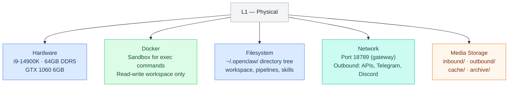
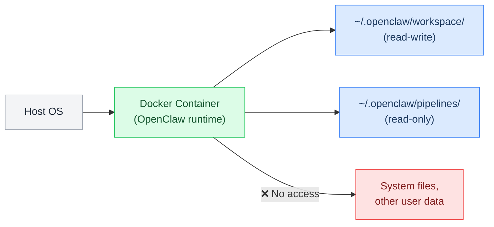
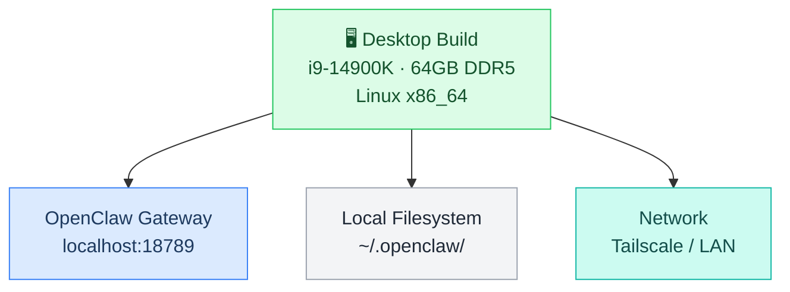
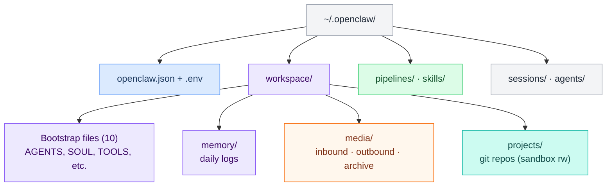
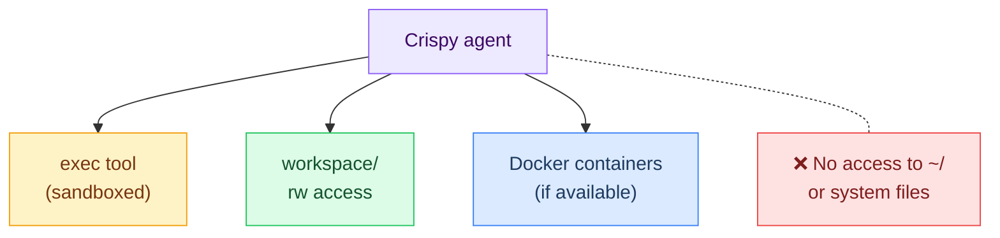
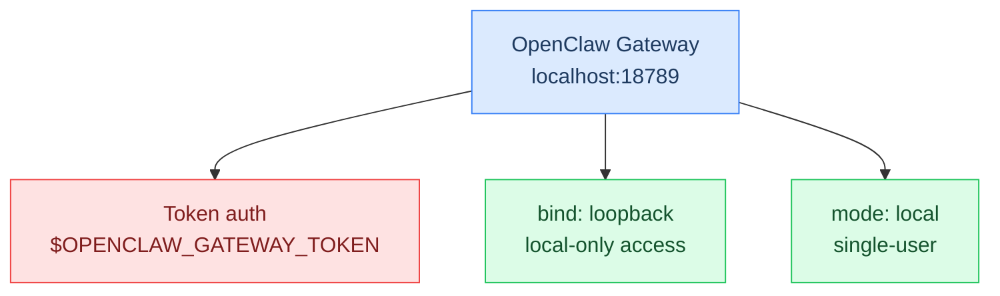
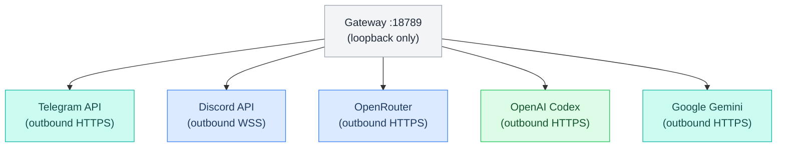
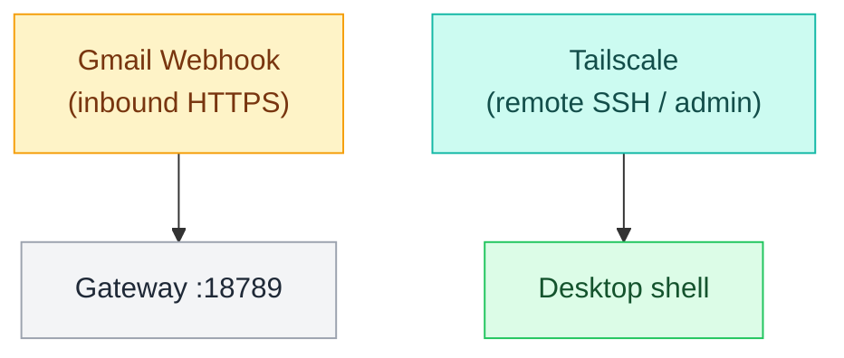
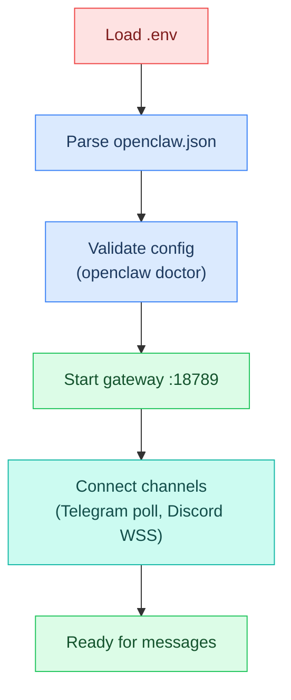

# L1 — Physical Layer

> What exists on the machine. Hardware, containers, filesystem, and network. If you can touch it (or SSH into it), it lives here.
> **This file is the single source of truth for all L1 properties.** Other L1 files reference these values via Dataview inline queries.

**OSI parallel:** Physical + Data Link — the raw infrastructure that everything else sits on top of.

## Contents

- [[#Diagrams]]
  - [[#What's at This Layer]] · `flowchart`
  - [[#Docker Sandbox]] · `flowchart`
  - [[#Hardware — Marty's Desktop]] · `flowchart`
  - [[#Filesystem Layout]] · `flowchart`
  - [[#Sandbox Model]] · `flowchart`
- [[#Hardware]]
- [[#Network]]
  - [[#Gateway — The Core Process]] · `flowchart`
  - [[#Outbound API Connections]] · `flowchart`
  - [[#Inbound Connections (Webhooks & Admin)]] · `flowchart`
  - [[#Startup Sequence]] · `flowchart`
- [[#Network Configuration]]
- [[#Media Storage]]
- [[#System Topology]]
- [[#Pages in This Layer]]
- [[#Property Schema Reference]]
- [[#Layer Boundary]]
- [[#L1 File Review (Live)]]

---

## Diagrams

### What's at This Layer



---

## Hardware

> Deep dive → [[stack/L1-physical/hardware]]

| Component | Spec | Notes |
|-----------|------|-------|
| **CPU** | `= this.hardware_cpu_model` (`= this.hardware_cpu_cores`) | ⚠️ `= this.hardware_cpu_status` |
| **RAM** | `= this.hardware_ram_capacity` `= this.hardware_ram_model` | ⚠️ `= this.hardware_ram_status` |
| **GPU** | `= this.hardware_gpu_model` | `= this.hardware_gpu_status` |
| **NVMe** | `= this.hardware_nvme_capacity` `= this.hardware_nvme_model` | `= this.hardware_nvme_role` |
| **SATA** | `= this.hardware_sata_capacity` `= this.hardware_sata_model` | `= this.hardware_sata_role` |
| **OS** | `= this.hardware_os` | Always-on, 24/7 |

This machine is an **inference client**, not an inference server. All LLM calls go to external APIs (OpenAI, Anthropic, DeepSeek, Google). The GPU is unused for AI work.

---

## Docker Sandbox

All `exec` commands run inside a Docker container with restricted access:

### Docker Sandbox



| Key | Value | Why |
|-----|-------|-----|
| Mode | `= this.sandbox_mode` | `= this.sandbox_mode_reason` |
| Scope | `= this.sandbox_scope` | `= this.sandbox_scope_reason` |
| Workspace | `= this.sandbox_workspace_access` | `= this.sandbox_workspace_access_reason` |
| Docker | `= this.sandbox_docker_enabled` | `= this.sandbox_docker_enabled_reason` |
| Image | `= this.sandbox_docker_image` | `= this.sandbox_docker_image_reason` |
| Read-only root | `= this.sandbox_docker_readonly_root` | `= this.sandbox_docker_readonly_root_reason` |
| Network | `= this.sandbox_docker_network` | `= this.sandbox_docker_network_reason` |
| Memory | `= this.sandbox_docker_memory` | `= this.sandbox_docker_memory_reason` |
| CPUs | `= this.sandbox_docker_cpus` | `= this.sandbox_docker_cpus_reason` |

**Key constraint:** Exec can only write to the workspace directory. This is the first guardrail — L1 limits blast radius before any other layer gets involved.

---

### Hardware — Marty's Desktop



### Filesystem Layout



Notice how the filesystem is shared across layers — the Physical layer provides the storage, but each file is **owned by** the layer that reads/writes it.

---

### Sandbox Model



## Network

### Gateway — The Core Process



### Outbound API Connections



### Inbound Connections (Webhooks & Admin)



### Startup Sequence



## Network Configuration

| Key | Value | Why |
|-----|-------|-----|
| Port | `= this.network_gateway_port` | `= this.network_gateway_port_reason` |
| Bind | `= this.network_gateway_bind` | `= this.network_gateway_bind_reason` |
| Mode | `= this.network_gateway_mode` | `= this.network_gateway_mode_reason` |
| Auth | `= this.network_gateway_auth_mode` | `= this.network_gateway_auth_mode_reason` |

| Direction | Port/Protocol | Purpose | Layer Owner |
|---|---|---|---|
| **Inbound** | TCP `= this.network_gateway_port` | Gateway API | L2 — Runtime |
| **Outbound** | HTTPS | OpenAI, Anthropic, DeepSeek, Google APIs | L6 — Processing |
| **Outbound** | HTTPS | Telegram Bot API | L3 — Channel |
| **Outbound** | HTTPS/WSS | Discord Gateway + REST API | L3 — Channel |
| **Outbound** | HTTPS | Brave Search API | L6 — Processing |
| **Inbound** | Webhook (optional) | Gmail push notifications | L3 — Channel |

---

## Media Storage

| Key | Value | Why |
|-----|-------|-----|
| Base path | `= this.media_base_path` | `= this.media_base_path_reason` |
| Max file size | `= this.media_max_file_size_mb` MB | `= this.media_max_file_size_mb_reason` |
| Keep sizes | `= this.media_keep_sizes` | `= this.media_keep_sizes_reason` |
| Cache 24h | `= this.media_cache_24h` | `= this.media_cache_24h_reason` |
| Metadata | `= this.media_metadata_format` | `= this.media_metadata_format_reason` |
| Archive retention | `= this.media_archive_retention_days` days | `= this.media_archive_retention_days_reason` |
| Cleanup schedule | `= this.media_cleanup_schedule` | `= this.media_cleanup_schedule_reason` |

### Media Hook (Primary Sorter)

| Key | Value | Why |
|-----|-------|-----|
| Kind | `= this.media_hook_kind` | `= this.media_hook_kind_reason` |
| Pipeline | `= this.media_hook_pipeline` | `= this.media_hook_pipeline_reason` |
| Trigger | `= this.media_hook_trigger` | `= this.media_hook_trigger_reason` |
| Condition | `= this.media_hook_condition` | `= this.media_hook_condition_reason` |

---

## System Topology

> What runs where. For setup steps, see [[stack/L1-physical/runbook]].

The gateway is the single process — if it's down, everything is down. No ports are exposed to the public internet; Telegram/Discord use outbound connections, Gmail hooks need a tunnel.

| Subsystem | Deep Dive | Key Facts |
|-----------|-----------|-----------|
| Hardware | [[stack/L1-physical/hardware]] | i9-14900K (⚠️ degraded), 64GB DDR5, GTX 1060 placeholder |
| Network | [[stack/L1-physical/network]] | Port 18789 loopback, token auth, Tailscale for remote |
| Sandbox | [[stack/L1-physical/sandbox]] | Docker mode `all`, session scope, read-only root |
| Filesystem | [[stack/L1-physical/filesystem]] | `~/.openclaw/` runtime tree + planning vault |
| Media | [[stack/L1-physical/media]] | 4-layer defense: hook → AGENTS.md → BOOT.md → cron |
| Config blocks | [[stack/L1-physical/config-reference]] | `^config-gateway` + `^config-hooks` for openclaw.json |

---

## Pages in This Layer

| Page | Covers |
|---|---|
| [[stack/L1-physical/config-reference]] | `^config-gateway` + `^config-hooks` blocks for openclaw.json |
| [[stack/L1-physical/hardware]] | CPU, RAM, GPU specs, machine capabilities |
| [[stack/L1-physical/sandbox]] | Docker sandbox, full field reference, modes and scopes |
| [[stack/L1-physical/filesystem]] | Full directory layout — runtime + vault |
| [[stack/L1-physical/media]] | Media inbound/outbound/cache/archive structure + 4-layer defense |
| [[stack/L1-physical/network]] | Port 18789, inbound/outbound routing, API access |
| [[stack/L1-physical/runbook]] | Hardware verification, workspace/sandbox setup, media maintenance |
| [[stack/L1-physical/CHANGELOG]] | Layer changelog — all L1 changes by date |
| [[stack/L1-physical/cross-layer-notes]] | Cross-layer notes from L1 audit sessions |

---

## Property Schema Reference

All L1 properties live in this file's frontmatter. Other L1 files reference them via `= [[_overview]].property_name`. Property names follow `{subsystem}_{concept}` naming.

| Group | Prefix | Count | From |
|-------|--------|-------|------|
| CPU | `hardware_cpu_*` | 3 | hardware.md |
| Motherboard | `hardware_motherboard` | 1 | hardware.md |
| Memory | `hardware_ram_*` | 3 | hardware.md |
| GPU | `hardware_gpu_*` | 3 | hardware.md |
| NVMe storage | `hardware_nvme_*` | 4 | hardware.md |
| SATA storage | `hardware_sata_*` | 4 | hardware.md |
| Power | `hardware_psu_*` | 2 | hardware.md |
| OS | `hardware_os` | 1 | hardware.md |
| Gateway | `network_gateway_*` | 4 | network.md |
| Sandbox | `sandbox_*` | 9 | sandbox.md |
| Media storage | `media_*` (not hook) | 7 | media.md |
| Media hooks | `media_hook_*` | 4 | media.md |

---

## Layer Boundary

**L1 provides to L2:** A running machine with Docker, network access, and a filesystem.

**L1 does NOT care about:** What's in the config files, which models are configured, or what messages say. It just provides the infrastructure.

**If L1 breaks:** Nothing works. Docker down = no gateway. Disk full = no memory writes. Network down = no API calls.

---

## L1 File Review (Live)

```dataview
TABLE WITHOUT ID
  file.link AS "File",
  choice(contains(file.frontmatter.tags, "status/finalized"), "✅",
    choice(contains(file.frontmatter.tags, "status/review"), "🔍",
      choice(contains(file.frontmatter.tags, "status/planned"), "⏳", "📝"))) AS "Status",
  choice(contains(file.frontmatter.tags, "type/guide"), "Guide", "Core") AS "Type",
  dateformat(file.mtime, "yyyy-MM-dd") AS "Last Modified"
FROM "stack/L1-physical"
WHERE file.name != "_overview"
SORT choice(contains(file.frontmatter.tags, "type/guide"), "Z", "A") ASC, file.name ASC
```

**Legend:** ✅ Finalized · 🔍 Review (content solid, verify against live) · 📝 Draft (needs work) · ⏳ Planned (skeleton only)

---

**Up -->** [[stack/L2-runtime/_overview]]
**Back -->** [[stack/_overview]]
