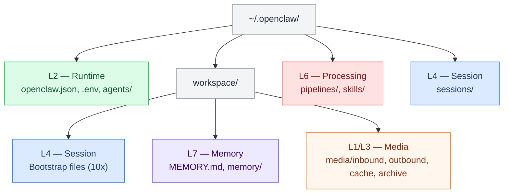

# L1 — Filesystem

> The complete directory structure for the Crispy Kitsune system. Two main trees: the **OpenClaw runtime** (`~/.openclaw/`) and the **planning vault** (`~/repos/crispy-kitsune/`). Each file and folder is owned by a specific CKS layer.
> **Setup guide →** [[stack/L1-physical/runbook#Workspace Setup]]

---

## OpenClaw Runtime Tree

Everything Crispy needs to run lives here.

```
~/.openclaw/
├── .env                       ← L2 (Runtime) — all secrets, chmod 600
├── openclaw.json              ← L2 (Runtime) — master config (JSON5)
│
├── workspace/                 ← L4 (Session) + L7 (Memory)
│   │
│   │  ── Bootstrap Files ──
│   ├── AGENTS.md                L4 — operating contract, task routing
│   ├── SOUL.md                  L4 — personality, values, tone
│   ├── TOOLS.md                 L4 — available tools reference
│   ├── IDENTITY.md              L4 — name, emoji, channel behavior
│   ├── USER.md                  L4 — admin preferences (Marty + Wenting)
│   ├── BOOTSTRAP.md             L4 — first-run instructions
│   ├── BOOT.md                  L4 — startup hook script
│   ├── HEARTBEAT.md             L4 — system pulse (every 20min)
│   ├── STATUS.md                L4 — compaction flush state
│   ├── projects.json            L6 — project registry (see project-routing)
│   │
│   │  ── Durable Memory ──
│   ├── MEMORY.md                L7 — curated facts (survives compaction)
│   ├── memory/                  L7 — daily logs + audit
│   │   ├── 2026-03-02.md          Today's log
│   │   ├── 2026-03-01.md          Yesterday's log
│   │   ├── ...                    Older daily logs (30-day decay)
│   │   └── guardrail.log         L5/L7 — security audit trail
│   │
│   │  ── Project Repos (sandbox rw) ──
│   └── projects/                L6 — git repos Crispy works on continuously
│       ├── crispy-kitsune/        This planning vault (symlink or clone)
│       ├── portfolio-site/        Example: personal website repo
│       └── api-backend/           Example: backend service repo
│
├── workspace/media/           ← L1 (Physical) + L3 (Channel)
│   │
│   │  ── Inbound (received from users/channels) ──
│   ├── inbound/
│   │   ├── voice/               Voice messages, call recordings (.ogg, .wav)
│   │   ├── images/              Photos, screenshots, memes (.jpg, .png, .webp)
│   │   ├── video/               Clips, screen recordings (.mp4, .webm)
│   │   ├── documents/           PDFs, spreadsheets, docs (.pdf, .docx, .xlsx)
│   │   └── other/               Anything else
│   │
│   │  ── Outbound (generated/sent by Crispy) ──
│   ├── outbound/
│   │   ├── voice/               TTS audio responses (.ogg, .mp3)
│   │   ├── images/              Generated charts, diagrams (.png, .svg)
│   │   ├── video/               Generated video content (.mp4)
│   │   └── documents/           Reports, exports (.pdf, .docx, .xlsx)
│   │
│   │  ── Processing ──
│   ├── cache/                   Temp files during processing (auto-cleaned)
│   └── archive/                 Old media before deletion (90-day retention)
│
├── pipelines/                 ← L6 (Processing) — Lobster workflows
│   ├── brief.lobster              Daily morning digest
│   ├── email.lobster              Email triage + classification
│   ├── git.lobster                Git status report
│   ├── buttons.lobster            Decision tree router
│   ├── skill-router.lobster       Intent → skill matching
│   ├── health-check.lobster       System heartbeat (hourly)
│   ├── notify.lobster             Alert routing
│   ├── media.lobster              Media processing
│   ├── media-cleanup.lobster      Storage cleanup (daily 2am)
│   └── voice-response.lobster     STT → agent → TTS pipeline
│
├── sessions/                  ← L4 (Session) — conversation history
│   └── {session-id}.jsonl       Per-session message log
│
├── skills/                    ← L6 (Processing) — installed skill packs
│   ├── engineering/               8 skills (code-review, debug, etc.)
│   ├── data/                      7 skills (analyze, visualize, etc.)
│   ├── human-resources/           9 skills
│   ├── operations/                9 skills
│   ├── productivity/              4 skills
│   ├── gaming/                    2 skills (sag, gog)
│   ├── openclaw-meta/             4 skills (pre-installed)
│   ├── authoring/                 2 skills
│   ├── builders/                  4 skills
│   └── custom/                    User-created skills
│
└── agents/                    ← L2 (Runtime) — agent-specific data
    └── {agentId}/
        └── agent/
            └── auth-profiles.json   OAuth tokens (Codex)
```

---

## Planning Vault Tree

The Obsidian vault where everything is planned and documented.

```
~/repos/crispy-kitsune/        (GitHub: FancyKat/crispy-kitsune)
│
├── .obsidian/                   Obsidian vault settings
├── 00-INDEX.md                  Master vault index
├── CHANGELOG.md                 Vault version history
├── VAULT-AUDIT.md               Vault-wide audit tracker
│
├── build/                     ← Build & Install (prereqs before first boot)
│   ├── README.md                  7-phase install guide (all prereq commands)
│   ├── .env.example               Annotated env var template
│   ├── openclaw.json.example      Complete annotated config (copy to ~/.openclaw/)
│   │
│   │  ── 3 Main Files (master blueprints) ──
│   ├── CONTEXT.md                 Master context: SOUL + IDENTITY + AGENTS + TOOLS + USER + MEMORY + BOOT + HEARTBEAT + BOOTSTRAP + STATUS
│   ├── config-main.md             openclaw.json blueprint (all 10 config sections)
│   ├── env-main.md                .env blueprint (21 variables, delivery mechanisms)
│   │
│   │  ── Build Pipeline ──
│   ├── scripts/
│   │   └── build-config.js        Node.js builder: extracts ^block-id content → dist/
│   │
│   └── dist/                      Generated output (gitignored, rebuilt on demand)
│       ├── openclaw.json            Assembled from ^config-* blocks
│       ├── .env                     Assembled from ^env-template block
│       ├── context-files/           10 bootstrap .md files from ^prefix-* blocks
│       │   ├── SOUL.md                ← ^soul-* (19 blocks)
│       │   ├── IDENTITY.md            ← ^id-* (8 blocks)
│       │   ├── AGENTS.md              ← ^agents-* (23 blocks)
│       │   ├── TOOLS.md               ← ^tools-* (17 blocks)
│       │   ├── USER.md                ← ^user-* (11 blocks)
│       │   ├── MEMORY.md              ← ^memory-* (6 blocks)
│       │   ├── BOOT.md                ← ^boot-* (4 blocks)
│       │   ├── HEARTBEAT.md           ← ^heartbeat-* (3 blocks)
│       │   ├── BOOTSTRAP.md           ← ^bootstrap-* (7 blocks)
│       │   └── STATUS.md              ← ^status-* (4 blocks)
│       └── pipelines/               .lobster files from ^pipeline-* blocks (future)
│
└── stack/                     ← CKS 7-Layer Architecture
    ├── _overview.md               Stack entry point + layer map
    │
    ├── L1-physical/             Hardware, sandbox, filesystem, network, media
    │   ├── _overview.md              Layer index + system topology + all L1 properties
    │   ├── config-reference.md       ^config-gateway + ^config-hooks blocks
    │   ├── hardware.md               Desktop specs (i9-14900K, 64GB, GTX 1060)
    │   ├── sandbox.md                Docker sandbox (mode: "all", full field reference)
    │   ├── filesystem.md             This file — directory layout
    │   ├── media.md                  Media storage + 4-layer defense + inbound flow
    │   ├── network.md                Connections, ports, security
    │   ├── runbook.md                Hardware verification, workspace/sandbox setup, media maintenance
    │   ├── CHANGELOG.md              Layer changelog (all L1 changes)
    │   └── cross-layer-notes.md      Cross-layer notes from L1 sessions
    │
    ├── L2-runtime/              Gateway, config, secrets, models (12 files)
    │   ├── _overview.md
    │   ├── gateway.md               Gateway startup + management
    │   ├── config.md                openclaw.json structure + debug map
    │   ├── config-audit.md          Known config issues + fixes
    │   ├── env.md                   Environment variables reference
    │   ├── models.md                7-model cascade + fallback chain
    │   └── guides/
    │       ├── _overview.md
    │       ├── config-audit-guide.md  Pre-boot checklist and fixes
    │       ├── env-guide.md           .env sourcing deep-dive
    │       ├── gateway-guide.md       Gateway operations guide
    │       ├── model-guide.md         Model authentication and session switching
    │       └── openclaw-json-guide.md Config walkthrough
    │
    ├── L3-channel/              Telegram, Discord, Gmail, voice (37 files)
    │   ├── _overview.md
    │   ├── decision-trees.md        Button tree construction patterns
    │   ├── voice-pipeline.md        STT → agent → TTS (all channels)
    │   ├── telegram/
    │   │   ├── _overview.md
    │   │   ├── chat-flow.md           Message lifecycle
    │   │   ├── button-patterns.md     4 button types + depth rules
    │   │   ├── conversation-flows.md  Example conversations
    │   │   ├── media-handling.md      Voice, photo, video, docs
    │   │   ├── pipelines.md           Telegram-specific pipelines
    │   │   └── guides/
    │   │       ├── _overview.md
    │   │       ├── decision-trees-guide.md
    │   │       ├── pipeline-approve-deny-guide.md
    │   │       ├── pipeline-decision-tree-guide.md
    │   │       ├── pipeline-exec-approve-guide.md
    │   │       ├── pipeline-media-guide.md
    │   │       ├── pipeline-notify-guide.md
    │   │       ├── pipeline-quick-actions-guide.md
    │   │       └── telegram-setup-guide.md
    │   ├── discord/
    │   │   ├── _overview.md
    │   │   ├── chat-flow.md           Slash commands + embeds
    │   │   ├── components.md          Buttons, selects, modals
    │   │   ├── media-handling.md      Attachments, voice channels
    │   │   └── guides/
    │   │       ├── _overview.md
    │   │       ├── decision-trees-guide.md
    │   │       └── discord-setup-guide.md
    │   ├── gmail/
    │   │   ├── _overview.md
    │   │   ├── email-triage.md        Email triage + classification
    │   │   ├── privacy-security.md    Data handling, PII rules
    │   │   ├── webhook-flow.md        Webhook integration
    │   │   └── guides/
    │   │       ├── _overview.md
    │   │       ├── email-pipeline-guide.md
    │   │       ├── gmail-debug-guide.md
    │   │       ├── gmail-setup-guide.md
    │   │       └── notification-rules-guide.md
    │   └── guides/
    │       ├── _overview.md
    │       ├── integration-map-guide.md  External services map
    │       └── voice-guide.md           Voice pipeline guide
    │
    ├── L4-session/              Context assembly, compaction, bootstrap (19 files)
    │   ├── _overview.md
    │   ├── sessions.md              Session lifecycle + reset triggers
    │   ├── context-assembly.md      9-step injection order
    │   ├── compaction.md            Token limit → summarize → flush
    │   ├── bootstrap-config.md      Bootstrap file budget + config
    │   ├── coding-session-lifecycle.md  Coding session patterns
    │   ├── session-templates.md     Session template patterns
    │   ├── agents-md.md             AGENTS.md reference
    │   ├── boot-md.md               BOOT.md reference
    │   ├── bootstrap-md.md          BOOTSTRAP.md reference
    │   ├── heartbeat-md.md          HEARTBEAT.md reference
    │   ├── identity-md.md           IDENTITY.md reference
    │   ├── memory-md.md             MEMORY.md reference
    │   ├── soul-md.md               SOUL.md reference
    │   ├── tools-md.md              TOOLS.md reference
    │   ├── user-md.md               USER.md reference
    │   ├── daily-logs.md            Daily log format + write triggers
    │   └── guides/
    │       ├── _overview.md
    │       └── sessions-guide.md      Sessions deep-dive guide
    │
    ├── L5-routing/              Message routing, classification, guardrails (14 files)
    │   ├── _overview.md
    │   ├── message-routing.md       Three paths: pipeline/button/agent
    │   ├── message-lifecycle.md     Full message lifecycle
    │   ├── intent-classifier.md     Triage model → 8 intents
    │   ├── conversation-flows.md    Conversation flow patterns
    │   ├── trigger-words.md         Trigger word detection
    │   ├── guardrails.md            Defense-in-depth (Phase 1-3)
    │   ├── input-sanitization.md    Input gate: block/flag/pass
    │   ├── output-validation.md     Output gate: PII, hallucination, tone
    │   └── guides/
    │       ├── _overview.md
    │       ├── guardrails-guide.md     Guardrails implementation guide
    │       ├── input-sanitization-guide.md
    │       ├── message-routing-guide.md
    │       └── output-validation-guide.md
    │
    ├── L6-processing/           Agent loop, tools, skills, pipelines, coding (43 files)
    │   ├── _overview.md
    │   ├── agent-loop.md            Think → Act → Observe → Repeat
    │   ├── tools.md                 Built-in + plugin tools
    │   ├── research.md              Research sub-agent pipeline
    │   ├── coding/
    │   │   ├── _overview.md
    │   │   ├── code-review.md         PR review workflow
    │   │   ├── deploy.md              Deployment workflows
    │   │   ├── git-pipelines.md       Git workflow pipelines
    │   │   ├── project-routing.md     Project-aware context switching
    │   │   └── testing.md             Test runner integration
    │   ├── pipelines/
    │   │   ├── _overview.md
    │   │   ├── brief.md               Morning digest
    │   │   ├── email.md               Email triage
    │   │   ├── health-check.md        System heartbeat
    │   │   ├── intent-finder.md       Intent detection pipeline
    │   │   ├── media-pipeline.md      Media processing + cleanup
    │   │   ├── media-sort.md          Media sorting pipeline
    │   │   ├── prompt-builder.md      Prompt assembly pipeline
    │   │   └── skill-router.md        Skill matching
    │   ├── skills/
    │   │   ├── _overview.md
    │   │   ├── inventory.md           Full 54+ skills listing
    │   │   ├── config.md              Skills configuration
    │   │   ├── authoring.md           Doc co-authoring skills
    │   │   ├── builders.md            MCP + plugin builder skills
    │   │   ├── engineering.md         11 engineering skills
    │   │   ├── data.md                8 data skills
    │   │   ├── human-resources.md     9 HR skills
    │   │   ├── operations.md          9 ops skills
    │   │   ├── productivity.md        4 productivity skills
    │   │   ├── gaming.md              2 gaming skills
    │   │   ├── openclaw-meta.md       4 meta skills
    │   │   ├── telegram.md            Telegram bot skill
    │   │   └── custom.md              Custom skills framework
    │   └── guides/
    │       ├── _overview.md
    │       ├── agent-design-guide.md    Agent architecture reference
    │       ├── buttons-guide.md         Button system guide
    │       ├── buttons-ux-mockup-guide.md  Button UX mockups
    │       ├── pipelines-guide.md       Pipeline infrastructure guide
    │       ├── research-pipeline-guide.md  Research sub-agent guide
    │       ├── skill-pipeline-guide.md  Research → skill conversion
    │       ├── skills-guide.md          Skills loading guide
    │       ├── skills-inventory-guide.md  Full inventory deep-dive
    │       └── workspace-awareness-guide.md  Workspace scanning guide
    │
    └── L7-memory/               Daily logs, search, Mem0, SQLite, audit (14 files)
        ├── _overview.md
        ├── daily-logs.md            Daily log format + write triggers
        ├── decisions-log.md         Decision rationale + dates
        ├── memory-md.md             MEMORY.md curated facts
        ├── memory-search.md         Vector + BM25 hybrid search
        ├── mem0.md                  Auto-memory plugin
        ├── open-questions.md        Unresolved design decisions
        ├── sqlite.md                Structured database (future)
        ├── audit-log.md             Guardrail audit trail
        └── guides/
            ├── _overview.md
            ├── memory-daily-guide.md    Daily logs deep-dive
            ├── memory-mem0-guide.md     Mem0 setup guide
            ├── memory-search-guide.md   Search system guide
            └── memory-sqlite-guide.md   SQLite planning guide
```

---

## Layer Ownership Map



---

## File Permissions

| Path | Permission | Why |
|---|---|---|
| `.env` | `600` (owner only) | Contains API keys and tokens |
| `openclaw.json` | `644` (owner rw, others read) | Config, no secrets (uses `${}` refs) |
| `workspace/` | `755` | Sandbox write target |
| `workspace/media/` | `755` | Media read/write by agent |
| `pipelines/` | `755` | Read by sandbox, written by admin |
| `sessions/` | `755` | Auto-managed by gateway |
| `skills/` | `755` | Read-only at runtime, write on install |

---

## Media File Naming Convention

All media files follow: `{channel}-{YYYYMMDD}-{hash8}.{ext}`

| Example | Source |
|---------|--------|
| `telegram-20260302-a1b2c3d4.ogg` | Telegram voice message |
| `discord-20260302-e5f6g7h8.png` | Discord image attachment |
| `tts-20260302-i9j0k1l2.ogg` | Generated TTS response |
| `chart-20260302-m3n4o5p6.png` | Generated chart export |

---

## Key Files Reference

| File | Size Limit | Updated By | Read By | Layer |
|---|---|---|---|---|
| `openclaw.json` | — | Admin (manual) | Gateway at startup | L2 |
| `.env` | — | Admin (manual) | Gateway at startup | L2 |
| `AGENTS.md` | 20KB | Crispy + admin | Every session | L4 |
| `SOUL.md` | 20KB | Admin | Every session | L4 |
| `MEMORY.md` | 20KB | Crispy | DM sessions | L7 |
| `memory/*.md` | — | Crispy (end of session) | Today + yesterday loaded | L7 |
| `*.lobster` | — | Admin | Pipeline runner | L6 |
| `*.jsonl` | — | Gateway (auto) | Compaction, search | L4 |
| `media/inbound/*` | 50MB/file | Channel handlers | Agent loop, processing | L1/L3 |
| `media/outbound/*` | 50MB/file | Agent, pipelines | Channel send | L1/L3 |

---

## Storage Estimates

| Category | Size | Growth Rate |
|---|---|---|
| Bootstrap files (10x) | ~50-100KB total | Slow (manual updates) |
| Daily memory logs | ~5-20KB/day | ~600KB/month |
| Session JSONL | ~50-500KB/session | Depends on usage |
| Pipeline definitions | ~1-5KB each | Slow (manual) |
| Skill packs | ~10-50KB each | On install |
| Media inbound | ~18-50MB/day | ~1.5GB/month |
| Media outbound (TTS) | ~5-20MB/day | ~600MB/month |
| Media cache | Volatile | Auto-cleaned |
| Media archive | Grows until 90-day purge | ~4.5GB before cleanup |

**Total runtime footprint**: ~100MB without media, ~6-8GB/month with active voice/media usage.

**Hardware mapping** (source of truth → [[stack/L1-physical/_overview]]):
- 990 PRO NVMe (1TB): All media (`inbound/`, `outbound/`, `cache/`, `archive/`)
- 870 EVO SATA (1TB): Qdrant Vector DB only — not used for media

---

## Vault Statistics (Live)

### File Counts by Location

```dataview
TABLE length(rows) AS "Files"
FROM ""
WHERE file.extension = "md"
GROUP BY regexreplace(file.folder, "/.*", "") AS "Top Folder"
SORT length(rows) DESC
```

### Status Breakdown

```dataview
TABLE length(rows) AS "Count"
FROM "stack" OR "build"
FLATTEN file.frontmatter.tags AS tag
WHERE startswith(tag, "status/")
GROUP BY tag AS "Status"
SORT length(rows) DESC
```

### Files per Layer

```dataview
TABLE length(rows) AS "Files"
FROM "stack"
FLATTEN file.frontmatter.tags AS tag
WHERE startswith(tag, "layer/")
GROUP BY tag AS "Layer"
SORT tag ASC
```

---

**See also:** [[stack/L1-physical/media]] · [[stack/L1-physical/sandbox]] · [[stack/L1-physical/network]]
**Up →** [[stack/L1-physical/_overview]]
