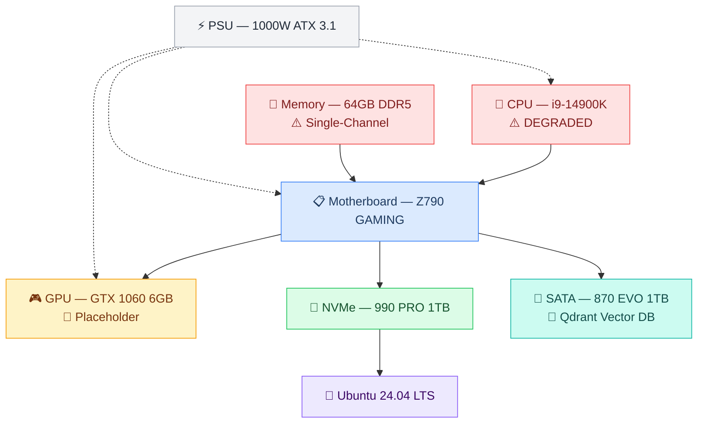

# 🖥️ L1 — Hardware

> Marty's desktop build — the machine that runs Crispy 24/7. Specs, known issues, and planned upgrades.
> **Properties live in [[stack/L1-physical/_overview]].** This file provides context and explanations.
> **Setup guide →** [[stack/L1-physical/runbook#Hardware Verification]]

---

---

## 🔧 Current Components

### 🧠 CPU
- **`= [[_overview]].hardware_cpu_model`** (Raptor Lake Refresh)
- `= [[_overview]].hardware_cpu_cores`
- 3.2 GHz base / 6.0 GHz boost, 125W TDP (253W PL2)
- Socket LGA 1700
- ⚠️ **STATUS: `= [[_overview]].hardware_cpu_status`**
  - **Why:** `= [[_overview]].hardware_cpu_status_reason`

### 🗂️ Motherboard
- **`= [[_overview]].hardware_motherboard`**
- 4x DDR5 slots (2 per channel), PCIe 5.0 x16 + PCIe 4.0
- WiFi 7 (BE200), Realtek 1Gb LAN
- 3x M.2 slots (1x PCIe 5.0, 2x PCIe 4.0)

### 🧩 Memory
- **`= [[_overview]].hardware_ram_model`**
- ⚠️ **STATUS:** `= [[_overview]].hardware_ram_status`
- Both sticks in channel B slots

### 🎮 GPU
- **`= [[_overview]].hardware_gpu_model`** (`= [[_overview]].hardware_gpu_vram`)
- 1280 CUDA cores, no Tensor Cores, no FP16 acceleration
- ❌ **`= [[_overview]].hardware_gpu_status`**
- Adequate for: display output, light CUDA tasks, video decode

### 💾 Storage

| Drive | Model | Interface | Capacity | Speed | Role |
|---|---|---|---|---|---|
| 🚀 NVMe SSD | `= [[_overview]].hardware_nvme_model` | `= [[_overview]].hardware_nvme_interface` | `= [[_overview]].hardware_nvme_capacity` | 7,450 MB/s read | `= [[_overview]].hardware_nvme_role` |
| 🗄️ SATA SSD | `= [[_overview]].hardware_sata_model` | `= [[_overview]].hardware_sata_interface` | `= [[_overview]].hardware_sata_capacity` | 560 MB/s read | **`= [[_overview]].hardware_sata_role`** |

> 🧠 **Qdrant on 870 EVO:** Docker volume mapped to the SATA SSD, stores all embeddings + collections. SATA III speeds (560 MB/s) are more than sufficient for vector similarity queries — the bottleneck is always the embedding model, not the disk. See [[stack/L7-memory/_overview]] for the memory architecture.

### ⚡ Power & Cooling
- **PSU:** `= [[_overview]].hardware_psu_model` (`= [[_overview]].hardware_psu_wattage`, 80+ Gold, ATX 3.1)
- **CPU Cooler:** Corsair iCUE LINK TITAN 360 RX (360mm AIO)
- **Case Fans:** 6x Corsair RS120 ARGB + 3 radiator = 9 total
- **Case:** HYTE Y70 Snow White (dual-chamber mid-tower)

### 🐧 Operating System
- **`= [[_overview]].hardware_os`** (Noble Numbat)

---

## 📊 Effective Resources

| Resource | Nominal | Effective | Notes |
|---|---|---|---|
| 🧠 CPU cores | `= [[_overview]].hardware_cpu_cores` | `= [[_overview]].hardware_cpu_cores` | Fully functional |
| 🧩 RAM | `= [[_overview]].hardware_ram_capacity` DDR5-6600 | 32-64GB single-channel | Half bandwidth; verify with `free -h` |
| 🎮 GPU VRAM | `= [[_overview]].hardware_gpu_vram` | ~5GB usable | Pascal, no tensor cores |
| 🚀 NVMe | `= [[_overview]].hardware_nvme_capacity` `= [[_overview]].hardware_nvme_interface` | `= [[_overview]].hardware_nvme_capacity` | Full speed |
| 🗄️ SATA SSD | `= [[_overview]].hardware_sata_capacity` SATA III | `= [[_overview]].hardware_sata_capacity` | `= [[_overview]].hardware_sata_role` |
| ⚡ PSU | `= [[_overview]].hardware_psu_wattage` | `= [[_overview]].hardware_psu_wattage` | Overspec for current build |

---

## 🐳 What Runs on This Machine

| Service | RAM Usage | CPU Impact | Notes |
|---|---|---|---|
| 🦊 OpenClaw gateway | ~500MB | Minimal | Node.js process |
| 🧠 Docker (Qdrant) | ~1-2GB | Low | Vector memory on 870 EVO SSD |
| 🕸️ Docker (Neo4j) | ~2-3GB | Low | Graph memory (optional) |
| 📐 Ollama (embeddings) | ~1GB | Low | `nomic-embed-text` on CPU |
| 🐧 OS + desktop | ~4-6GB | — | `= [[_overview]].hardware_os` |
| **Remaining** | ~50GB+ | — | ✅ Comfortable headroom |

---

## ⚠️ Known Issues

### 1. 🧠 i9-14900K Memory Controller — Channel A Failure
- Only channel B functional → single-channel bandwidth (~38 GB/s)
- Known issue with some 14900K/13900K units (CPU IMC defect)
- RMA status: pending
- Workaround: both sticks in channel B, XMP may need lowering to DDR5-5600

### 2. 🎮 GTX 1060 — Placeholder GPU
- `= [[_overview]].hardware_gpu_vram` can't run useful LLMs locally (7B models need 4-6GB)
- Ollama falls back to CPU inference (slow for anything beyond embeddings)
- Upgrade planned: RTX 5080 (16GB) or RTX 5090 (32GB)

---

## 🔮 Planned Upgrades

### Priority 1 — 🎮 GPU (biggest single improvement)

The GTX 1060 is the main bottleneck. These next-gen cards work with the current setup (Z790, 1000W PSU, HYTE Y70 case):

| GPU | VRAM | What It Unlocks | Est. Price | Compatible? |
|---|---|---|---|---|
| **RTX 5080** | 16GB GDDR7 | Next-gen local inference, DLSS 4 | ~$1,000 (est.) | ✅ PCIe 5.0 x16 on Z790, needs 12V-2x6 (PSU has it) |
| **RTX 5090** | 32GB GDDR7 | Full local 70B quantized models | ~$2,000 (est.) | ✅ Same as 5080 but check case clearance |

> **Note on PSU:** The `= [[_overview]].hardware_psu_model` (`= [[_overview]].hardware_psu_wattage`, ATX 3.1) has the 12V-2x6 connector needed for 50 series cards. No PSU upgrade needed for anything up to RTX 5090.

### Priority 2 — 🧠 CPU (restore dual-channel memory)

| Option | What It Does | Est. Price | Notes |
|---|---|---|---|
| **RMA the 14900K** | Free replacement, restores dual-channel (~76 GB/s) | $0 | Check warranty window — some Intel batches had known IMC defects |
| **Intel Core i9-14900KS** | Slightly higher boost, same socket | ~$600 | Only if RMA denied; marginal improvement otherwise |
| **Intel Arrow Lake i9-15900K** | Next-gen, new socket (LGA 1851) | ~$600+ | Needs new motherboard — don't do this unless mobo also dies |

> 💡 **Best move:** RMA first. The 14900K is still a beast — the only issue is the dead memory channel. A free replacement fixes everything.

---

**Setup guide →** [[stack/L1-physical/runbook#Hardware Verification]]
**Up →** [[stack/L1-physical/_overview]]
