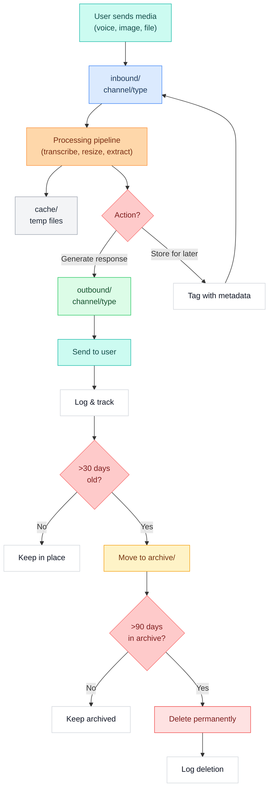
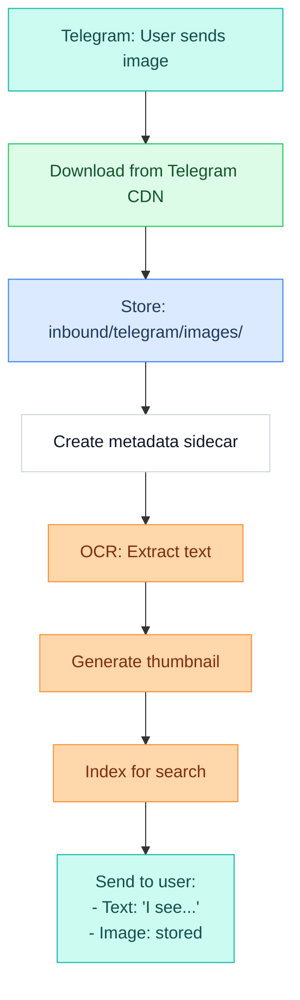
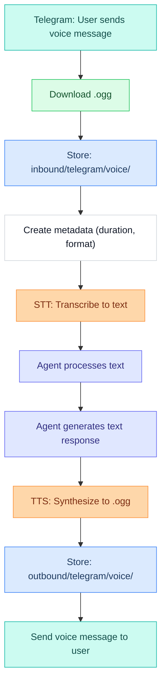
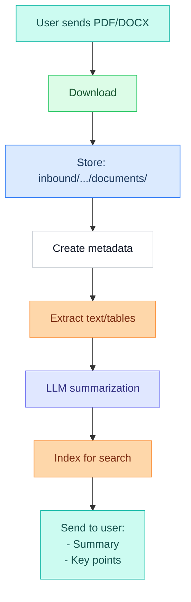
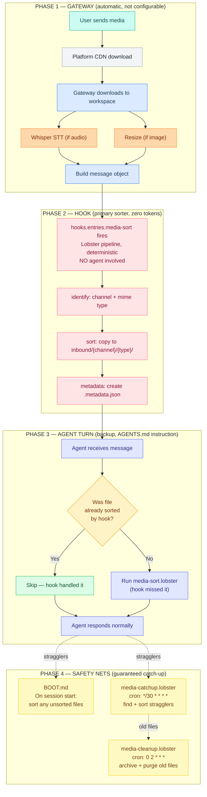
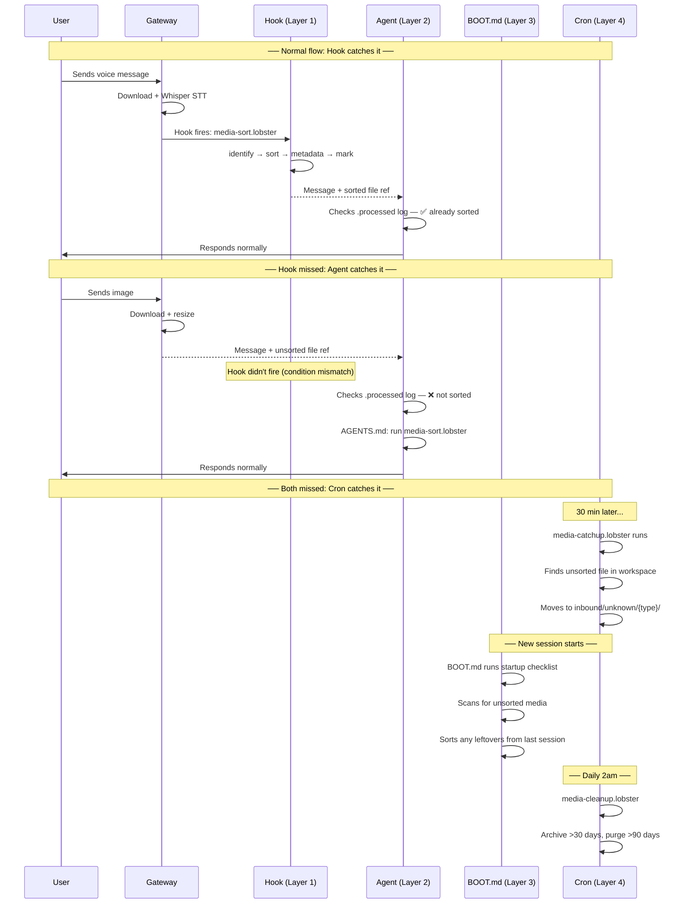

# L1 — Media (Storage & Inbound Flow)

> Where all media lives and how it lands on disk. Organized by channel, flow direction, and media type. Integrated cleanup policies prevent bloat.
> **Properties live in [[stack/L1-physical/_overview]].** This file provides context and explanations.
> **Setup guide →** [[stack/L1-physical/runbook#Media Maintenance]]

---

## Media Storage


### Overview

Media storage lives under `~/.openclaw/workspace/media/`, split into:
- **inbound/** — Media received from users/channels
- **outbound/** — Media generated/sent by Crispy
- **cache/** — Temporary processing files
- **archive/** — Files pending deletion (keep 90 days)



---

### Directory Structure

```
~/.openclaw/workspace/media/
│
├── inbound/                 ← Media RECEIVED from users/channels
│   ├── telegram/            ← Telegram messages
│   │   ├── voice/
│   │   │   ├── 20260302-user123-a1b2c3.ogg
│   │   │   └── 20260302-user123-d4e5f6.ogg
│   │   ├── images/
│   │   │   ├── 20260302-user123-photo1-xyz.jpg
│   │   │   ├── 20260302-user123-photo2-abc.jpg
│   │   │   └── 20260302-user123-photo2-abc.jpg.metadata.json
│   │   ├── video/
│   │   │   └── 20260302-user123-clip-def.mp4
│   │   ├── documents/
│   │   │   └── 20260302-user123-report-ghi.pdf
│   │   └── other/
│   │       └── 20260302-user123-unknown-jkl.bin
│   │
│   ├── discord/             ← Discord attachments + voice channel
│   │   ├── voice/           ← Voice channel recordings
│   │   │   └── 20260302-channel_general-session1-xyz.wav
│   │   ├── images/
│   │   ├── video/
│   │   ├── documents/
│   │   └── other/
│   │
│   └── phone/               ← Future SIP/phone calls
│       └── voice/
│           └── 20260302-caller_555_1234-xyz.wav
│
├── outbound/                ← Media GENERATED/SENT by Crispy
│   ├── telegram/
│   │   ├── voice/           ← TTS audio responses
│   │   │   └── 20260302-response_to_user123-abc.ogg
│   │   ├── images/          ← Charts, graphs, generated content
│   │   │   └── 20260302-chart-weather-def.png
│   │   └── documents/       ← Exports, reports
│   │       └── 20260302-report-export-ghi.pdf
│   │
│   ├── discord/
│   │   ├── voice/           ← Bot voice channel audio
│   │   │   └── 20260302-response_session1-xyz.wav
│   │   ├── images/
│   │   └── documents/
│   │
│   └── email/               ← Future: email attachments
│       ├── images/
│       └── documents/
│
├── cache/                   ← TEMPORARY files during processing
│   ├── 20260302-transcribe-temp-xyz.json
│   ├── 20260302-resize-temp-abc.jpg
│   ├── 20260302-extract-temp-def.txt
│   └── ...
│
└── archive/                 ← Files >30 days old, pending deletion
    ├── 20260131-user123-old-photo.jpg          ← created 30 days ago
    ├── 20260131-user123-old-photo.jpg.metadata.json
    └── ...                                      ← delete after 90 days in archive
```

---

### Naming Convention

All media files follow this pattern:

```
{channel}-{date}-{user_or_session}-{hash}.{ext}
```

#### Components

| Component | Format | Example | Notes |
|---|---|---|---|
| **channel** | `telegram`, `discord`, `phone`, `email` | `telegram` | Source channel |
| **date** | `YYYYMMDD` | `20260302` | ISO date (UTC) |
| **user_or_session** | `user{id}`, `channel_{name}`, `call_{num}` | `user123`, `channel_general` | Identifier in context |
| **hash** | First 6 chars of SHA256(filename + timestamp) | `a1b2c3` | Uniqueness + prevent collisions |
| **ext** | Standard extension | `.ogg`, `.jpg`, `.pdf` | File type |

#### Examples

```
telegram-20260302-user123-a1b2c3.ogg        ← voice message from user 123
telegram-20260302-user456-d4e5f6.jpg        ← photo from user 456
discord-20260302-channel_general-xyz789.wav ← voice channel recording
phone-20260302-caller_5551234-abc123.wav    ← incoming call
telegram-20260302-response_to_user123-xyz.ogg ← Crispy's TTS response
```

---

### Per-Channel Inbound Routing

#### Telegram

**Received media types:**

| Type | Format | Size Limit | Storage Path |
|---|---|---|---|
| **Voice message** | `.ogg` (Opus, 48kHz) | 20MB | `inbound/telegram/voice/` |
| **Photo** | `.jpg`, `.png` | 5MB (multiple sizes from TG) | `inbound/telegram/images/` |
| **Video message** | `.mp4`, `.mov` | 20MB | `inbound/telegram/video/` |
| **Video file** | `.mp4`, `.mov`, `.mkv` | 2GB | `inbound/telegram/video/` |
| **Document** | `.pdf`, `.docx`, `.xlsx`, `.txt`, etc. | 2GB | `inbound/telegram/documents/` |
| **Sticker** | `.webp` (animated) | 512KB | `inbound/telegram/images/` |

**Telegram API behavior:**
- Photos sent at 3 sizes (thumbnail, medium, large)
- We store only the **large** version
- `file_id` changes on each re-upload, but `unique_file_id` is stable

**Config in `openclaw.json`:**

```json5
"channels": {
  "telegram": {
    "media": {
      "enabled": true,
      "inbound_path": "~/.openclaw/workspace/media/inbound/telegram",
      "keep_sizes": ["large"],           // ignore thumbnail, medium
      "max_file_size_mb": 2000,
      "skip_stickers": false,
      "cache_downloaded_24h": true,
      "create_metadata": true,
      "metadata_format": "json"          // sidecar .json files
    }
  }
}
```

#### Discord

**Received media types:**

| Type | Format | Size Limit | Storage Path |
|---|---|---|---|
| **Attachment** | Any | 8MB (free), 50MB (Nitro) | Based on type |
| **Voice channel** | PCM stream | Depends on duration | `inbound/discord/voice/` |
| **Embed image** | `.jpg`, `.png` | 8MB | `inbound/discord/images/` |
| **Emoji** | `.png` | 256KB | `inbound/discord/images/` |

**Discord API behavior:**
- Attachments have CDN URLs (valid ~24h)
- Voice channels require bot to be connected (active stream)
- Embeds can contain images (not direct files)

**Config:**

```json5
"channels": {
  "discord": {
    "media": {
      "enabled": true,
      "inbound_path": "~/.openclaw/workspace/media/inbound/discord",
      "download_attachments": true,
      "voice_channels": {
        "enabled": true,
        "auto_record": false,          // require /record command
        "max_session_duration_s": 3600  // 1 hour max
      },
      "cache_cdn_urls_24h": true,
      "create_metadata": true
    }
  }
}
```

#### Phone (Future)

**Format:** Live PCM/WAV streams

**Config (planned):**

```json5
"channels": {
  "phone": {
    "media": {
      "enabled": false,                 // not yet implemented
      "inbound_path": "~/.openclaw/workspace/media/inbound/phone",
      "sip_server": "sip.example.com",
      "auto_record_calls": true,
      "max_call_duration_s": 600        // 10 minutes max
    }
  }
}
```

---

### Metadata Tracking

Every media file gets a sidecar `.metadata.json` file with:

```json
{
  "filename": "telegram-20260302-user123-a1b2c3.ogg",
  "channel": "telegram",
  "direction": "inbound",
  "type": "voice",
  "user_id": "user123",
  "user_name": "Marty",
  "timestamp_received": "2026-03-02T14:23:15.234Z",
  "timestamp_processed": "2026-03-02T14:23:21.456Z",
  "duration_seconds": 8.5,
  "file_size_bytes": 12400,
  "format": "ogg_opus",
  "mime_type": "audio/ogg",
  "hash_sha256": "a1b2c3d4e5f6g7h8...",
  "processing": {
    "stt_provider": "whisper-api",
    "stt_duration_ms": 4200,
    "stt_text": "what's the weather tomorrow",
    "stt_confidence": 0.98
  },
  "tags": ["voice", "question", "weather"],
  "keep": false,
  "delete_after_days": 30,
  "archived_date": null,
  "notes": "User asked about weather forecast"
}
```

**Images:**

```json
{
  "filename": "telegram-20260302-user456-d4e5f6.jpg",
  "channel": "telegram",
  "direction": "inbound",
  "type": "image",
  "user_id": "user456",
  "timestamp_received": "2026-03-02T10:15:42.123Z",
  "file_size_bytes": 245600,
  "format": "jpeg",
  "dimensions": "1920x1080",
  "exif": {
    "camera": "iPhone 15 Pro",
    "date_taken": "2026-03-02T10:14:00Z",
    "location": null
  },
  "processing": {
    "ocr_text": "Invoice #12345\nTotal: $499.99",
    "ocr_confidence": 0.92,
    "objects_detected": ["invoice", "text"],
    "thumbnail_generated": "telegram-20260302-user456-d4e5f6.thumb.jpg"
  },
  "tags": ["invoice", "financial"],
  "keep": true,
  "delete_after_days": null,
  "notes": "User sent invoice for reimbursement"
}
```

**Documents:**

```json
{
  "filename": "telegram-20260302-user123-report-ghi.pdf",
  "channel": "telegram",
  "direction": "inbound",
  "type": "document",
  "user_id": "user123",
  "timestamp_received": "2026-03-02T09:30:00.000Z",
  "file_size_bytes": 1245000,
  "format": "pdf",
  "pages": 12,
  "processing": {
    "text_extracted": "true",
    "page_count": 12,
    "char_count": 45000,
    "summary": "Monthly project report for Q1 2026",
    "extraction_confidence": 0.95
  },
  "tags": ["report", "project", "q1"],
  "keep": true,
  "delete_after_days": null,
  "notes": "Monthly project report"
}
```

**Queries:**

```bash
# Find all voice messages from today
jq -r 'select(.type == "voice" and .timestamp_received | startswith("2026-03-02"))' \
  ~/.openclaw/workspace/media/inbound/telegram/*/*.metadata.json

# Find files marked "keep"
jq -r 'select(.keep == true) .filename' \
  ~/.openclaw/workspace/media/**/*.metadata.json

# Find files older than 30 days
jq -r 'select((.timestamp_received | fromdateiso8601) < now - 2592000) .filename' \
  ~/.openclaw/workspace/media/**/*.metadata.json

# Calculate total inbound voice data
du -sh ~/.openclaw/workspace/media/inbound/*/voice/
```

---

### Hardware Mapping

> **Source of truth →** [[stack/L1-physical/_overview]] — all specs below are Dataview inline queries.

| Drive | Capacity | Role | Media Use |
|---|---|---|---|
| 🚀 `= [[_overview]].hardware_nvme_model` (NVMe) | `= [[_overview]].hardware_nvme_capacity` | `= [[_overview]].hardware_nvme_role` | **All media** (inbound, outbound, cache, archive) |
| 🗄️ `= [[_overview]].hardware_sata_model` (SATA) | `= [[_overview]].hardware_sata_capacity` | `= [[_overview]].hardware_sata_role` | None — reserved for embeddings |

#### Media Allocation (`= [[_overview]].hardware_nvme_model`)

All media lives on the NVMe alongside the OS and workspace. With projected growth of ~1.6GB/month (see estimates below), storage is comfortable for years.

```
NVMe (see hardware.md for specs):
├── OS + system                (~50GB)
├── OpenClaw workspace         (~20GB)
├── Docker (Ollama, Neo4j)     (~10GB)
├── media/inbound/             (~5-20GB, active files)
├── media/outbound/            (~1-5GB, responses)
├── media/cache/               (~1GB, ephemeral)
├── media/archive/             (~5-15GB, 30-90 day retention)
└── Free space                 (~900GB+)

SATA (see hardware.md for specs):
└── Qdrant Vector DB (dedicated — not for media)
```

**Strategy:** Single-drive for all media. The NVMe has ample capacity and speed. The SATA drive is dedicated to Qdrant vector storage — see [[stack/L1-physical/hardware]] § Storage for details.

**Config:**

```json5
"media": {
  "storage": {
    "path": "~/.openclaw/workspace/media",  // All on 990 PRO
    "cleanup_age_days": 90,
    "archive_age_days": 30
  }
}
```

---

### Storage Estimates

#### Daily Inbound Volume

Assuming moderate usage (42 Telegram messages/day, 3 Discord voice sessions):

| Media Type | Count/Day | Avg Size | Daily Total | Monthly Total |
|---|---|---|---|---|
| **Voice messages (TG)** | 42 | 15KB | 630KB | 18.9MB |
| **Images (TG)** | 28 | 200KB | 5.6MB | 168MB |
| **Photos (TG+DC)** | 8 | 500KB | 4MB | 120MB |
| **Documents** | 5 | 500KB | 2.5MB | 75MB |
| **Voice channel (DC)** | 3 | 10MB | 30MB | 900MB |
| **Video clips** | 2 | 5MB | 10MB | 300MB |
| **Metadata sidecars** | 88 | 2KB | 176KB | 5.3MB |
| **Total per day** | — | — | **52.5MB** | **1.59GB** |

**Growth trajectory:**
- **Week 1:** 368MB
- **Month 1:** 1.59GB (inbound) + 0.2GB (outbound) = **1.79GB**
- **Month 6:** ~10.7GB
- **Month 12:** ~21.4GB

At this rate, **90-day archive would be ~5.3GB**, easily fitting on either drive.

**Peak scenario** (high activity):
- 100+ Telegram messages/day with photos
- Daily 1-2 hour Discord voice sessions
- Multiple video shares
- Could hit 200MB/day = 6GB/month = 18GB over 90 days

---

### Cleanup & Retention Policies

See [[stack/L1-physical/runbook#Media Maintenance]] for setup and cleanup operations.

---

### Media Flow Diagrams

#### Image Processing



#### Voice Processing



#### Document Processing



---

## Inbound Flow


### The 4 Layers — From Most Reliable to Least



---

### Layer Comparison

| Layer | When it fires | Token cost | Can forget? | Catches |
|---|---|---|---|---|
| **Hook** (primary) | Gateway level, before agent | **0 tokens** | No — deterministic | ~95% of media |
| **AGENTS.md** (backup) | During agent turn | ~50-100 tokens (pipeline call) | Yes — under context pressure | Files hook missed |
| **BOOT.md** (session start) | New session begins | ~50 tokens (scan command) | No — runs every session | Leftovers from previous session |
| **Cron catchup** (sweep) | Every 30 min | **0 tokens** | No — deterministic | Anything all others missed |
| **Cron cleanup** (purge) | Daily 2am | **0 tokens** | No — deterministic | Old files >30/90 days |

---

### Layer 1 — Hook (Primary, Zero Tokens)

The hook fires at the **gateway level** before the agent session even receives the message. This is a Lobster pipeline — pure shell commands, no LLM.

**Config in openclaw.json:**

```json5
"hooks": {
  "enabled": true,
  "entries": {
    "media-sort": {
      "kind": "lobster",
      "pipeline": "pipelines/media-sort.lobster",
      // Fire when inbound message has media attachment
      "on": "message.inbound",
      "condition": "message.hasAttachment"
    }
  }
}
```

**What it does:**

```
Gateway downloads file to workspace
        │
        ▼
Hook fires: media-sort.lobster
        │
        ├── Step 1: identify
        │   Read file reference from hook context
        │   Detect channel (telegram/discord/gmail)
        │   Detect type from mime (audio→voice, image→images, etc.)
        │
        ├── Step 2: sort
        │   mkdir -p media/inbound/{channel}/{type}/
        │   cp file → organized path
        │   Filename: {channel}-{YYYYMMDD}-{hash8}.{ext}
        │
        ├── Step 3: metadata
        │   Create .metadata.json sidecar
        │   {channel, type, user, timestamp, size, hash}
        │
        └── Step 4: mark processed
            Append file hash to .processed log
            (so other layers know to skip it)
        │
        ▼
Agent receives message (file already sorted)
```

**Why this is the best option:** It runs before the agent, costs zero tokens, and can't be forgotten. The agent never needs to think about file sorting.

---

### Layer 2 — AGENTS.md (Backup During Conversation)

If the hook didn't fire (maybe the hook config doesn't match this media type, or there's a gateway version issue), the agent has instructions to catch it.

**In AGENTS.md:**

```markdown
## Media Handling

When you receive a message with a media attachment:
1. Check if the file already exists in media/inbound/ (hook may have sorted it)
2. If NOT sorted: run `media-sort.lobster` with the attachment details
3. Use the sorted path and metadata for your response
4. For voice messages, use the transcription as the user's actual message
```

**How the agent checks if hook already handled it:**

```
Agent sees attachment in message
        │
        ▼
Check: does file hash exist in .processed log?
        │
        ├── YES → hook already sorted it, skip
        │
        └── NO → run media-sort.lobster as fallback
```

---

### Layer 3 — BOOT.md (Session Start Cleanup)

Every time a new session starts, BOOT.md scans for any unsorted media files left from the previous session.

**In BOOT.md:**

```markdown
# Startup Checklist
- [ ] Git remote accessible
- [ ] Memory search working
- [ ] Workspace clean
- [ ] Read yesterday's daily log
- [ ] Check for interrupted tasks
- [ ] **Scan workspace for unsorted media files**
      Run: find ~/.openclaw/workspace -maxdepth 2 -type f
        \( -name "*.ogg" -o -name "*.jpg" -o -name "*.png"
           -o -name "*.mp4" -o -name "*.pdf" \)
        -not -path "*/media/inbound/*" -not -path "*/media/outbound/*"
      If found: run media-sort.lobster for each
```

---

### Layer 4 — Cron Safety Nets (Zero Tokens)

Two cron jobs handle anything that slipped through all other layers:

#### media-catchup.lobster (every 30 min)

```yaml
name: media-catchup
steps:
  # Find media files in workspace root that aren't in organized folders
  - id: find_unsorted
    command: exec --json --shell 'PROCESSED="$HOME/.openclaw/workspace/media/.processed" && find "$HOME/.openclaw/workspace" -maxdepth 2 -type f \( -name "*.ogg" -o -name "*.jpg" -o -name "*.jpeg" -o -name "*.png" -o -name "*.webp" -o -name "*.mp4" -o -name "*.mov" -o -name "*.pdf" -o -name "*.docx" -o -name "*.xlsx" \) -not -path "*/media/inbound/*" -not -path "*/media/outbound/*" -not -path "*/media/archive/*" -not -path "*/media/cache/*" -newer "$HOME/.openclaw/workspace/media/.last-catchup" 2>/dev/null | jq -R -s "split(\"\n\") | map(select(. != \"\"))"'

  # Sort each file into the right folder
  - id: sort_each
    command: exec --json --shell 'echo "$stdin" | jq -r ".[]" | while read FILE; do EXT="${FILE##*.}" && case "$EXT" in ogg|wav|mp3|opus) TYPE="voice" ;; jpg|jpeg|png|webp|gif) TYPE="images" ;; mp4|mov|mkv|webm) TYPE="video" ;; pdf|docx|xlsx|csv|txt) TYPE="documents" ;; *) TYPE="other" ;; esac && DEST="$HOME/.openclaw/workspace/media/inbound/unknown/${TYPE}" && mkdir -p "$DEST" && HASH=$(sha256sum "$FILE" | head -c 8) && NEWNAME="unknown-$(date +%Y%m%d)-${HASH}.${EXT}" && mv "$FILE" "${DEST}/${NEWNAME}" && echo "sorted: ${NEWNAME}"; done && echo "{\"status\":\"done\"}"'
    stdin: $find_unsorted.stdout

  # Update timestamp marker
  - id: mark
    command: exec --shell 'touch "$HOME/.openclaw/workspace/media/.last-catchup"'
```

**Note:** Files sorted by catchup go to `inbound/unknown/{type}/` since we can't determine the channel retroactively. The hook and AGENTS.md layers know the channel — this one doesn't.

#### media-cleanup.lobster (daily 2am)

```yaml
name: media-cleanup
steps:
  - id: find_old
    command: exec --json --shell 'find ~/.openclaw/workspace/media/inbound ~/.openclaw/workspace/media/outbound -type f -mtime +30 -not -name "*.metadata.json" 2>/dev/null | jq -R -s "split(\"\n\") | map(select(. != \"\"))"'

  - id: archive
    command: exec --json --shell 'mkdir -p ~/.openclaw/workspace/media/archive && echo "$stdin" | jq -r ".[]" | while read f; do mv "$f" ~/.openclaw/workspace/media/archive/ 2>/dev/null; mv "${f}.metadata.json" ~/.openclaw/workspace/media/archive/ 2>/dev/null; done && echo "{\"archived\":$(echo "$stdin" | jq length)}"'
    stdin: $find_old.stdout

  - id: purge
    command: exec --json --shell 'DELETED=$(find ~/.openclaw/workspace/media/archive -type f -mtime +90 -delete -print 2>/dev/null | wc -l) && echo "{\"deleted\":$DELETED}"'

  - id: log
    command: exec --shell 'echo "[$(date -Is)] archived=$(echo "$stdin" | jq -r .archived), purged=$(echo "$purge_stdout" | jq -r .deleted)" >> ~/.openclaw/workspace/media/cleanup.log'
    stdin: $archive.stdout
```

**Cron config in openclaw.json:**

```json5
"cron": {
  "enabled": true,
  "jobs": [
    {
      "name": "media-catchup",
      "cron": "*/30 * * * *",         // Every 30 minutes
      "kind": "lobster",
      "pipeline": "pipelines/media-catchup.lobster"
    },
    {
      "name": "media-cleanup",
      "cron": "0 2 * * *",            // Daily at 2am
      "kind": "lobster",
      "pipeline": "pipelines/media-cleanup.lobster"
    }
  ]
}
```

---

### Timeline: All 4 Layers in Action



---

### Complete openclaw.json Config

Everything needed for the 4-layer media system:

```json5
{
  // Layer 1 — Hook (primary, zero tokens)
  "hooks": {
    "enabled": true,
    "entries": {
      "media-sort": {
        "kind": "lobster",
        "pipeline": "pipelines/media-sort.lobster",
        "on": "message.inbound",
        "condition": "message.hasAttachment"
      }
    }
  },

  // Layer 4 — Cron safety nets (zero tokens)
  "cron": {
    "enabled": true,
    "jobs": [
      {
        "name": "media-catchup",
        "cron": "*/30 * * * *",
        "kind": "lobster",
        "pipeline": "pipelines/media-catchup.lobster"
      },
      {
        "name": "media-cleanup",
        "cron": "0 2 * * *",
        "kind": "lobster",
        "pipeline": "pipelines/media-cleanup.lobster"
      }
    ]
  },

  // Allow agent to call Lobster (Layer 2 fallback)
  "tools": {
    "alsoAllow": ["lobster"],
    "media": {
      "audio": { "enabled": true }
    }
  },

  "agents": {
    "defaults": {
      "workspace": "~/.openclaw/workspace",
      "imageMaxDimensionPx": 1920
    }
  }
}
```

**Layer 2 (AGENTS.md) and Layer 3 (BOOT.md) are configured in their respective workspace files, not in openclaw.json.**

---

### File Locations

| File | Location | Layer |
|---|---|---|
| `media-sort.lobster` | `~/.openclaw/pipelines/media-sort.lobster` | Hook + Agent fallback |
| `media-catchup.lobster` | `~/.openclaw/pipelines/media-catchup.lobster` | Cron (every 30 min) |
| `media-cleanup.lobster` | `~/.openclaw/pipelines/media-cleanup.lobster` | Cron (daily 2am) |
| `.processed` log | `~/.openclaw/workspace/media/.processed` | Shared hash log |
| `.last-catchup` marker | `~/.openclaw/workspace/media/.last-catchup` | Cron timestamp |
| `cleanup.log` | `~/.openclaw/workspace/media/cleanup.log` | Cleanup audit trail |
| AGENTS.md instructions | `~/.openclaw/workspace/AGENTS.md` | Agent fallback |
| BOOT.md checklist | `~/.openclaw/workspace/BOOT.md` | Session start scan |

---

**Setup guide →** [[stack/L1-physical/runbook#Media Maintenance]]
**Up →** [[stack/L1-physical/_overview]]
**Related →** [[stack/L3-channel/voice-pipeline]]
**Related →** [[stack/L6-processing/pipelines/media]]
**Back →** [[stack/_overview]]
