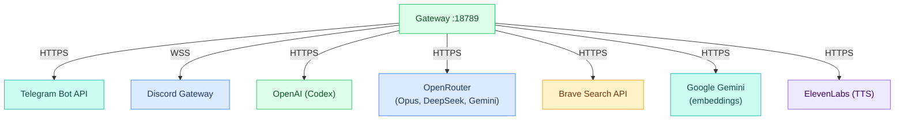
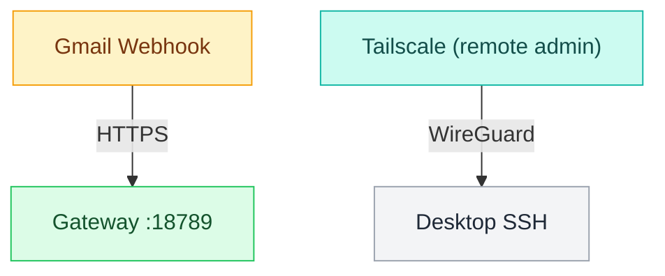
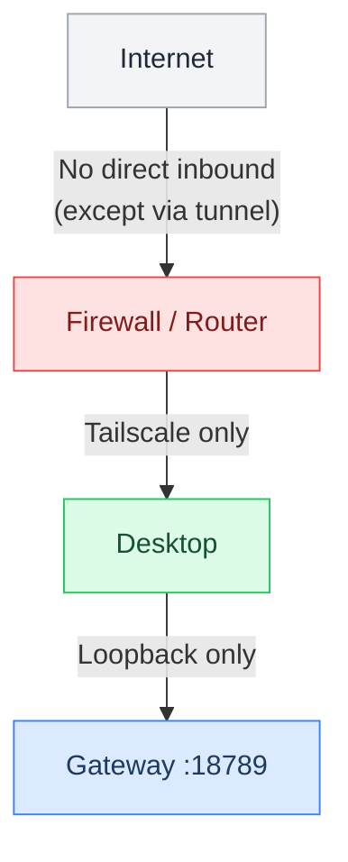

# L1 — Network

> Network topology — what ports are open, what connects where, and how traffic flows in and out.
> **Properties live in [[stack/L1-physical/_overview]].** This file provides context and explanations.

---

## Outbound Connections (Crispy → Internet)



---

## Inbound Connections (Internet → Desktop)



---

## Connection Table

| Direction | Protocol | Destination | Auth Method | CKS Layer |
|---|---|---|---|---|
| Outbound | HTTPS | Telegram Bot API | Bot token | L3 — Channel |
| Outbound | WSS | Discord Gateway | Bot token | L3 — Channel |
| Outbound | HTTPS | OpenAI (Codex) | OAuth (auto-refresh) | L6 — Processing |
| Outbound | HTTPS | OpenRouter | API key | L6 — Processing |
| Outbound | HTTPS | Google Gemini | API key | L6 — Processing |
| Outbound | HTTPS | Brave Search | API key | L6 — Processing |
| Outbound | HTTPS | ElevenLabs | API key | L3 — Channel |
| Outbound | HTTPS | GitHub API | Fine-grained PAT | L6 — Processing |
| Inbound | HTTPS | Gmail webhooks | Hooks token | L3 — Channel |
| Inbound | WireGuard | Tailscale (admin) | Device auth | L1 — Physical |

---

## Port Configuration

| Port | Binding | Purpose | Exposed? |
|---|---|---|---|
| **`= [[_overview]].network_gateway_port`** | `= [[_overview]].network_gateway_bind` (localhost only) | OpenClaw gateway | No (local only) |
| **11434** | `localhost` | Ollama (if running) | No |
| **6333** | `localhost` | Qdrant (if running) | No |
| **7474/7687** | `localhost` | Neo4j (if running) | No |

**No ports are exposed to the public internet.** Telegram and Discord use outbound connections (long-polling / WebSocket). Gmail webhooks need a tunnel (Tailscale or ngrok).

---

## Security Posture



Key security features:
- Gateway binds to `= [[_overview]].network_gateway_bind` — no external access without tunnel
- All model API calls use HTTPS (encrypted in transit)
- Channel tokens stored in .env (never in config)
- Tailscale provides encrypted remote access without exposing ports

---

## Verification Commands

```bash
# Is the gateway listening?
ss -tlnp | grep 18789

# Can you reach it locally?
curl http://localhost:18789/health

# Check outbound connectivity
curl -I https://api.telegram.org
curl -I https://api.openai.com

# Check Tailscale
tailscale status

# DNS resolution
dig api.telegram.org
```

---

**Up →** [[stack/L1-physical/_overview]]
