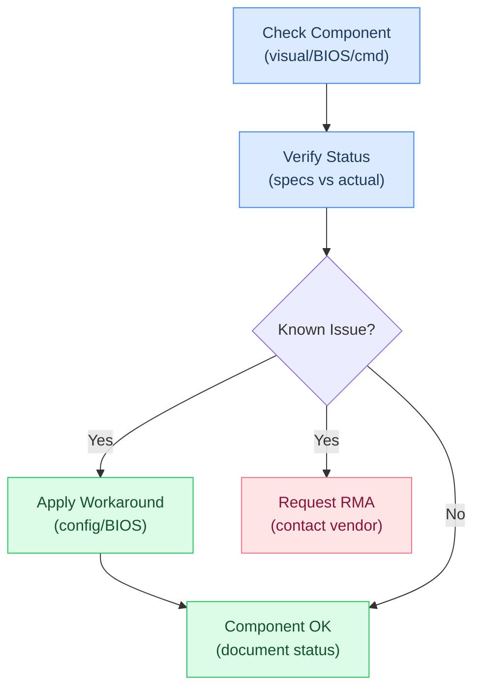
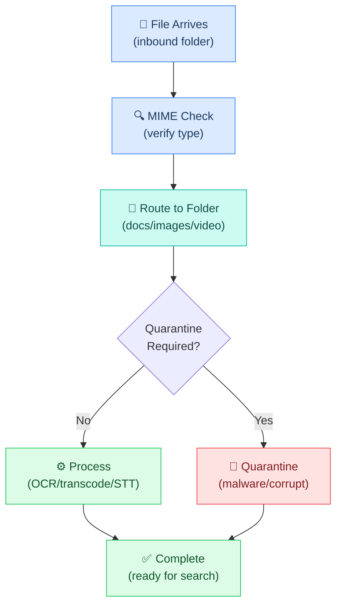

# L1 Runbook

> Operational guides for setup, verification, and troubleshooting of physical infrastructure components.

---

## Hardware Verification


### Setup Steps



---

### Verification Commands

```bash
# CPU info
lscpu | grep -E "Model name|Core|Thread|MHz"

# Memory topology — check channels and populated slots
sudo dmidecode -t memory | grep -E "Locator|Size|Speed|Configured"
free -h

# GPU info
nvidia-smi          # If NVIDIA driver installed
lspci | grep -i vga

# Storage
lsblk -d -o NAME,SIZE,MODEL,ROTA,TRAN
sudo hdparm -Tt /dev/nvme0n1   # NVMe speed test
sudo hdparm -Tt /dev/sda       # SATA speed test

# Docker resource usage
docker stats --no-stream

# System overview
neofetch   # or fastfetch
```

---

### Current Components

#### CPU
- **Model:** Intel Core i9-14900K (Raptor Lake Refresh)
- **Cores/Threads:** 24C/32T (8P + 16E)
- **Base/Boost:** 3.2 GHz / 6.0 GHz
- **TDP:** 125W (253W PL2)
- **Socket:** LGA 1700
- **⚠️ STATUS: DEGRADED** — Memory channel A non-functional. See Known Issues below.

#### Motherboard
- **Model:** ASUS Z790 GAMING WIFI7
- **Socket:** LGA 1700
- **Chipset:** Intel Z790
- **Memory Slots:** 4x DDR5 (2 per channel)
- **PCIe:** 1x PCIe 5.0 x16, 1x PCIe 4.0 x16, 1x PCIe 4.0 x4
- **M.2 Slots:** 3x (1x PCIe 5.0, 2x PCIe 4.0)
- **Networking:** WiFi 7 (BE200), Realtek 1Gb LAN
- **USB:** USB 3.2 Gen 2x2 Type-C, USB4/Thunderbolt header
- **Audio:** Realtek onboard

#### Memory
- **Kit:** Corsair Dominator Titanium CMP64GX5M2X6600C32W
- **Capacity:** 64GB (2 × 32GB)
- **Type:** DDR5-6600 (PC5-52800)
- **Timings:** CL32
- **Color:** White
- **⚠️ STATUS: DEGRADED** — Running single-channel only. See Known Issues.

#### GPU
- **Model:** EVGA GeForce GTX 1060
- **VRAM:** 6GB GDDR5 (assuming 6GB SKU — verify with `nvidia-smi`)
- **Architecture:** Pascal (2016)
- **CUDA Cores:** 1280
- **TDP:** 120W
- **PCIe:** 3.0 x16
- **Driver support:** NVIDIA 535.x series (last to support Pascal on newer kernels)
- **⚠️ NOTE:** No Tensor Cores, no FP16 acceleration. Very limited for local LLM inference.

#### Storage

| Drive | Model | Interface | Capacity | Speed | Role |
|-------|-------|-----------|----------|-------|------|
| NVMe SSD | Samsung 990 PRO (w/ heatsink) | PCIe 4.0 x4 | 1TB | 7,450 MB/s read | OS + primary workload |
| SATA SSD | Samsung 870 EVO | SATA III | 1TB | 560 MB/s read | **Qdrant Vector DB** |

#### Power Supply
- **Model:** Corsair RMe RM1000e
- **Wattage:** 1000W
- **Rating:** Cybenetics Gold / 80+ Gold equivalent
- **Modularity:** Fully modular
- **Standard:** ATX 3.1 (12VHPWR ready)
- **Note:** Massively overspec for current build — ready for high-end GPU upgrade

#### Cooling
- **CPU Cooler:** Corsair iCUE LINK TITAN 360 RX RGB (360mm AIO, white)
  - 3x RX120 RGB fans on radiator
  - iCUE LINK System Hub included
- **Case Fans:** 6x Corsair RS120 ARGB PWM (white)
  - 2x triple packs
  - Daisy-chain 4-pin PWM + 5V ARGB
  - Magnetic dome bearing
- **Total airflow:** 9 fans (3 rad + 6 case) — excellent thermal headroom

#### Case
- **Model:** HYTE Y70 (Snow White)
- **Form Factor:** Dual-chamber mid-tower ATX
- **Included:** PCIe 4.0 riser cable
- **Notes:** Panoramic glass, dual chamber separates PSU/drives from main board

---

### Known Issues

#### 1. i9-14900K Memory Controller — Channel A Failure

**Symptom:** Only memory channel B is functional. Channel A DIMMs are not detected or cause instability.

**Impact:**
- If both 32GB sticks are installed in channel B slots: **64GB accessible, single-channel bandwidth**
  - Memory bandwidth cut roughly in half (~38 GB/s vs ~76 GB/s dual-channel)
  - Noticeable impact on memory-intensive workloads (large model inference, heavy Docker stacks, video encoding)
  - General desktop/coding/web use: minimal perceptible difference
- If only one 32GB stick in channel B: **32GB accessible, single-channel**

**Current config (verify):**
```bash
# Check what's actually detected
sudo dmidecode -t memory | grep -A5 "Memory Device"
# Or
free -h
# Or for detailed topology
lshw -class memory
```

**Root cause:** Likely CPU memory controller defect (known issue with some 14900K/13900K units). Could also be motherboard trace damage, but CPU IMC is more common.

**RMA status:** _[TODO: Update — is the CPU being RMA'd? Timeline?]_

**Workaround:** Run with both sticks in channel B if the board allows population of both DIMM_B1 and DIMM_B2 without channel A. Some Z790 boards require specific slot populations — check ASUS manual. BIOS may need XMP disabled or frequency lowered (DDR5-5600 or DDR5-4800) for stability on single channel.

#### 2. GTX 1060 — Placeholder GPU

**Not a defect**, but a significant limitation for AI workloads:
- 6GB VRAM cannot run most useful LLMs locally (even 7B models need 4-6GB VRAM)
- No Tensor Cores = no FP16/INT8 acceleration
- Ollama will fall back to CPU inference, which is slow on large models
- **Adequate for:** Display output, light CUDA tasks, video decode
- **Not adequate for:** Local LLM inference, Stable Diffusion, real-time AI workloads

---

### Effective System Resources (Current)

Taking degraded components into account:

| Resource | Nominal | Effective | Notes |
|----------|---------|-----------|-------|
| CPU cores | 24C/32T | 24C/32T | Fully functional |
| RAM | 64GB DDR5-6600 | 32-64GB single-channel* | Half bandwidth; verify actual capacity |
| GPU VRAM | 6GB GDDR5 | ~5GB usable | Pascal, no tensor cores |
| NVMe | 1TB PCIe 4.0 | 1TB | Full speed |
| SATA | 1TB SATA III | 1TB | Bulk storage |
| PSU | 1000W | 1000W | Way more than needed currently |

*Verify actual accessible RAM with `free -h`

---

### Implications for OpenClaw / Mem0 Stack

#### What runs fine
- **OpenClaw gateway** — minimal resource usage (Node.js process, <500MB RAM)
- **Docker containers** — Qdrant (~1-2GB), Neo4j (~2-3GB) fit easily even at 32GB
- **Native memorySearch** — SQLite-based, negligible resources
- **Ollama embeddings** — `nomic-embed-text` (274MB) runs fine on CPU
- **Mem0 plugin** — lightweight Node.js, no GPU needed

#### What needs adjustment
- **Ollama LLM for Mem0 extraction** — `llama3.1:latest` (8B, ~4.7GB) will run on CPU but slowly (~10-30 tokens/sec on i9). Usable for background extraction but not interactive. Consider using a cloud API (gpt-4.1-nano at ~$0.001/turn) instead of local extraction until GPU upgrade.
- **Large local models** — 70B models won't fit in VRAM. CPU inference with 32-64GB RAM is possible but very slow. Not recommended until GPU upgrade.
- **Docker memory allocation** — If running at 32GB effective, budget carefully:
  - OS + desktop: ~4-6GB
  - OpenClaw gateway: ~500MB
  - Qdrant: 1-2GB
  - Neo4j: 2-3GB (can reduce to 1.5GB by lowering heap)
  - Ollama (embeddings only): ~1GB
  - Remaining: ~20-24GB for other tasks
  - At 64GB: much more comfortable, ~50GB free

#### Recommended Mem0 configuration for current hardware

**Option A: Hybrid (recommended)**
- Embeddings: Local Ollama (`nomic-embed-text`) — fast, free, CPU is fine for embeddings
- Extraction LLM: Cloud API (`gpt-4.1-nano` via OpenAI or `gemini-2.5-flash-lite` via OpenRouter) — cheap, fast, doesn't tax local resources
- Vector store: Local Qdrant in Docker
- Graph store: Local Neo4j in Docker (optional — skip to save 2-3GB RAM)

**Option B: Fully local (slower but free)**
- Embeddings: Local Ollama (`nomic-embed-text`)
- Extraction LLM: Local Ollama (`llama3.1:latest` or `phi3:mini` for lighter weight)
- Slower extraction (~5-15 seconds per conversation turn on CPU)
- Zero API costs

**Option C: Minimal (if RAM is tight at 32GB)**
- Embeddings: Local Ollama (`nomic-embed-text`)
- Extraction LLM: Cloud API
- Vector store: Local Qdrant
- Graph store: SKIP Neo4j — saves 2-3GB RAM
- Total Docker RAM: ~3GB

---

### Planned Upgrades

| Component | Current | Planned | Status | Impact |
|-----------|---------|---------|--------|--------|
| GPU | EVGA GTX 1060 6GB | RTX 5080 or 5090 | _Pending purchase_ | Unlocks local LLM inference (16-32GB VRAM), CUDA acceleration, Ollama GPU mode |
| CPU | i9-14900K (degraded) | RMA replacement or new CPU | _Pending RMA?_ | Restores dual-channel memory (~2x bandwidth), full stability |
| RAM | DDR5-6600 single-channel | Same kit, dual-channel (after CPU fix) | _Blocked on CPU_ | ~76 GB/s bandwidth, better multitasking |

#### When GPU arrives (RTX 5080: 16GB / RTX 5090: 32GB)

Update `docker-compose.mem0.yaml` — uncomment GPU section:
```yaml
ollama:
  deploy:
    resources:
      reservations:
        devices:
          - driver: nvidia
            count: 1
            capabilities: [gpu]
```

Install NVIDIA Container Toolkit:
```bash
sudo apt install nvidia-container-toolkit
sudo nvidia-ctk runtime configure --runtime=docker
sudo systemctl restart docker
```

Switch Mem0 extraction to local (update openclaw.json):
```json
"llm": {
  "provider": "ollama",
  "config": {
    "model": "llama3.1:latest",
    "ollama_base_url": "http://localhost:11434"
  }
}
```

With RTX 5090 (32GB VRAM), you could run up to `qwen3:32b` or `llama3.1:70b-q4` locally for extraction — overkill but free.

#### When CPU is fixed (RMA or replacement)

1. Reseat both DIMMs in proper dual-channel configuration (A2 + B2 typically)
2. Enable XMP profile in BIOS for DDR5-6600
3. Run `memtest86+` overnight to verify stability
4. Update this file — remove "DEGRADED" status

---

## Workspace Setup


### Directory Structure

```
workspace/                    ← ~/.openclaw/workspace/
│
│  ── Bootstrap Files ──
├── AGENTS.md                 ← Behavior rules (loaded every session)
├── SOUL.md                   ← Personality, values, tone
├── TOOLS.md                  ← Available tools reference
├── IDENTITY.md               ← Self-written identity
├── USER.md                   ← Admin preferences (Marty + Wenting)
├── MEMORY.md                 ← Curated long-term knowledge
├── HEARTBEAT.md              ← Periodic check instructions (every 20min)
├── BOOT.md                   ← Gateway startup hook
├── BOOTSTRAP.md              ← First-run ritual (self-deletes)
├── STATUS.md                 ← Task checkpoint (compaction flush)
├── projects.json             ← Project registry (see below)
│
│  ── Memory ──
├── memory/                   ← Daily logs (YYYY-MM-DD.md)
│   ├── 2026-03-02.md           Today's log
│   ├── 2026-03-01.md           Yesterday's log
│   └── guardrail.log          Security audit trail
│
│  ── Media ──
├── media/                    ← Inbound/outbound/cache/archive
│   ├── inbound/{channel}/{type}/
│   ├── outbound/{channel}/{type}/
│   ├── cache/
│   └── archive/
│
│  ── Project Repos ──
└── projects/                 ← Git repos Crispy works on continuously
    ├── crispy-kitsune/         This planning vault
    ├── portfolio-site/         Example: personal website
    └── api-backend/            Example: backend service
```

> **One location per category.** Pipelines live in `~/.openclaw/pipelines/`, skills live in `~/.openclaw/skills/` — NOT inside workspace. See [[stack/L1-physical/filesystem]] for the full layout.

---

### Projects Folder

The `workspace/projects/` directory is where git repos live so the Docker sandbox can access them. This is the key pattern for continuous agent work on codebases.

#### Why inside workspace?

The sandbox only mounts `~/.openclaw/workspace/` as read-write. Any repo Crispy needs to `git pull`, edit, test, or push must be reachable from inside the container at `/workspace/projects/`.

#### Setup

```bash
# Create the projects directory
mkdir -p ~/.openclaw/workspace/projects

# Option A: Clone repos directly
cd ~/.openclaw/workspace/projects
git clone git@github.com:FancyKat/crispy-kitsune.git
git clone git@github.com:FancyKat/portfolio-site.git

# Option B: Symlink existing repos (symlinks resolve at mount time)
ln -s ~/repos/crispy-kitsune ~/.openclaw/workspace/projects/crispy-kitsune
ln -s ~/repos/portfolio-site ~/.openclaw/workspace/projects/portfolio-site
```

> **Symlink vs clone:** Symlinks are simpler (no duplicate repos), but the host path must be accessible from Docker. If using Docker Desktop with volume mounts, cloning is more reliable.

#### Per-Project Context File

Each project can have a `PROJECT.md` at its root that Crispy reads when switching context:

```markdown
# PROJECT.md — Portfolio Site

## Stack
- Next.js 15, TypeScript, Tailwind CSS
- Vercel deployment, GitHub Actions CI

## Standards
- Branch naming: feature/*, fix/*, chore/*
- Commit style: conventional commits
- Tests: Jest + Playwright

## Current Focus
- Redesigning the about page
- Adding blog section with MDX

## Quick Actions
- /test — Run jest + playwright
- /deploy — Push to Vercel preview
- /pr — Create PR from current branch
```

#### Project Registry

The `projects.json` file at workspace root tells Crispy about all registered projects:

```json5
{
  "projects": [
    {
      "id": "crispy",
      "name": "Crispy Kitsune Stack",
      "path": "projects/crispy-kitsune",       // relative to workspace
      "keywords": ["crispy", "cks", "stack", "vault"],
      "language": "markdown, yaml",
      "gitBranch": "main"
    },
    {
      "id": "portfolio",
      "name": "Portfolio Site",
      "path": "projects/portfolio-site",
      "keywords": ["portfolio", "website", "blog"],
      "language": "typescript, nextjs",
      "gitBranch": "main"
    }
  ]
}
```

See [[stack/L6-processing/coding/_overview]] for the full project detection and context-switching system.

---

### Continuous Agent Work on Projects

With repos in `workspace/projects/`, you can set up cron jobs and hooks so Crispy continuously monitors and works on your code:

#### Cron: Periodic Project Health Checks

```json5
// openclaw.json → cron.jobs
{
  "name": "project-healthcheck",
  "cron": "0 */6 * * *",              // Every 6 hours
  "kind": "lobster",
  "pipeline": "pipelines/project-healthcheck.lobster"
}
```

What the healthcheck does per project:
- `git fetch` — check for upstream changes
- `git status` — any uncommitted work?
- Run tests if test command is defined
- Check for dependency updates (`npm outdated`, `pip list --outdated`)
- Report findings to Telegram

#### Cron: Daily Project Digest

```json5
{
  "name": "project-digest",
  "cron": "0 9 * * 1-5",              // Weekdays at 9am
  "kind": "lobster",
  "pipeline": "pipelines/project-digest.lobster"
}
```

What the digest does:
- Summarize `git log --since=yesterday` across all projects
- List open PRs and their status
- Flag stale branches (>7 days)
- Report to Telegram

#### Hook: Auto-Pull on Session Start

Add to `BOOT.md`:

```markdown
## Project Sync
- [ ] For each project in projects.json:
      cd workspace/projects/{path} && git pull --ff-only
      Report any conflicts or failures
```

---

### Config

```json5
"agents.defaults.workspace": "~/.openclaw/workspace"

// Sandbox mounts this directory
"agents.defaults.sandbox": {
  "mode": "all",
  "workspaceAccess": "rw"   // Read-write inside Docker
}

// Bootstrap loads from workspace
"agents.defaults.skipBootstrap": true  // ⚠️ flip to false after writing files
// "agents.defaults.bootstrapMaxChars": 20000  // per-file limit
```

---

### Git Backup

```bash
# Workspace root is a git repo
cd ~/.openclaw/workspace
git remote -v   # → FancyKat/crispy-kitsune (or a dedicated workspace repo)
git push        # Manual backup

# Individual projects have their own remotes
cd ~/.openclaw/workspace/projects/portfolio-site
git remote -v   # → FancyKat/portfolio-site
```

---

## Gateway Restart & Recovery

The gateway is the single process — if it's down, everything is down. These procedures cover restart, crash recovery, and config reload.

### Restart (clean)

```bash
# Graceful restart — waits for active sessions to drain
openclaw gateway restart

# Verify it came back
openclaw status
openclaw doctor
```

### Crash Recovery

```bash
# Check if gateway is running
openclaw status

# If not running, check why
openclaw logs --tail 50

# Common crash causes:
# 1. Config syntax error after edit → fix config, then restart
openclaw doctor --fix
openclaw gateway start

# 2. Port already in use (stale process)
lsof -i :18789
kill <PID>              # Kill the stale process
openclaw gateway start

# 3. Out of memory (Docker containers ate RAM)
docker stats --no-stream
docker system prune     # Clean up unused containers/images
openclaw gateway start

# 4. .env missing or corrupt
ls -la ~/.openclaw/.env
openclaw secrets audit
openclaw gateway start
```

### Config Hot-Reload vs Restart

Most config changes hot-apply without restart. Gateway-level changes (`gateway.port`, `gateway.bind`, `gateway.auth`, TLS, `plugins`) require a full restart.

```bash
# Check what changed and whether restart is needed
openclaw logs --tail 10   # Look for "hot-applied" or "restart required" messages

# Force restart if in doubt
openclaw gateway restart
```

### Post-Restart Verification

```bash
# Confirm gateway is healthy
openclaw status
openclaw doctor

# Confirm channels reconnected
openclaw channels status

# Confirm sandbox is working
openclaw sandbox explain
openclaw exec "echo hello from sandbox"
```

---

## Sandbox Setup


### Prerequisites

Docker must be installed and running on the host machine.

```bash
# Check Docker is installed
docker --version

# Check Docker daemon is running
docker info

```

---

### Setup Steps

```bash
# 1. Make sure Docker is running
docker info

# 2. Set the sandbox config
openclaw config set agents.defaults.sandbox.mode all
openclaw config set agents.defaults.sandbox.workspaceAccess rw
openclaw config set agents.defaults.sandbox.docker.enabled true
openclaw config set agents.defaults.sandbox.docker.network bridge

# 3. Verify with doctor
openclaw doctor

# 4. Test it
openclaw exec "echo 'hello from sandbox'"
openclaw exec "pwd"                    # Should show /workspace
openclaw exec "ls /"                   # Container root, not host root
openclaw exec "cat /etc/os-release"    # Container OS, not host OS
openclaw exec "touch /test.txt"        # Should FAIL (root is read-only)
openclaw exec "touch /workspace/test.txt"  # Should SUCCEED

# 5. Restart gateway to apply
openclaw gateway restart
```

---

### Verification Checklist

| Check | Command | Expected |
|-------|---------|----------|
| Docker running | `docker info` | No errors |
| Sandbox enabled | `openclaw config get agents.defaults.sandbox.mode` | `"all"` |
| Workspace writable | `openclaw exec "touch /workspace/test && rm /workspace/test"` | Success |
| Root read-only | `openclaw exec "touch /root-test"` | Permission denied |
| Network works | `openclaw exec "curl -s https://api.github.com"` | JSON response |
| Can't see .env | `openclaw exec "cat ~/.openclaw/.env"` | File not found |
| Can't see host home | `openclaw exec "ls /home/user"` | Not found or empty |

---

### Common Issues

| Problem | Cause | Fix |
|---------|-------|-----|
| "exec: Docker not available" | Docker isn't running | Start Docker Desktop (Windows) or `sudo systemctl start docker` (Linux) |
| "exec: permission denied" | Container can't write | Check `workspaceAccess` is `"rw"` |
| "exec: network unreachable" | Network mode is `"none"` | Change to `"bridge"` if git/API access needed |
| Packages disappear between sessions | Scope is `"session"` | Switch to `"agent"` scope or pre-bake packages |
| Container starts slow | Cold start overhead | Normal — first exec in a session takes 1-3s |
| Can't access project repo | Not mounted into container | Adjust workspace path or use `repoRoot` config |

---

### Troubleshooting Commands

```bash
# Check sandbox status
openclaw doctor

# View running containers
docker ps | grep openclaw

# View container logs
docker logs <container-id>

# Inspect what's mounted
docker inspect <container-id> | grep -A5 Mounts

# Test sandbox manually
openclaw exec "echo hello"
openclaw exec "ls /workspace"
openclaw exec "whoami"
openclaw exec "cat /etc/os-release"

# Check network access from sandbox
openclaw exec "curl -s https://api.github.com | head -5"

# Check what CAN'T be accessed
openclaw exec "ls /home"            # Should NOT show host home
openclaw exec "cat /etc/shadow"     # Should be denied
```

---

## Media Maintenance




---

### Cleanup & Retention Policies

#### Automatic Cleanup Pipeline

File: `~/.openclaw/pipelines/media-cleanup.lobster`

Runs daily at 2am UTC.

```yaml
---
name: Media Cleanup
description: Archive >30 day old files, delete >90 day archived files
schedule: "0 2 * * *"
timeout: 600s

steps:
  # Step 1: Find files older than 30 days
  - id: find_old_files
    type: exec
    command: |
      find ~/.openclaw/workspace/media/inbound -type f ! -name "*.metadata.json" \
        -mtime +30 -exec ls -la {} \;
    stdout_path: $find_old_files

  # Step 2: Check metadata for "keep" tag
  - id: filter_keep_tagged
    type: exec
    command: |
      for file in $(echo '$find_old_files' | jq -r '.[] | .file'); do
        metadata="${file}.metadata.json"
        if [ -f "$metadata" ]; then
          keep=$(jq '.keep' "$metadata")
          if [ "$keep" == "false" ]; then
            echo "$file"
          fi
        fi
      done
    stdout_path: $filter_keep_tagged

  # Step 3: Move to archive/
  - id: move_to_archive
    type: exec
    command: |
      for file in $filter_keep_tagged; do
        mkdir -p ~/.openclaw/workspace/media/archive
        mv "$file" ~/.openclaw/workspace/media/archive/
        if [ -f "${file}.metadata.json" ]; then
          mv "${file}.metadata.json" ~/.openclaw/workspace/media/archive/
        fi
      done
      echo "$filter_keep_tagged" | wc -l
    stdout_path: $move_to_archive

  # Step 4: Find archived files older than 90 days
  - id: find_expired_archive
    type: exec
    command: |
      find ~/.openclaw/workspace/media/archive -type f ! -name "*.metadata.json" \
        -mtime +90 -exec ls {} \;
    stdout_path: $find_expired_archive

  # Step 5: Log before deletion
  - id: log_deletions
    type: exec
    command: |
      timestamp=$(date -u +"%Y-%m-%dT%H:%M:%SZ")
      echo "$find_expired_archive" | while read file; do
        size=$(stat -f%z "$file" 2>/dev/null || stat -c%s "$file" 2>/dev/null)
        echo "{\"timestamp\":\"$timestamp\",\"deleted\":\"$file\",\"size_bytes\":$size}" >> \
          ~/.openclaw/workspace/media/cleanup.log
      done
      tail -10 ~/.openclaw/workspace/media/cleanup.log
    stdout_path: $log_deletions

  # Step 6: Delete expired files
  - id: delete_expired
    type: exec
    command: |
      for file in $find_expired_archive; do
        rm -f "$file" "${file}.metadata.json"
      done
      echo "Deleted $(echo '$find_expired_archive' | wc -l) files"
    stdout_path: $delete_expired

  # Step 7: Report storage usage
  - id: storage_report
    type: exec
    command: |
      echo "=== Media Storage Report ==="
      echo "Inbound:"
      du -sh ~/.openclaw/workspace/media/inbound/*
      echo ""
      echo "Outbound:"
      du -sh ~/.openclaw/workspace/media/outbound/*
      echo ""
      echo "Archive:"
      du -sh ~/.openclaw/workspace/media/archive
      echo ""
      echo "Cache:"
      du -sh ~/.openclaw/workspace/media/cache
      echo ""
      echo "Total:"
      du -sh ~/.openclaw/workspace/media
    stdout_path: $storage_report

outputs:
  archived_count: $move_to_archive
  deleted_count: $delete_expired
  storage_report: $storage_report
```

---

### Exception: Keep Tagged Files

Add `"keep": true` to metadata to exempt from cleanup:

```bash
# Keep a file permanently
jq '.keep = true' \
  ~/.openclaw/workspace/media/inbound/telegram/documents/file.metadata.json \
  > temp.json && mv temp.json \
  ~/.openclaw/workspace/media/inbound/telegram/documents/file.metadata.json

# Query all files marked to keep
jq -r 'select(.keep == true) .filename' \
  ~/.openclaw/workspace/media/**/*.metadata.json
```

---

### Disk Budget Alerts

```json5
"media": {
  "cleanup": {
    "enabled": true,
    "run_schedule": "0 2 * * *",         // 2am UTC daily
    "age_threshold_days": 30,
    "archive_retention_days": 90,
    "budget_alerts": {
      "enabled": true,
      "inbound_max_gb": 300,
      "archive_max_gb": 1000,
      "cache_max_gb": 100,
      "alert_on_threshold_percent": 80
    }
  }
}
```

---

### Troubleshooting

| Problem | Cause | Fix |
|---|---|---|
| **Disk full after 1 month** | Cleanup not running; video accumulating | Check `cron` job; manually run cleanup; investigate videos |
| **Metadata not created** | Metadata creation disabled in config | Enable `create_metadata: true` in openclaw.json |
| **Old files not moving to archive** | Archive path doesn't exist or permission denied | `mkdir -p ~/.openclaw/workspace/media/archive && chmod 755` |
| **Images not OCR'd** | OCR pipeline not running | Check media-pipeline.lobster; verify Tesseract installed |
| **STT transcripts are wrong** | Voice files corrupted or format mismatch | Verify `.ogg` files with `ffprobe`; re-transcode |
| **Metadata queries slow** | Too many `.metadata.json` files to scan | Implement SQLite database for metadata (future) |

---

**Full filesystem →** [[stack/L1-physical/filesystem]]
**Project routing →** [[stack/L6-processing/coding/_overview]]
**Sandbox config →** [[stack/L1-physical/sandbox]]
**Bootstrap files →** [[stack/L4-session/bootstrap]]
**Up →** [[stack/L1-physical/_overview]]
