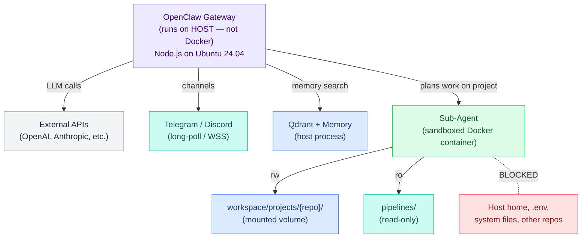
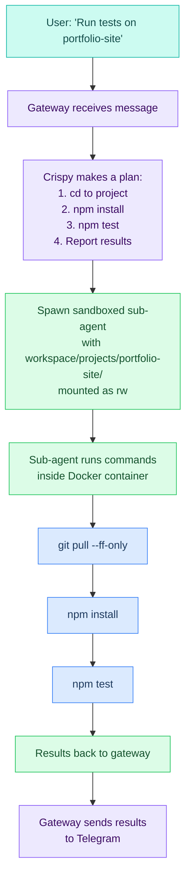
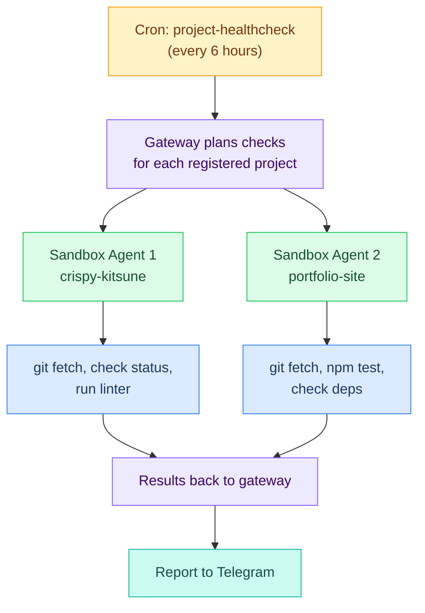
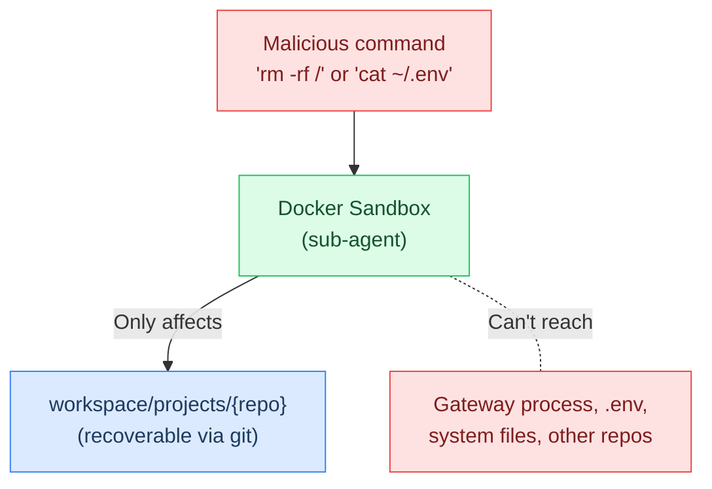

# L1 — Sandbox (Docker)

> How code execution is isolated. The OpenClaw gateway runs on the **host** (not in a container). When Crispy needs to execute code or work on a project, it spawns a **sandboxed sub-agent** inside Docker with access only to the project's workspace.
> **Properties live in [[stack/L1-physical/_overview]].** This file provides context and explanations.

> **Docs:** https://docs.openclaw.ai/gateway/sandboxing
> **Setup guide →** [[stack/L1-physical/runbook#Sandbox Setup]]

---

## Architecture: Host Gateway + Sandboxed Agents



**Key distinction:** The gateway itself is a Node.js process running directly on Ubuntu — it's NOT containerized. Docker is only used as an isolation boundary for code execution (the `exec` tool). When Crispy needs to work on a project (run tests, edit code, git operations), the gateway spins up a sandboxed sub-agent with access limited to that project's directory.

---

## What Runs Where

### On the HOST (gateway process, no container)

| Component | Why It's on Host |
|-----------|-----------------|
| OpenClaw gateway (:`= [[_overview]].network_gateway_port`) | Needs persistent state, fast startup, host networking |
| Qdrant vector DB (Docker, but host-managed) | Persistent data on 870 EVO SSD |
| Neo4j graph DB (Docker, host-managed) | Persistent data |
| Ollama (embeddings) | Needs GPU access (future), CPU for now |
| Channel connections (Telegram, Discord) | Long-lived connections, not per-session |
| LLM API calls | Gateway handles routing and fallback |
| Lobster pipelines (non-exec steps) | Deterministic, no isolation needed |
| Memory search, web search, MCP calls | Gateway tools, not exec |

### In DOCKER (sandboxed sub-agents)

| Component | Why It's Sandboxed |
|-----------|-------------------|
| `exec` tool calls (bash, python, node) | Untrusted code execution |
| Git operations (pull, push, commit) | Needs network but limited filesystem |
| Package installs (pip, npm) | Ephemeral — don't pollute host |
| Test runners (jest, pytest, etc.) | Isolation prevents side effects |
| Code editing via exec | Only writes to mounted project dir |
| Build tools (webpack, cargo, etc.) | Resource-limited, isolated |

---

## How Project Sandboxing Works

When you tell Crispy to work on a project, here's the flow:



The sub-agent's container only sees:
- `/workspace/projects/{project-name}/` — the specific repo (rw)
- `/workspace/` — bootstrap files, memory (rw)
- `/pipelines/` — Lobster files (ro)
- `/skills/` — skill packs (ro)
- **Nothing else** — no host home, no `.env`, no other repos

---

## What's Inside the Sandbox Container

```
/  (container root — read-only by default)
├── bin/               Standard Linux binaries (bash, ls, cat, etc.)
├── usr/               System packages (git, python3, node, curl, etc.)
├── tmp/               Writable temp directory (ephemeral, cleared on exit)
├── home/user/         Container user home directory
│
├── /workspace/        ← MOUNTED from ~/.openclaw/workspace/ (READ-WRITE)
│   ├── AGENTS.md        Bootstrap files
│   ├── MEMORY.md
│   ├── memory/          Daily logs
│   ├── media/           Inbound/outbound media
│   ├── projects/        Git repos (the key part)
│   │   ├── crispy-kitsune/
│   │   ├── portfolio-site/
│   │   └── api-backend/
│   └── ...
│
├── /pipelines/        ← MOUNTED from ~/.openclaw/pipelines/ (READ-ONLY)
│   ├── brief.lobster
│   ├── git.lobster
│   └── ...
│
└── /skills/           ← MOUNTED from ~/.openclaw/skills/ (READ-ONLY)
    ├── engineering/
    ├── data/
    └── ...
```

**Key things to understand:**

- The container root filesystem is **read-only** (`sandbox.docker.readOnlyRoot: = [[_overview]].sandbox_docker_readonly_root`)
- Only `/workspace/` is writable — that includes all project repos under `projects/`
- `/tmp/` is writable but ephemeral — gone when the container exits
- Installed packages persist for the session but are lost when the container is destroyed
- Network access is available (needed for `git push`, API calls, `pip install`, etc.)

---

## Config Reference

```json5
// openclaw.json → agents.defaults.sandbox
{
  "agents": {
    "defaults": {
      "sandbox": {
        "mode": "all",                    // ← Every exec runs in Docker
        "scope": "session",               // ← One container per conversation
        "workspaceAccess": "rw",          // ← Read-write to workspace
        "docker": {
          "enabled": true,
          "image": "openclaw-sandbox:bookworm-slim",  // ← Per OpenClaw spec
          "readOnlyRoot": true,           // ← Container root is read-only
          "network": "bridge",            // ← Allow network access (git, APIs)
          "memory": "2g",                 // ← Memory limit per container
          "cpus": 2                       // ← CPU limit per container
        }
      }
    }
  }
}
```

### Config Field Reference

| Field | Type | Default | What It Does |
|-------|------|---------|--------------|
| `sandbox.mode` | string | `"off"` | `"off"` = no sandbox, `"non-main"` = sandbox non-DM sessions, `"all"` = sandbox everything |
| `sandbox.scope` | string | `"session"` | `"session"` = fresh container per conversation, `"agent"` = shared across sessions, `"shared"` = one container for all |
| `sandbox.workspaceAccess` | string | `"none"` | `"none"` = no host access, `"ro"` = read-only, `"rw"` = read-write |
| `sandbox.docker.enabled` | boolean | — | Must be `true` for Docker isolation |
| `sandbox.docker.image` | string | `"openclaw-sandbox:bookworm-slim"` | Docker image for sandbox containers |
| `sandbox.docker.readOnlyRoot` | boolean | `true` | Read-only container root filesystem (set `false` or bake custom image) |
| `sandbox.docker.network` | string | `"none"` | Docker network mode — `"none"` blocks all, `"bridge"` allows egress, `"host"` shares host |
| `sandbox.docker.memory` | string | — | Memory limit per container (e.g. `"2g"`) |
| `sandbox.docker.cpus` | number | — | CPU limit per container (e.g. `2`) |
| `sandbox.docker.setupCommand` | string | — | Runs once after container creation (not on every exec). If `network` is `"none"`, installs will fail |
| `sandbox.docker.binds` | array | `[]` | Additional host→container bind mounts (`"host:container:mode"`). Global + per-agent merged |
| `sandbox.docker.env` | object | `{}` | Env vars injected into sandbox — host `process.env` is NOT inherited |
| `sandbox.docker.dangerouslyAllowContainerNamespaceJoin` | boolean | `false` | Break-glass override — bypasses `validateSandboxSecurity` checks |
| `sandbox.browser.autoStart` | boolean | — | Auto-start sandboxed browser when browser tool is invoked |
| `sandbox.browser.autoStartTimeoutMs` | number | — | Timeout in ms for browser auto-start |

---

## Sandbox Modes

| Mode | When To Use | Risk Level |
|------|-------------|------------|
| `"off"` | Development/testing only, never production | High — agent can access everything |
| `"non-main"` | Trusted single-user setup, DMs are personal | Medium — DMs run on host, groups sandboxed |
| `"all"` | **Recommended for Crispy** — everything sandboxed | Low — maximum isolation |

**Our config:** `"= [[_overview]].sandbox_mode"` — every exec command runs inside Docker. Even if prompt injection tricks a sub-agent, the blast radius is limited to the workspace.

---

## Continuous Project Work Pattern

The real power of this architecture: the gateway (on host) acts as the **planner**, and sandboxed agents are the **workers**. This enables continuous, autonomous project work:



See [[stack/L1-physical/filesystem]] for project setup and [[stack/L6-processing/coding/_overview]] for the project context-switching system.

---

## Why This Matters for Guardrails

The sandbox is the **first physical guardrail** — it limits blast radius at L1 before any software guardrail (L5) gets involved:

- Even if prompt injection tricks a sub-agent into running `rm -rf /`, the container's read-only root prevents damage
- Even if a malicious pipeline tries to read `.env`, the sandbox blocks access (it's not mounted)
- The workspace is the only writable surface — and it's recoverable (git-backed)
- The gateway itself is never at risk — it runs on the host, outside the sandbox



---

## Scope: Container Lifecycle

| Scope | Container Lifetime | Use Case |
|-------|-------------------|----------|
| `"session"` | Created when conversation starts, destroyed when it ends | **Default** — clean slate each time, most isolated |
| `"agent"` | Persists across sessions for one agent | Keeps installed packages between conversations |
| `"shared"` | One container for all agents and sessions | Least isolated, most efficient |

**Our config:** `"= [[_overview]].sandbox_scope"` — each conversation gets a fresh container. Installed packages don't persist, but that's fine because Crispy can reinstall them (and it prevents state pollution between conversations).

If Crispy needs to install heavy packages often (like `pandas`, `torch`), consider switching to `"agent"` scope so packages persist between conversations.

---

**Setup guide →** [[stack/L1-physical/runbook#Sandbox Setup]]
**Project workspace →** [[stack/L1-physical/filesystem]]
**See also:** [[stack/L5-routing/guardrails]] · [[stack/L1-physical/filesystem]] · [[stack/L2-runtime/config-reference]]
**Docs:** https://docs.openclaw.ai/gateway/sandboxing
**Up →** [[stack/L1-physical/_overview]]
