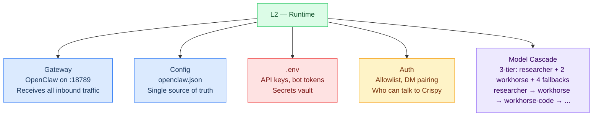
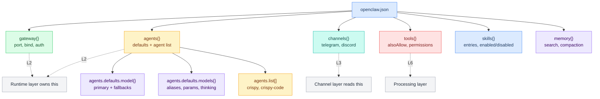
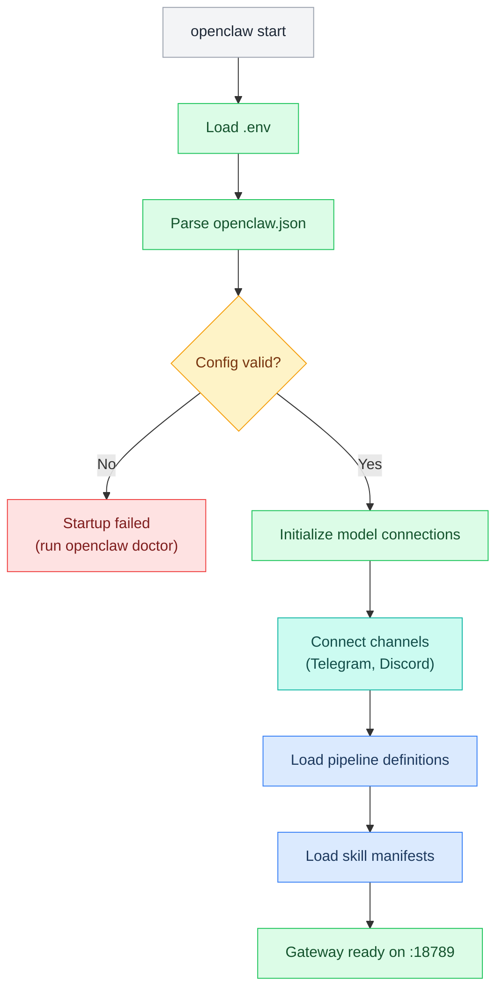

# L2 — Runtime Layer

> How messages get in and out reliably. The OpenClaw gateway, configuration, secrets, authentication, and startup sequence. This is the "network layer" of the agent — it routes connections and ensures delivery.

**OSI parallel:** Network + Transport — routing, reliability, and connection management.

## Contents

- [[#Diagrams]]
  - [[#What's at This Layer]] · `flowchart`
- [[#Gateway]]
- [[#Config Structure]] · `flowchart`
- [[#Model Cascade]]
- [[#Authentication]]
- [[#Environment Variables (.env)]]
- [[#Startup Sequence]] · `flowchart`
- [[#Pages in This Layer]]
- [[#Layer Boundary]]
- [[#L2 File Review (Live)]]

---

## Diagrams

### What's at This Layer



---

## Gateway

The OpenClaw gateway is the single entry point for all traffic:

| Setting | Value | Notes |
|---|---|---|
| **Port** | 18789 | Default, configurable |
| **Health endpoint** | GET /health | Returns 200 if gateway is up |
| **Admin endpoint** | Various | Model switching, config reload |
| **Config file** | `~/.openclaw/openclaw.json` | JSON5 format |
| **Secrets** | `~/.openclaw/.env` | Loaded at startup |

---

## Config Structure

`openclaw.json` is organized into sections that map to layers:



---

## Model Cascade

L2 manages the model routing — which model handles which task, and what happens when one fails:

| Tier | Alias | Model | Role |
|---|---|---|---|
| **Global Primary** | **researcher** | Claude Opus 4.6 (Anthropic) | Extended thinking, deep research |
| **Workhorse General** | **workhorse** | Claude Sonnet 4.5 (Anthropic) | Fast, cost-efficient general purpose |
| **Workhorse Code** | **workhorse-code** | GPT 5.2 (OpenAI) | Code generation, function calling |
| **Fallback 1** | **coder** | DeepSeek R1 | Deep reasoning, code gen |
| **Fallback 2** | **triage** | DeepSeek v3.2 | Intent classification (~200 tokens) |
| **Fallback 3** | **flash** | Gemini 2.5 Flash Lite | Cheap/fast tasks, heartbeats |
| **Fallback 4** | **free** | OpenRouter Auto | Emergency fallback |

**Actual fallback chains** (per-agent, from config-reference.md):

- `crispy`: workhorse → researcher → coder → triage → flash → free
- `crispy-code`: workhorse-code → researcher → coder → triage → flash → free
- Global defaults: researcher → coder → triage → flash → free

---

## Authentication

L2 handles who is allowed to talk to Crispy:

| Mechanism | Where | Effect |
|---|---|---|
| **DM Pairing** | Telegram config | Only paired users can DM |
| **Allowlist** | Channel config | Explicit user IDs or handles |
| **requireMention** | Discord server | Ignores messages without @Crispy |
| **Admin flag** | Agent config | Marty + Wenting = full access |

---

## Environment Variables (.env)

All secrets live in `~/.openclaw/.env`. L2 loads them at startup; other layers consume via `${VAR}` interpolation.

```
# 🔴 REQUIRED (gateway won't start without)
OPENCLAW_GATEWAY_TOKEN=oc_...        # Gateway auth
ANTHROPIC_API_KEY=sk-ant-...         # Researcher + workhorse models (Claude Opus 4.6, Sonnet 4.5)
OPENAI_API_KEY=sk-...                # Workhorse-code model (GPT 5.2)
OPENROUTER_API_KEY=sk-or-...         # Model hub (DeepSeek, Gemini, fallbacks)
GEMINI_API_KEY=AI...                 # Embeddings (memory search) + heartbeat model
TELEGRAM_BOT_TOKEN=123456:ABC...     # Primary channel
TELEGRAM_MARTY_ID=5452941776         # Admin allowlist
TELEGRAM_WENTING_ID=...              # Co-admin allowlist

# 🟡 IMPLEMENT NOW (essential for full features)
GITHUB_TOKEN=github_pat_...          # Workspace backup
BRAVE_API_KEY=BSA...                 # Web search tool
ELEVENLABS_API_KEY=...               # TTS for voice messages
ELEVENLABS_VOICE_ID=...              # Voice identity
MEM0_API_KEY=m0-...                  # Auto-memory capture

# 🔵 OPTIONAL (enable when ready)
DISCORD_BOT_TOKEN=...                # Secondary channel
OPENCLAW_HOOKS_TOKEN=...             # Gmail/webhook auth
GOG_KEYRING_PASSWORD=...             # Gaming skill keyring
```

> **Note:** Anthropic Claude Opus uses direct API key. OpenRouter provides fallback models. No OAuth needed.

---

## Startup Sequence



---

## Pages in This Layer

| Page | Covers |
|---|---|
| [[stack/L2-runtime/config-reference]] | Full openclaw.json walkthrough |
| [[stack/L2-runtime/env]] | Environment variables and secrets |
| [[stack/L2-runtime/gateway]] | Gateway setup, health checks, startup |
| [[stack/L2-runtime/models]] | Model cascade, aliases, fallback chain |
| [[stack/L2-runtime/runbook]] | Known issues and fixes needed |
| [[stack/L2-runtime/CHANGELOG]] | Layer changelog — all L2 changes by date |
| [[stack/L2-runtime/cross-layer-notes]] | Cross-layer notes from L2 sessions |

---

## Layer Boundary

**L2 receives from L1:** A running machine with Docker and network access.

**L2 provides to L3:** An authenticated, configured gateway that can route messages to/from channels.

**If L2 breaks:** Messages can't reach Crispy. Check `openclaw doctor`, then config, then .env.

---

## L2 File Review (Live)

```dataview
TABLE WITHOUT ID
  file.link AS "File",
  choice(contains(file.frontmatter.tags, "status/finalized"), "✅",
    choice(contains(file.frontmatter.tags, "status/review"), "🔍",
      choice(contains(file.frontmatter.tags, "status/planned"), "⏳", "📝"))) AS "Status",
  choice(contains(file.frontmatter.tags, "type/guide"), "Guide", "Core") AS "Type",
  dateformat(file.mtime, "yyyy-MM-dd") AS "Last Modified"
FROM "stack/L2-runtime"
WHERE file.name != "_overview"
SORT choice(contains(file.frontmatter.tags, "type/guide"), "Z", "A") ASC, file.name ASC
```

**Legend:** ✅ Finalized · 🔍 Review · 📝 Draft · ⏳ Planned

---

**Up →** [[stack/L3-channel/_overview]]
**Down →** [[stack/L1-physical/_overview]]
**Back →** [[stack/_overview]]
