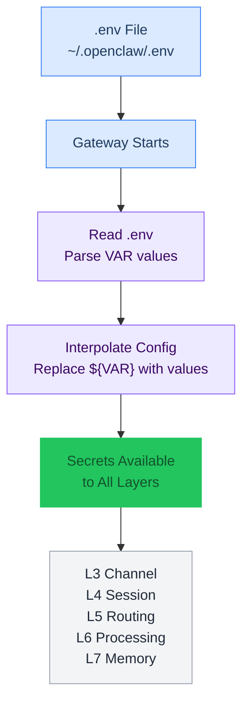

# L2 — Environment Variables (.env)

> All secrets live in `~/.openclaw/.env`. Never committed to git. Referenced in `openclaw.json` via `${VAR}` interpolation. File permissions: `chmod 600`.

---

## .env Loading Flow



---

## Key Categories

### Required (gateway won't function without these)

| Variable | Source | Format | Cost |
|---|---|---|---|
| `OPENCLAW_GATEWAY_TOKEN` | `openclaw doctor --generate-gateway-token` | `oc_...` | Free |
| `ANTHROPIC_API_KEY` | [console.anthropic.com](https://console.anthropic.com/) | `sk-ant-...` | Pay-per-use (researcher + workhorse models) |
| `OPENAI_API_KEY` | [platform.openai.com](https://platform.openai.com/api-keys) | `sk-...` | Pay-per-use (workhorse-code model) |
| `OPENROUTER_API_KEY` | [openrouter.ai/keys](https://openrouter.ai/keys) | `sk-or-...` | Pay-per-use ($5 credit unlocks free tier) |
| `GEMINI_API_KEY` | [aistudio.google.dev](https://aistudio.google.dev/apikey) | `AI...` | Free tier: 5-15 req/min |
| `TELEGRAM_BOT_TOKEN` | @BotFather → `/newbot` | `123456789:ABCdef...` | Free |
| `TELEGRAM_MARTY_ID` | @userinfobot | Numeric | Free |
| `TELEGRAM_WENTING_ID` | @userinfobot | Numeric | Free |

### Implement Now

| Variable | Source | Format | Cost |
|---|---|---|---|
| `GITHUB_TOKEN` | [github.com/settings/tokens](https://github.com/settings/tokens?type=beta) | `github_pat_...` | Free |
| `BRAVE_API_KEY` | [api-dashboard.search.brave.com](https://api-dashboard.search.brave.com) | `BSA...` | $5/mo free credit |
| `ELEVENLABS_API_KEY` | [elevenlabs.io](https://elevenlabs.io) | Hex string | Free: 10K chars/mo |
| `ELEVENLABS_VOICE_ID` | ElevenLabs voice settings | Hex string | — |
| `MEM0_API_KEY` | [app.mem0.ai](https://app.mem0.ai) or self-host | `m0-...` | Free: 10K memories |

### Optional

| Variable | Source | Format | Cost |
|---|---|---|---|
| `DISCORD_BOT_TOKEN` | [discord.com/developers](https://discord.com/developers/applications) | Base64 string | Free |
| `OPENCLAW_HOOKS_TOKEN` | `openssl rand -hex 32` | Hex | Free |
| `GOG_KEYRING_PASSWORD` | Self-set | Passphrase | Free |

### Special Auth (not in .env)

- **OpenAI Codex:** OAuth auto-refresh via `openclaw models auth paste-token --provider openai-codex`
- **GitHub Copilot:** OAuth via `openclaw models auth login --provider github-copilot`

---

## Delivery Mechanisms

| Method | Variables |
|---|---|
| `${VAR}` interpolation in config | `TELEGRAM_BOT_TOKEN`, user IDs, `OPENCLAW_GATEWAY_TOKEN`, `ELEVENLABS_*`, `OPENCLAW_HOOKS_TOKEN`, `MEM0_API_KEY` |
| shellEnv auto-pickup | `ANTHROPIC_API_KEY`, `OPENAI_API_KEY`, `OPENROUTER_API_KEY`, `GEMINI_API_KEY`, `BRAVE_API_KEY`, `GITHUB_TOKEN`, `ELEVENLABS_API_KEY` |

---

## How to Get Each Key

### OpenClaw Gateway Token
```bash
openclaw doctor --generate-gateway-token
```

### OpenRouter API Key
1. Go to [openrouter.ai/keys](https://openrouter.ai/keys)
2. Create account, generate API key
3. Cost: Pay-per-use ($5 credit unlocks free tier)

### Telegram Bot Token
1. Open Telegram, find @BotFather
2. `/start` → `/newbot` → follow prompts
3. Copy the token

### Gemini API Key
1. Go to [aistudio.google.dev/apikey](https://aistudio.google.dev/apikey)
2. Create API key
3. Cost: Free tier (5-15 req/min)

### Telegram User IDs
Send `/start` to @userinfobot in Telegram — it replies with your `user_id`.

### GitHub Token (fine-grained PAT)
1. Go to [github.com/settings/tokens?type=beta](https://github.com/settings/tokens?type=beta)
2. Create fine-grained personal access token
3. Scopes: repo (all), workflow

### Brave Search API Key
1. Go to [api-dashboard.search.brave.com](https://api-dashboard.search.brave.com)
2. Cost: Free $5/mo credit

### ElevenLabs (TTS)
1. Go to [elevenlabs.io](https://elevenlabs.io)
2. Get API key + voice ID from dashboard
3. Cost: Free 10K chars/mo

### Mem0 API Key
1. Cloud: [app.mem0.ai](https://app.mem0.ai) → Dashboard → API Keys
2. Self-hosted: No key needed (see [[stack/L7-memory/memory-search]])

### Discord Bot Token
1. Go to [discord.com/developers/applications](https://discord.com/developers/applications)
2. New Application → Bot tab → Reset Token → Copy
3. Invite to server via OAuth2 URL Generator

### OpenAI Codex (Special Auth)
Uses OAuth (auto-refresh), not a static API key:
```bash
openclaw models auth paste-token --provider openai-codex
# Stored in: ~/.openclaw/agents/<agentId>/agent/auth-profiles.json
```

---

## Security

### File Permissions
```bash
chmod 600 ~/.openclaw/.env    # Restrict to your user only
```

### Rules
- Never hardcode secrets in `openclaw.json` — use `${VARIABLE_NAME}` syntax
- Never commit secrets to workspace/ or GitHub
- At runtime, OpenClaw replaces `${VAR}` with the value from `.env`

---

## Troubleshooting

| Error | Fix |
|---|---|
| "OPENROUTER_API_KEY not set" | Check `.env` exists: `test -f ~/.openclaw/.env && echo "exists"` |
| "Gateway starts but Telegram doesn't respond" | Verify TELEGRAM_BOT_TOKEN with `openclaw channels status --probe` |
| "Memory search returns no results" | Verify GEMINI_API_KEY: `openclaw models status` |
| ".env: Permission denied" | `chmod 600 ~/.openclaw/.env` |

---

## Key Sourcing Guide

Every key below includes where to get it, how, and what it costs.

### 🔴 Required — gateway won't function without these

**`OPENCLAW_GATEWAY_TOKEN`**
Gateway auth token for the OpenClaw control UI and API.

| | |
|---|---|
| **Get it** | Auto-generated locally by OpenClaw |
| **How** | `openclaw doctor --generate-gateway-token` |
| **Cost** | Free (local) |
| **Format** | `oc_...` |

**`ANTHROPIC_API_KEY`**
Direct API key for Anthropic — powers researcher (Claude Opus 4.6) and workhorse (Claude Sonnet 4.5).

| | |
|---|---|
| **Get it** | [console.anthropic.com](https://console.anthropic.com/) |
| **How** | Sign up → API Keys → Create Key |
| **Cost** | Pay-per-use. Opus: ~$15/MTok input, ~$75/MTok output. Sonnet: ~$3/MTok input, ~$15/MTok output. |
| **Format** | `sk-ant-...` |
| **Note** | Direct provider — not routed through OpenRouter. Supports extended thinking on Opus. |
| **Docs** | [docs.anthropic.com](https://docs.anthropic.com/) |

**`OPENAI_API_KEY`**
Direct API key for OpenAI — powers workhorse-code (GPT-5.2).

| | |
|---|---|
| **Get it** | [platform.openai.com/api-keys](https://platform.openai.com/api-keys) |
| **How** | Sign up → API Keys → Create New Secret Key |
| **Cost** | Pay-per-use. |
| **Format** | `sk-...` |
| **Docs** | [platform.openai.com/docs](https://platform.openai.com/docs) |

**`OPENROUTER_API_KEY`**
Hub for fallback models — routes to DeepSeek, Gemini, free tier, and more.

| | |
|---|---|
| **Get it** | [openrouter.ai/keys](https://openrouter.ai/keys) |
| **How** | Sign up → Keys → Create Key |
| **Cost** | Pay-per-use. Free models available (20 req/min, 200 req/day). $5 credit unlocks 1,000 req/day on free models. BYOK first 1M req/month free. |
| **Format** | `sk-or-...` |
| **Docs** | [openrouter.ai/docs](https://openrouter.ai/docs) |

**`GEMINI_API_KEY`**
Google Gemini — used for embeddings (memory search vectors) and heartbeat model.

| | |
|---|---|
| **Get it** | [aistudio.google.dev/apikey](https://aistudio.google.dev/apikey) |
| **How** | Sign in with Google → Get API Key → Create |
| **Cost** | Free tier: 5-15 req/min, 1,000 req/day, no credit card needed. Paid tier unlocks 100-500 RPM with billing enabled. |
| **Format** | `AI...` |
| **Note** | Free tier data may be used for model training. Paid tier opts out. |
| **Docs** | [ai.google.dev/gemini-api/docs/pricing](https://ai.google.dev/gemini-api/docs/pricing) |

**`TELEGRAM_BOT_TOKEN`**
Crispy's Telegram bot identity.

| | |
|---|---|
| **Get it** | Telegram → [@BotFather](https://t.me/BotFather) |
| **How** | `/newbot` → follow prompts → copy token |
| **Cost** | Free |
| **Format** | `123456789:ABCdef...` |
| **Note** | One token per bot. If leaked, `/revoke` via BotFather. |

**`TELEGRAM_MARTY_ID`** / **`TELEGRAM_WENTING_ID`**
Numeric Telegram user IDs for the allowlist.

| | |
|---|---|
| **Get it** | Telegram → [@userinfobot](https://t.me/userinfobot) or [@RawDataBot](https://t.me/RawDataBot) |
| **How** | Send any message to the bot → it replies with your user ID |
| **Cost** | Free |
| **Format** | Numeric string (e.g., `5452941776`) |

---

### 🟡 Implement Now — ready to set up

**`GITHUB_TOKEN`**
Fine-grained PAT for workspace backup and repo tools.

| | |
|---|---|
| **Get it** | [github.com/settings/tokens?type=beta](https://github.com/settings/tokens?type=beta) |
| **How** | Settings → Developer Settings → Personal Access Tokens → Fine-grained → Generate New Token. Scope to `FancyKat/crispy-kitsune` repo. Permissions: Contents (read/write), Metadata (read). |
| **Cost** | Free |
| **Format** | `github_pat_...` |
| **Expiry** | Fine-grained tokens expire — set a reasonable duration and renew. |
| **Docs** | [docs.github.com/en/authentication/.../managing-your-personal-access-tokens](https://docs.github.com/en/authentication/keeping-your-account-and-data-secure/managing-your-personal-access-tokens) |

**`BRAVE_API_KEY`**
Web search via Brave Search API — used by `web_search` tool.

| | |
|---|---|
| **Get it** | [api-dashboard.search.brave.com](https://api-dashboard.search.brave.com/app/plans) |
| **How** | Sign up → Subscribe to a plan → API Keys → copy |
| **Cost** | $5/month free credit (renews monthly, ~1,000 queries). After that, $5 per 1,000 requests. Must attribute Brave in project for free credit. |
| **Format** | `BSA...` |
| **Docs** | [api-dashboard.search.brave.com/documentation](https://api-dashboard.search.brave.com/documentation/pricing) |

**`ELEVENLABS_API_KEY`** / **`ELEVENLABS_VOICE_ID`**
Text-to-speech for Telegram voice responses.

| | |
|---|---|
| **Get it** | [elevenlabs.io](https://elevenlabs.io) → Profile → API Keys |
| **How** | Sign up → Profile icon (bottom-left) → API Keys → Create. For voice ID: Speech Synthesis → pick a voice → copy ID from URL or settings. |
| **Cost** | Free tier: 10,000 chars/month (~20 min audio), non-commercial only. Starter: $5/month (commercial rights). |
| **Format** | API key is a hex string. Voice ID is also a hex string. |
| **Note** | Use model `eleven_v3` (not `eleven_multilingual_v2`). |
| **Docs** | [elevenlabs.io/docs](https://elevenlabs.io/docs) |

**`MEM0_API_KEY`**
Auto-memory plugin — passive capture and recall across sessions.

| | |
|---|---|
| **Get it** | [app.mem0.ai](https://app.mem0.ai) (cloud) or self-host (no key needed) |
| **How** | Cloud: Sign up → Dashboard → API Keys → Create. Self-hosted: see [[stack/L7-memory/memory-search]]. |
| **Cost** | Cloud free tier (Hobby): 10,000 memories, 1,000 retrieval calls/month. Starter: $19/month (50K memories, 5K calls). Self-hosted: free (uses local resources). |
| **Format** | `m0-...` |
| **Note** | Self-hosted recommended for privacy — desktop has plenty of resources. See [[stack/L1-physical/hardware]]. |
| **Docs** | [docs.mem0.ai](https://docs.mem0.ai) |

---

### 🔵 Optional — enable when ready

**`DISCORD_BOT_TOKEN`**
Crispy's Discord bot identity (Phase 5).

| | |
|---|---|
| **Get it** | [discord.com/developers/applications](https://discord.com/developers/applications) |
| **How** | New Application → Bot tab → Reset Token → Copy. Invite to server via OAuth2 URL Generator (Bot scope + needed permissions). |
| **Cost** | Free |
| **Format** | Long base64 string |
| **Note** | Never publish in a public repo. Regenerate immediately if leaked. |

**`OPENCLAW_HOOKS_TOKEN`**
Auth token for inbound webhooks (Gmail hooks, etc).

| | |
|---|---|
| **Get it** | Generate locally |
| **How** | `openssl rand -hex 32` or let OpenClaw generate it |
| **Cost** | Free (local) |
| **Format** | Hex string |

**`GOG_KEYRING_PASSWORD`**
Passphrase for the `gog` ClawHub skill's encrypted keyring.

| | |
|---|---|
| **Get it** | You set it yourself |
| **How** | Pick a strong passphrase |
| **Cost** | Free |

---

### Not in .env (special auth)

**OpenAI Codex**
OAuth auto-refresh — configured through OpenClaw's auth flow, not an env var.

| | |
|---|---|
| **How** | `openclaw models auth paste-token --provider openai-codex` |
| **Cost** | Pay-per-use via OpenAI billing. |

**GitHub Copilot**
OAuth login — configured through OpenClaw's auth flow.

| | |
|---|---|
| **How** | `openclaw models auth login --provider github-copilot` |
| **Cost** | Requires GitHub Copilot subscription. |

---

## .env Template

```bash
# ═══════════════════════════════════════════
# 🔴 REQUIRED
# ═══════════════════════════════════════════
OPENCLAW_GATEWAY_TOKEN=            # openclaw doctor --generate-gateway-token
ANTHROPIC_API_KEY=                 # console.anthropic.com (researcher + workhorse)
OPENAI_API_KEY=                    # platform.openai.com (workhorse-code)
OPENROUTER_API_KEY=                # openrouter.ai/keys (fallback models)
GEMINI_API_KEY=                    # aistudio.google.dev/apikey (embeddings + heartbeat)
TELEGRAM_BOT_TOKEN=                # @BotFather → /newbot
TELEGRAM_MARTY_ID=                 # @userinfobot
TELEGRAM_WENTING_ID=               # @userinfobot

# ═══════════════════════════════════════════
# 🟡 IMPLEMENT NOW
# ═══════════════════════════════════════════
GITHUB_TOKEN=                      # github.com/settings/tokens?type=beta
BRAVE_API_KEY=                     # api-dashboard.search.brave.com
ELEVENLABS_API_KEY=                # elevenlabs.io → Profile → API Keys
ELEVENLABS_VOICE_ID=               # elevenlabs.io → voice settings → ID
MEM0_API_KEY=                      # app.mem0.ai or skip if self-hosting

# ═══════════════════════════════════════════
# 🔵 OPTIONAL
# ═══════════════════════════════════════════
DISCORD_BOT_TOKEN=                 # discord.com/developers/applications
OPENCLAW_HOOKS_TOKEN=              # openssl rand -hex 32
GOG_KEYRING_PASSWORD=              # your passphrase
```

---

## Security & Verification

- File permissions: `chmod 600 ~/.openclaw/.env`
- Use `"${VAR_NAME}"` in `openclaw.json` to reference these values
- OpenClaw resolves env vars at gateway startup — restart after changes
- Never hardcode secrets in `openclaw.json` — always use `${}` references
- To verify: `openclaw models status --probe` (checks provider keys) and `openclaw channels status --probe` (checks channel tokens)

---

**Related →** [[stack/L2-runtime/runbook]] · [[stack/L2-runtime/config-reference]]
**Up →** [[stack/L2-runtime/_overview]]
