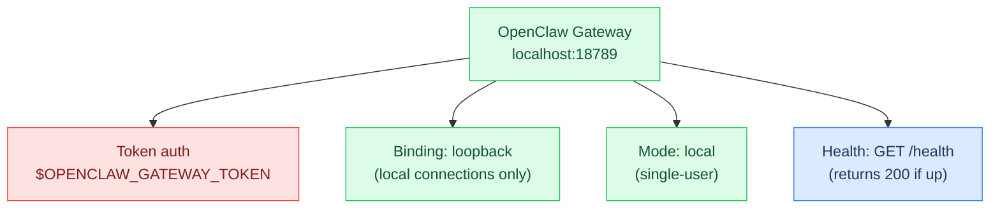
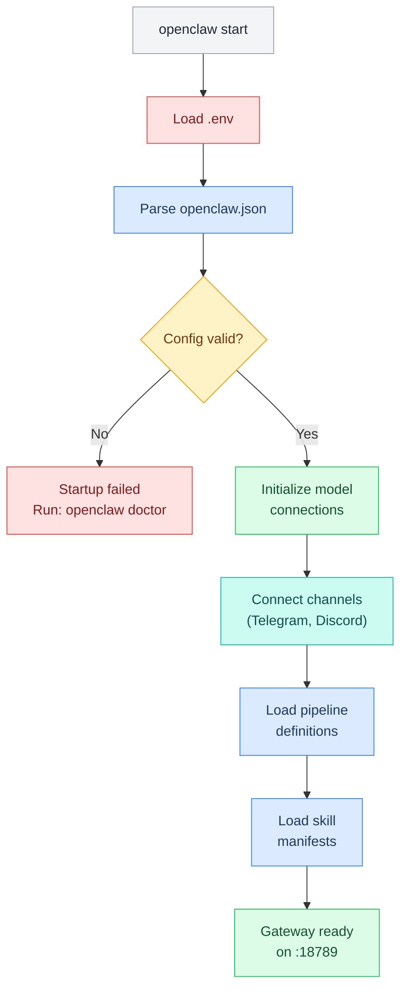

# L2 — Gateway

> The OpenClaw gateway — the single process that everything runs through. Port 18789, loopback binding, token auth.

**Operations guide →** [[stack/L2-runtime/runbook]]

---

## Overview

The gateway is the **core process** of the entire stack. Every message, every tool call, every model request flows through it. If the gateway is down, nothing works.



---

## Config

```json5
// openclaw.json → gateway section
"gateway": {
  "port": 18789,
  "bind": "loopback",     // Only local connections
  "mode": "local",         // Single-user mode
  "auth": {
    "mode": "token",
    "token": "${OPENCLAW_GATEWAY_TOKEN}"
  }
}
```

---

## Startup Sequence



---

**Operations guide →** [[stack/L2-runtime/runbook]]
**Up →** [[stack/L2-runtime/_overview]]
