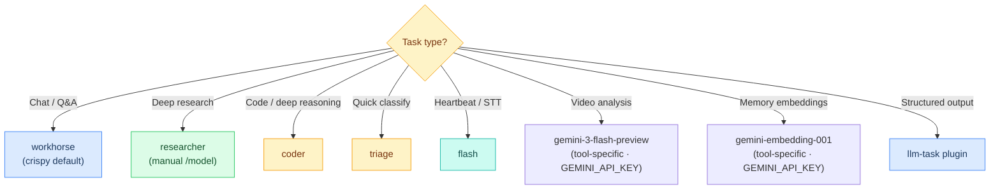
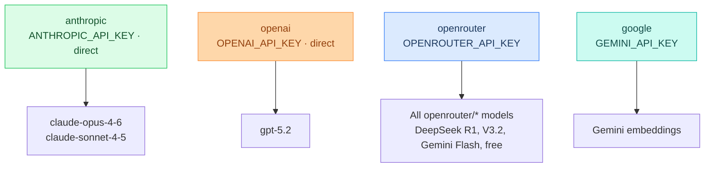

# L2 — Model Cascade

> 7 models with aliases and a fallback chain. When the primary fails, requests automatically cascade to the next model. L2 manages routing; L6 consumes the models.
> **Setup guide →** [[stack/L2-runtime/runbook]]

---

## Model Inventory

**3-Tier Architecture:**

| # | Alias | Model | Provider | Tier | Role |
|---|---|---|---|---|---|
| 1 | **researcher** | claude-opus-4-6 | Anthropic (direct) | Global Primary | Extended thinking, deep research |
| 2 | **workhorse** | claude-sonnet-4-5 | Anthropic (direct) | Workhorse General | Fast, cost-efficient general purpose |
| 3 | **workhorse-code** | gpt-5.2 | OpenAI (direct) | Workhorse Code | Code generation, function calling |
| 4 | **coder** | deepseek-r1 | DeepSeek (via OR) | Fallback 1 | Deep reasoning, debugging |
| 5 | **triage** | deepseek-v3.2 | DeepSeek (via OR) | Fallback 2 | Intent classification, triage |
| 6 | **flash** | gemini-2.5-flash-lite | Google (via OR) | Fallback 3 | Cheap/fast — heartbeats, STT |
| 7 | **free** | openrouter/auto | OpenRouter | Fallback 4 | Zero-cost emergency |

---

## Fallback Chains (Per Agent)

Each agent has its own primary model and fallback chain. The chains share fallback models but start from different primaries.

```mermaid
flowchart TD
    subgraph crispy ["crispy (default agent)"]
        C1["① workhorse<br>claude-sonnet-4-5"]:::blue
        C1 -->|fail| C2["② researcher<br>claude-opus-4-6"]:::green
        C2 -->|fail| C3["③ coder<br>deepseek-r1"]:::amber
        C3 -->|fail| C4["④ triage<br>deepseek-v3.2"]:::amber
        C4 -->|fail| C5["⑤ flash<br>gemini-2.5-flash-lite"]:::teal
        C5 -->|fail| C6["⑥ free<br>openrouter/auto"]:::gray
    end

    subgraph code ["crispy-code"]
        D1["① workhorse-code<br>gpt-5.2"]:::orange
        D1 -->|fail| D2["② researcher<br>claude-opus-4-6"]:::green
        D2 -->|fail| D3["③ coder<br>deepseek-r1"]:::amber
        D3 -->|fail| D4["④ triage<br>deepseek-v3.2"]:::amber
        D4 -->|fail| D5["⑤ flash<br>gemini-2.5-flash-lite"]:::teal
        D5 -->|fail| D6["⑥ free<br>openrouter/auto"]:::gray
    end

    classDef green fill:#dcfce7,stroke:#22c55e,color:#14532d
    classDef blue fill:#dbeafe,stroke:#3b82f6,color:#1e3a5f
    classDef orange fill:#fed7aa,stroke:#fb923c,color:#92400e
    classDef teal fill:#ccfbf1,stroke:#14b8a6,color:#134e4a
    classDef amber fill:#fef3c7,stroke:#f59e0b,color:#78350f
    classDef gray fill:#f3f4f6,stroke:#9ca3af,color:#6b7280
```



---

## Task Routing



> **Note:** Video analysis (`gemini-3-flash-preview`) and memory embeddings (`gemini-embedding-001`) are tool-specific models consumed by L6/L7 directly via `GEMINI_API_KEY`. They are not part of the agent model cascade defined in [[stack/L2-runtime/config-reference]].

---

## Auth Profiles



---

## Config

> **Source of truth →** [[stack/L2-runtime/config-reference]] §Agents Config (`^config-agents` block)

Model routing is configured in `agents.defaults.model` (primary + fallbacks) and `agents.defaults.models` (alias definitions + params). Per-agent overrides: `crispy` uses workhorse (Sonnet 4.5) as primary; `crispy-code` uses workhorse-code (GPT 5.2) as primary. Both inherit fallbacks from defaults. See config-reference.md for the full JSON5 config.

---

## llm-task Plugin (Separate Model Pool)

The `llm-task` plugin has its own model routing for structured, short outputs:

```json5
"plugins.entries.llm-task.config": {
  "defaultModel": "anthropic/claude-sonnet-4-5",
  "allowedModels": ["researcher", "workhorse", "workhorse-code", "coder", "triage", "flash", "free"],
  "maxTokens": 800,
  "timeoutMs": 30000
}
```

---

## Switching Models in Chat

Use aliases in Telegram: `/model coder` switches the session to deepseek-r1.

---

## Decisions to Make

- [x] Primary model switched to `researcher` (claude-opus-4-6) with extended_thinking enabled
- [ ] Should `coder` be the default for #dev on Discord?
- [ ] Is the fallback order optimal?
- [x] Extended thinking enabled at "high" level for researcher model

---

**Setup guide →** [[stack/L2-runtime/runbook]]
**Up →** [[stack/L2-runtime/_overview]]
