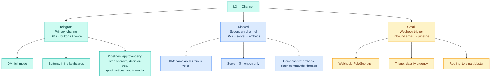
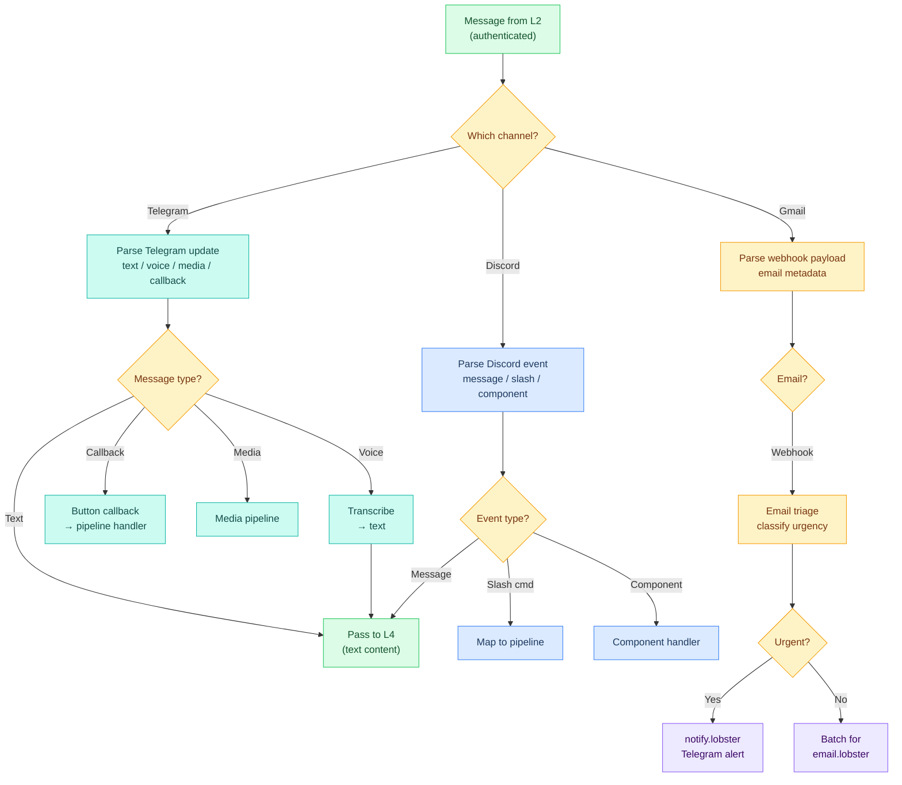

# L3 — Channel Layer

> Where messages arrive and depart. Each channel (Telegram, Discord, Gmail) has its own behavior rules, formatting, interaction patterns, and pipelines. Everything that's channel-specific lives here.

**OSI parallel:** Session (partial) — the channel manages the connection between user and agent, just as the Session layer manages connections between hosts.

## Contents

- [[#What's at This Layer]] · `flowchart`
- [[#Channel Comparison]]
- [[#Channel Architecture]]
- [[#Per-Channel Folders]]
- [[#L3-Level Core Files]]
- [[#How L3 Processes a Message]] · `flowchart`
- [[#Telegram Button Patterns]]
- [[#Channel-Specific Behavior Rules]]
- [[#Core vs Runbooks]]
- [[#Pages in This Layer]]
- [[#Layer Boundary]]
- [[#L3 File Review (Live)]]
- [[#Integration Map (Channel-Specific)]]

---

## What's at This Layer



---

## Channel Comparison

| Feature | Telegram | Discord | Gmail |
|---|---|---|---|
| **Mode** | DM (full) | DM + Server | Webhook only |
| **Buttons** | Inline keyboards | Components | N/A |
| **Voice** | Voice → transcribe → text | Not supported | N/A |
| **Rich output** | HTML formatting | Embeds + markdown | N/A |
| **Custom commands** | /brief /email /git /pipelines | Slash commands | N/A |
| **Auto-threading** | No | Over ~500 words | N/A |
| **Group behavior** | Not enabled | @mention only, short replies | N/A |
| **Button patterns** | 4 types (see below) | TBD | N/A |
| **Status** | ✅ Connected | ⏳ Planned | ⏳ Planned |

---

## Channel Architecture

Each channel serves a fundamentally different architectural role. This determines how the rest of the stack interacts with it.

| Channel | Role | Interaction Model | Session Type |
|---|---|---|---|
| **Telegram** | Primary orchestrator | 1:1 (Marty <> Crispy) | Full Focus Mode Tree, decision flows, inline keyboards, execution |
| **Discord** | Council / multi-agent | Many-to-many (users x bots x roles) | Multiple Crispy bots in Docker containers, each with a role. Family members join. Council answers questions. Per-room 1:1 with role-specialized Crispy |
| **Gmail** | Information gathering | Inbound-only (webhook -> pipeline) | No interactive sessions. Incoming email triggers category-aware memory writes (recipe newsletter -> cooking memory, market update -> finance memory). Data ready for retrieval when relevant hat loads on Telegram |

---

## Per-Channel Folders

Each channel has its own folder with everything Crispy needs for that channel:

### Telegram → [[stack/L3-channel/telegram/_overview]]

```
telegram/
├── _overview                Core channel config & behavior
├── button-patterns          Button design patterns
├── chat-flow                Message lifecycle + conversation flows
├── media-handling           Media types/limits
├── pipelines                All Telegram pipelines
└── runbook                  Setup + operations guide
```

### Discord → [[stack/L3-channel/discord/_overview]]

```
discord/
├── _overview                Core channel config & behavior
├── chat-flow                Message lifecycle, components, media
└── runbook                  Setup + operations guide
```

### Gmail → [[stack/L3-channel/gmail/_overview]]

```
gmail/
├── _overview                Webhook architecture, how it works
├── email-triage             Classification logic, webhook flow, privacy
└── runbook                  Setup + operations guide
```

---

## L3-Level Core Files

```
├── config-reference.md      Channel config blocks (^config-channels)
└── voice-pipeline.md        Voice STT/TTS setup + guide
```

> **Note:** `decision-trees.md` moved to L5 — decision trees are session-time intent routing, not channel concerns. See [[stack/L5-routing/decision-trees]].

---

## How L3 Processes a Message



---

## Telegram Button Patterns

Telegram is the primary channel and has 4 distinct button interaction patterns:

| Pattern | When | Depth | LLM Cost |
|---|---|---|---|
| **Approve-Deny** | Binary yes/no for pipeline approval | 1 level | 0 (pre-built) |
| **Exec-Approve** | Command preview before execution | 1 level | 0 (pre-built) |
| **Decision-Tree** | 3+ choices that cascade | 2 levels max | 1 call (to build) |
| **Quick-Actions** | Shortcut menu for common tasks | 1–2 levels | 1 call (to build) |

**Key insight:** Button callbacks are **zero-LLM** operations. The tree is built once (1 LLM call), stored in Lobster state, and every subsequent tap is a pure key lookup (~200ms, no tokens).

---

## Channel-Specific Behavior Rules

### Telegram DMs (full mode)
- Voice replies on voice input
- Inline buttons for ambiguous intents (2x2 max, escape hatch)
- Custom commands: /brief /email /git /pipelines
- Streaming responses enabled
- Full context (bootstrap + memory + history)

### Discord DMs
- Same as Telegram DMs minus voice
- No inline buttons (use components instead)

### Discord Server
- Only responds when @Crispy mentioned
- Embeds for structured output
- Auto-thread over ~500 words
- #crispy-logs = write-only
- Shorter responses in group context

### Gmail Webhook
- Email arrives → Webhook push notification
- Crispy classifies urgency and routes to appropriate pipeline
- Urgent → immediate Telegram alert
- Normal → batch processing (scheduled or manual)
- Replies require explicit user approval

### All Channels
- Never share DM context in groups
- Never message users outside the allowlist
- Channel formatting happens here, not in L6

---

## Core vs Runbooks

**Core files** (in layer root or channel root):
- Understanding — diagrams, architecture, concepts, config field references
- "How things work" — state machines, flow diagrams, decision trees
- Examples: `chat-flow.md`, `button-patterns.md`, `media-handling.md`, `voice-pipeline.md`, `decision-trees.md`

**Runbooks** (per-channel `runbook.md`):
- Action — step-by-step setup, debugging, troubleshooting, checklists, bash commands
- Each channel has one `runbook.md` consolidating all operational guides
- Guide content was previously in `guides/` subfolders — now merged into runbooks

---

## Pages in This Layer

| Page | Covers |
|---|---|
| [[stack/L3-channel/config-reference]] | Channel config blocks for openclaw.json |
| [[stack/L3-channel/CHANGELOG]] | Layer changelog — all L3 changes by date |
| [[stack/L3-channel/cross-layer-notes]] | Cross-layer notes from L3 sessions |
| ~~decision-trees~~ | Moved to [[stack/L5-routing/decision-trees]] |
| [[stack/L3-channel/discord/_overview]] | Discord DMs + server mode, embeds, slash commands |
| [[stack/L3-channel/gmail/_overview]] | Gmail webhook trigger, inbound email processing |
| [[stack/L3-channel/telegram/_overview]] | Telegram DMs, buttons, voice, custom commands |
| [[stack/L3-channel/voice-pipeline]] | Voice architecture, STT/TTS engines, diagrams |

---

## Layer Boundary

**L3 receives from L2:** An authenticated message with source metadata (who sent it, which channel).

**L3 provides to L4:** A normalized message (text content, regardless of original format) with channel context (which channel, what formatting to use on response).

**If L3 breaks:** Messages arrive at the gateway but Crispy can't understand or respond to them. Check bot token, webhook URL, channel config.

---

## L3 File Review (Live)

### By Channel

```dataview
TABLE WITHOUT ID
  file.link AS "File",
  choice(contains(file.frontmatter.tags, "status/finalized"), "✅",
    choice(contains(file.frontmatter.tags, "status/review"), "🔍",
      choice(contains(file.frontmatter.tags, "status/planned"), "⏳", "📝"))) AS "Status",
  choice(contains(file.frontmatter.tags, "channel/telegram"), "Telegram",
    choice(contains(file.frontmatter.tags, "channel/discord"), "Discord",
      choice(contains(file.frontmatter.tags, "channel/gmail"), "Gmail", "Core"))) AS "Channel",
  choice(contains(file.frontmatter.tags, "type/guide"), "Guide", "Core") AS "Type",
  dateformat(file.mtime, "yyyy-MM-dd") AS "Last Modified"
FROM "stack/L3-channel"
WHERE file.name != "_overview"
SORT file.folder ASC, file.name ASC
```

**Legend:** ✅ Finalized · 🔍 Review · 📝 Draft · ⏳ Planned

---

## Integration Map (Channel-Specific)

> For model providers, auth summary, and full integration details, see [[stack/L2-runtime/_overview]]. This section covers channel-specific integrations only.

| Channel | Integration | Status |
|---|---|---|
| **Telegram** | Bot API (long-polling), inline keyboards, voice STT/TTS | ✅ Active |
| **Discord** | Gateway (WebSocket), slash commands, embeds, components | 🟡 Ready to implement |
| **Gmail** | Webhook (Pub/Sub push) -> email.lobster pipeline | ⏳ Planned |

**Channel configs →** [[stack/L3-channel/config-reference]]
**Model providers & auth →** [[stack/L2-runtime/_overview]] · [[stack/L2-runtime/env]]

---

**Up →** [[stack/_overview]]
**Down →** [[stack/L2-runtime/_overview]]
