# L3 — Discord Chat Flow

> Discord message lifecycle from arrival to response. Covers slash commands, DM vs. server behavior, embed formatting, and component interactions.

---

## Input Routing

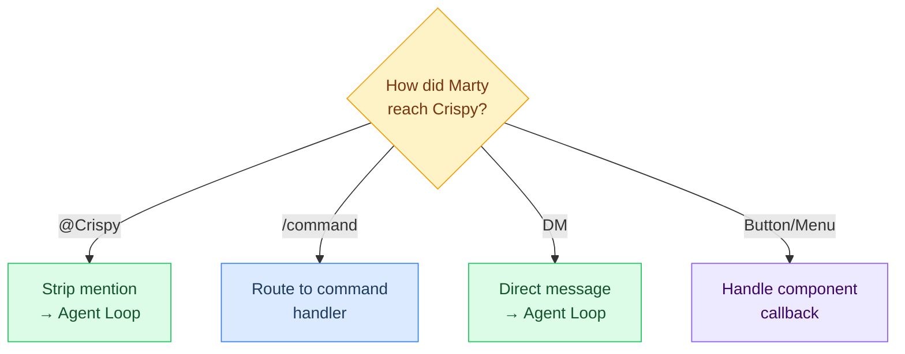

---

## Message Reception

### Direct Messages (DM)

Full interaction mode — same as Telegram DM minus voice:

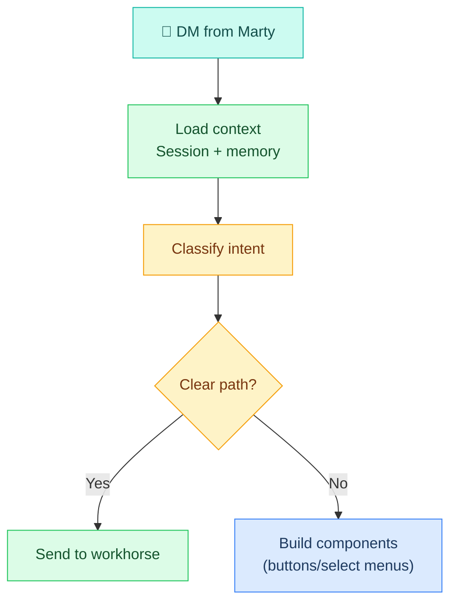

### Server Message (@Mention)

Limited interaction — brief replies only:

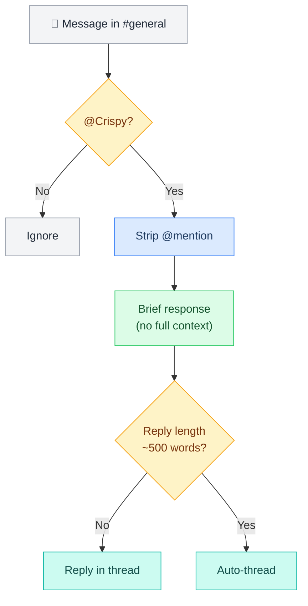

---

## Slash Commands

When a user types `/command`, it routes to a handler:

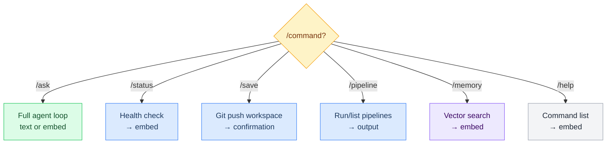

### Command Reference

| Command | Purpose | Needs LLM? | Output |
|---|---|---|---|
| `/ask <question>` | Free-form question | Yes | Text or embed |
| `/status` | System health | No | Status embed |
| `/save` | Commit + push workspace | No | Confirmation |
| `/pipeline <name>` | Run named pipeline | Depends | Pipeline output |
| `/memory <query>` | Search vector memory | Yes (vector) | Results embed |
| `/help` | Command list | No | Help embed |

### Example: `/status`

```
/status
         ↓
Build system health check
         ↓
Render as embed with:
  • Gateway: ✅ Running
  • Uptime: 6h 34m
  • Models: All healthy
  • Memory: 247 KB loaded
         ↓
Send embed response
```

---

## Response Formatting

After the agent loop runs, Crispy formats the response based on content type:

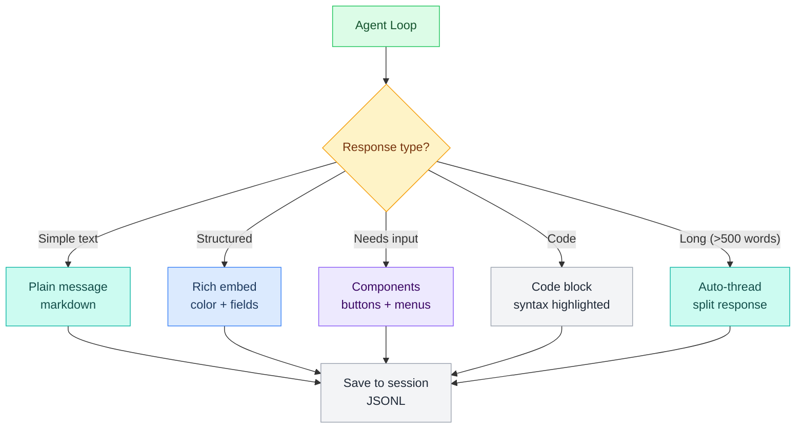

### Plain Message

```
Simple text response with markdown:
**bold** *italic* `code` [link](url)
```

### Rich Embed

```
Title + color + fields + footer
Multiple fields per row (inline)
Thumbnail or image
Author info
```

### Code Block

```
Discord code block with syntax:
```python
def hello():
    print("world")
```
```

### Threading

Automatic when response exceeds ~500 words:

```
Main message: "Here's the full answer..."
           ↓
Thread reply 1: "[block 1]"
           ↓
Thread reply 2: "[block 2]"
           ↓
Thread reply 3: "[block 3 — conclusion]"
```

---


## Components (Buttons & Menus)

Discord components are interactive UI elements:

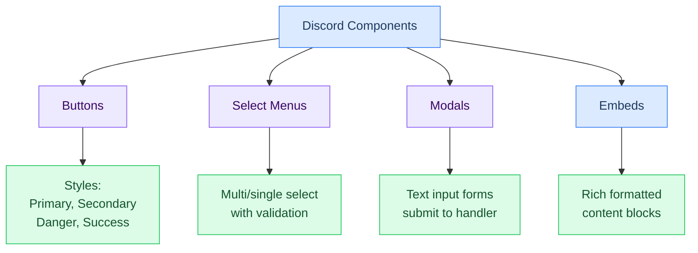

### 1. Buttons

Interactive buttons that trigger actions.

#### Button Styles

```
┌─────────────────────────────────────┐
│ Primary (blue)                      │
│ [Primary] [Primary Disabled]         │
│                                     │
│ Secondary (gray)                    │
│ [Secondary] [Secondary Disabled]    │
│                                     │
│ Danger (red)                        │
│ [Danger] [Danger Disabled]          │
│                                     │
│ Success (green)                     │
│ [Success] [Success Disabled]        │
│                                     │
│ Link (external)                     │
│ [Open Link]                         │
└─────────────────────────────────────┘
```

#### Button Config

```json5
{
  "type": "button",
  "style": "primary",       // primary, secondary, danger, success
  "label": "✅ Approve",
  "customId": "btn_approve", // Used in callback
  "disabled": false,
  "emoji": "✅"
}
```

#### Button Callback Handler

```yaml
steps:
  - id: handle_button
    command: |
      case "$customId" in
        btn_approve)
          echo "User approved"
          # Execute action
          ;;
        btn_deny)
          echo "User denied"
          # Execute action
          ;;
      esac
```

#### Examples

**Approval:**
```
📨 Deploy to staging?
[✅ Approve] [❌ Deny] [🔍 Preview]
```

**Quick Actions:**
```
🔀 What would you like?
[📋 Brief] [📧 Email] [🔀 Git]
```

**External Links:**
```
📚 Need help?
[📖 Docs] [💬 Discord] [🐛 Issues]
```

---

### 2. Select Menus

Dropdown selectors for choosing from multiple options.

#### Types

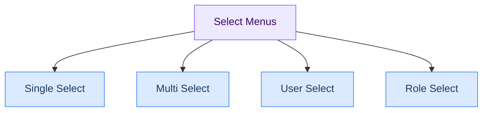

#### Single Select Example

```
┌─────────────────────────────┐
│ Which environment to deploy?│
│ ▼ Select environment...     │
│                             │
│ Options:                    │
│ ┌─────────────────────────┐ │
│ │ 🧪 Staging              │ │
│ │ 🔴 Production           │ │
│ │ 📊 Canary               │ │
│ └─────────────────────────┘ │
└─────────────────────────────┘
```

#### Config

```json5
{
  "type": "select",
  "customId": "select_env",
  "placeholder": "Select environment...",
  "minValues": 1,
  "maxValues": 1,
  "options": [
    {
      "label": "🧪 Staging",
      "value": "staging",
      "description": "Test environment"
    },
    {
      "label": "🔴 Production",
      "value": "production",
      "description": "Live environment"
    },
    {
      "label": "📊 Canary",
      "value": "canary",
      "description": "Limited rollout"
    }
  ]
}
```

#### Multi-Select Example

```
┌─────────────────────────────┐
│ Which repos to deploy?      │
│ ▼ Select repositories...    │
│                             │
│ Selected: 2                 │
│ ☑ core                      │
│ ☑ api                       │
│ ☐ web                       │
│                             │
│ [✅ Confirm] [🔄 Change]    │
└─────────────────────────────┘
```

#### Callback Handler

```yaml
steps:
  - id: handle_select
    command: |
      echo "Selected: $selectedValues"
      # Process selections
      for value in $selectedValues; do
        case "$value" in
          staging)
            echo "Deploying to staging..."
            ;;
          production)
            echo "Deploying to production..."
            ;;
        esac
      done
```

---

### 3. Modals (Text Input Forms)

Modals collect text input from users.

#### Modal Example

```
┌─────────────────────────────────────┐
│ Create New Pipeline                 │
├─────────────────────────────────────┤
│ Name:                               │
│ [_________________________]          │
│                                     │
│ Description:                        │
│ [_________________________]          │
│ [_________________________]          │
│                                     │
│ Frequency:                          │
│ [_________________________]          │
│                                     │
│          [✅ Create] [❌ Cancel]     │
└─────────────────────────────────────┘
```

#### Config

```json5
{
  "type": "modal",
  "customId": "modal_new_pipeline",
  "title": "Create New Pipeline",
  "components": [
    {
      "type": "text",
      "customId": "input_name",
      "label": "Pipeline Name",
      "placeholder": "e.g., daily-brief",
      "required": true,
      "maxLength": 50
    },
    {
      "type": "text",
      "customId": "input_desc",
      "label": "Description",
      "placeholder": "What does this pipeline do?",
      "required": true,
      "style": "paragraph",
      "maxLength": 500
    },
    {
      "type": "text",
      "customId": "input_freq",
      "label": "Frequency (cron)",
      "placeholder": "e.g., '0 9 * * *' for 9am daily",
      "required": false,
      "maxLength": 50
    }
  ]
}
```

#### Modal Submission Handler

```yaml
steps:
  - id: handle_modal
    command: |
      NAME="$input_name"
      DESC="$input_desc"
      FREQ="$input_freq"

      # Validate
      if [ -z "$NAME" ]; then
        echo "Name is required"
        exit 1
      fi

      # Create pipeline
      mkdir -p ~/.openclaw/pipelines/$NAME
      cat > ~/.openclaw/pipelines/$NAME/manifest.yaml <<EOF
      name: $NAME
      description: $DESC
      schedule: $FREQ
      EOF

      echo "✅ Pipeline created: $NAME"
```

---

### 4. Rich Embeds

Structured, formatted content blocks.

#### Embed Anatomy

```
┌──────────────────────────────┐
│ 🦊 Crispy (Author icon)      │ Author
├──────────────────────────────┤
│ 📊 System Status (Title)     │ Title (blue = link)
│                              │
│ Gateway    ✅ Running   6h 34m│ Fields (key/value)
│ Uptime     4h 23m      active│
│ Sessions   3 active          │
│ Memory     247 KB      loaded│
│                              │
│ 🎯 Models (Field group)      │ Inline fields
│ ├ workhorse ✅ healthy (99%)│
│ ├ OpenRouter ✅ healthy (99%)│
│ └ Gemini    ✅ healthy (99%)│
│                              │
│ [Thumbnail/image] | Optional │ Image
│                    |          │
├──────────────────────────────┤
│ Last check: 2 min ago        │ Footer + timestamp
│ 2026-03-02 15:42:33 UTC      │
└──────────────────────────────┘
```

#### Embed Config

```json5
{
  "title": "📊 System Status",
  "description": "Current health of all systems",
  "color": 0x22c55e,  // Green for success
  "author": {
    "name": "Crispy",
    "iconUrl": "https://example.com/crispy.png"
  },
  "fields": [
    {
      "name": "Gateway",
      "value": "✅ Running",
      "inline": true
    },
    {
      "name": "Uptime",
      "value": "4h 23m",
      "inline": true
    },
    {
      "name": "Sessions",
      "value": "3 active",
      "inline": true
    },
    {
      "name": "Memory",
      "value": "247 KB",
      "inline": true
    },
    {
      "name": "🎯 Models",
      "value": "├ workhorse ✅ healthy\n├ OpenRouter ✅ healthy\n└ Gemini ✅ healthy",
      "inline": false
    }
  ],
  "thumbnail": {
    "url": "https://example.com/chart.png"
  },
  "footer": {
    "text": "Last check: 2 min ago",
    "iconUrl": "https://example.com/icon.png"
  },
  "timestamp": "2026-03-02T15:42:33Z"
}
```

#### Color Coding

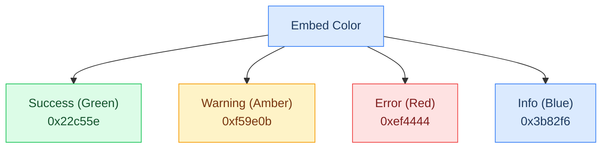

---

### Slash Command Registration

Slash commands are registered with Discord at bot startup.

#### Command Definitions

```json5
{
  "commands": [
    {
      "name": "ask",
      "description": "Ask Crispy a question",
      "options": [
        {
          "type": "string",
          "name": "question",
          "description": "Your question",
          "required": true
        }
      ]
    },
    {
      "name": "status",
      "description": "Show system health status",
      "options": []
    },
    {
      "name": "save",
      "description": "Commit and push workspace",
      "options": [
        {
          "type": "string",
          "name": "message",
          "description": "Commit message",
          "required": false
        }
      ]
    },
    {
      "name": "pipeline",
      "description": "Run or list pipelines",
      "options": [
        {
          "type": "string",
          "name": "action",
          "description": "run or list",
          "required": true,
          "choices": [
            { "name": "run", "value": "run" },
            { "name": "list", "value": "list" }
          ]
        },
        {
          "type": "string",
          "name": "pipeline",
          "description": "Pipeline name (for run)",
          "required": false
        }
      ]
    },
    {
      "name": "memory",
      "description": "Search your memory",
      "options": [
        {
          "type": "string",
          "name": "query",
          "description": "Search query",
          "required": true
        }
      ]
    },
    {
      "name": "help",
      "description": "Show available commands",
      "options": []
    }
  ]
}
```

#### Command Handler

```yaml
steps:
  - id: route_command
    command: |
      case "$commandName" in
        ask)
          echo "Q: $question"
          # Call agent loop
          ;;
        status)
          # Run health check
          ;;
        save)
          # Git commit + push
          ;;
        pipeline)
          # Run or list pipeline
          ;;
        memory)
          # Vector search
          ;;
        help)
          # Show command list
          ;;
      esac
```

---

### Component Interaction Flow

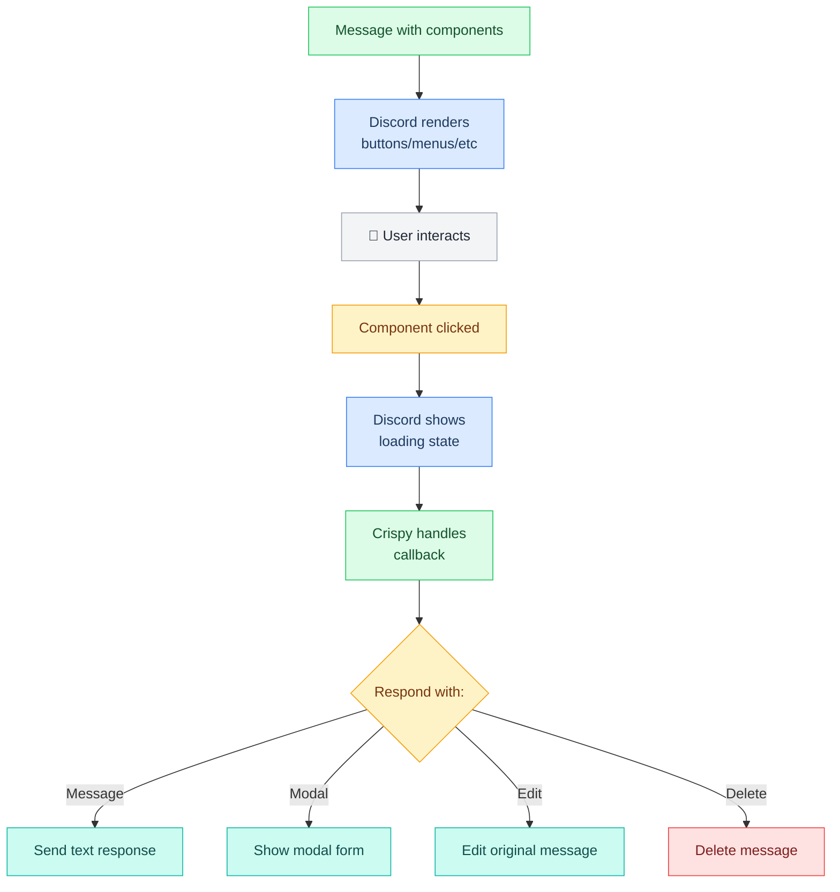

---

### Threading

Automatic threading when response is long (>500 words):

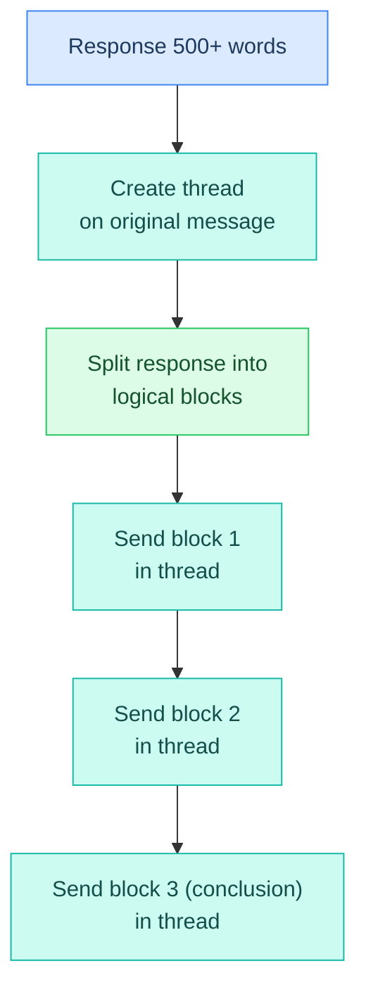

#### Example

```
Main message: "Here's your full answer..."
           ↓
Thread auto-created
           ↓
Reply 1: "[Block 1: introduction]"
Reply 2: "[Block 2: methodology]"
Reply 3: "[Block 3: conclusion]"
```

---

### Code Blocks

Syntax-highlighted code:

```
```python
def deploy_to_prod():
    run_tests()
    build_image()
    push_image()
    update_service()
```
```

Discord supports: python, javascript, yaml, json, bash, go, rust, etc.

---

### Component Composition Rules

#### Layout Guidelines

- **Max 5 buttons per row**
- **Max 25 components total per message**
- **Max 1 select menu per message** (Discord limitation)
- **Max 25 options per select menu**

#### Design Pattern

```
Message content
             ↓
Embed (optional)
             ↓
Components row 1: [Button] [Button] [Button]
             ↓
Components row 2: [Select Menu ▼]
```

#### Accessibility

- Always use labels with buttons (not just emojis)
- Provide descriptions in select menus
- Use clear, specific button text ("Approve" not "OK")
- Disable buttons when not applicable
- Show loading state during processing

---

#### Config Example

```json5
{
  "discord": {
    "components": {
      "buttons": {
        "maxPerRow": 5,
        "defaultStyle": "primary"
      },
      "selects": {
        "maxOptions": 25
      },
      "modals": {
        "maxFields": 5
      },
      "embeds": {
        "defaultColor": 0x3b82f6,
        "maxFields": 25,
        "maxDescription": 4096
      }
    }
  }
}
```

---

## Channel Routing

Different channels have different rules:

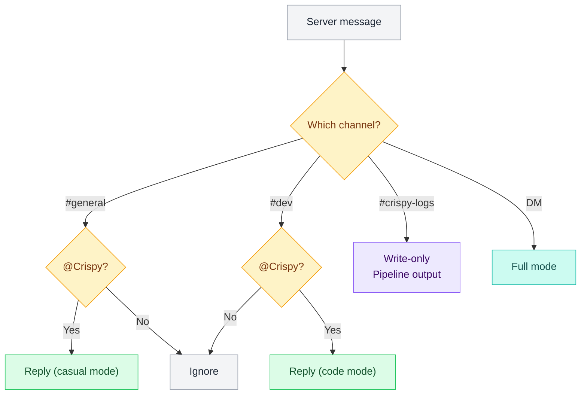

### Channel Behavior

| Channel | Mode | Crispy Behavior |
|---|---|---|
| **DM** | Full | Responds to any message, full context, components, etc. |
| **#general** | Casual | Only on @mention, brief reply, no components |
| **#dev** | Code-focused | Only on @mention, longer technical replies allowed |
| **#crispy-logs** | Write-only | Crispy posts pipeline output, doesn't respond to mentions |

### Rules

- Never share DM context in public channels
- Don't @mention users in channels (DM them instead)
- Keep channel replies brief (max ~500 words, auto-thread)
- Respect channel topic (#dev for code, #general for casual)

---

## Full Message Lifecycle

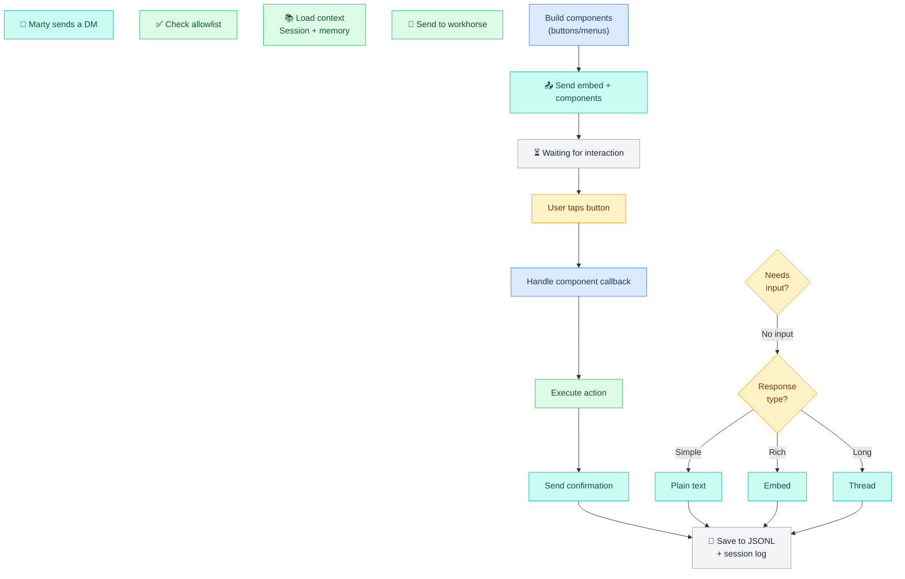

---

## Embed Anatomy

When Crispy formats structured data, it uses Discord embeds:

```
┌──────────────────────────────┐
│ 🦊 Crispy                    │  Author
├──────────────────────────────┤
│ 📊 System Status             │  Title
│                              │
│ Gateway    ✅ Running         │  Fields
│ Uptime     4h 23m            │  (up to 25)
│ Sessions   3 active          │
│ Memory     247 KB             │
│                              │
│ Models                       │  Field group
│ ├ workhorse ✅ healthy       │
│ ├ OpenRouter ✅ healthy      │
│ └ Gemini    ✅ healthy       │
├──────────────────────────────┤
│ Last check: 2 min ago        │  Footer
│ 2026-03-02 15:42:33 UTC      │
└──────────────────────────────┘
```

Embed features:
- **Color:** Theme-based (green for success, red for error, blue for info)
- **Title:** 256 char max
- **Description:** 4096 char max
- **Fields:** Up to 25 fields (key/value pairs)
- **Thumbnail/Image:** Embedded visual
- **Author:** Name + icon + URL
- **Footer:** Text + timestamp

---

## Error Handling

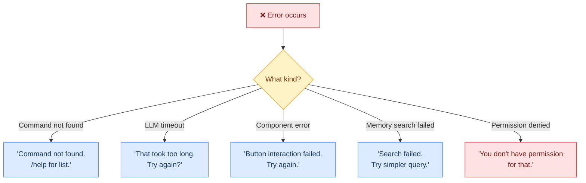

---

## Config Example

```json5
{
  "discord": {
    "enabled": true,
    "botToken": "${DISCORD_BOT_TOKEN_CRISPY}",
    "serverIds": ["${DISCORD_GUILD_ID}"],
    "channels": {
      "general": {
        "id": "${DISCORD_GENERAL_ID}",
        "mode": "casual",
        "mentionRequired": true
      },
      "dev": {
        "id": "${DISCORD_DEV_ID}",
        "mode": "technical",
        "mentionRequired": true
      },
      "logs": {
        "id": "${DISCORD_LOGS_ID}",
        "writeOnly": true
      }
    },

    // Slash commands
    "slashCommands": [
      {
        "name": "ask",
        "description": "Ask Crispy a question"
      },
      {
        "name": "status",
        "description": "System health check"
      },
      {
        "name": "save",
        "description": "Commit and push workspace"
      },
      {
        "name": "pipeline",
        "description": "Run or list pipelines"
      },
      {
        "name": "memory",
        "description": "Search memory"
      },
      {
        "name": "help",
        "description": "Show all commands"
      }
    ],

    // Embed colors
    "embedColors": {
      "default": 0x3b82f6,      // Blue
      "success": 0x22c55e,      // Green
      "warning": 0xf59e0b,      // Amber
      "error": 0xef4444         // Red
    },

    // Threading
    "autoThread": {
      "enabled": true,
      "wordCount": 500
    },

    // History
    "historyLimit": 50
  }
}
```

---

## Performance Targets

| Operation | Target | Notes |
|---|---|---|
| **Message arrival → response** | 2–15s | Includes LLM call |
| **Slash command** | 2–15s | Depends on command type |
| **Component interaction** | < 500ms | Instant feedback |
| **Embed rendering** | < 100ms | Client-side only |
| **Thread auto-split** | < 500ms | Per block |

---


## Media Handling

> How Crispy receives and sends media through Discord: attachments, embeds, voice channel audio, and file uploads.

---

### Overview

Discord's media handling differs significantly from Telegram in several ways:

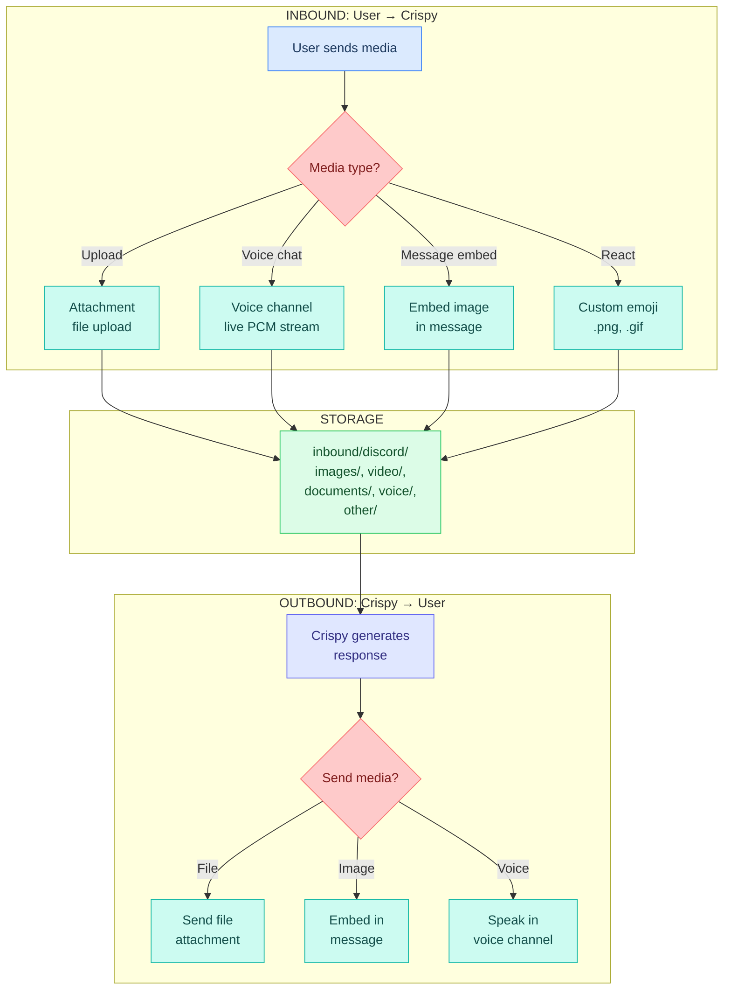

---

### Inbound: Discord → Crispy

#### Attachment (File Upload)

**Format:** Any file type (PDF, DOCX, images, video, etc.)

**Characteristics:**
- Max 8MB (free tier), 50MB (Nitro)
- Discord hosts on CDN (valid ~24h)
- File name is preserved

**How to receive:**

```json
{
  "type": "MESSAGE_CREATE",
  "data": {
    "id": "987654321",
    "channel_id": "456789",
    "author": { "id": "user123", "username": "Marty" },
    "attachments": [
      {
        "id": "attach_123",
        "filename": "report.pdf",
        "size": 245600,
        "url": "https://cdn.discordapp.com/attachments/...",
        "content_type": "application/pdf"
      }
    ]
  }
}
```

**Download flow:**

```
1. Extract attachment from message
   filename: "report.pdf"
   url: "https://cdn.discordapp.com/attachments/..."

2. Download from CDN
   curl {url} -o report.pdf

3. Store locally
   ~/.openclaw/workspace/media/inbound/discord/documents/discord-20260302-channel_general-xyz123.pdf

4. Process
   → Extract text (if PDF/DOCX)
   → Summarize if >1000 chars
   → Create metadata.json sidecar
```

**Config:**

```json5
"channels": {
  "discord": {
    "media": {
      "attachment": {
        "enabled": true,
        "max_file_size_mb": 50,
        "cache_cdn_urls_24h": true,
        "auto_process": true,
        "timeout_download_s": 30
      }
    }
  }
}
```

#### Voice Channel (Live Audio)

**Format:** Live PCM stream (48kHz stereo, 16-bit)

**Characteristics:**
- Real-time audio stream (not discrete files)
- Bot must join the voice channel
- Discord enforces voice activity detection (VAD)
- No API limit on duration (only server storage limits)

**How to receive:**

```
1. Bot receives "VOICE_STATE_UPDATE" when user joins voice channel

2. Bot joins voice channel
   voice_client = await guild.voice_channels[0].connect()

3. Receive audio stream
   voice_client.listen(audio_callback)

4. Audio comes as PCM chunks
   chunk_size: 3840 bytes (48kHz stereo 16-bit, 20ms)
   sample_rate: 48000 Hz
   channels: 2 (stereo)
   bit_depth: 16 (signed int16)
```

**Buffer & transcribe:**

```
Accumulate chunks into 1-2 second buffers
   ↓
Send to STT engine (Deepgram for streaming)
   ↓
Get partial transcripts in real-time
   ↓
When user stops speaking (voice activity = false for 2s)
   → Send final transcript to agent
   → Generate response
   → TTS synthesis
   → Send bot voice back
```

**Config:**

```json5
"channels": {
  "discord": {
    "media": {
      "voice_channel": {
        "enabled": true,
        "auto_join_on_mention": false,    // require /join command
        "auto_leave_on_silence": true,
        "silence_timeout_s": 2,
        "max_session_duration_s": 3600,   // 1 hour max
        "recording": {
          "enabled": true,
          "save_to_disk": true,
          "save_path": "inbound/discord/voice"
        },
        "stt": {
          "provider": "deepgram",         // for streaming latency
          "streaming": true,
          "interim_results": true,
          "vad": true
        },
        "tts": {
          "provider": "elevenlabs",
          "streaming": true,
          "voice_id": "Ember"
        }
      }
    }
  }
}
```

#### Embed Image

**Format:** Image hosted in Discord embed (not as attachment)

**Characteristics:**
- Image URL is in the `embed` object, not `attachments`
- Small images (thumbnails) or inline previews
- URL is ~24h temporary

**How to receive:**

```json
{
  "type": "MESSAGE_CREATE",
  "data": {
    "id": "987654321",
    "embeds": [
      {
        "title": "Chart",
        "image": {
          "url": "https://cdn.discordapp.com/attachments/..."
        }
      }
    ]
  }
}
```

**Processing:**

```
1. Extract image URL from embed.image.url
2. Download (same as attachment)
3. Store in inbound/discord/images/
4. Process (OCR, etc.)
```

**Config:**

```json5
"channels": {
  "discord": {
    "media": {
      "embed_image": {
        "enabled": true,
        "extract_from_embeds": true,
        "storage_path": "inbound/discord/images"
      }
    }
  }
}
```

#### Custom Emoji

**Format:** PNG or GIF image

**Characteristics:**
- Small (usually 64-128px)
- Can be animated (GIF)
- Used for reactions and custom emojis in messages

**How to receive:**

```json
{
  "type": "MESSAGE_REACTION_ADD",
  "data": {
    "user_id": "user123",
    "emoji": {
      "name": "custom_emoji",
      "id": "emoji_id_123",
      "animated": false
    }
  }
}
```

**Config:**

```json5
"channels": {
  "discord": {
    "media": {
      "emoji": {
        "enabled": false,               // usually not needed
        "extract_emoji_images": false,
        "storage_path": "inbound/discord/images"
      }
    }
  }
}
```

#### File Size Limits

Discord's native limits:

| Tier | Attachment Limit | Notes |
|---|---|---|
| **Free** | 8MB | Per file |
| **Nitro** | 50MB | Per file |
| **Bot API** | 8MB | Same as free tier |

**Strategy:** Warn user if file >8MB:

```json5
"channels": {
  "discord": {
    "media": {
      "size_limits": {
        "warn_if_larger_than_mb": 8,
        "skip_if_larger_than_mb": 100,
        "message": "File too large. Please use Nitro account or split into smaller files."
      }
    }
  }
}
```

---

### Outbound: Crispy → User

#### File Attachment

**Use case:** Send document, export, or media file

**API call (discord.py):**

```python
# Send file attachment
file = discord.File('/tmp/report.pdf', filename='report.pdf')
await message.channel.send(
    content="Here's the report:",
    file=file
)

# Or bytes
import io
pdf_bytes = generate_report()
file = discord.File(io.BytesIO(pdf_bytes), filename='report.pdf')
await message.channel.send(
    content="Here's the report:",
    file=file
)
```

**Constraints:**
- 8MB max (free tier)
- Can send one file per message
- Multiple files → send multiple messages

**Config:**

```json5
"channels": {
  "discord": {
    "send": {
      "attachment": {
        "enabled": true,
        "max_file_size_mb": 8,
        "formats": ["pdf", "docx", "xlsx", "csv", "txt", "png", "jpg", "gif"],
        "chunk_if_too_large": false,    // or split files
        "max_per_message": 1
      }
    }
  }
}
```

#### Embed (with Image)

**Use case:** Send rich message with inline image (charts, screenshots, etc.)

**API call:**

```python
import discord

embed = discord.Embed(
    title="Weather Forecast",
    description="3-day forecast for your area",
    color=discord.Color.blue()
)

# Add inline image
image_bytes = generate_chart()
import io
image_file = discord.File(
    io.BytesIO(image_bytes),
    filename='chart.png'
)
embed.set_image(url='attachment://chart.png')

await message.channel.send(
    embed=embed,
    file=image_file
)
```

**Components:**
- **Title:** Short header (256 chars max)
- **Description:** Main text (4096 chars max)
- **Image:** Inline image (via attachment)
- **Color:** Accent color
- **Thumbnail:** Small preview image
- **Fields:** Structured key-value pairs

**Config:**

```json5
"channels": {
  "discord": {
    "send": {
      "embed": {
        "enabled": true,
        "max_title_length": 256,
        "max_description_length": 4096,
        "color": "#3498db",             // hex color
        "include_footer": true,
        "footer_text": "Crispy Kitsune",
        "include_timestamp": true,
        "inline_images": true,
        "max_fields": 25
      }
    }
  }
}
```

**Example embed from agent:**

```json
{
  "title": "Stock Price Update",
  "description": "AAPL is up 2.5% today",
  "color": 3498db,
  "fields": [
    {
      "name": "Current Price",
      "value": "$195.42",
      "inline": true
    },
    {
      "name": "Change (24h)",
      "value": "+$4.71 (+2.5%)",
      "inline": true
    },
    {
      "name": "Volume",
      "value": "52.3M shares",
      "inline": false
    }
  ],
  "footer": {
    "text": "Data from Yahoo Finance"
  },
  "timestamp": "2026-03-02T14:23:15Z"
}
```

#### Voice Channel

**Use case:** Bot speaks in Discord voice channel (responds to user voice input)

**API call:**

```python
# Join voice channel
voice_channel = message.author.voice.channel
voice_client = await voice_channel.connect()

# Speak
audio_source = discord.FFmpegPCMAudio('response.mp3')
voice_client.play(audio_source)

# Wait for finish
while voice_client.is_playing():
    await asyncio.sleep(0.1)

# Optionally leave
await voice_client.disconnect()
```

**Config:**

```json5
"channels": {
  "discord": {
    "send": {
      "voice": {
        "enabled": true,
        "tts_provider": "elevenlabs",
        "voice_id": "Ember",
        "output_format": "mp3",
        "auto_leave_after_seconds": 300,  // leave after 5min
        "output_format": "mp3"
      }
    }
  }
}
```

---

### Metadata Sidecar Files

Every inbound media file gets a `.metadata.json` sidecar:

**Attachment example:**

```json
{
  "filename": "discord-20260302-channel_general-xyz789.pdf",
  "channel": "discord",
  "type": "document",
  "guild_id": "guild123",
  "guild_name": "DevServer",
  "channel_id": "channel456",
  "channel_name": "general",
  "user_id": "user789",
  "user_name": "Alice",
  "timestamp_received": "2026-03-02T14:23:15.234Z",
  "discord": {
    "message_id": "msg_999",
    "attachment_id": "attach_123",
    "filename": "report.pdf",
    "size": 245600,
    "content_type": "application/pdf",
    "url": "https://cdn.discordapp.com/attachments/...",
    "url_expires_at": "2026-03-03T14:23:15Z"
  },
  "processing": {
    "text_extracted": true,
    "char_count": 45000,
    "page_count": 12,
    "summary": "Monthly project report",
    "extraction_confidence": 0.95
  },
  "stored_path": "~/.openclaw/workspace/media/inbound/discord/documents/discord-20260302-channel_general-xyz789.pdf",
  "tags": ["report", "project"],
  "keep": true,
  "delete_after_days": null
}
```

**Voice channel example:**

```json
{
  "filename": "discord-20260302-channel_voice-session1-abc456.wav",
  "channel": "discord",
  "type": "voice",
  "guild_id": "guild123",
  "guild_name": "DevServer",
  "channel_id": "voice_channel789",
  "channel_name": "Voice Chat",
  "users_in_session": ["user123", "user456"],
  "timestamp_started": "2026-03-02T14:00:00.000Z",
  "timestamp_ended": "2026-03-02T14:15:23.456Z",
  "duration_seconds": 923,
  "discord": {
    "sample_rate": 48000,
    "channels": 2,
    "bit_depth": 16,
    "codec": "pcm"
  },
  "processing": {
    "transcribed": true,
    "transcript": "Alice: Hey, did you see the new code?\nBob: Yeah, looks good. Just needs...",
    "speaker_count": 2,
    "longest_speaker": "alice"
  },
  "stored_path": "~/.openclaw/workspace/media/inbound/discord/voice/discord-20260302-channel_voice-session1-abc456.wav",
  "tags": ["conversation", "code_review"],
  "keep": false,
  "delete_after_days": 30
}
```

---

### Discord CDN & Caching

**Important:** Discord CDN URLs expire after ~24 hours.

**Strategy:**

1. Download immediately when attachment is received
2. Cache in `~/.openclaw/workspace/media/inbound/discord/`
3. Don't rely on CDN URL for future access
4. If URL expires, you'll need to re-download from user

**Config:**

```json5
"channels": {
  "discord": {
    "media": {
      "cdn_cache": {
        "enabled": true,
        "cache_duration_hours": 24,
        "warn_if_cdn_url_old": true
      },
      "download_policy": {
        "immediate": true,              // download ASAP
        "background": false,            // don't defer
        "max_concurrent": 3
      }
    }
  }
}
```

---

### Permission-Based Processing

Discord allows granular permissions. Consider:

```json5
"channels": {
  "discord": {
    "media": {
      "permissions": {
        "process_in_public_channels": false,  // only DMs
        "process_only_in_channels": ["crispy-voice", "media-uploads"],
        "skip_if_user_permission_level": "member",  // skip unless admin+
        "require_bot_attachment_permission": true
      }
    }
  }
}
```

---

### Complete Config Block

```json5
{
  "channels": {
    "discord": {
      "media": {
        "enabled": true,
        "inbound_path": "~/.openclaw/workspace/media/inbound/discord",

        // Attachment (file upload)
        "attachment": {
          "enabled": true,
          "max_file_size_mb": 50,
          "cache_cdn_urls_24h": true,
          "auto_process": true,
          "timeout_download_s": 30,
          "size_limits": {
            "warn_if_larger_than_mb": 8,
            "skip_if_larger_than_mb": 100
          }
        },

        // Voice channel
        "voice_channel": {
          "enabled": true,
          "auto_join_on_mention": false,
          "auto_leave_on_silence": true,
          "silence_timeout_s": 2,
          "max_session_duration_s": 3600,
          "recording": {
            "enabled": true,
            "save_to_disk": true,
            "save_path": "voice"
          },
          "stt": {
            "provider": "deepgram",
            "streaming": true,
            "interim_results": true,
            "vad": true
          },
          "tts": {
            "provider": "elevenlabs",
            "streaming": true,
            "voice_id": "Ember"
          }
        },

        // Embed image
        "embed_image": {
          "enabled": true,
          "extract_from_embeds": true,
          "storage_path": "images"
        },

        // Custom emoji (rarely used)
        "emoji": {
          "enabled": false,
          "extract_emoji_images": false
        },

        // Metadata
        "create_metadata": true,
        "metadata_format": "json",

        // Permissions
        "permissions": {
          "process_in_public_channels": false,
          "process_only_in_channels": ["crispy-voice", "media-uploads"],
          "require_bot_attachment_permission": true
        },

        // Outbound
        "send": {
          "attachment": {
            "enabled": true,
            "max_file_size_mb": 8,
            "formats": ["pdf", "docx", "xlsx", "csv", "txt"],
            "max_per_message": 1
          },

          "embed": {
            "enabled": true,
            "max_title_length": 256,
            "max_description_length": 4096,
            "color": "#3498db",
            "include_footer": true,
            "include_timestamp": true,
            "inline_images": true,
            "max_fields": 25
          },

          "voice": {
            "enabled": true,
            "tts_provider": "elevenlabs",
            "voice_id": "Ember",
            "output_format": "mp3",
            "auto_leave_after_seconds": 300
          }
        }
      }
    }
  }
}
```

---

### Voice Channel Example: Complete Flow

```python
# 1. User joins voice channel and speaks
# Bot receives VOICE_STATE_UPDATE

# 2. Bot joins voice channel
voice_client = await user.voice.channel.connect()

# 3. Start listening & recording
async def audio_callback(user_audio):
    # Buffer audio
    accumulate_to_buffer(user_audio)

    if buffer_duration >= 1.0:  # 1 second of audio
        # Stream to Deepgram
        transcript_chunk = await deepgram_stream(buffer)
        print(f"Partial: {transcript_chunk}")
        clear_buffer()

voice_client.listen(audio_callback)

# 4. User stops speaking (2s silence detected by VAD)
# Send to agent
response_text = await agent.process(final_transcript)

# 5. Synthesize response
audio_bytes = tts_elevenlabs(response_text)

# 6. Bot speaks back
import io
audio_source = discord.FFmpegPCMAudio(
    io.BytesIO(audio_bytes),
    codec='mp3'
)
voice_client.play(audio_source)

# Wait for finish
while voice_client.is_playing():
    await asyncio.sleep(0.1)

# 7. Store recording
await save_voice_recording(
    filename="discord-20260302-channel_voice-session1.wav",
    duration=923,
    users=["user123", "user456"]
)

# 8. Leave channel (or wait for next input)
await voice_client.disconnect()
```

---

### Discord Embeds: Advanced

**Rich embed with fields and thumbnail:**

```python
embed = discord.Embed(
    title="Weather Report",
    description="5-day forecast",
    color=discord.Color.from_rgb(52, 152, 219)
)

embed.set_thumbnail(url='https://...')
embed.add_field(
    name="Today",
    value="Sunny, 75°F",
    inline=True
)
embed.add_field(
    name="Tomorrow",
    value="Partly Cloudy, 72°F",
    inline=True
)
embed.add_field(
    name="Next 3 Days",
    value="Rain expected. High: 68°F",
    inline=False
)

embed.set_footer(text="Forecast from OpenWeatherMap")
embed.timestamp = discord.utils.utcnow()

await message.reply(embed=embed)
```

---

### Troubleshooting

| Problem | Cause | Fix |
|---|---|---|
| **Attachment URL returns 404** | CDN URL expired (>24h) | Download immediately when received; don't cache URLs |
| **Bot can't join voice channel** | Missing CONNECT or SPEAK permissions | Check bot role permissions in guild settings |
| **Voice transcription is silent** | Voice channel has no audio or low volume | Check user is unmuted; test with --stream-only flag |
| **Embed image doesn't show** | Filename mismatch in attachment:// reference | Use exact filename in `embed.set_image(url='attachment://name')` |
| **File too large (>8MB)** | User doesn't have Nitro | Warn user or implement file splitting |
| **Multiple files in one message** | API limitation | Send one file per message, or use embeds |

---

**Up →** [[stack/L3-channel/_overview]]
**Related →** [[stack/L1-physical/media]]
**Related →** [[stack/L6-processing/pipelines/media]]
**Back →** [[stack/L3-channel/_overview]]
**Components →** [[stack/L3-channel/discord/chat-flow]]
**Telegram flow →** [[stack/L3-channel/telegram/chat-flow]]
