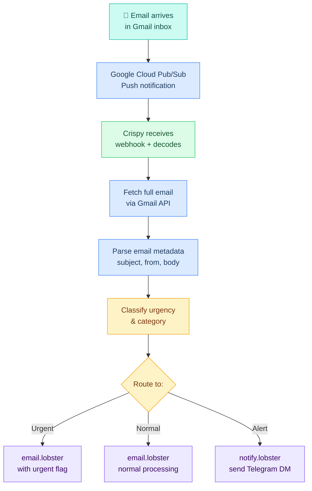
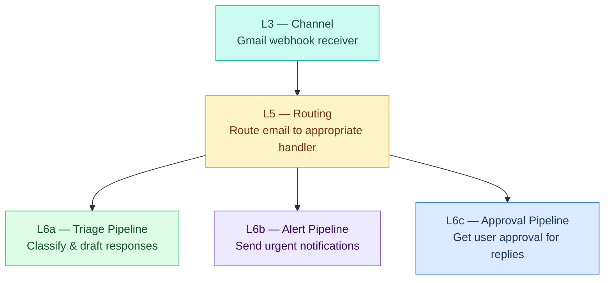

# Gmail Channel

> Gmail is triggered via webhook only (not DM mode). When emails arrive, Crispy processes them and routes them to appropriate pipelines.

## Architectural Role

Gmail is the **information gathering** channel. No interactive sessions — incoming email triggers category-aware memory writes (recipe newsletter -> cooking memory, market update -> finance memory). Data is ready for retrieval when the relevant hat loads on Telegram. Outbound email requires safeguards and explicit user approval.

---

## What It Is

Gmail integration is **read-only webhook** — Crispy doesn't send emails directly via Gmail API. Instead:

1. Emails arrive via Google Cloud Pub/Sub webhook
2. Crispy receives the webhook, fetches the full email via Gmail API
3. Extracts metadata (from, subject, body) and classifies urgency
4. Routes to downstream pipelines (email triage, alert notification, etc.)
5. May send replies via the email.lobster pipeline (with approval)

---

## How It Fits in CKS Stack

---

## Channel Behavior

| Aspect | Gmail |
|---|---|
| **Mode** | Webhook only |
| **Trigger** | Incoming email |
| **User input** | Email content (subject, body) |
| **Response** | Draft reply (optional, needs approval) |
| **Status** | ⏳ Planned |

---

## Pages

| Page | Covers |
|---|---|
| [[stack/L3-channel/gmail/email-triage]] | Triage flow, classification rules, webhook architecture, privacy & security |
| [[stack/L3-channel/gmail/runbook]] | Setup guide, pipeline config, notification rules, debugging |

---

## Status

**Current:** ⏳ Planned
**Next steps:**
- [ ] Google Cloud Pub/Sub integration
- [ ] Service account setup
- [ ] email.lobster pipeline creation
- [ ] Email classification rules
- [ ] Notification routing

---

**Up →** [[stack/L3-channel/_overview]]
**Telegram →** [[stack/L3-channel/telegram/_overview]]
**Discord →** [[stack/L3-channel/discord/_overview]]
