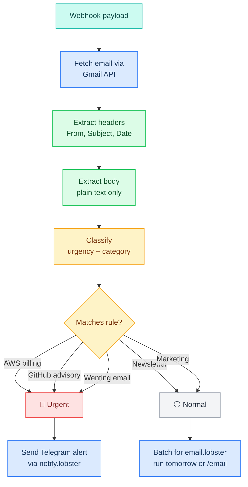
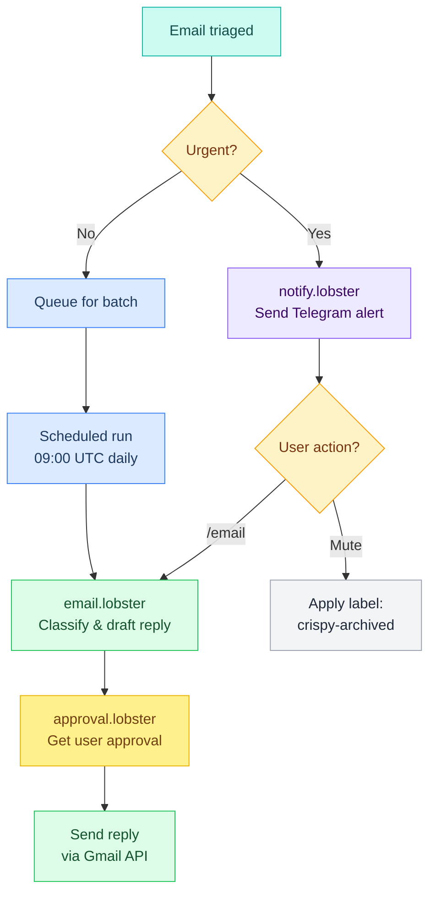
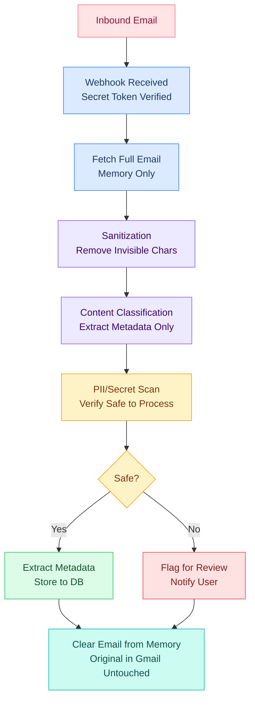
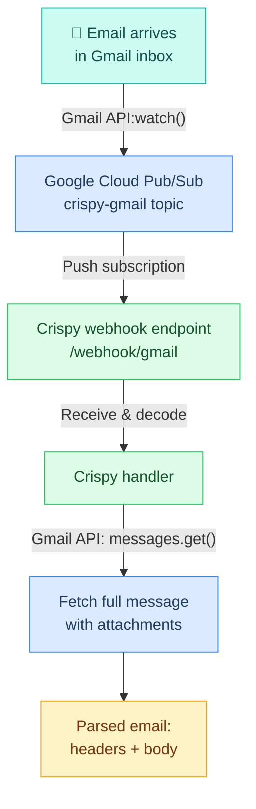
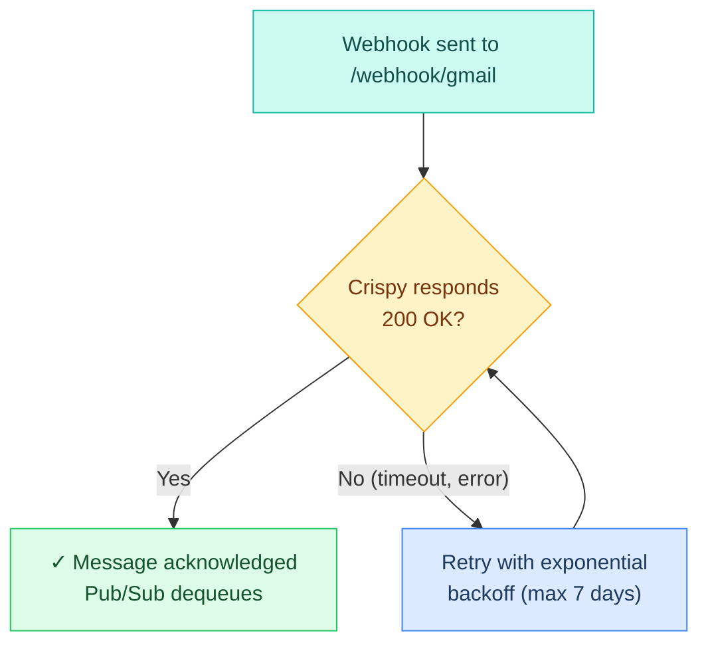

# Email Triage & Classification

> How incoming emails are classified by urgency and category, and routed to appropriate pipelines.

---

## Triage Flow

After Crispy receives and parses an email, it runs the triage flow to classify urgency and category:



---

## Urgency Levels

Emails are classified into three urgency levels:

| Level | Color | Timing | Example |
|---|---|---|---|
| **Urgent** | 🔴 Red | Immediate notification | AWS billing spike, security advisory, VIP email |
| **High** | 🟠 Orange | Next batch (1-4 hours) | Important account notifications, friend email |
| **Normal** | ⚪ Gray | Daily batch (next morning) | Newsletters, marketing, confirmation emails |

---

## Classification Logic

The urgency level is determined by matching email metadata (from, subject, body) against configured rules:

```yaml
Matching order:
1. Sender email address (from:)
2. Subject line keywords (subject:)
3. Body content keywords (body:)
4. Label already applied (e.g., spam, promotions)
```

### Example Rules

```json5
{
  "rules": [
    {
      "name": "AWS Billing Alerts",
      "match": "from:aws-notifications@amazon.com OR subject:billing",
      "urgency": "urgent",
      "category": "billing",
      "notify": "telegram",
      "sound": true
    },
    {
      "name": "GitHub Security Advisories",
      "match": "from:security@github.com OR subject:advisory",
      "urgency": "urgent",
      "category": "security",
      "notify": "telegram",
      "sound": false
    },
    {
      "name": "VIP Emails",
      "match": "from:wenting@example.com",
      "urgency": "high",
      "category": "personal",
      "notify": "telegram"
    },
    {
      "name": "Newsletters & Marketing",
      "match": "from:newsletter OR subject:unsubscribe",
      "urgency": "normal",
      "category": "marketing",
      "notify": "none"
    }
  ]
}
```

---

## Notification Routing

### Urgent Emails

**Telegram immediate notification:**

```
┌─────────────────────────────────────┐
│ 🔴 Urgent Email                     │
│                                     │
│ From: aws-notifications@amazon.com  │
│ Subject: AWS Billing Alert          │
│                                     │
│ Your recent activity on AWS account │
│ has incurred $147 in charges (spike │
│ in us-east-1 region).               │
│                                     │
│ ┌───────────────┐                   │
│ │ 📧 View email │                   │
│ └───────────────┘                   │
│ ┌───────────────┐                   │
│ │ 🤐 Mute       │                   │
│ └───────────────┘                   │
└─────────────────────────────────────┘
```

The `/email` command can be used to manually review all urgent emails.

### Normal Emails

**Batch processing:**

Accumulated normal emails are processed together via the `email.lobster` pipeline at a scheduled time (default: 09:00 UTC).

Alternatively, trigger manually with `/email` command.

---

## Label Schema

After processing, Crispy applies Gmail labels to track email state:

| Label | Applied By | Meaning |
|---|---|---|
| `processed` | Crispy | Crispy has reviewed this email |
| `crispy-flag` | Crispy | Flagged for manual review (high priority) |
| `crispy-auto-reply` | Crispy | Auto-reply was sent |
| `crispy-archived` | Crispy | Archived by Crispy after processing |

These labels help organize the inbox and allow filtering in Gmail.

---

## Routing to Pipelines

Based on urgency and user action, emails are routed to different L6 pipelines:



---

## Configuration

Example OpenClaw config block:

```json5
{
  "gmail": {
    // ...
    
    // Classification rules
    "urgencyRules": [
      {
        "match": "from:aws-notifications@amazon.com",
        "urgency": "urgent"
      },
      {
        "match": "from:security@github.com",
        "urgency": "urgent"
      },
      {
        "match": "from:wenting@",
        "urgency": "high"
      }
    ],

    // Batching
    "batch": {
      "enabled": true,
      "runAt": "09:00"  // Daily at 9am UTC
    },

    // Labels
    "labels": {
      "processed": "processed",
      "flag": "crispy-flag",
      "autoReply": "crispy-auto-reply",
      "archived": "crispy-archived"
    }
  }
}
```

---


## Privacy & Security

> What Crispy stores, what it never touches, and how it protects email data.

---

### Email Security Layers



---

### Data Storage Policy

#### What's Stored

- **Email metadata only**
  - Sender (from), recipient (to), subject, date
  - Extracted classification (urgency, category)
  - Message ID (for linkage to Gmail)
  - Label history (which labels were applied)

- **Daily statistics**
  - Count of emails processed
  - Urgency distribution (1 urgent, 5 normal, 2 high)
  - Category breakdown (2 billing, 3 security, 4 personal)
  - No individual email details

#### What's Never Stored

- **Email body content** — never persisted to database
- **HTML content** — never persisted
- **Attachment data** — never downloaded or processed
- **Full email payload** — never stored, only read in memory
- **User passwords** — never requested or stored

---

### Processing Flow (Memory Only)

When an email is processed, Crispy keeps everything in memory and clears it after:

```
1. Webhook received
2. Message ID decoded (in memory)
3. Gmail API call → full email fetched (in memory)
4. Headers & body extracted (in memory)
5. Classification performed (in memory)
6. Metadata extracted (saved to DB)
7. Full email cleared from memory
8. Classification passed to pipeline (no body content)
```

The original email remains in Gmail untouched.

---

### Attachment Policy

**Attachments are never downloaded or processed:**

- No file extraction
- No virus scanning
- No content analysis
- No storage
- No forwarding

Attachments are simply ignored. If an email rule requires attachment inspection, that rule will not match.

---

### Approval Workflow

#### Replies Are Drafted, Not Auto-Sent

When Crispy drafts a reply:

1. **LLM generates** a response based on email content
2. **Draft is shown** to user (via Telegram or approval pipeline)
3. **User reviews** the draft before approval
4. **User approves** or rejects
5. **Only then** is the email sent

**No auto-replies without explicit user action.**

#### Who Can Approve

- The user who owns the Gmail account
- No delegation (for security)
- Approval via Telegram inline buttons or `/email` command

---

### API Logging

All Gmail API calls are logged to the workspace audit trail:

| Event | Logged Details |
|---|---|
| `gmail.webhook.received` | Webhook timestamp, message ID, sender |
| `gmail.api.messages.get` | Message ID, size, timestamp |
| `gmail.api.messages.modify` | Message ID, labels changed (added/removed) |
| `gmail.api.messages.send` | To, subject, sending timestamp |
| `gmail.api.labels.list` | Labels present at query time |

**Logged to:** Workspace audit trail (not visible to public, only to admin)

---

### Service Account Security

The Gmail service account:

- Has **only `gmail.modify` scope** (no admin access)
- Cannot read other users' emails (only designated user's inbox)
- Private key stored in `GMAIL_SERVICE_ACCOUNT_KEY` (env var)
- Key rotation recommended every 90 days
- All API calls use OAuth 2.0 bearer token (short-lived)

---

### Webhook Security

The webhook endpoint is protected by:

1. **Secret token verification** — Google Cloud includes webhook secret in request
2. **HTTPS only** — All webhook traffic is encrypted
3. **Subscription validation** — Webhook verifies Pub/Sub subscription matches expected
4. **Idempotency** — Message ID prevents duplicate processing
5. **Rate limiting** — Protect against DoS (handled by Google Cloud)

---

### Email Content in Conversations

If an email is discussed in Crispy conversation (Telegram DM):

- The email metadata is shared (from, subject, date)
- Body excerpts may be shared (for context)
- User must explicitly request full email content
- No automated logging of email body

---

### Compliance

**Privacy principles:**

- **Minimal collection** — only metadata needed for classification
- **No retention** — email body not persisted
- **User control** — explicit approval before sending replies
- **Transparency** — all API calls logged
- **No forwarding** — email stays in original inbox

---

### Error Handling & Deletion

If an error occurs during processing:

- Email is **not deleted**
- Email is **not modified**
- Error is **logged** with message ID
- User is **notified** (via Telegram) of the error
- Email can be **manually reprocessed** via `/email` command

---


## Webhook Flow

> How Google Cloud Pub/Sub webhooks deliver incoming emails to Crispy, and how Crispy fetches the full email.

---

### Webhook Architecture

When an email arrives in Gmail, Google Cloud Pub/Sub sends a webhook push notification to Crispy's webhook endpoint:



---

### Webhook Payload

When an email arrives, Google Cloud Pub/Sub sends a POST to the webhook endpoint with this structure:

```json5
{
  "message": {
    "data": "base64_encoded_message_id",
    "messageId": "12345678901234",
    "publishTime": "2024-03-02T10:15:30.123Z",
    "attributes": {
      "email_address": "marty@example.com"
    }
  },
  "subscription": "projects/my-project/subscriptions/crispy-gmail-push"
}
```

#### Decoding the Payload

The `message.data` field is base64-encoded. When decoded, it contains the email message ID:

```
base64_decode("base64_encoded_message_id")
  → "12345678901234"
```

Crispy uses this message ID to fetch the full email via Gmail API.

---

### Gmail API: Fetch Full Email

After receiving the webhook, Crispy calls `gmail.users.messages.get()` to fetch the complete email:

```
GET https://www.googleapis.com/gmail/v1/users/me/messages/{messageId}

Headers:
  Authorization: Bearer ${SERVICE_ACCOUNT_ACCESS_TOKEN}

Query params:
  format=full    # Get complete message with headers and body
  metadataHeaders=From,Subject,Date,To,Cc,Bcc
```

### Email Metadata Extracted

From the Gmail API response, Crispy extracts:

| Field | Source | Used For |
|---|---|---|
| `message_id` | Pub/Sub `messageId` | Link to Gmail |
| `from` | Headers: `From` | Sender identification |
| `subject` | Headers: `Subject` | Email topic |
| `date` | Headers: `Date` | Timeline |
| `to` | Headers: `To` | Recipient (usually user's email) |
| `body_plain` | Message payload (MIME) | Content classification |
| `body_html` | Message payload (MIME) | Display (not stored) |
| `label_ids` | Message: `labelIds` | Tracking |

---

### How Crispy Receives the Webhook

#### Webhook Endpoint

```
POST /webhook/gmail

Headers (sent by Google Cloud):
  Content-Type: application/json
  Authorization: Bearer ${WEBHOOK_SECRET}    # Verified by Crispy

Body: webhook payload (JSON)
```

#### Security Verification

1. **Check webhook secret** — Google Cloud includes an `Authorization` header with the webhook secret
2. **Verify subscription** — Confirm the subscription matches `crispy-gmail-push`
3. **Parse message ID** — Base64 decode the `message.data` field
4. **Idempotency** — Use `messageId` to prevent duplicate processing

---

### Full Flow Sequence

```
Timeline: Email arrives → Webhook push → Crispy processes

┌──────────────────────────────────────────────────────────────┐
│ 1. Email arrives in Gmail inbox                              │
│    Time: T+0                                                 │
└──────────────────────────────────────────────────────────────┘
           │
           ↓ Gmail API: watch() trigger
┌──────────────────────────────────────────────────────────────┐
│ 2. Pub/Sub creates notification message                      │
│    Time: T+100ms                                             │
│    Message ID: base64(12345678901234)                        │
└──────────────────────────────────────────────────────────────┘
           │
           ↓ Push subscription delivery
┌──────────────────────────────────────────────────────────────┐
│ 3. Crispy receives webhook at /webhook/gmail                 │
│    Time: T+200ms                                             │
│    Body: { "message": { "data": "base64...", ... } }         │
└──────────────────────────────────────────────────────────────┘
           │
           ↓ Decode + verify
┌──────────────────────────────────────────────────────────────┐
│ 4. Crispy decodes message ID: 12345678901234                 │
│    Checks webhook secret & subscription                      │
│    Time: T+250ms                                             │
└──────────────────────────────────────────────────────────────┘
           │
           ↓ Fetch full email
┌──────────────────────────────────────────────────────────────┐
│ 5. Call gmail.users.messages.get(id=12345678901234)          │
│    Time: T+300-500ms (API call)                              │
│    Response: Full message with headers, body, labels         │
└──────────────────────────────────────────────────────────────┘
           │
           ↓ Parse headers
┌──────────────────────────────────────────────────────────────┐
│ 6. Extract: From, Subject, Date, To, Body (plain text)       │
│    Time: T+550ms                                             │
│    Metadata extracted, ready for classification              │
└──────────────────────────────────────────────────────────────┘
           │
           ↓ Trigger triage
┌──────────────────────────────────────────────────────────────┐
│ 7. Pass to email-triage logic                                │
│    Time: T+600ms                                             │
│    → Classify urgency                                        │
│    → Route to appropriate pipeline                           │
└──────────────────────────────────────────────────────────────┘
```

---

### Error Handling

If the webhook delivery fails, Google Cloud Pub/Sub retries automatically:



---

### Configuration

OpenClaw config block:

```json5
{
  "gmail": {
    "enabled": false,           // Enable when ready
    "mode": "webhook",
    "serviceAccountKey": "${GMAIL_SERVICE_ACCOUNT_KEY}",
    "userId": "${GMAIL_USER_ID}",   // e.g., marty@example.com
    "webhookUrl": "${GATEWAY_URL}/webhook/gmail",
    "webhookSecret": "${GMAIL_WEBHOOK_SECRET}",
    "topicName": "projects/${GCP_PROJECT}/topics/gmail-push"
  }
}
```

---

**Up →** [[stack/L3-channel/gmail/_overview]]
