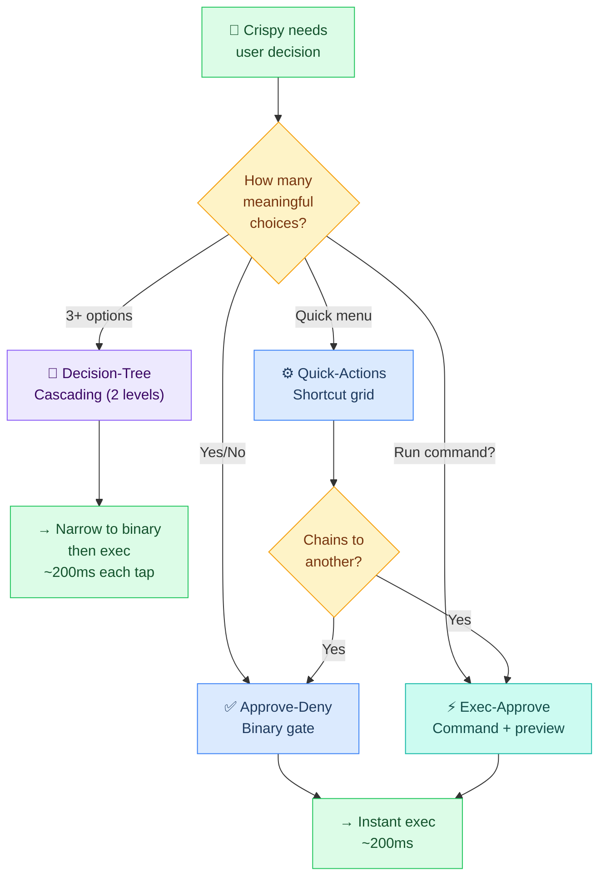
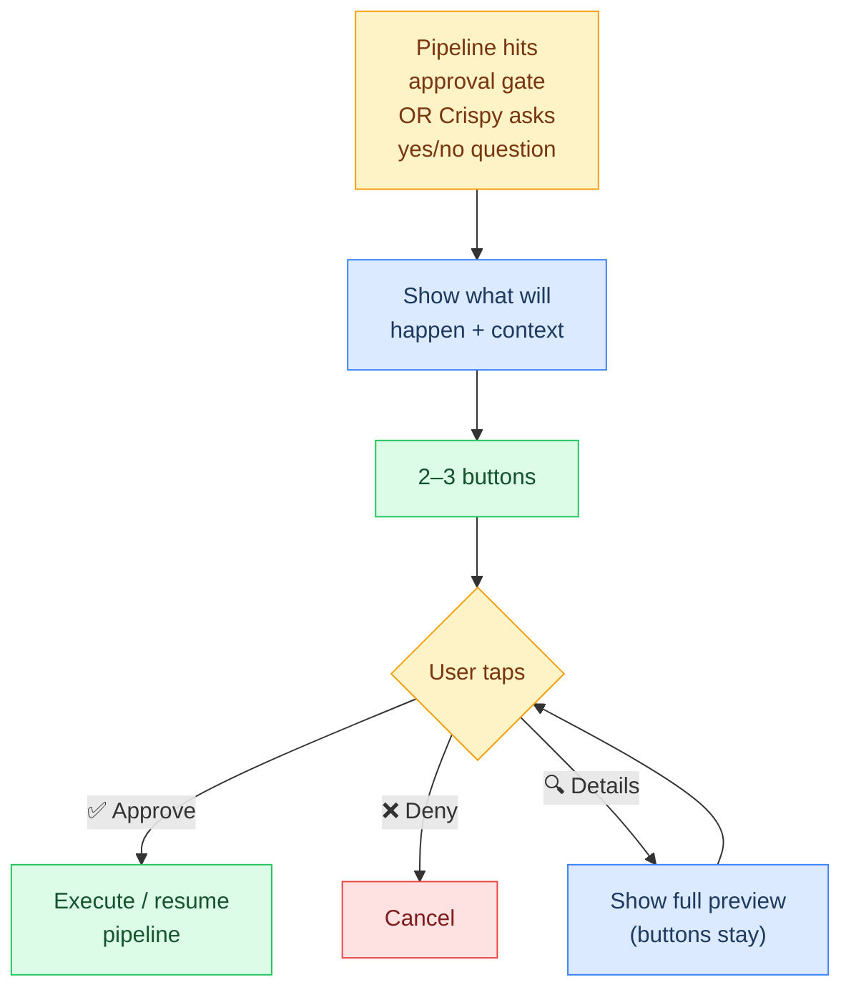
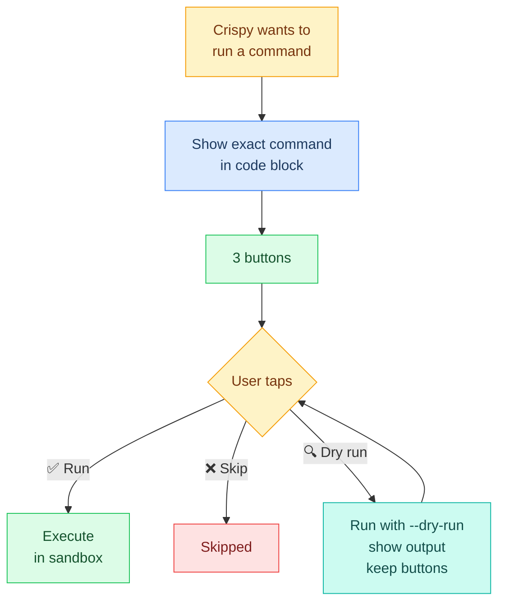
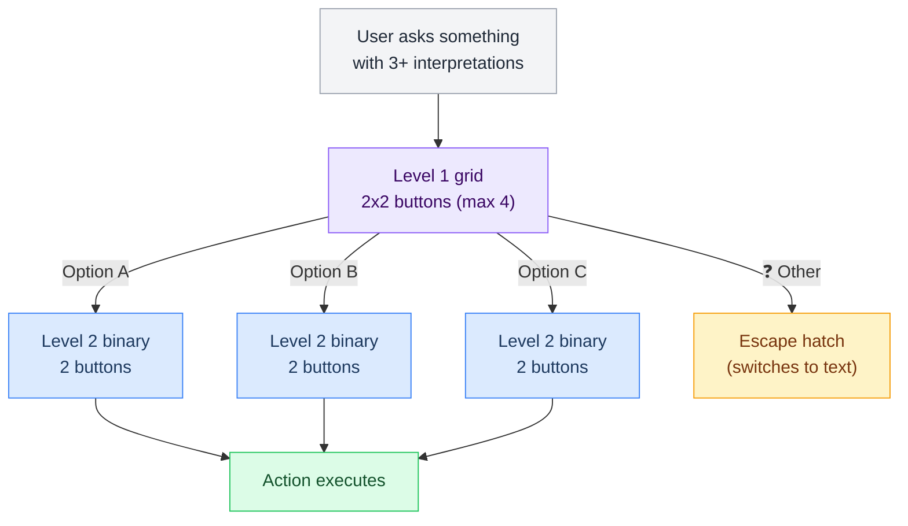
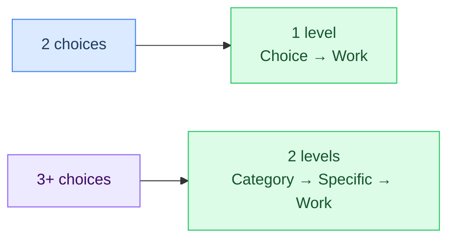
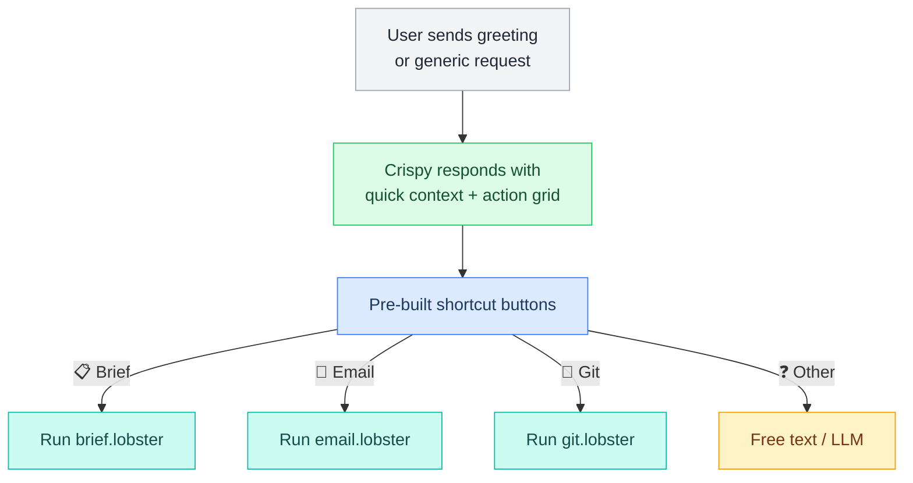

# L3 — Telegram Button Patterns

> The 4 interaction patterns for inline keyboard buttons. Each pattern is a complete interaction shape — from how Crispy decides to show it, to what happens when the user taps.

---

## Pattern Overview

When Crispy needs input from the user, it chooses a pattern based on complexity:



---

## 1. Approve-Deny (Binary Gate)

**When:** Pipeline needs approval, yes/no question, confirmation before destructive action.

**Depth:** 1 level. Button tap → Action complete.

**LLM cost:** 0 on tap (tree pre-built).



### UI Layout

```
┌─────────────────────────────┐
│ 🦊 Crispy                   │
│                             │
│ 📧 3 urgent emails found.   │
│ Process them?               │
│                             │
│ ┌──────────────┐            │
│ │ ✅ Approve   │            │
│ └──────────────┘            │
│ ┌──────────────┐            │
│ │ ❌ Deny      │            │
│ └──────────────┘            │
│ ┌──────────────┐            │
│ │ 🔍 Details   │            │
│ └──────────────┘            │
└─────────────────────────────┘
```

### Decision Tree (Pre-Built)

```json5
{
  "tree_id": "dt_ap_8f3e",
  "type": "approval",
  "context": "Email triage - 3 urgent items",
  "options": {
    "approve": {
      "label": "✅ Approve",
      "action": "approve",
      "resume_token": "tok_abc123def456",  // from paused pipeline
      "decision": true,
      "reply": "Approved — pipeline resuming."
    },
    "deny": {
      "label": "❌ Deny",
      "action": "approve",
      "resume_token": "tok_abc123def456",
      "decision": false,
      "reply": "Denied — pipeline cancelled."
    },
    "details": {
      "label": "🔍 Details",
      "action": "reply",
      "reply": "[full email list preview]"
    }
  },
  "expires": "2026-03-02T09:00:00Z"
}
```

### Example Conversation

> Marty runs `/email` command

```
┌─────────────────────────────┐
│ 🦊 Crispy                   │
│                             │
│ 📧 Email triage: 3 urgent.  │
│                             │
│ Plan: auto-reply AWS        │
│ billing, GitHub advisory.   │
│ Flag Wenting's for review.  │
│                             │
│ ┌──────────────┐            │
│ │ ✅ Approve   │            │
│ └──────────────┘            │
│ ┌──────────────┐            │
│ │ ❌ Deny      │            │
│ └──────────────┘            │
└─────────────────────────────┘

> Marty taps ✅ Approve

┌─────────────────────────────┐
│ 🦊 Crispy                   │
│                             │
│ Approved — resuming.        │
│ ✅ 2 replies sent           │
│ 📋 1 flagged for review     │
└─────────────────────────────┘
```

---

## 2. Exec-Approve (Command Approval)

**When:** Crispy wants to run a command that needs sign-off (git push, rm, docker prune).

**Depth:** 1 level, but with a preview option.

**LLM cost:** 0 on tap (tree pre-built).

**Special:** The 🔍 button runs a dry-run (where possible) and keeps buttons active for more taps.



### UI Layout

```
┌───────────────────────────────────┐
│ 🦊 Crispy                         │
│                                   │
│ I'd like to run this:             │
│                                   │
│ git push origin main              │
│ 3 commits, 7 files changed        │
│                                   │
│ ┌─────────────┐                   │
│ │ ✅ Run      │                   │
│ └─────────────┘                   │
│ ┌─────────────┐                   │
│ │ ❌ Skip     │                   │
│ └─────────────┘                   │
│ ┌─────────────┐                   │
│ │ 🔍 Dry run  │                   │
│ └─────────────┘                   │
└───────────────────────────────────┘
```

### Decision Tree (Pre-Built)

```json5
{
  "tree_id": "dt_ex_5a6b",
  "type": "exec_approval",
  "command": "git push origin main",
  "display": "git push origin main\n3 commits, 7 files changed",
  "options": {
    "run": {
      "label": "✅ Run",
      "action": "exec",
      "command": "cd ~/.openclaw/workspace && git push origin main",
      "reply": "Pushed to origin/main."
    },
    "skip": {
      "label": "❌ Skip",
      "action": "reply",
      "reply": "Skipped — nothing pushed."
    },
    "dryrun": {
      "label": "🔍 Dry run",
      "action": "exec",
      "command": "cd ~/.openclaw/workspace && git push origin main --dry-run 2>&1",
      "reply_prefix": "Dry run output:\n\n",
      "keep_buttons": true  // ← Buttons stay active after this tap
    }
  }
}
```

### Example Conversation

> Marty works on a feature and Crispy detects it's ready to push

```
┌───────────────────────────────────┐
│ 🦊 Crispy                         │
│                                   │
│ Ready to push. Here's what goes:  │
│                                   │
│ git push origin main              │
│ 3 commits, 7 files changed        │
│                                   │
│ ┌─────────────┐                   │
│ │ ✅ Run      │                   │
│ └─────────────┘                   │
│ ┌─────────────┐                   │
│ │ ❌ Skip     │                   │
│ └─────────────┘                   │
│ ┌─────────────┐                   │
│ │ 🔍 Dry run  │                   │
│ └─────────────┘                   │
└───────────────────────────────────┘

> Marty taps 🔍 Dry run

┌───────────────────────────────────┐
│ 🦊 Crispy                         │
│                                   │
│ Dry run output:                   │
│                                   │
│ To github.com:User/repo.git       │
│   abc1234..def5678  main → main   │
│ Everything up-to-date after 3 commits.
│                                   │
│ Buttons still active.             │
└───────────────────────────────────┘

> Marty taps ✅ Run

┌───────────────────────────────────┐
│ 🦊 Crispy                         │
│ Pushed to origin/main.            │
└───────────────────────────────────┘
```

---

## 3. Decision-Tree (3+ Cascading)

**When:** User intent maps to 3+ distinct paths, each needing clarification.

**Depth:** Max 2 levels. Level 1 narrows category (3–4 buttons), Level 2 is binary (2 buttons).

**LLM cost:** 1 call upfront to build all levels, then 0 on taps.



### Depth Rule



| Scenario | Depth | Pattern |
|---|---|---|
| 2 choices | 1 level | approve-deny or exec-approve |
| 3–4 choices | 2 levels | L1: categories (grid) → L2: specific (binary) |
| Still unclear after L2 | → | Use ❓ Other escape hatch (freeform text) |

### UI Layout

**Level 1: Categories**

```
┌─────────────────────────────┐
│ 🦊 Crispy                   │
│                             │
│ What kind of project?       │
│                             │
│ ┌──────────────┐            │
│ │ 🌐 Web app   │            │
│ └──────────────┘            │
│ ┌──────────────┐            │
│ │ 🤖 Bot       │            │
│ └──────────────┘            │
│ ┌──────────────┐            │
│ │ 📦 Library   │            │
│ └──────────────┘            │
│ ┌──────────────┐            │
│ │ ❓ Other     │            │
│ └──────────────┘            │
└─────────────────────────────┘
```

**Level 2: Specific (after tapping Bot)**

```
┌─────────────────────────────┐
│ 🦊 Crispy                   │
│                             │
│ Bot for which platform?     │
│                             │
│ ┌──────────────┐            │
│ │ 📱 Telegram  │            │
│ └──────────────┘            │
│ ┌──────────────┐            │
│ │ 💬 Discord   │            │
│ └──────────────┘            │
└─────────────────────────────┘
```

### Decision Tree Structure (All Levels Pre-Built)

```json5
// Level 1 tree
{
  "tree_id": "dt_c3d4",
  "type": "decision_tree",
  "depth": 1,
  "prompt": "What kind of project?",
  "options": {
    "web": {
      "label": "🌐 Web app",
      "action": "cascade",
      "next_tree": "dt_c3d4_web",
      "next_prompt": "Web app framework?"
    },
    "bot": {
      "label": "🤖 Bot",
      "action": "cascade",
      "next_tree": "dt_c3d4_bot",
      "next_prompt": "Bot for which platform?"
    },
    "lib": {
      "label": "📦 Library",
      "action": "cascade",
      "next_tree": "dt_c3d4_lib",
      "next_prompt": "Library for what language?"
    },
    "other": {
      "label": "❓ Other",
      "action": "agent",
      "reply": "Describe what you need and I'll scaffold it."
    }
  }
}

// Level 2 trees (one per Level 1 option, all pre-built at once)
{
  "tree_id": "dt_c3d4_bot",
  "type": "decision_tree",
  "depth": 2,
  "parent": "dt_c3d4",
  "prompt": "Bot for which platform?",
  "options": {
    "tg": {
      "label": "📱 Telegram",
      "action": "exec",
      "command": "openclaw scaffold telegram-bot",
      "reply": "Scaffolded Telegram bot project."
    },
    "dc": {
      "label": "💬 Discord",
      "action": "exec",
      "command": "openclaw scaffold discord-bot",
      "reply": "Scaffolded Discord bot project."
    }
  }
}
// ... dt_c3d4_web, dt_c3d4_lib similarly pre-built
```

### Example Conversation

> Marty: "I want to start a new project"

```
┌─────────────────────────────┐
│ 🦊 Crispy                   │
│                             │
│ What kind of project?       │
│                             │
│ ┌──────────────┐            │
│ │ 🌐 Web app   │            │
│ └──────────────┘            │
│ ┌──────────────┐            │
│ │ 🤖 Bot       │            │
│ └──────────────┘            │
│ ┌──────────────┐            │
│ │ 📦 Library   │            │
│ └──────────────┘            │
│ ┌──────────────┐            │
│ │ ❓ Other     │            │
│ └──────────────┘            │
└─────────────────────────────┘

> Marty taps 🤖 Bot (~200ms)

┌─────────────────────────────┐
│ 🦊 Crispy                   │
│                             │
│ Bot for which platform?     │
│                             │
│ ┌──────────────┐            │
│ │ 📱 Telegram  │            │
│ └──────────────┘            │
│ ┌──────────────┐            │
│ │ 💬 Discord   │            │
│ └──────────────┘            │
└─────────────────────────────┘

> Marty taps 📱 Telegram (~200ms)

┌─────────────────────────────┐
│ 🦊 Crispy                   │
│                             │
│ Scaffolded Telegram bot.    │
│ What should it do?          │
└─────────────────────────────┘
```

---

## 4. Quick-Actions (Shortcut Menu)

**When:** User says something broad ("what's going on", "clean up", general greeting).

**Depth:** 1–2 levels (can chain into other patterns).

**LLM cost:** 0 on first tap (pre-built), but chaining may have cost.

**Pattern:** High-level action grid → Often chains to approve-deny or exec-approve.



### UI Layout

```
┌─────────────────────────────┐
│ 🦊 Crispy                   │
│                             │
│ Morning! Quick status:      │
│ • 3 unread emails          │
│ • Git: 2 uncommitted       │
│ • 1 item in inbox          │
│                             │
│ ┌──────────────┐            │
│ │ 📋 Brief     │            │
│ └──────────────┘            │
│ ┌──────────────┐            │
│ │ 📧 Email     │            │
│ └──────────────┘            │
│ ┌──────────────┐            │
│ │ 🔀 Git       │            │
│ └──────────────┘            │
│ ┌──────────────┐            │
│ │ ❓ Other     │            │
│ └──────────────┘            │
└─────────────────────────────┘
```

### Decision Tree

```json5
{
  "tree_id": "dt_qa_2e3f",
  "type": "quick_actions",
  "context": "general",
  "options": {
    "brief": {
      "label": "📋 Brief",
      "action": "pipeline",
      "pipeline": "brief",
      "reply": "Running morning brief..."
    },
    "email": {
      "label": "📧 Email",
      "action": "pipeline",
      "pipeline": "email",
      "reply": "Running email triage..."
    },
    "git": {
      "label": "🔀 Git",
      "action": "pipeline",
      "pipeline": "git",
      "reply": "Checking git status..."
    },
    "other": {
      "label": "❓ Other",
      "action": "agent",
      "reply": "What do you need?"
    }
  }
}
```

### Chaining Example

When Marty taps a quick-action, it might chain into another pattern:

```
Quick-Actions (Level 0)
  → Tap 📧 Email
  → email.lobster pipeline runs
  → Pipeline hits approval gate
  → approve-deny: "Process 3 urgent items?" [✅] [❌]
  → User taps ✅
  → Pipeline resumes
```

---

## Button Composition Rules

### Layout

- **Max 2 wide × 2 tall:** 4 buttons per message grid
- **Button text:** Emoji + 1–2 words max (e.g., "✅ Approve", "🔀 Git")
- **Edit on callback:** Always replace buttons with result (don't send new message)

### Depth

- **1 level:** approve-deny, exec-approve, quick-actions
- **2 levels:** decision-tree (L1 category → L2 specific → work)
- **Never deeper than 2:** If still ambiguous after L2, use ❓ escape hatch

### Escape Hatch

Every decision must include an escape hatch as the final button:

| Pattern | Escape |
|---|---|
| approve-deny | 🔍 Details (show preview) |
| exec-approve | 🔍 Dry run (preview output) |
| decision-tree | ❓ Other (switch to text) |
| quick-actions | ❓ Other (freeform question) |

The escape hatch prevents user frustration when options don't fit the pre-built choices.

### Callback Data Format

```
<tree_id>:<option_key>

Examples:
dt_a1b2:yes               (approve-deny)
dt_ex_5a6b:run            (exec-approve)
dt_c3d4:bot               (decision-tree level 1)
dt_c3d4_bot:tg            (decision-tree level 2)
dt_qa_2e3f:email          (quick-actions)
```

---

## Performance & Timeouts

| Metric | Target |
|---|---|
| **Button creation** | Instant (LLM step, once) |
| **Callback response** | < 200ms (state lookup, no LLM) |
| **Button lifetime** | 1 hour (default) |
| **Tree expiry** | Auto-cleanup after expiry |

If a button isn't tapped within the expiry window:

```
┌─────────────────────────────┐
│ 🦊 Crispy                   │
│                             │
│ ⏰ Button approval expired.  │
│ Run the command again or    │
│ approve from dashboard.     │
└─────────────────────────────┘
```

---

**Up →** [[stack/L3-channel/_overview]]
**Chat flow →** [[stack/L3-channel/telegram/chat-flow]]
**Conversations →** [[stack/L3-channel/telegram/chat-flow]]
**Pipelines →** [[stack/L3-channel/telegram/pipelines]]
