# L3 — Telegram Chat Flow

> Full Telegram message lifecycle from arrival to response, including auth checks, context loading, classification, routing, and multi-format handling.

---

## Message Arrival & Authentication

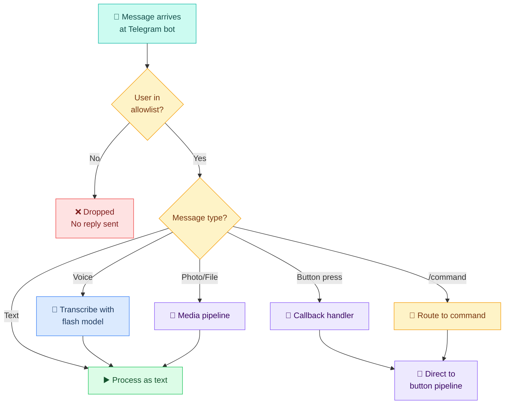

### Allowlist Rules

> Config keys below are illustrative. Source of truth → [[stack/L3-channel/config-reference]]

```json5
{
  "telegram": {
    "dmPolicy": "allowlist",
    "allowFrom": [
      "tg:${TELEGRAM_MARTY_ID}",      // Primary user
      "tg:${TELEGRAM_WENTING_ID}"     // Secondary user
    ]
  }
}
```

If the sender's Telegram ID is not in this list, Crispy drops the message with no reply.

---

## Input Processing

### Text Messages

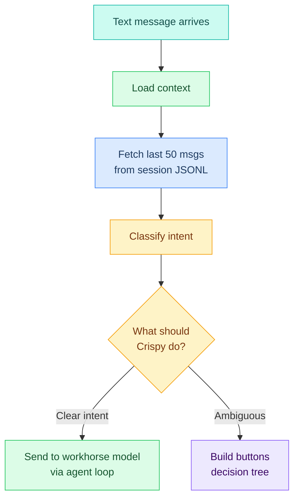

**Context load steps:**
1. Fetch session JSONL for current user
2. Extract last 50 messages (both user and Crispy)
3. Include daily memory log (if exists)
4. Load long-term MEMORY.md (if referenced)
5. Include any stored decision trees (from previous buttons)

### Voice Messages

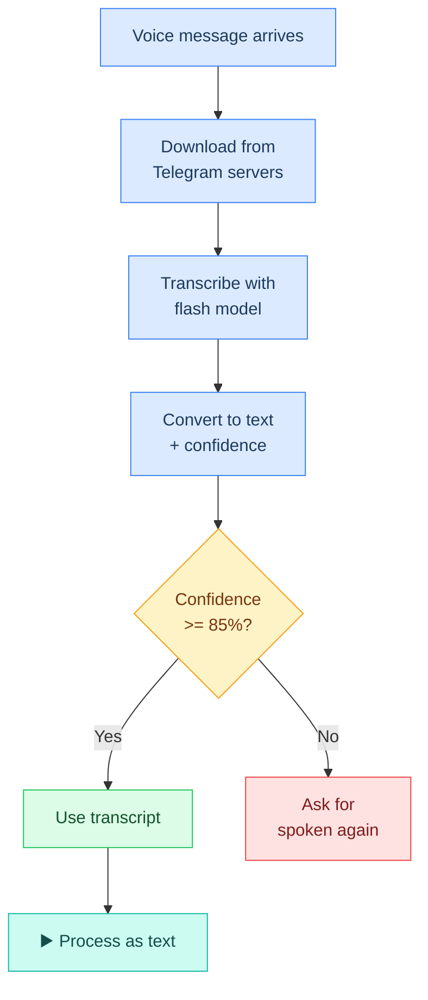

### Media (Photos, Documents, Files)

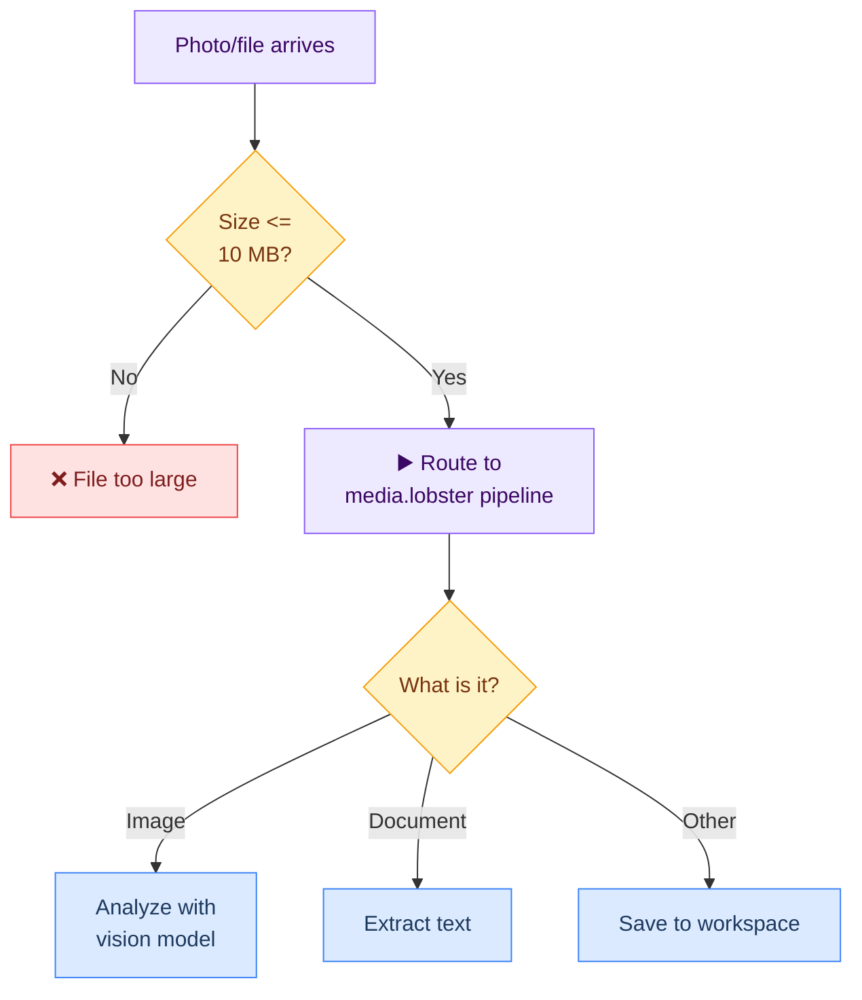

---

## Custom Commands

When a message starts with `/`, it's routed to a command handler instead of the agent loop:

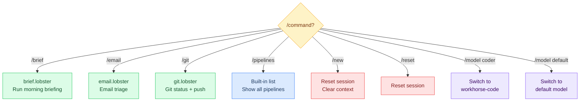

### Command Config

> Authoritative config → [[stack/L3-channel/config-reference]]. Below is a summary.

```json5
{
  "telegram": {
    "customCommands": {
      "brief": { "description": "Morning briefing" },
      "email": { "description": "Email triage" },
      "git": { "description": "Git status" },
      "pipelines": { "description": "List pipelines" }
    }
  }
}
```

---

## Agent Loop: Thinking & Responding

When a message makes it to the agent loop (text or transcribed voice), Crispy runs the standard decision sequence:

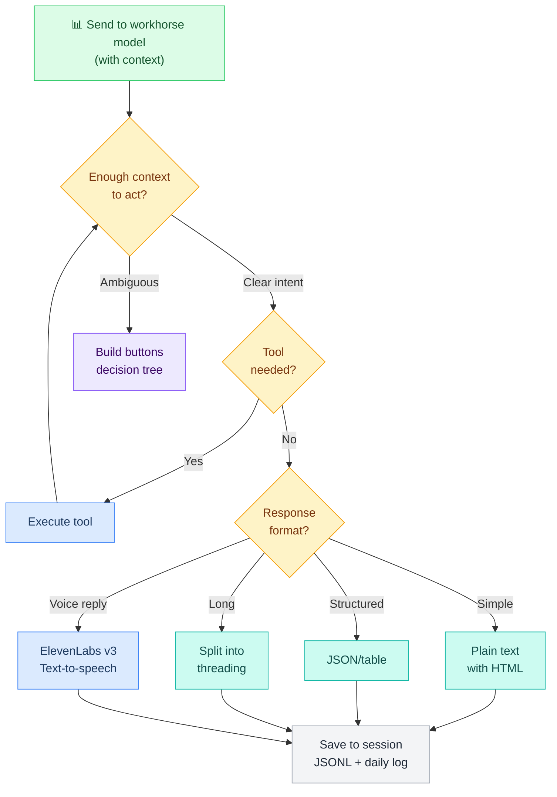

### Block Streaming

Responses are streamed in blocks of 800–1200 characters to keep Telegram messages readable:

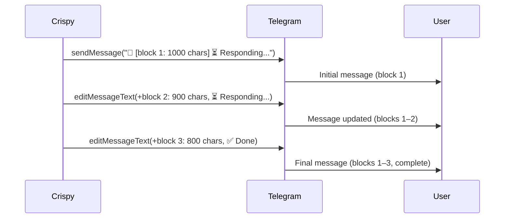

---

## Button Callbacks (Pre-Built Decision Trees)

When Crispy creates buttons, it builds a **pre-compiled decision tree** and stores it in Lobster state. Each button press resolves from that tree — no LLM, ~200ms response time.

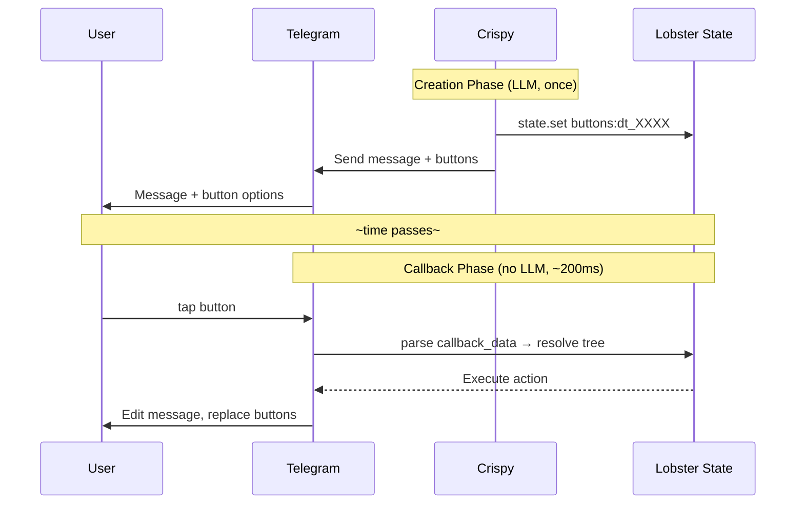

### Callback Data Format

```
<tree_id>:<option_key>

Examples:
dt_a1b2:yes          — tree ID "a1b2", option "yes"
dt_c3d4:fix          — tree ID "c3d4", option "fix"
dt_ap_8f3e:approve   — approval tree, "approve" option
```

---

## DM vs. Group Behavior

### Direct Messages (Full Mode)

- **Full context:** Bootstrap + memory + history
- **Voice input:** Supported, auto-transcribed
- **Buttons:** All 4 patterns (approve-deny, exec-approve, decision-tree, quick-actions)
- **Streaming:** Enabled (block streaming)
- **Response length:** No limit (can thread if needed)
- **Custom commands:** All 6 commands available

### Group Mentions (Limited Mode)

Group support is currently disabled (groups config not present). When/if enabled in the future:

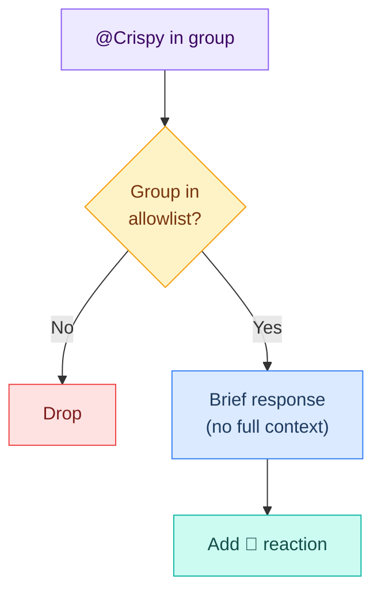

---

## Inline Button Rules

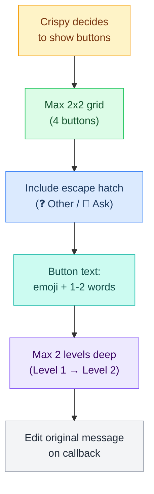

### Examples

**Good:**
- Text: "🔧 Config", "📊 Status", "💬 Ask"
- Grid: 2x2 (4 buttons max)
- Depth: Level 1 (broad category) → Level 2 (specific choice) → Work

**Bad:**
- Text: "Configure the system settings"
- Grid: 3x3 (9 buttons — unreadable)
- Depth: Level 1 → Level 2 → Level 3 → Level 4 (too deep, frustrating)

---

## Full Message Lifecycle: Example

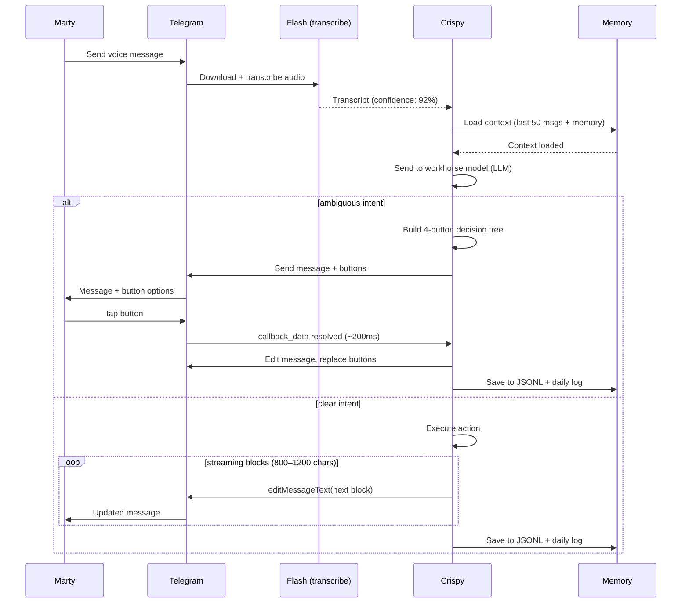

---

## Config Example

```json5
{
  "telegram": {
    "enabled": true,
    "botToken": "${TELEGRAM_BOT_TOKEN}",

    // Authentication
    "dmPolicy": "allowlist",
    // groups not configured = group support disabled
    "allowFrom": [
      "tg:${TELEGRAM_MARTY_ID}",
      "tg:${TELEGRAM_WENTING_ID}"
    ],

    // Features
    "capabilities": {
      "inlineButtons": true,
      "voiceInput": true,
      "mediaHandling": true,
      "textStreaming": true
    },

    // Limits
    "historyLimit": 50,
    "mediaMaxMb": 10,
    "blockStreamingChars": 1000,
    "commandTimeout": 300,

    // Streaming
    "streaming": "partial",

    // Voice TTS (reply to voice with audio)
    "voiceReply": {
      "enabled": true,
      "provider": "elevenlabs",
      "voice": "Aria"
    },

    // Custom commands
    "customCommands": {
      "brief": { "description": "Morning briefing" },
      "email": { "description": "Email triage" },
      "git": { "description": "Git status" },
      "pipelines": { "description": "List pipelines" }
    }
  }
}
```

---

## Error Handling

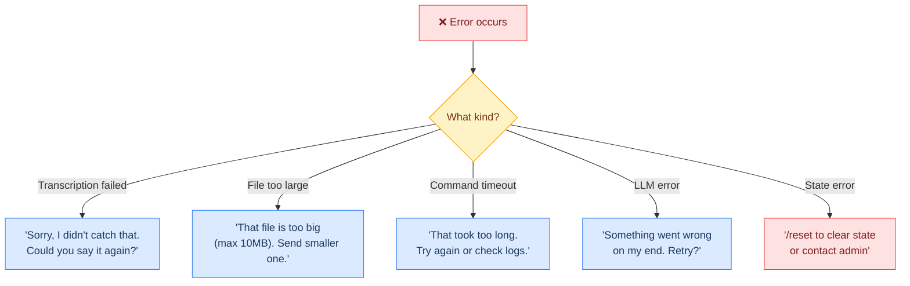

---

## Performance Targets

| Operation | Target | Notes |
|---|---|---|
| **Message arrival → auth** | < 100ms | Synchronous check |
| **Voice transcription** | 2–5s | Depends on audio length |
| **Context load** | < 500ms | 50 messages + memory from disk |
| **workhorse model round-trip** | 3–15s | Streaming response |
| **Button callback** | < 200ms | Pure state lookup, no LLM |
| **Block stream edit** | < 200ms | Each block append |

---


## Example Conversations

> Example multi-turn conversations and mockups showing all 4 button patterns in real-world scenarios.

### Conversation Flow Types

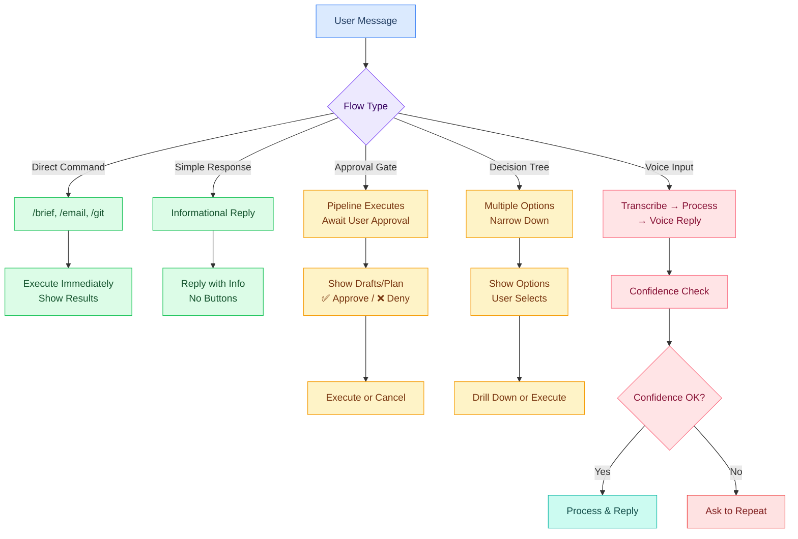

### Example 1: `/brief` Command

Running the morning brief pipeline:

```
> Marty: /brief

┌─────────────────────────────────────────┐
│ 🦊 Crispy                               │
│                                         │
│ 📰 Morning Brief (Mar 2, 2026)          │
│ ⏳ Gathering info...                    │
└─────────────────────────────────────────┘

[~5 second wait]

┌─────────────────────────────────────────┐
│ 🦊 Crispy                               │
│                                         │
│ 📰 Morning Brief (Mar 2, 2026)          │
│                                         │
│ 🎯 TOP 3 ITEMS:                         │
│                                         │
│ 1. 📚 3 new articles in your briefing  │
│    • AI agent systems (HN top)         │
│    • Rust async patterns               │
│    • Postgres 16 optimizations         │
│                                         │
│ 2. 💾 Git status                       │
│    • 2 commits ahead of main           │
│    • No uncommitted changes            │
│    • Last push: 3 hours ago            │
│                                         │
│ 3. 📧 Email inbox                      │
│    • 4 unread emails                   │
│    • 1 flagged urgent                  │
│                                         │
│ ⏳ More...                              │
└─────────────────────────────────────────┘

[Block streaming continues]

┌─────────────────────────────────────────┐
│ 🦊 Crispy                               │
│                                         │
│ 📰 Morning Brief (continued)            │
│                                         │
│ 🔐 SYSTEM                               │
│    Gateway: ✅ Healthy                  │
│    Memory: 247 KB loaded               │
│    Uptime: 6h 34m                      │
│                                         │
│ 💡 WHAT'S NEXT?                         │
│    • Process emails → /email            │
│    • Check git → /git                   │
│    • Read articles → via memory search  │
│                                         │
│ ✅ Brief complete.                      │
└─────────────────────────────────────────┘
```

(Additional examples 2-8 omitted for brevity — see original conversation-flows.md for full text, photos, videos, error handling)

---

**Up →** [[stack/L3-channel/_overview]]
**Channel overview →** [[stack/L3-channel/telegram/_overview]]
**Button patterns →** [[stack/L3-channel/telegram/button-patterns]]
**Pipelines →** [[stack/L3-channel/telegram/pipelines]]
