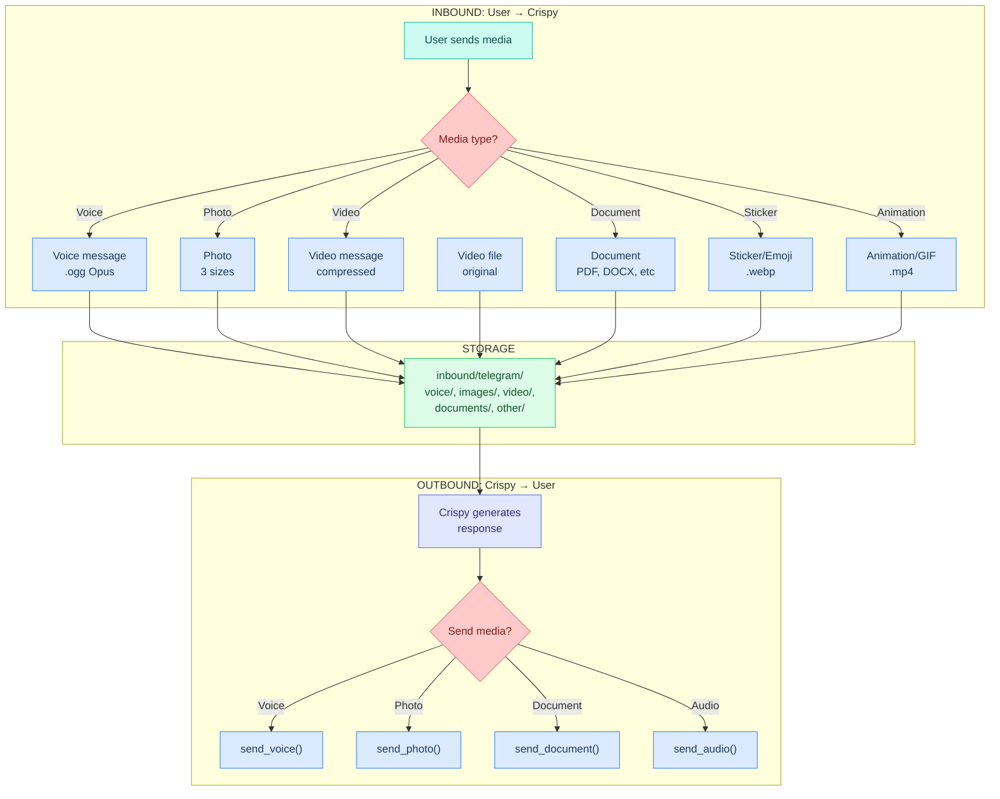

# Telegram — Media Handling

> How Crispy receives and sends media through Telegram: voice messages, photos, videos, documents, and stickers.

---

## Overview

Telegram has rich media support with several unique characteristics:



---

## Inbound: Telegram → Crispy

### Voice Messages

**Format:** OGG Opus codec, mono, 48kHz (Telegram's standard)

**Constraints:**
- Maximum 20MB file size (~3 minutes at Telegram's bitrate)
- Users hold push-to-talk button to record
- Telegram sends as `voice` update type
- `file_id` changes on re-forward, but `unique_file_id` is stable

**How to receive:**

```json
{
  "update_id": 12345,
  "message": {
    "message_id": 678,
    "from": { "id": 987654, "first_name": "Marty" },
    "chat": { "id": 987654, "type": "private" },
    "date": 1709386995,
    "voice": {
      "file_id": "AwAC...",
      "file_unique_id": "AQADXp1Zwv...",
      "duration": 8,
      "mime_type": "audio/ogg",
      "file_size": 12400
    }
  }
}
```

**Download flow:**

```
1. getFile() API call with file_id
   → Returns file_path: "documents/file_123.oga"

2. Download from CDN
   curl https://api.telegram.org/file/bot{TOKEN}/documents/file_123.oga -o voice.ogg

3. Store locally
   ~/.openclaw/workspace/media/inbound/telegram/voice/telegram-20260302-user123-a1b2c3.ogg

4. Process
   → STT transcribe
   → Extract metadata (duration, format)
   → Create metadata.json sidecar
```

**Config:**

```json5
"channels": {
  "telegram": {
    "media": {
      "voice": {
        "enabled": true,
        "max_duration_s": 300,         // 5 minutes max
        "storage_path": "inbound/telegram/voice",
        "stt_provider": "whisper-api",
        "cache_transcriptions_24h": true,
        "auto_respond_with_voice": true  // reply with TTS audio
      }
    }
  }
}
```

### Photo (Images)

**Format:** JPEG, PNG, WebP

**Characteristics:**
- Telegram sends **3 versions** of each photo (thumbnail, medium, large)
- Thumbnail: ~100x100px
- Medium: ~320x320px
- Large: Original size up to ~4000x3000px
- File sizes: ~2KB (thumb) → 50KB (medium) → 500KB+ (large)

**How to receive:**

```json
{
  "message": {
    "message_id": 679,
    "photo": [
      {
        "file_id": "AgAC...",
        "file_unique_id": "AQAD...",
        "width": 320,
        "height": 213,
        "file_size": 18932
      },
      {
        "file_id": "AgAC...",
        "file_unique_id": "AQAD...",
        "width": 800,
        "height": 533,
        "file_size": 94132
      },
      {
        "file_id": "AgAC...",
        "file_unique_id": "AQAD...",
        "width": 4000,
        "height": 2667,
        "file_size": 1024934
      }
    ],
    "caption": "Look at this invoice"
  }
}
```

**Strategy:** Download only the **largest** version to preserve detail.

**Download flow:**

```
1. Extract largest file_id from photo[] array
   → Use photo[2] (always the largest)

2. getFile() API call
   → Returns file_path

3. Download
   curl https://api.telegram.org/file/bot{TOKEN}/{file_path} -o photo.jpg

4. Store
   ~/.openclaw/workspace/media/inbound/telegram/images/telegram-20260302-user123-d4e5f6.jpg

5. Process
   → Resize if >5MB (save space)
   → Generate thumbnail (300px)
   → OCR text extraction
   → EXIF metadata
   → Create sidecar JSON
```

**Config:**

```json5
"channels": {
  "telegram": {
    "media": {
      "image": {
        "enabled": true,
        "keep_sizes": ["large"],        // ignore thumbnail, medium
        "max_file_size_mb": 5,
        "resize_max_width": 1920,
        "resize_max_height": 1080,
        "generate_thumbnail": true,
        "thumbnail_size": 300,
        "ocr": {
          "enabled": true,
          "language": "eng"
        },
        "extract_exif": true,
        "storage_path": "inbound/telegram/images"
      }
    }
  }
}
```

### Video Message

**Format:** MP4, compressed by Telegram

**Characteristics:**
- Telegram's "video message" — short, meant for quick shares
- Telegram compresses automatically (lower quality)
- Max ~20MB file size
- Usually <10 seconds duration

**How to receive:**

```json
{
  "message": {
    "message_id": 680,
    "video": {
      "file_id": "BAACAgJ...",
      "file_unique_id": "AgAD...",
      "width": 1280,
      "height": 720,
      "duration": 5,
      "thumb": {
        "file_id": "AAMC...",
        "width": 320,
        "height": 180,
        "file_size": 12000
      },
      "mime_type": "video/mp4",
      "file_size": 245600
    }
  }
}
```

**Storage:** `inbound/telegram/video/`

**Processing:**
- Extract thumbnail (Telegram already provides one)
- Extract audio track → STT transcription
- Store video file

### Video File (Large)

**Format:** User uploads entire video file (not Telegram's compression)

**Characteristics:**
- Can be large (up to Telegram's 2GB download limit via bot API)
- Sent as `document` type but with `mime_type: "video/*"`
- No automatic compression

**How to receive:**

```json
{
  "message": {
    "message_id": 681,
    "document": {
      "file_id": "BQACAgJ...",
      "file_unique_id": "AgAE...",
      "file_name": "project-demo.mp4",
      "mime_type": "video/mp4",
      "file_size": 1245600000
    }
  }
}
```

**Handling:** Route by `mime_type` — if `video/*`, treat as video not document.

### Document

**Format:** PDF, DOCX, XLSX, ZIP, etc.

**Constraints:**
- Max 2GB file size (via bot API)
- Sent as `document` type
- `file_name` is preserved

**How to receive:**

```json
{
  "message": {
    "message_id": 682,
    "document": {
      "file_id": "BQACAgJ...",
      "file_unique_id": "AgAE...",
      "file_name": "report-q1-2026.pdf",
      "mime_type": "application/pdf",
      "file_size": 1245600
    }
  }
}
```

**Storage:** `inbound/telegram/documents/`

**Processing:**
- Extract text (pdftotext, python-docx, etc.)
- Parse structure (headings, lists)
- Summarize if >1000 chars
- Extract keywords

### Sticker/Emoji

**Format:** WebP (animated or static)

**Characteristics:**
- Telegram's first-class sticker type
- Animated stickers are WebP with APNG format
- Usually small (50KB)
- Less useful for Crispy (mostly decorative)

**Config:**

```json5
"channels": {
  "telegram": {
    "media": {
      "skip_stickers": false,         // set to true to ignore
      "storage_path": "inbound/telegram/images"  // store with images
    }
  }
}
```

### File Size Limits

Telegram's download API has hard limits:

| Media Type | Size Limit | Notes |
|---|---|---|
| **Voice message** | 20MB | ~3min at Telegram bitrate |
| **Photo** | 5MB (per size) | Largest usually 500KB-1MB |
| **Video message** | 20MB | Compressed by Telegram |
| **Video file** | 2GB | User upload, not compressed |
| **Document** | 2GB | Any file type |
| **Sticker** | 512KB | WebP format |

**Recommendation:** Set `max_file_size_mb` in config to prevent memory issues:

```json5
"channels": {
  "telegram": {
    "media": {
      "max_file_size_mb": 100,        // skip anything larger
      "auto_skip_on_timeout": true,   // skip if >30s download
      "timeout_download_s": 30
    }
  }
}
```

---

## Outbound: Crispy → User

### send_voice()

**Use case:** Respond to voice message with voice reply

**Format:** OGG Opus (Telegram native), WAV, MP3

**API call:**

```json
{
  "chat_id": 987654,
  "voice": "file_id_or_bytes",
  "caption": "optional text",
  "duration": 8,
  "reply_to_message_id": 678
}
```

**Implementation in Python (Telegram bot library):**

```python
# Send voice from file
bot.send_voice(
    chat_id=user_id,
    voice=open('/tmp/response.ogg', 'rb'),
    duration=8,
    reply_to_message_id=message_id
)

# Or send voice bytes
audio_bytes = tts_engine.synthesize("Hello world")
bot.send_voice(
    chat_id=user_id,
    voice=io.BytesIO(audio_bytes),
    duration=len(audio_bytes) // (16000 * 2),  # estimate
    reply_to_message_id=message_id
)
```

**Config:**

```json5
"channels": {
  "telegram": {
    "send": {
      "voice": {
        "enabled": true,
        "format": "ogg_opus",          // Telegram's native format
        "codec": "libopus",            // ffmpeg codec
        "bitrate": "128k",             // 128 kbps
        "sample_rate": 48000,          // 48 kHz (Telegram standard)
        "channels": 1,                 // mono
        "reply_to_voice": true         // reply_to_message_id if user sent voice
      }
    }
  }
}
```

### send_photo()

**Use case:** Send chart, screenshot, or image

**API call:**

```json
{
  "chat_id": 987654,
  "photo": "file_id_or_bytes",
  "caption": "Here's the weather forecast",
  "parse_mode": "HTML"
}
```

**Implementation:**

```python
# Send from file
bot.send_photo(
    chat_id=user_id,
    photo=open('/tmp/chart.png', 'rb'),
    caption="Weather forecast"
)

# Or from bytes (generated image)
image_bytes = matplotlib_figure.to_png()
bot.send_photo(
    chat_id=user_id,
    photo=io.BytesIO(image_bytes),
    caption="Weather forecast"
)
```

**Config:**

```json5
"channels": {
  "telegram": {
    "send": {
      "photo": {
        "enabled": true,
        "format": "png",               // or jpeg
        "max_width": 1280,
        "max_height": 800,
        "compression": 8,              // PNG compression level (1-9)
        "reply_to_photo": true         // reply_to if user sent photo
      }
    }
  }
}
```

### send_document()

**Use case:** Send PDF report, spreadsheet, or any file

**API call:**

```json
{
  "chat_id": 987654,
  "document": "file_id_or_bytes",
  "caption": "Monthly report",
  "file_name": "report-2026-03.pdf"
}
```

**Implementation:**

```python
# Send file
bot.send_document(
    chat_id=user_id,
    document=open('/tmp/report.pdf', 'rb'),
    caption="Monthly report",
    file_name="report-2026-03.pdf"
)

# Or send bytes
pdf_bytes = generate_pdf_report()
bot.send_document(
    chat_id=user_id,
    document=io.BytesIO(pdf_bytes),
    caption="Monthly report",
    file_name="report-2026-03.pdf"
)
```

**Config:**

```json5
"channels": {
  "telegram": {
    "send": {
      "document": {
        "enabled": true,
        "formats": ["pdf", "docx", "xlsx", "csv", "txt"],
        "max_file_size_mb": 100,
        "always_send_as_document": true  // vs. auto-detection
      }
    }
  }
}
```

### send_audio()

**Use case:** Send music or longer audio file (vs. voice message for speech)

**Format:** MP3, WAV, FLAC

**API call:**

```json
{
  "chat_id": 987654,
  "audio": "file_id_or_bytes",
  "title": "Song title",
  "performer": "Artist name",
  "duration": 180
}
```

**Config:**

```json5
"channels": {
  "telegram": {
    "send": {
      "audio": {
        "enabled": false,              // rarely used
        "format": "mp3",
        "max_file_size_mb": 50
      }
    }
  }
}
```

### send_video()

**Use case:** Send video file or movie clip

**API call:**

```json
{
  "chat_id": 987654,
  "video": "file_id_or_bytes",
  "caption": "Check out this video",
  "duration": 120,
  "width": 1280,
  "height": 720
}
```

**Config:**

```json5
"channels": {
  "telegram": {
    "send": {
      "video": {
        "enabled": false,              // rare for AI agent
        "format": "mp4",
        "max_file_size_mb": 50,
        "max_duration_s": 600
      }
    }
  }
}
```

---

## file_id vs. unique_file_id

**Important distinction:**

| Attribute | Behavior | Use Case |
|---|---|---|
| **file_id** | Changes when file is re-forwarded or user shares again | Temporary, valid for ~24h |
| **unique_file_id** | Stable identifier for a file (permanent) | Deduplication, caching |

**Implication:** For caching voice transcriptions or image OCR results, use `unique_file_id` as the key:

```python
cache_key = message.voice.file_unique_id

if cache_key in transcription_cache:
    text = transcription_cache[cache_key]
else:
    # Download and transcribe
    file_path = bot.get_file(message.voice.file_id).file_path
    audio = download(file_path)
    text = transcribe(audio)
    transcription_cache[cache_key] = text
```

---

## Metadata Sidecar Files

Every inbound media file gets a `.metadata.json` sidecar:

**Voice example:**

```json
{
  "filename": "telegram-20260302-user123-a1b2c3.ogg",
  "channel": "telegram",
  "type": "voice",
  "user_id": "user123",
  "timestamp_received": "2026-03-02T14:23:15.234Z",
  "telegram": {
    "message_id": 678,
    "chat_id": 987654,
    "file_id": "AwAC...",
    "file_unique_id": "AQADXp1Z...",
    "duration": 8,
    "mime_type": "audio/ogg",
    "file_size": 12400
  },
  "processing": {
    "stt_provider": "whisper-api",
    "stt_duration_ms": 4200,
    "stt_text": "what's the weather tomorrow",
    "stt_confidence": 0.98
  },
  "stored_path": "~/.openclaw/workspace/media/inbound/telegram/voice/telegram-20260302-user123-a1b2c3.ogg",
  "tags": ["weather", "question"],
  "keep": false,
  "delete_after_days": 30
}
```

**Photo example:**

```json
{
  "filename": "telegram-20260302-user456-d4e5f6.jpg",
  "channel": "telegram",
  "type": "image",
  "user_id": "user456",
  "timestamp_received": "2026-03-02T10:15:42.123Z",
  "telegram": {
    "message_id": 679,
    "chat_id": 987654,
    "file_id": "AgAC...",
    "file_unique_id": "AQAD...",
    "file_size": 245600,
    "width": 4000,
    "height": 2667
  },
  "processing": {
    "resized": false,
    "thumbnail_generated": true,
    "ocr_text": "Invoice #12345\nTotal: $499.99",
    "ocr_confidence": 0.92,
    "ocr_duration_ms": 2340,
    "exif": {
      "camera": "iPhone 15 Pro",
      "date_taken": "2026-03-02T10:14:00Z"
    }
  },
  "stored_path": "~/.openclaw/workspace/media/inbound/telegram/images/telegram-20260302-user456-d4e5f6.jpg",
  "tags": ["invoice", "financial"],
  "keep": true,
  "delete_after_days": null
}
```

---

## Complete Config Block

```json5
{
  "channels": {
    "telegram": {
      "media": {
        "enabled": true,
        "inbound_path": "~/.openclaw/workspace/media/inbound/telegram",

        // Voice messages
        "voice": {
          "enabled": true,
          "max_duration_s": 300,
          "storage_path": "voice",
          "stt_provider": "whisper-api",      // or "deepgram", "whisper-local"
          "cache_transcriptions_24h": true,
          "auto_respond_with_voice": true,    // reply with TTS if user sent voice
          "timeout_stt_s": 30,
          "timeout_tts_s": 20
        },

        // Photos
        "image": {
          "enabled": true,
          "keep_sizes": ["large"],            // skip thumbnail and medium
          "max_file_size_mb": 5,
          "resize_max_width": 1920,
          "resize_max_height": 1080,
          "generate_thumbnail": true,
          "thumbnail_size": 300,
          "storage_path": "images",
          "ocr": {
            "enabled": true,
            "language": "eng",
            "confidence_threshold": 0.5
          },
          "extract_exif": true
        },

        // Video messages & files
        "video": {
          "enabled": true,
          "max_file_size_mb": 500,
          "max_duration_s": 600,
          "extract_thumbnail": true,
          "extract_audio": true,
          "transcribe_audio": true,
          "storage_path": "video"
        },

        // Documents
        "document": {
          "enabled": true,
          "max_file_size_mb": 100,
          "max_pages": 200,
          "extract_text": true,
          "summarize_if_longer_than_chars": 1000,
          "storage_path": "documents",
          "supported_formats": ["pdf", "docx", "xlsx", "txt", "csv", "rtf"]
        },

        // Stickers
        "skip_stickers": false,

        // Download
        "cache_downloaded_24h": true,
        "timeout_download_s": 30,
        "auto_skip_on_timeout": true,
        "max_file_size_mb": 100,

        // Metadata
        "create_metadata": true,
        "metadata_format": "json",

        // Outbound
        "send": {
          "voice": {
            "enabled": true,
            "format": "ogg_opus",
            "codec": "libopus",
            "bitrate": "128k",
            "sample_rate": 48000,
            "channels": 1,
            "reply_to_voice": true
          },
          "photo": {
            "enabled": true,
            "format": "png",
            "max_width": 1280,
            "max_height": 800,
            "reply_to_photo": true
          },
          "document": {
            "enabled": true,
            "formats": ["pdf", "docx", "xlsx", "csv"],
            "max_file_size_mb": 100,
            "always_send_as_document": true
          },
          "audio": {
            "enabled": false
          },
          "video": {
            "enabled": false
          }
        }
      }
    }
  }
}
```

---

## Telegram Media Limits Reference

Quick lookup for API limits:

| Feature | Limit | Notes |
|---|---|---|
| **File download (bot API)** | 20MB per file | 50MB for Telegram Passport files |
| **File upload (bot API)** | 50MB per file | Use local file for larger |
| **Photo upload** | 10MB | Telegram re-compresses |
| **Animation/GIF** | 50MB | Sent as video_note or animation |
| **Voice message duration** | 20min | Practical max ~3min due to 20MB file limit |
| **Video duration** | 10,000 seconds | Rare to hit in practice |
| **Caption length** | 1024 characters | HTML/Markdown parsing supported |
| **Inline keyboard buttons** | 100 per message | Usually 2x2 grid recommended |

---

## Troubleshooting

| Problem | Cause | Fix |
|---|---|---|
| **Voice message won't download** | file_id expired (>24h old) | Re-download immediately after message arrives |
| **Photo is too small** | Downloaded medium instead of large | Ensure using largest file_id from photo[] array |
| **OCR text is garbled** | Image skewed or rotated | Pre-process with deskew + rotation detection |
| **TTS response doesn't play** | Wrong format (not ogg_opus) | Use ffmpeg to convert to `.ogg` with Opus codec |
| **Document extraction fails** | Unsupported format or corrupted file | Check MIME type; test file with pdftotext |
| **Sticker won't display in analysis** | Treating as image but it's animation | Check if `file_name.endswith('.webp')` for stickers |

---

## Examples: Complete Voice Message Flow

```python
# 1. Receive voice message
voice_message = update.message.voice
user_id = update.message.from_user.id

# 2. Download
file_info = bot.get_file(voice_message.file_id)
downloaded_file = bot.download_file(file_info.file_path)

# 3. Store
filename = f"telegram-{date.today()}-user{user_id}-{hash}.ogg"
with open(f"~/.openclaw/workspace/media/inbound/telegram/voice/{filename}", "wb") as f:
    f.write(downloaded_file)

# 4. Transcribe
text = transcribe_whisper(filename)

# 5. Agent processes
response = agent.process(text, user_id)

# 6. Synthesize
audio_bytes = tts_elevenlabs(response)

# 7. Send back
bot.send_voice(
    chat_id=user_id,
    voice=audio_bytes,
    reply_to_message_id=voice_message.message_id
)
```

---

**Up →** [[stack/L3-channel/telegram/_overview]]
**Related →** [[stack/L1-physical/media]]
**Related →** [[stack/L6-processing/pipelines/media]]
**Back →** [[stack/L3-channel/_overview]]
