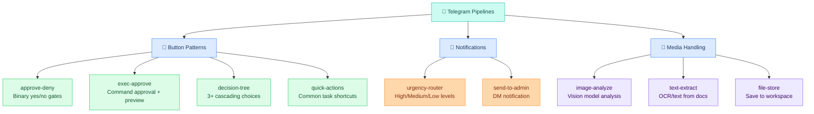
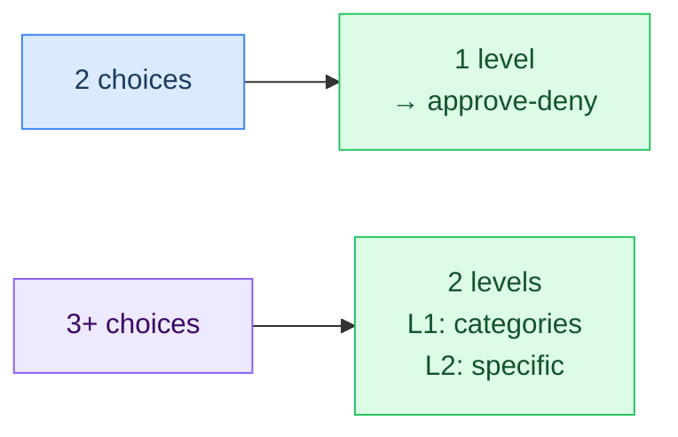
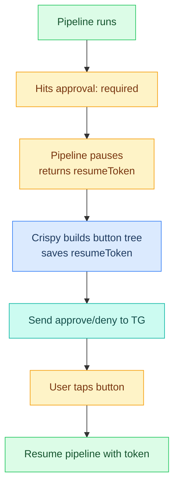
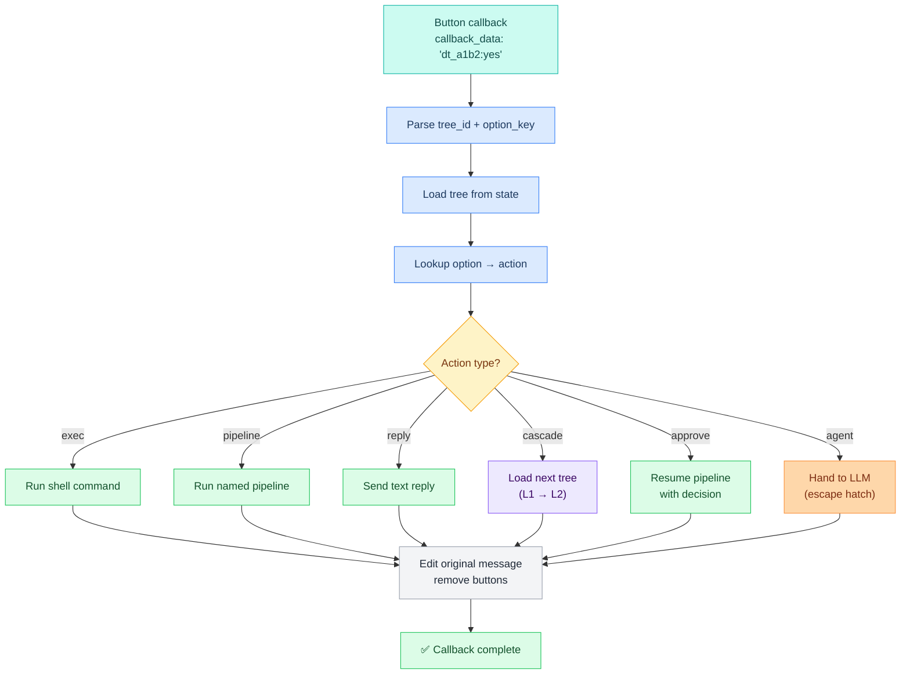
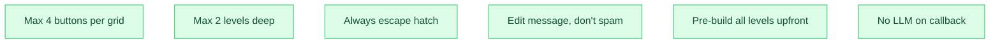

# L3 — Telegram Pipelines

> All Telegram-specific pipelines documented in one place. These handle button callbacks, approvals, media, and notifications — everything that only makes sense in Telegram context.

---

## Pipeline Map



---

## 1. Approve-Deny Pattern

**Purpose:** Binary yes/no decision for pipeline approval gates and confirmations.

**Trigger:** Pipeline hits `approval: required` step, or Crispy asks a yes/no question.

**Response time:** ~200ms (pre-built tree, state lookup).

### Config

```json5
{
  "type": "approval",
  "tree_id": "dt_ap_XXXX",
  "context": "Brief description of what's being approved",
  "options": {
    "approve": {
      "label": "✅ Approve",
      "action": "approve",
      "resume_token": "tok_from_pipeline",  // only if pipeline approval
      "decision": true,
      "reply": "Approved — proceeding."
    },
    "deny": {
      "label": "❌ Deny",
      "action": "approve",
      "resume_token": "tok_from_pipeline",
      "decision": false,
      "reply": "Denied — cancelled."
    },
    "details": {
      "label": "🔍 Details",
      "action": "reply",
      "reply": "[full preview text]"
    }
  },
  "expires": "2026-03-02T10:00:00Z"
}
```

### Pipeline Integration

```yaml
# Inside a Lobster pipeline
  - id: review
    command: approve --preview-from-stdin --prompt "Process these items?"
    stdin: $classify.stdout
    approval: required

  # Crispy intercepts this and sends Telegram buttons
  # (handled automatically by L3 channel layer)
```

### Conversation Example

```
Pipeline paused at approval gate
         ↓
Crispy sends: "Process 3 items?" with buttons
         ↓
User taps ✅ Approve
         ↓
Pipeline resumes via resume token (~300ms)
```

---

## 2. Exec-Approve Pattern

**Purpose:** Show command preview and approval before execution (destructive operations).

**Trigger:** Git push, file deletion, Docker prune, any side-effect command.

**Special feature:** 🔍 Dry run button shows command output and keeps buttons active.

### Config

```json5
{
  "type": "exec_approval",
  "tree_id": "dt_ex_XXXX",
  "command": "git push origin main",
  "display": "git push origin main\n3 commits, 7 files changed",
  "options": {
    "run": {
      "label": "✅ Run",
      "action": "exec",
      "command": "cd ~/.openclaw/workspace && git push origin main",
      "reply": "Pushed to origin/main."
    },
    "skip": {
      "label": "❌ Skip",
      "action": "reply",
      "reply": "Skipped — nothing pushed."
    },
    "dryrun": {
      "label": "🔍 Dry run",
      "action": "exec",
      "command": "cd ~/.openclaw/workspace && git push origin main --dry-run 2>&1",
      "reply_prefix": "Dry run output:\n\n",
      "keep_buttons": true  // Buttons stay active after this tap
    }
  }
}
```

### When to Use

- `git push` / `git reset` / `git rebase`
- `rm` / `docker prune` / `docker image rm`
- Any command that modifies files or remote state
- Any command Crispy is >50% confident about but not 100%

### Conversation Example

```
Crispy detects 2 commits ready to push
         ↓
Show: "git push origin main" + 3 buttons
         ↓
User taps 🔍 Dry run
         ↓
Show: "abc123..def456 main → main"
  (buttons still active)
         ↓
User taps ✅ Run
         ↓
Command executes, buttons removed
```

---

## 3. Decision-Tree Pattern

**Purpose:** Multi-option narrowing for ambiguous intents (3+ choices).

**Depth:** Max 2 levels.
- Level 1: Broad category (3–4 buttons)
- Level 2: Specific choice (2 buttons, binary)

**Response time:** ~200ms per tap (state lookup, no LLM).

### Config

```json5
// Level 1 tree (root)
{
  "type": "decision_tree",
  "tree_id": "dt_c3d4",
  "depth": 1,
  "prompt": "What area needs attention?",
  "options": {
    "config": {
      "label": "⚙️ Config",
      "action": "cascade",
      "next_tree": "dt_c3d4_config",
      "next_prompt": "Which config section?"
    },
    "pipeline": {
      "label": "🔧 Pipeline",
      "action": "cascade",
      "next_tree": "dt_c3d4_pipeline",
      "next_prompt": "Which pipeline?"
    },
    "memory": {
      "label": "🧠 Memory",
      "action": "cascade",
      "next_tree": "dt_c3d4_memory",
      "next_prompt": "Memory action?"
    },
    "other": {
      "label": "❓ Other",
      "action": "agent",
      "reply": "Describe what you need."
    }
  }
}

// Level 2 tree for config (one per Level 1 option)
{
  "type": "decision_tree",
  "tree_id": "dt_c3d4_config",
  "depth": 2,
  "parent": "dt_c3d4",
  "prompt": "Which config section?",
  "options": {
    "models": {
      "label": "Models",
      "action": "exec",
      "command": "vi ~/.openclaw/config/models.yaml",
      "reply": "Edit models.yaml in editor."
    },
    "agents": {
      "label": "Agents",
      "action": "exec",
      "command": "vi ~/.openclaw/config/agents.yaml",
      "reply": "Edit agents.yaml in editor."
    }
  }
}
```

### Depth Rule



---

## 4. Quick-Actions Pattern

**Purpose:** Shortcut menu for frequently-used tasks (context-sensitive).

**Use cases:** Greetings, "what's next", general status requests.

**Often chains into:** approve-deny or exec-approve after the first tap.

### Config

```json5
{
  "type": "quick_actions",
  "tree_id": "dt_qa_XXXX",
  "context": "general",
  "options": {
    "brief": {
      "label": "📋 Brief",
      "action": "pipeline",
      "pipeline": "brief",
      "reply": "Running morning brief..."
    },
    "email": {
      "label": "📧 Email",
      "action": "pipeline",
      "pipeline": "email",
      "reply": "Running email triage..."
    },
    "git": {
      "label": "🔀 Git",
      "action": "pipeline",
      "pipeline": "git",
      "reply": "Checking git status..."
    },
    "other": {
      "label": "❓ Other",
      "action": "agent",
      "reply": "What do you need?"
    }
  }
}
```

### Pre-Built Sets

```json5
// General context (default)
{ "context": "general", "options": { "brief", "email", "git", "other" } }

// Workspace context (when cleanup is needed)
{ "context": "workspace", "options": { "logs", "archive", "git_clean", "other" } }

// Dev context (when code is mentioned)
{ "context": "dev", "options": { "review", "debug", "deploy", "other" } }

// Research context (when lookups are requested)
{ "context": "research", "options": { "web", "docs", "memory", "other" } }
```

---

## 5. Notification Router

**Purpose:** Route alerts and notifications by urgency.

**When triggered:** System events, pipeline completions, errors, user mentions.

**Levels:** 🔴 Urgent, 🟡 Medium, 🟢 Low

### Config

```yaml
name: notify
args:
  level:
    default: "medium"
    enum: ["urgent", "medium", "low"]
  title:
    default: "Notification"
  message:
    default: ""
  action_url:
    default: ""

steps:
  - id: route
    command: exec --json --shell |
      case "$level" in
        urgent)
          # Send immediately + sound
          openclaw.invoke --tool agent_send \
            --args-json '{"channelId":"telegram:${TELEGRAM_MARTY_ID}","content":"🔴 $title\n\n$message","sound":true}'
          ;;
        medium)
          # Send immediately, no sound
          openclaw.invoke --tool agent_send \
            --args-json '{"channelId":"telegram:${TELEGRAM_MARTY_ID}","content":"🟡 $title\n\n$message"}'
          ;;
        low)
          # Batch with other lows, send every 10 min
          openclaw.invoke --tool agent_send \
            --args-json '{"channelId":"telegram:${TELEGRAM_MARTY_ID}","content":"🟢 $title\n\n$message","batch":"low_batch"}'
          ;;
      esac
```

### Usage Example

```yaml
# In another pipeline
  - id: notify_complete
    command: openclaw pipeline run notify
      --args-json '{
        "level": "medium",
        "title": "Email triage complete",
        "message": "3 items processed, 5 archived"
      }'
```

---

## 6. Media Handler

**Purpose:** Process photos, documents, and files.

**File limits:** Max 10 MB.

**Features:**
- Image analysis (vision model)
- Text extraction (OCR)
- File storage to workspace

### Config

```yaml
name: media
args:
  file_id:
    default: ""
  media_type:
    default: "photo"
    enum: ["photo", "document", "audio", "video"]

steps:
  - id: check_size
    command: |
      SIZE=$(stat -f%z "$file_id" 2>/dev/null || echo 0)
      if [ $SIZE -gt 10485760 ]; then
        echo "File too large (max 10MB)"
        exit 1
      fi

  - id: process
    condition: '$media_type == "photo"'
    command: |
      # Send to vision model for analysis
      openclaw.invoke --tool llm-task \
        --args-json '{
          "model": "workhorse-code",   // alias — see [[stack/L2-runtime/config-reference]]
          "prompt": "Describe this image",
          "images": ["$file_id"]
        }'

  - id: extract_text
    condition: '$media_type == "document"'
    command: |
      # OCR or text extraction
      tesseract "$file_id" stdout | head -500

  - id: store
    command: |
      # Save to workspace
      cp "$file_id" ~/.openclaw/workspace/uploads/$(date +%s)_$(basename "$file_id")
      echo "Saved to workspace/uploads"
```

---

## Pipeline Approval Gates

When a Lobster pipeline hits `approval: required`, Crispy sends the preview as **Telegram buttons** instead of blocking on the dashboard.

### How It Works



### Button Tree for Approvals

```json5
{
  "tree_id": "dt_ap_approval_token",
  "type": "approval",
  "pipeline": "email",
  "step": "review",
  "resume_token": "tok_abc123def456",
  "options": {
    "approve": {
      "label": "✅ Approve",
      "action": "approve",
      "resume_token": "tok_abc123def456",
      "decision": true,
      "reply": "Approved — pipeline resuming."
    },
    "deny": {
      "label": "❌ Deny",
      "action": "approve",
      "resume_token": "tok_abc123def456",
      "decision": false,
      "reply": "Denied — pipeline cancelled."
    },
    "details": {
      "label": "🔍 Details",
      "action": "reply",
      "reply": "[full preview text]"
    }
  },
  "expires": "2026-03-02T09:00:00Z"
}
```

### Resume Handler

```yaml
  - id: handle_approval
    condition: '$callback.action == "approve"'
    command: |
      openclaw pipeline resume \
        --token "$callback.resume_token" \
        --approve "$callback.decision"
```

This resumes the paused pipeline with the admin's decision (true = approve, false = deny).

---

## Callback Handler Architecture

All button callbacks route through a single handler:



---

## Callback Data Limits

Telegram callback data has a **64-byte limit**. Our format is efficient:

```
dt_a1b2:yes       ← 12 bytes (short tree ID + option key)
dt_ex_5a6b:run    ← 16 bytes
dt_c3d4_bot:tg    ← 15 bytes (decision tree L1 + L2)
dt_ap_8f3e:approve ← 17 bytes
```

Max tree ID length: 16 chars (leaves 48 bytes for option key).

---

## Performance Targets

| Operation | Target | Notes |
|---|---|---|
| **Tree creation** | < 2s | LLM step (happens once) |
| **Button tap → response** | < 200ms | State lookup, no LLM |
| **Approval resume** | < 300ms | Resume token lookup + pipeline continue |
| **Media upload → analyze** | 3–10s | Depends on file size + vision model |
| **Notification send** | < 500ms | Immediate dispatch |

---

## State Storage

All trees are stored in Lobster state with auto-cleanup:

```json5
{
  "state": {
    "buttons": {
      "dt_a1b2": { /* tree */ },
      "dt_c3d4": { /* tree */ },
      "dt_c3d4_auto": { /* tree */ },
      "dt_c3d4_bot": { /* tree */ }
    }
  }
}
```

Trees auto-expire after 1 hour (configurable via `expires` field). Expired trees are purged to prevent state bloat.

---

## Design Rules



| Rule | Why |
|---|---|
| **Max 4 buttons** | Telegram UI truncates at 8; 4 is readable |
| **Max 2 levels** | Deeper trees frustrate users; use escape hatch |
| **Always escape hatch** | Covers edge cases user didn't anticipate |
| **Edit message** | Keeps chat clean, one message per decision |
| **Pre-build all levels** | No LLM delay between taps → instant feel (~200ms) |
| **No LLM on callback** | Buttons exist to be *fast* |

---

**Up →** [[stack/L3-channel/_overview]]
**Chat flow →** [[stack/L3-channel/telegram/chat-flow]]
**Button patterns →** [[stack/L3-channel/telegram/button-patterns]]
**Conversations →** [[stack/L3-channel/telegram/chat-flow]]
**Pipelines overview →** [[stack/L6-processing/pipelines/_overview]]
