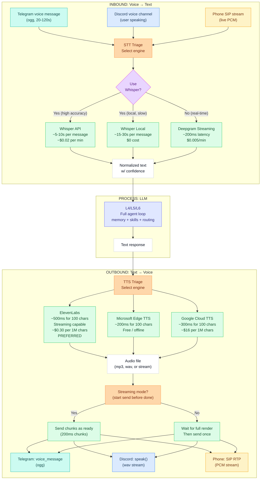
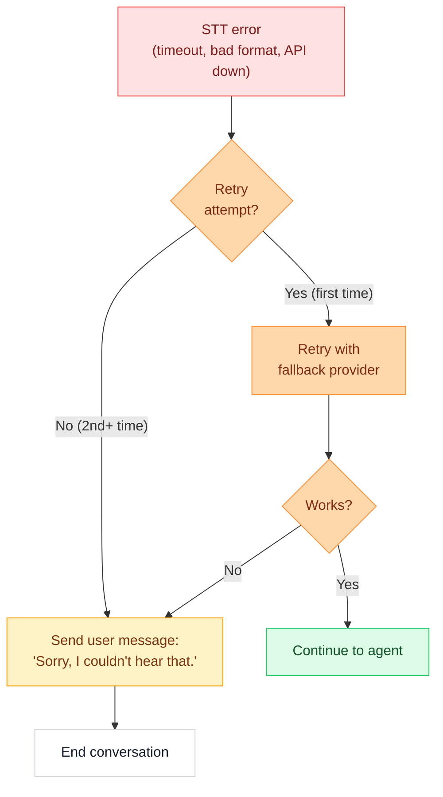
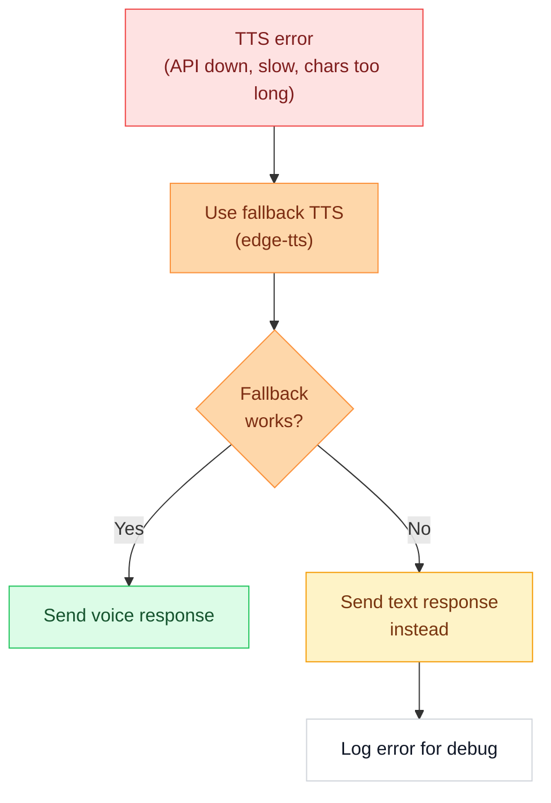

# L3 — Voice Pipeline

> Inbound STT → Agent processing → Outbound TTS across all channels. Fast, end-to-end voice communication for Telegram, Discord, and future SIP/phone integration.

---

## Overview

Crispy communicates via voice on three channels, each with different constraints and capabilities:

| Channel | Format | Latency Target | Notes |
|---|---|---|---|
| **Telegram** | Voice messages (`.ogg` Opus) | <3s total | User sends, Crispy responds with audio |
| **Discord** | Voice channel (live PCM) | <2s | Real-time conversation in channel |
| **Phone (Future)** | SIP/VoIP streams | <1s | Emergency/alert calls |

All channels funnel through the same voice pipeline: **Audio → STT → LLM text → TTS → Audio**.

---

## Full Voice Flow Diagram



---

## Per-Channel Specifics

### Telegram Voice Messages

**Format:** `.ogg` Opus codec, mono, 16-bit, 48kHz (Telegram's standard)

**Constraints:**
- Max ~3 minutes per message (Telegram limit: 20MB file size)
- User can send at any time
- Response should be voice (not text) for better UX

**Flow:**


**Config in `openclaw.json`:**

```json5
"channels": {
  "telegram": {
    "voice": {
      "enabled": true,
      "stt": "whisper-api",           // or "whisper-local", "deepgram"
      "tts": "elevenlabs",            // or "edge-tts", "google"
      "streaming": true,              // start sending before TTS finishes
      "fallback_tts": "edge-tts",    // if elevenlabs fails
      "timeout_stt": 30,              // seconds to transcribe
      "timeout_tts": 20,              // seconds to synthesize
      "voice_id": "Ember",            // ElevenLabs voice name
      "audio_format": "ogg_opus",     // Telegram native format
      "cache_voice_24h": true         // reuse same voice queries
    }
  }
}
```

---

### Discord Voice Channels

**Format:** Live PCM stream (16-bit, 48kHz stereo by default)

**Constraints:**
- Real-time streaming (not discrete files)
- Requires bot to join voice channel
- User speaks continuously
- Discord enforces voice activity detection (VAD)

**Flow:**


**Config in `openclaw.json`:**

```json5
"channels": {
  "discord": {
    "voice": {
      "enabled": true,
      "join_on_mention": false,       // or true for auto-join
      "stt": "deepgram",              // for streaming latency
      "tts": "elevenlabs",            // streaming capable
      "streaming": true,              // essential for real-time
      "vad": true,                    // voice activity detection
      "silence_timeout": 2000,        // ms to assume user done speaking
      "timeout_response": 10,         // max response duration (s)
      "voice_id": "Ember",            // ElevenLabs voice
      "audio_format": "pcm_48k",
      "channels_allowed": [
        "#general",
        "#crispy-voice",
        "DM"
      ]
    }
  }
}
```

---

### Phone/SIP (Future)

**Format:** Live PCM stream (8kHz or 16kHz, mono)

**Constraints:**
- Ultra-low latency required (<1s)
- Continuous call (not discrete messages)
- May be used for alerts/emergencies
- Need SIP server configuration (Twilio, Asterisk, etc.)

**Planned flow:**


---

## Speed Optimization

The user wants **FAST voice responses**. Here are the strategies:

### 1. Model Selection for Speed

Use smaller/faster models for voice tasks (not Opus):

| Task | Model | Latency | Tokens | Cost |
|---|---|---|---|---|
| **STT triage** | Whisper or Deepgram | 1-10s | 0 | ~$0.02-0.005/min |
| **Voice response (simple)** | flash (Haiku-class) | 0.5-1s | 100-300 | ~$0.002 |
| **Voice response (complex)** | researcher (Opus-class) | 2-3s | 500-2000 | ~$0.02 |
| **TTS synthesis** | ElevenLabs | 0.5-2s | 0 | ~$0.30/1M chars |

**Recommendation for fast voice:**
- For simple voice queries: **flash** alias (instant)
- For complex voice queries: **researcher** alias with streaming (start TTS mid-response)
- Skip memory/context on voice (voice = ephemeral)

### 2. Streaming TTS (Critical for Low Latency)

Don't wait for the full TTS response. Start sending audio to the user as soon as the first chunk is ready.

```
Agent starts generating response...
  ↓ (after 100 chars, ~200ms)
TTS starts rendering...
  ↓ (first 500ms chunk ready)
Bot sends first audio chunk to user
  ↓ (user hears sound starting ~400ms after they finished speaking)
Agent continues generating...
  ↓ (TTS continues in parallel)
...
All chunks streamed by the time agent finishes
```

ElevenLabs supports **streaming mode** — hit the `/text-to-speech` endpoint with `output_format: "mp3_stream"` and you get chunks as they're ready.

**Config:**

```json5
"voice": {
  "streaming_tts": true,
  "chunk_size_chars": 100,        // trigger TTS chunk at 100 chars
  "min_chunk_duration_ms": 500,   // ensure audio > 500ms before sending
}
```

### 3. Chunked Audio Buffering

TTS can emit audio faster than the user consumes it. Buffer smartly:

```
TTS: ▓▓▓ 500ms chunk ready
     → Buffer queue (100ms in)
     → Send to user (50ms)
     → User buffer playback (50ms into playback)

     ▓▓▓ 500ms chunk ready (total 1s now)
     → Buffer (already 400ms backlog)
     → Send to user (streaming, no pause)

Audio plays continuously without gaps.
```

### 4. Pre-buffering & Warm-up

- **Cache voice configs** at startup (one ElevenLabs test call per voice_id)
- **Warm up TTS** on first message (~300ms penalty, then ~100ms per message)
- **Pre-cache common responses** ("I didn't understand", "Processing...", "Done!")

### 5. Target Latencies

```
User speaks: ────────────┐
                         ├─ Total: <3s for simple responses
STT (Whisper): ──────┐  │
                    ├──┤
Agent (Haiku): ──┐  │  │
               ├─┤  │  │
TTS (stream):   ├────┤
                │    ├──ǃ User hears response
                     │
                   <3s target

Discord (real-time, stricter):
User speaks: ────────────┐
                         ├─ Total: <2s
STT (Deepgram): ──┐     │
                 ├─┤    │
Agent (Haiku): ─┤ ├────┤
             ├─┤ │    │
TTS (stream): ├────┤   │
              │    ├──ǃ Bot speaks back
                    <2s target
```

---

## STT Options & Configuration

### Whisper API (Recommended for Telegram)

**Pros:**
- Highest accuracy (99%+)
- Supports many languages and accents
- Relatively fast (~5-10s per message)

**Cons:**
- ~$0.02 per minute of audio
- Not real-time streaming

**Config:**

```json5
"stt": {
  "provider": "whisper-api",
  "model": "whisper-1",
  "language": "en",               // or "auto" for detection
  "temperature": 0,               // deterministic
  "cache_24h": true               // reuse same audio hashes
}
```

### Whisper Local (Budget Alternative)

**Pros:**
- Zero cost (run locally on GPU)
- Privacy (no API calls)
- Works offline

**Cons:**
- Slow (~15-30s per message on CPU, ~5-10s on GPU)
- High memory (2-3GB for medium model)
- Lower accuracy than API

**Config:**

```json5
"stt": {
  "provider": "whisper-local",
  "model": "base",                // tiny, base, small, medium, large
  "device": "cuda",               // or "cpu"
  "compute_type": "int8",         // quantization for speed
  "num_workers": 2                // parallel processing
}
```

### Deepgram (Real-time Streaming)

**Pros:**
- True streaming (200ms latency)
- Low cost (~$0.005/min)
- Built for real-time use

**Cons:**
- Slightly lower accuracy than Whisper
- Requires API key

**Config:**

```json5
"stt": {
  "provider": "deepgram",
  "model": "nova-2",              // or "nova", "enhanced"
  "language": "en",
  "encoding": "linear16",
  "sample_rate": 16000,
  "streaming": true,
  "interim_results": true,        // send partial results
  "vad": true                      // voice activity detection
}
```

---

## TTS Options & Configuration

### ElevenLabs (Recommended - Current)

**Pros:**
- Natural-sounding voice
- Streaming support (start playing before synthesis done)
- Fast (~500ms for 100 chars)
- Pre-configured in `.env`

**Cons:**
- ~$0.30 per 1 million characters
- Requires API key

**Config:**

```json5
"tts": {
  "provider": "elevenlabs",
  "api_key": "${ELEVENLABS_API_KEY}",
  "voice_id": "Ember",            // or "Bella", "Josh", etc.
  "model": "eleven_turbo_v2_5",   // fastest + quality
  "stability": 0.5,               // 0=varied, 1=consistent
  "similarity": 0.75,             // 0=clear, 1=accent match
  "style": 0.5,                   // exaggeration/emphasis
  "use_speaker_boost": true,      // louder output
  "streaming": true,              // chunk-based delivery
  "latency_optimization": "default_with_chunking",
  "output_format": "mp3_stream"   // or "wav_stream", "pcm_stream"
}
```

**Voice options:** Bella, Josh, Arnold, Adam, Sam, Ember (female), Chris, Gigi, Freya, Grace, Giovanni, Glinda (more on API docs)

### Microsoft Edge TTS (Free Fallback)

**Pros:**
- Free (no API key)
- Works offline
- ~200ms for 100 chars
- Can use on voice failures

**Cons:**
- Less natural sounding
- Requires local edge-tts package

**Config:**

```json5
"tts": {
  "provider": "edge-tts",
  "voice": "en-US-EmberNeural",   // predefined voices
  "rate": "+0%",                  // speech speed
  "volume": "+0%"
}
```

### Google Cloud TTS

**Pros:**
- Multiple voices
- ~300ms latency
- Streaming support

**Cons:**
- ~$16 per 1 million characters
- Slower than ElevenLabs

**Config:**

```json5
"tts": {
  "provider": "google-cloud",
  "api_key": "${GOOGLE_CLOUD_TTS_KEY}",
  "voice": {
    "language_code": "en-US",
    "name": "en-US-Neural2-C"
  },
  "audio_config": {
    "audio_encoding": "MP3",
    "speaking_rate": 1.0,
    "pitch": 0.0
  }
}
```

---

## Voice Response Pipeline (Lobster YAML)

File: `~/.openclaw/pipelines/voice-response.lobster`

```yaml
---
name: Voice Response Pipeline
description: |
  Handle incoming voice message (Telegram, Discord, Phone).
  STT → Agent → TTS → Send back
triggers: [voice_message]
timeout: 30s

steps:
  # Step 1: Identify channel and download audio
  - id: parse_voice
    type: exec
    command: |
      case $MESSAGE.channel in
        telegram)
          curl -s "https://api.telegram.org/bot${TELEGRAM_BOT_TOKEN}/getFile?file_id=${MESSAGE.file_id}" \
            | jq '.result.file_path' \
            | xargs -I {} curl -s -o /tmp/voice.ogg \
              "https://api.telegram.org/file/bot${TELEGRAM_BOT_TOKEN}/{}"
          echo '{"channel":"telegram","file":"/tmp/voice.ogg","format":"ogg_opus"}'
          ;;
        discord)
          # Discord already provides PCM stream via voice channel
          echo '{"channel":"discord","stream":"pcm_48k","user_id":"${MESSAGE.user_id}"}'
          ;;
      esac
    stdout_path: $parse_voice

  # Step 2: Transcribe (STT)
  - id: transcribe
    type: exec
    command: |
      case ${parse_voice.channel} in
        telegram)
          # Use Whisper API for high accuracy
          curl -s https://api.openai.com/v1/audio/transcriptions \
            -H "Authorization: Bearer ${OPENAI_API_KEY}" \
            -F "file=@${parse_voice.file}" \
            -F "model=whisper-1" \
            | jq '.text'
          ;;
        discord)
          # Use Deepgram for real-time streaming
          # (Would be a WebSocket connection, simplified here)
          deepgram transcribe --model nova-2 --stream
          ;;
      esac
    timeout: 15s
    stdout_path: $transcribe

  # Step 3: Route to Agent
  - id: agent_process
    type: exec
    command: |
      openclaw invoke \
        --text "${transcribe}" \
        --channel "${parse_voice.channel}" \
        --no-memory \
        --model "flash" \
        --max-tokens 300
    timeout: 5s
    stdout_path: $agent_process

  # Step 4: Synthesize (TTS) - Streaming
  - id: synthesize
    type: exec
    command: |
      curl -s \
        -H "Authorization: Bearer ${ELEVENLABS_API_KEY}" \
        -H "Content-Type: application/json" \
        "https://api.elevenlabs.io/v1/text-to-speech/Ember/stream" \
        -d '{
          "text": "'"${agent_process.response}"'",
          "model_id": "eleven_turbo_v2_5",
          "stream": true
        }' \
        -o /tmp/response.mp3
      file /tmp/response.mp3 | awk '{print $NF}'
    timeout: 10s
    stdout_path: $synthesize

  # Step 5: Convert to channel format
  - id: convert_audio
    type: exec
    command: |
      case ${parse_voice.channel} in
        telegram)
          # Convert mp3 to ogg_opus for Telegram
          ffmpeg -i /tmp/response.mp3 -c:a libopus -b:a 128k \
            -ac 1 -ar 48000 -f ogg /tmp/response.ogg
          file /tmp/response.ogg | awk '{print $NF}'
          ;;
        discord)
          # Keep as mp3, Discord will handle conversion
          file /tmp/response.mp3 | awk '{print $NF}'
          ;;
      esac
    stdout_path: $convert_audio

  # Step 6: Send response
  - id: send_voice
    type: exec
    command: |
      case ${parse_voice.channel} in
        telegram)
          curl -s -X POST \
            "https://api.telegram.org/bot${TELEGRAM_BOT_TOKEN}/sendVoice" \
            -F "chat_id=${MESSAGE.chat_id}" \
            -F "voice=@/tmp/response.ogg" \
            | jq '.ok'
          ;;
        discord)
          # Discord SDK sends audio to voice channel
          discord-bot --send-voice /tmp/response.mp3
          ;;
      esac
    stdout_path: $send_voice

  # Step 7: Log & cleanup
  - id: cleanup
    type: exec
    command: |
      rm -f /tmp/voice.* /tmp/response.*
      echo '{"status":"done","channel":"${parse_voice.channel}"}'
    stdout_path: $cleanup

outputs:
  status: $cleanup.status
  transcribed_text: $transcribe
  agent_response: $agent_process.response
  audio_file: $convert_audio
```

---

## Error Handling

### What if STT fails?



**Config:**

```json5
"voice": {
  "stt_retry": {
    "max_attempts": 2,
    "fallback_providers": [
      "whisper-api",
      "deepgram",
      "whisper-local"
    ],
    "timeout_escalation": [15, 30, 60]  // seconds
  },
  "stt_failure_message": "Sorry, I couldn't hear that. Could you try again?"
}
```

### What if TTS fails?



**Config:**

```json5
"voice": {
  "tts_error_handling": {
    "max_char_per_request": 1000,
    "split_on_sentence": true,
    "fallback_provider": "edge-tts",
    "fallback_to_text": true          // if all TTS fails
  }
}
```

### What if timeout?

```json5
"voice": {
  "timeouts": {
    "stt": 30,                        // abort if >30s
    "agent": 10,                      // triage mode if >10s
    "tts": 20,                        // give up if >20s
    "total": 45                       // hard cap for entire flow
  },
  "timeout_behavior": {
    "agent_timeout": "abort_and_retry_with_haiku",
    "stt_timeout": "use_fallback_provider",
    "tts_timeout": "fallback_to_text_response"
  }
}
```

---

## Cost Tracking

Track voice costs to understand usage patterns:

| Service | Unit | Cost | Formula |
|---|---|---|---|
| **Whisper API** | per minute | $0.02 | `message_duration_s / 60 * 0.02` |
| **Deepgram** | per minute | $0.005 | `message_duration_s / 60 * 0.005` |
| **ElevenLabs TTS** | per 1M chars | $0.30 | `response_chars / 1_000_000 * 0.30` |
| **Google Cloud TTS** | per 1M chars | $16.00 | `response_chars / 1_000_000 * 16.00` |

**Config for cost tracking:**

```json5
"voice": {
  "cost_tracking": {
    "enabled": true,
    "log_per_message": true,
    "aggregate_daily": true,
    "alert_on_daily_budget_threshold": 10.00  // $10/day
  }
}
```

**Sample log (daily):**

```json
{
  "date": "2026-03-02",
  "channel_voice_stats": {
    "telegram": {
      "messages_received": 42,
      "total_audio_duration_s": 180,
      "stt_provider": "whisper-api",
      "stt_cost": 0.06,
      "tts_provider": "elevenlabs",
      "tts_chars": 4200,
      "tts_cost": 0.00126,
      "total_cost": 0.06126
    },
    "discord": {
      "voice_sessions": 3,
      "total_session_duration_s": 420,
      "stt_provider": "deepgram",
      "stt_cost": 0.035,
      "tts_provider": "elevenlabs",
      "tts_chars": 8900,
      "tts_cost": 0.00267,
      "total_cost": 0.03767
    }
  },
  "daily_total_cost": 0.09893,
  "monthly_projection": 2.97
}
```

---

## Caching & Optimization

### Voice Message Caching (24h)

Telegram: Cache downloaded `.ogg` files by `file_id` hash to avoid re-downloading if user forwards same message.

```
~/.openclaw/workspace/media/inbound/voice/
├── telegram-20260302-a1b2c3d4.ogg
├── telegram-20260302-e5f6g7h8.ogg
└── {channel}-{date}-{hash}.ogg
```

### TTS Response Caching

Cache common responses:
- "I'm processing that..."
- "I didn't understand..."
- "Done!"
- "Processing voice..."

These get pre-rendered at startup.

### Model Warm-up

On service start, make one test call to each TTS provider to measure actual latency (cache is slower than raw latency metrics).

---

## Monitoring & Observability

**Log every voice interaction:**

```json
{
  "timestamp": "2026-03-02T14:23:15.234Z",
  "message_id": "tg_msg_12345",
  "channel": "telegram",
  "event": "voice_inbound",
  "audio_duration_s": 8.5,
  "audio_format": "ogg_opus",
  "file_size_bytes": 12400
}
```

```json
{
  "timestamp": "2026-03-02T14:23:21.456Z",
  "message_id": "tg_msg_12345",
  "event": "stt_complete",
  "provider": "whisper-api",
  "duration_ms": 4200,
  "confidence": 0.98,
  "text": "what's the weather tomorrow",
  "cost": 0.003
}
```

```json
{
  "timestamp": "2026-03-02T14:23:24.678Z",
  "message_id": "tg_msg_12345",
  "event": "agent_response",
  "model": "flash",  // alias — see [[stack/L2-runtime/config-reference]]
  "tokens": 48,
  "duration_ms": 1200,
  "response_text": "Tomorrow will be sunny..."
}
```

```json
{
  "timestamp": "2026-03-02T14:23:26.901Z",
  "message_id": "tg_msg_12345",
  "event": "tts_complete",
  "provider": "elevenlabs",
  "voice_id": "Ember",
  "duration_ms": 3200,
  "chars_synthesized": 35,
  "cost": 0.0000105,
  "output_format": "mp3_stream"
}
```

```json
{
  "timestamp": "2026-03-02T14:23:28.901Z",
  "message_id": "tg_msg_12345",
  "event": "voice_complete",
  "channel": "telegram",
  "total_latency_ms": 13667,
  "breakdown": {
    "download_ms": 200,
    "stt_ms": 4200,
    "agent_ms": 1200,
    "tts_ms": 3200,
    "upload_ms": 400,
    "overhead_ms": 4467
  },
  "cost_total": 0.00414
}
```

---

## Troubleshooting

| Problem | Cause | Fix |
|---|---|---|
| **Voice response is slow (>5s)** | Using Opus instead of Haiku; STT timeout | Switch to Haiku for voice; use Deepgram for real-time |
| **TTS audio is robotic** | Low stability or wrong voice_id | Increase stability to 0.75; try different voice |
| **Telegram audio not playing** | Wrong format (not ogg_opus) | Ensure ffmpeg is converting to ogg_opus |
| **Discord latency >3s** | Using Whisper API instead of Deepgram | Switch Discord to Deepgram for streaming STT |
| **"Sorry, I couldn't hear that" loop** | STT is failing silently | Check API keys; test Whisper/Deepgram directly |
| **TTS costs spike** | High-volume voice usage; long responses | Implement response caching; limit voice response length |

---

## Future: Advanced Voice Features

- **Voice activity detection (VAD)** on Discord voice channels (know when user stops speaking)
- **Emotion detection** from voice (pause if user sounds upset)
- **Multi-language** voice (auto-detect + respond in same language)
- **Voice cloning** (user speaks → match their voice in TTS)
- **Accent preservation** (detect user accent → match in TTS)
- **Noise filtering** (improve STT accuracy on noisy channels)

---


## Voice Setup & Configuration Guide

> Step-by-step setup for voice STT/TTS across all channels. Config examples, error handling, cost tracking.

### Quick Setup Checklist

#### Prerequisites

- [ ] OpenAI API key (for Whisper STT)
- [ ] ElevenLabs API key (for TTS)
- [ ] ffmpeg installed (`brew install ffmpeg` or apt)
- [ ] Python 3.9+ with `pydub`, `openai`, `elevenlabs` packages

#### Installation

```bash
pip install openai elevenlabs pydub
# For Deepgram (optional):
pip install deepgram-sdk
# For local Whisper:
pip install openai-whisper
```

#### Telegram Voice Setup

```bash
# 1. Add keys to .env
echo "OPENAI_API_KEY=sk-..." >> .env
echo "ELEVENLABS_API_KEY=..." >> .env

# 2. Update openclaw.json with voice config
cat >> openclaw.json << 'JSON'
"channels": {
  "telegram": {
    "voice": {
      "enabled": true,
      "stt": "whisper-api",
      "tts": "elevenlabs",
      "streaming": true,
      "fallback_tts": "edge-tts",
      "timeout_stt": 30,
      "timeout_tts": 20,
      "voice_id": "Ember",
      "audio_format": "ogg_opus",
      "cache_voice_24h": true
    }
  }
}
JSON

# 3. Test voice with a message
```

#### Discord Voice Setup

```bash
# Add to openclaw.json:
cat >> openclaw.json << 'JSON'
"channels": {
  "discord": {
    "voice": {
      "enabled": true,
      "join_on_mention": false,
      "stt": "deepgram",
      "tts": "elevenlabs",
      "streaming": true,
      "vad": true,
      "silence_timeout": 2000,
      "timeout_response": 10,
      "voice_id": "Ember",
      "audio_format": "pcm_48k",
      "channels_allowed": ["#general", "#crispy-voice", "DM"]
    }
  }
}
JSON
```

### Test Commands

```bash
# Test Whisper API
curl -s https://api.openai.com/v1/audio/transcriptions \
  -H "Authorization: Bearer $OPENAI_API_KEY" \
  -F "file=@/path/to/audio.ogg" \
  -F "model=whisper-1" | jq '.text'

# Test ElevenLabs TTS
curl -s "https://api.elevenlabs.io/v1/text-to-speech/Ember/stream" \
  -H "Authorization: Bearer $ELEVENLABS_API_KEY" \
  -H "Content-Type: application/json" \
  -d '{"text":"hello world","model_id":"eleven_turbo_v2_5"}' \
  -o test.mp3 && file test.mp3

# Test Deepgram
deepgram listen --model nova-2 /path/to/audio.wav

# Test local Whisper
python -m openai_whisper /path/to/audio.ogg --model base --device cuda
```

---

**Up →** [[stack/L3-channel/_overview]]
**Related →** [[stack/L1-physical/media]]
**Related →** [[stack/L6-processing/pipelines/media]]
**Back →** [[stack/_overview]]
