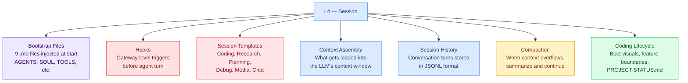
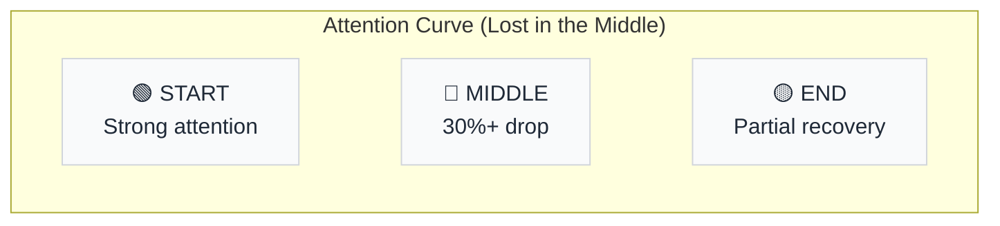
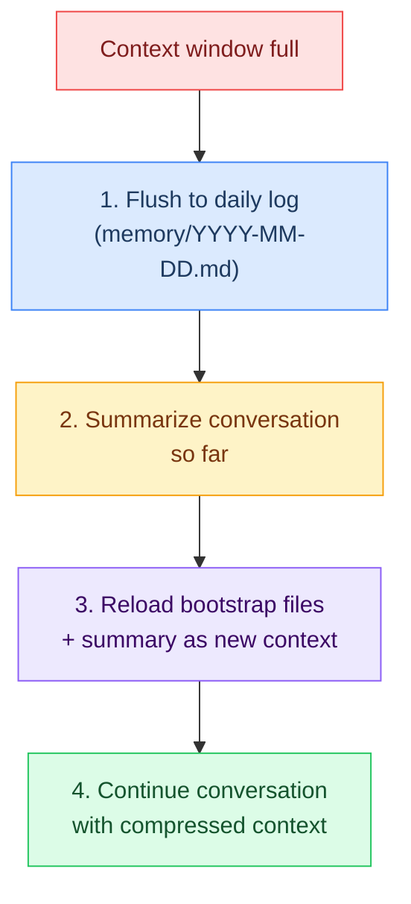
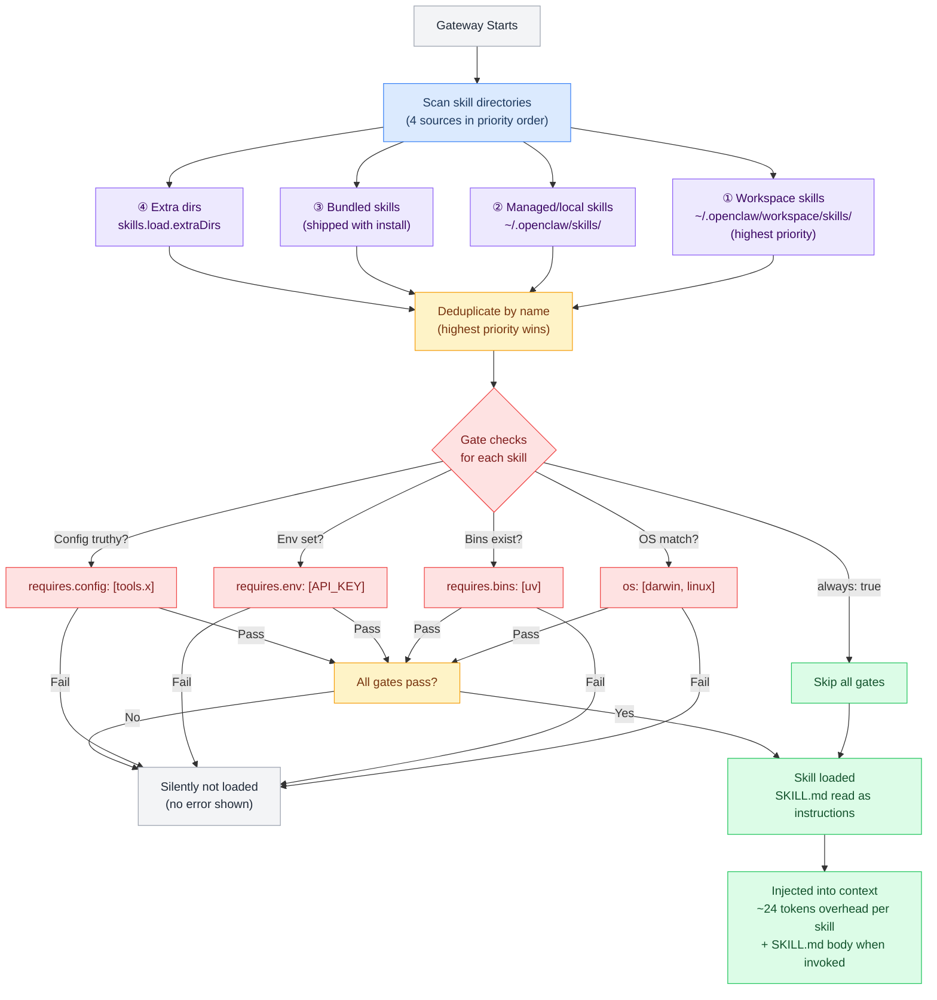
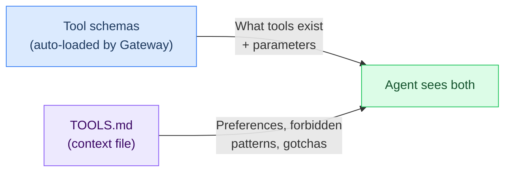
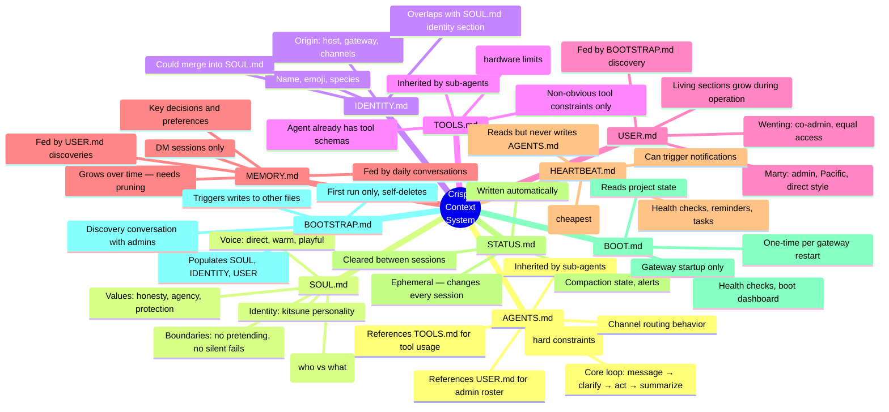
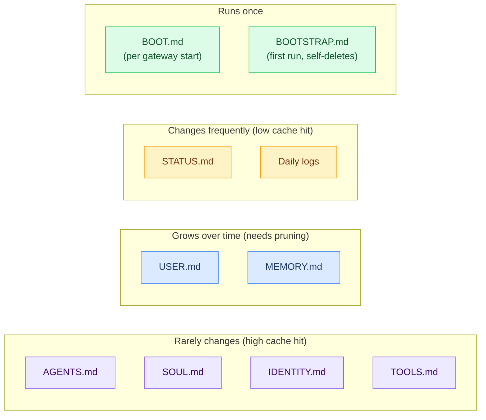

# L4 — Session Layer

> What Crispy knows right now. Context window assembly, bootstrap file injection, session history, compaction, and hooks. This is the "working memory" — everything loaded into the LLM's context for this conversation turn.

**OSI parallel:** Session (partial) — while L3 manages the channel connection, L4 manages the conversation state.

## Contents

- [[#What's at This Layer]] · `flowchart`
- [[#Context Assembly Order]] · `flowchart`
  - [[#Full Injection Order]] · `flowchart`
  - [[#Why This Order Matters]] · `flowchart`
- [[#Hooks]]
- [[#Bootstrap Files]]
- [[#Bootstrap Failure Modes]]
- [[#Session Templates]]
- [[#Coding Session Lifecycle]]
- [[#Compaction]] · `flowchart`
- [[#Pages in This Layer]]
- [[#Token Budget (Authoring Targets)]]
- [[#Tool and Skill Loading]] · `flowchart`
  - [[#How TOOLS.md Fits In]] · `flowchart`
- [[#Context File Relationships]]
  - [[#Dependency Mind Map]] · `mindmap`
  - [[#Data Flow Between Files]] · `flowchart`
  - [[#File Lifecycle]] · `flowchart`
- [[#Layer Boundary]]
- [[#L4 File Review (Live)]]

---

## What's at This Layer



Bootstrap files, hooks, session templates, context assembly, session history, compaction, and coding lifecycle.

---

## Context Assembly Order

When a new message arrives, L4 assembles the context window in this order:

### Full Injection Order

```mermaid
flowchart TD
    MSG["Message arrives<br>from L3 Channel"]:::gray
    MSG --> HOOK{"Hook<br>triggered?"}:::red
    HOOK -->|Yes| HOOKRUN["Run hook pipeline<br>(zero LLM tokens)"]:::red
    HOOK -->|No| INJECT
    HOOKRUN --> INJECT["Begin context assembly"]:::blue

    subgraph BOOTSTRAP["Bootstrap Files (always loaded)"]
        direction TB
        B1["① AGENTS.md<br>Operating contract<br>~2,000 tok budget"]:::purple
        B2["② SOUL.md<br>Personality & values<br>~600 tok"]:::purple
        B3["③ TOOLS.md<br>Tool constraints<br>~600 tok"]:::purple
        B4["④ IDENTITY.md<br>Name, emoji, origin<br>~400 tok"]:::purple
        B5["⑤ USER.md<br>Admin profiles<br>~400 tok"]:::purple
        B1 --> B2 --> B3 --> B4 --> B5
    end

    INJECT --> B1

    B5 --> DMCHECK{"DM session?"}:::amber
    DMCHECK -->|Yes| B6["⑥ MEMORY.md<br>Curated long-term facts<br>~800 tok"]:::blue
    DMCHECK -->|No| B7

    B6 --> B7["⑦ Daily logs<br>Today + yesterday"]:::blue
    B7 --> B8["⑧ Session history<br>Prior conversation turns"]:::blue
    B8 --> B9["⑨ Current message<br>User's prompt"]:::green
    B9 --> READY["Context window ready<br>→ Pass to L5 Routing"]:::green

    classDef gray fill:#f3f4f6,stroke:#9ca3af,color:#1f2937
    classDef red fill:#fee2e2,stroke:#ef4444,color:#7f1d1d
    classDef blue fill:#dbeafe,stroke:#3b82f6,color:#1e3a5f
    classDef purple fill:#ede9fe,stroke:#8b5cf6,color:#3b0764
    classDef amber fill:#fef3c7,stroke:#f59e0b,color:#78350f
    classDef green fill:#dcfce7,stroke:#22c55e,color:#14532d
```



### Why This Order Matters



| Position | What Goes Here | Why |
|----------|---------------|-----|
| **First** (① AGENTS) | Safety rules, core loop | Strongest attention — never missed |
| **Early** (②-⑤) | Personality, tools, identity, user | Stable context, high cache hit rate |
| **Middle** (⑥-⑦) | Memory, daily logs | Variable content, lower attention |
| **Last** (⑧-⑨) | History + current message | Recency boost helps here |

### Special Injection Events

| Event | What's Injected | When |
|-------|----------------|------|
| **Gateway boot** | BOOT.md | Once at startup |
| **First run** | BOOTSTRAP.md | Once ever (self-deletes) |
| **Heartbeat** | HEARTBEAT.md | Every 20min (flash model) |
| **Compaction** | All bootstrap files + summary | When context window fills |
| **Sub-agent** | AGENTS.md + TOOLS.md | Inherited by coding agent |

---

## Hooks

Hooks fire at the gateway level **before** the agent session starts. They run deterministic Lobster pipelines with zero LLM tokens. Hooks are the primary defense layer for tasks that should always happen (like media sorting).

| Hook | Trigger | Pipeline | What It Does |
|---|---|---|---|
| **media-sort** | `message.inbound` + `hasAttachment` | `media-sort.lobster` | Routes media by MIME type, quarantines unknowns |
| **Gmail webhook** | `POST /webhook/gmail` | `email.lobster` | Receives inbound email via Pub/Sub |

**Config:**
```json5
"hooks": {
  "enabled": true,
  "entries": {
    "media-sort": {
      "on": "message.inbound",
      "condition": "message.hasAttachment",
      "kind": "lobster",
      "pipeline": "pipelines/media-sort.lobster"
    }
  }
}
```

**Hook lifecycle:** Configured in L2 (config) → triggered at L3 (channel receives message) → pipeline runs at L6 (processing) → results available before L4 assembles context.

**Why hooks matter:** The agent can forget AGENTS.md instructions under context pressure. Hooks are gateway-level and can't forget — they fire every time. See [[stack/L1-physical/media]] for the full 4-layer defense (hook → agent → boot → cron).

---

## Bootstrap Files

9 files that define how Crispy operates. Injected from `~/.openclaw/workspace/`. Each has its own deep-dive doc:

| # | File | Deep Dive | Injected When | Subagents? | What It Does |
|---|---|---|---|---|---|
| 1 | **AGENTS.md** | [[stack/L4-session/bootstrap]] | Every session | Yes | Operating contract — core loop, priorities, safety, routing |
| 2 | **SOUL.md** | [[stack/L4-session/bootstrap]] | Every session | No | Personality, values, communication style |
| 3 | **TOOLS.md** | [[stack/L4-session/bootstrap]] | Every session | Yes | Available tools, limits, usage patterns |
| 4 | **IDENTITY.md** | [[stack/L4-session/bootstrap]] | Every session | No | Name (Crispy), emoji, appearance, vibe |
| 5 | **USER.md** | [[stack/L4-session/bootstrap]] | Every session | No | Personal info about Marty + Wenting |
| 6 | **MEMORY.md** | [[stack/L7-memory/memory-search]] | DM sessions only | No | Curated long-term facts |
| 7 | **HEARTBEAT.md** | [[stack/L4-session/bootstrap]] | Every 20min | No | System health pulse |
| 8 | **Daily Logs** | [[stack/L4-session/daily-logs]] | Every session | No | Session journal (today + yesterday) |
| 9 | **BOOTSTRAP.md** | [[stack/L4-session/bootstrap]] | First run only | No | First-boot setup instructions |
| — | **BOOT.md** | [[stack/L4-session/bootstrap]] | Gateway startup | No | Startup hook + project dashboard |

**Size limits:** 20,000 chars/file, 150,000 chars total across all bootstrap files.

**Current state:** `skipBootstrap: true` — must flip after writing files.

**Config & limits →** [[stack/L4-session/bootstrap]]

---

## Bootstrap Failure Modes

Each bootstrap file can fail to load. Here's what breaks and how bad it is:

| File | If Missing/Broken | Severity | What Happens | Recovery |
|---|---|---|---|---|
| **AGENTS.md** | No operating rules | 🔴 Critical | Agent has no workflow, no routing rules, no safety constraints | Agent acts as raw LLM — dangerous in group chats |
| **SOUL.md** | No personality | 🟡 Medium | Responses are generic, no kitsune personality | Functional but impersonal |
| **TOOLS.md** | No tool awareness | 🟠 High | Agent doesn't know what tools it has, may fail to use them | Tools still exist but agent doesn't leverage them well |
| **IDENTITY.md** | No name/emoji | 🟢 Low | Agent doesn't know it's "Crispy", uses generic identity | Still works, just unnamed |
| **USER.md** | No admin context | 🟡 Medium | Doesn't know Marty or Wenting, can't personalize | Treats everyone as unknown |
| **MEMORY.md** | No long-term memory | 🟡 Medium | Can't recall past decisions, facts, preferences | Short-term still works |
| **HEARTBEAT.md** | No pulse check | 🟢 Low | No periodic health monitoring | System still runs |
| **BOOTSTRAP.md** | First-run skipped | 🟢 Low | Only matters on very first boot | Won't affect running system |
| **BOOT.md** | No startup hook | 🟡 Medium | No health check, no boot visual, no project context | Agent works but starts blind |

**Guide →** [[stack/L4-session/bootstrap]] for how to write, test, and recover each file.

---

## Session Templates

Different session types load different contexts and show different boot visuals:

| Template | Trigger | Extra Context | Focus |
|---|---|---|---|
| **Coding** | "Let's code", active branch | PROJECT-STATUS.md, git status | Code tools, exec, git |
| **Research** | "Research [X]", "investigate" | Prior research notes | Web search, citations |
| **Planning** | "Let's plan", "design" | Open questions, decisions log | Structure, decision trees |
| **Debug** | "Something broke", errors detected | Gateway logs, doctor output | Systematic diagnosis |
| **Media** | Bulk upload, quarantine pending | Media stats, quarantine count | File operations, metadata |
| **Chat** | Default / casual | Standard bootstrap only | General purpose |

**Details →** [[stack/L4-session/sessions]]

---

## Coding Session Lifecycle

For coding sessions, Crispy manages feature boundaries: when to start fresh, how to track progress between sessions, and boot visuals that show where you left off.

**Details →** [[stack/L4-session/sessions]]

---

## Compaction

When the context window fills up, OpenClaw triggers compaction:



### What Survives Compaction

| Survives | Source | Notes |
|----------|--------|-------|
| All bootstrap files | Reloaded fresh | AGENTS, SOUL, TOOLS, etc. |
| Conversation summary | Generated by LLM | Compressed version of full chat |
| STATUS.md carried forward | Written before compaction | Critical facts buffer |
| Daily log entry | Flushed before compaction | Full conversation preserved |

| Lost | Recovery |
|------|----------|
| Full conversation turns | Read from daily log via memory search |
| In-context tool results | Re-run if needed |
| Nuance and detail | Summary captures key points only |

Memory is flushed BEFORE compaction to prevent data loss.

---

## Pages in This Layer

| Page | Covers |
|---|---|
| [[context-assembly]] | Full context assembly logic |
| [[stack/L4-session/sessions]] | Session lifecycle, compaction, templates, coding lifecycle, JSONL format |
| [[stack/L4-session/bootstrap]] | Bootstrap config, dependency graph, checklist (legacy deep-dive) |
| [[stack/L4-session/daily-logs]] | Daily log system, format, injection |
| [[stack/L4-session/CHANGELOG]] | Layer changelog — all L4 changes by date |
| [[stack/L4-session/cross-layer-notes]] | Cross-layer notes from L4 sessions |

## Token Budget (Authoring Targets)

> **Two budget systems exist — don't confuse them.**
> - **Authoring targets** (this table): How many tokens each context file's *static content* should aim for. These are the file-size targets you write to.
> - **Window allocations** (in [[context-assembly]]): How much of the 150K context window each file can *occupy at runtime*, including dynamic content, retrieved memories, and conversation history. Window allocations are much larger because they include runtime-injected content beyond the static file.
>
> Example: AGENTS.md has a 2,000 token authoring target (keep the file under 2K), but an 8,000 token window allocation (at runtime, agent instructions + dynamic rules can expand to 8K).

| File | Source | Max Tokens | Max Chars | Current Tokens | Current Chars | Injection |
|------|--------|-----------|-----------|----------------|---------------|-----------|
| AGENTS.md | [[stack/L4-session/context-files/agents]] | 2,000 | 8,000 | ~994 | 3,977 | Every session + subagents |
| SOUL.md | [[stack/L4-session/context-files/soul]] | 600 | 2,400 | ~770 | 3,081 | Every session |
| IDENTITY.md | [[stack/L4-session/context-files/identity]] | 400 | 1,600 | ~434 | 1,736 | Every session |
| TOOLS.md | [[stack/L4-session/context-files/tools]] | 600 | 2,400 | ~499 | 1,999 | Every session + subagents |
| USER.md | [[stack/L4-session/context-files/user]] | 400 | 1,600 | ~551 | 2,206 | Every session |
| MEMORY.md | [[stack/L4-session/context-files/memory]] | 800 | 3,200 | ~463 | 1,854 | DM sessions only |
| HEARTBEAT.md | [[stack/L4-session/context-files/heartbeat]] | 300 | 1,200 | ~485 | 1,941 | Every 20min (flash model) |
| STATUS.md | [[stack/L4-session/context-files/status]] | 300 | 1,200 | ~265 | 1,063 | Every session |
| BOOT.md | [[stack/L4-session/context-files/boot]] | 300 | 1,200 | ~369 | 1,477 | Gateway startup only |
| BOOTSTRAP.md | [[stack/L4-session/context-files/bootstrap]] | 400 | 1,600 | ~407 | 1,629 | First run only (self-deletes) |
| **Total** | | **~6,100** | **~24,400** | **~5,237** | **~20,963** | |

> **Note:** Current Tokens/Chars measured 2026-03-04. Run `wc -c stack/L4-session/context-files/*.md` to update. Several files exceed authoring targets — particularly SOUL.md (770 tok vs 600 target) and agents.md (994 tok vs 2,000 target — headroom available).

**Context file registry →** [[stack/L4-session/config-reference]] — block IDs, assembly order, token budgets

**Legacy deep-dive (being decomposed):** [[stack/L4-session/bootstrap]]

---

## Tool and Skill Loading

Tools and skills are discovered, gated, and loaded when the gateway starts.

### Discovery & Gate Checking



### How TOOLS.md Fits In

TOOLS.md does **not** control which tools are loaded — that's handled by `openclaw.json` and the gate system above. TOOLS.md only tells the agent **how to use** its tools differently than the default:



Key insight: The agent already knows what tools it has (from schemas). TOOLS.md only adds non-obvious constraints — like "prefer IBKR API over web scraping for market data."

---

## Context File Relationships

### Dependency Mind Map



### Data Flow Between Files

```mermaid
flowchart TD
    BOOTSTRAP["BOOTSTRAP.md<br>(first run)"]:::amber
    BOOTSTRAP -->|"Discovers preferences"| USER["USER.md"]:::purple
    BOOTSTRAP -->|"Calibrates personality"| SOUL["SOUL.md"]:::purple
    BOOTSTRAP -->|"Fills identity card"| IDENTITY["IDENTITY.md"]:::purple

    CONVERSATIONS["Daily conversations"]:::gray
    CONVERSATIONS -->|"Durable facts"| MEMORY["MEMORY.md"]:::blue
    CONVERSATIONS -->|"New preferences"| USER
    CONVERSATIONS -->|"Session journal"| DAILY["Daily logs"]:::blue

    HEARTBEAT["HEARTBEAT.md<br>(every 20min)"]:::green
    HEARTBEAT -->|"Health alerts"| STATUS["STATUS.md"]:::green
    HEARTBEAT -->|"Pending reminders"| MEMORY

    COMPACTION["Compaction event"]:::red
    COMPACTION -->|"Flush to"| DAILY
    COMPACTION -->|"Carry forward"| STATUS

    AGENTS["AGENTS.md<br>(operating contract)"]:::purple
    AGENTS -->|"Rules cascade to"| SUBAGENT["Sub-agents<br>(crispy-code)"]:::gray
    TOOLS["TOOLS.md"]:::purple
    TOOLS -->|"Constraints cascade to"| SUBAGENT

    classDef gray fill:#f3f4f6,stroke:#9ca3af,color:#1f2937
    classDef purple fill:#ede9fe,stroke:#8b5cf6,color:#3b0764
    classDef blue fill:#dbeafe,stroke:#3b82f6,color:#1e3a5f
    classDef amber fill:#fef3c7,stroke:#f59e0b,color:#78350f
    classDef green fill:#dcfce7,stroke:#22c55e,color:#14532d
    classDef red fill:#fee2e2,stroke:#ef4444,color:#7f1d1d
```



### File Lifecycle



---

**Guides:**

| Page | Covers |
|---|---|
| [[stack/L4-session/sessions]] | Sessions guide |

---

## Layer Boundary

**L4 receives from L3:** A normalized message with channel context. Hooks may have already fired at gateway level before L4 sees the message.

**L4 provides to L5:** A fully assembled context window (bootstrap + memory + history + current message) ready for classification.

**If L4 breaks:** Crispy responds but has no memory, no personality, no operating rules. Check `skipBootstrap` flag, file permissions, workspace path.

---

## L4 File Review (Live)

```dataview
TABLE WITHOUT ID
  file.link AS "File",
  choice(contains(file.frontmatter.tags, "status/finalized"), "✅",
    choice(contains(file.frontmatter.tags, "status/review"), "🔍",
      choice(contains(file.frontmatter.tags, "status/planned"), "⏳", "📝"))) AS "Status",
  choice(contains(file.frontmatter.tags, "type/guide"), "Guide",
    choice(contains(file.path, "bootstrap"), "Bootstrap", "Core")) AS "Type",
  dateformat(file.mtime, "yyyy-MM-dd") AS "Last Modified"
FROM "stack/L4-session"
WHERE file.name != "_overview"
SORT choice(contains(file.frontmatter.tags, "type/guide"), "Z", "A") ASC, file.name ASC
```

> **Note:** Bootstrap file docs (agents-md, soul-md, etc.) describe what goes in each workspace file. The actual `.md` files have not been written to `~/.openclaw/workspace/` yet — that's the next implementation step after review.

**Legend:** ✅ Finalized · 🔍 Review · 📝 Draft · ⏳ Planned

---

**Up →** [[stack/L5-routing/_overview]]
**Down →** [[stack/L3-channel/_overview]]
**Back →** [[stack/_overview]]
