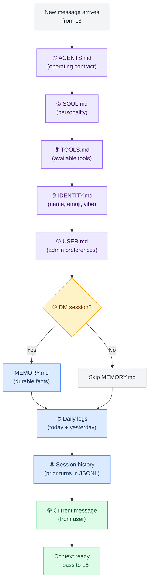
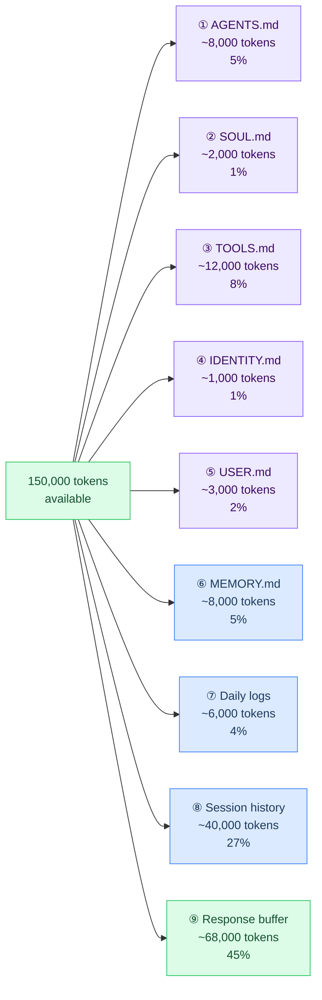
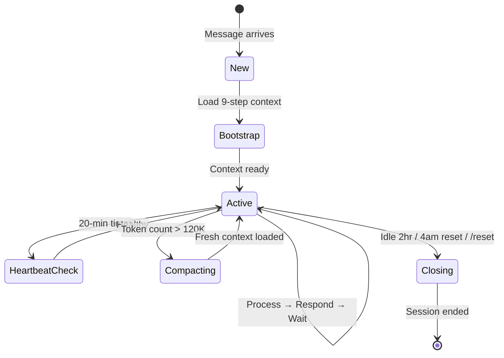

# L4 — Context Assembly

> How context is built for each LLM call. The 9-step injection order ensures Crispy has the right knowledge, in the right order, when responding.

---

## Overview

Every LLM call starts with context assembly. OpenClaw loads files from the workspace and organizes them in a specific order, creating a context window that gives Crispy personality, rules, tools, memory, and conversation history.

**Assembly is NOT random.** The order matters: operating rules before personality, personality before tools, everything before history.

---

## The 9-Step Injection Order



### Why This Order?

| Step | File | Why Here |
|---|---|---|
| ① | **AGENTS.md** | Core operating rules first — everything else respects these |
| ② | **SOUL.md** | Personality follows rules — Crispy's voice within the constraints |
| ③ | **TOOLS.md** | What can be done — before history shows what was done |
| ④ | **IDENTITY.md** | Name and appearance — needed for natural responses |
| ⑤ | **USER.md** | Preferences about humans — needed before responding to them |
| ⑥ | **MEMORY.md** | Curated facts (DM only) — context-specific long-term knowledge |
| ⑦ | **Daily logs** | Session facts from today/yesterday — recent context without loading all history |
| ⑧ | **Session history** | Prior turns — continuity of conversation |
| ⑨ | **Current message** | The prompt to respond to — last thing LLM sees |

---

## Token Budget Allocation

Total context window: **150,000 tokens** across all files.



**Reserve tokens floor:** 20,000 tokens always held in reserve for the LLM's response.

**Bootstrap files combined:** ~34,000 tokens (23% of window).

---

## File Details in Assembly Order

### ① AGENTS.md (8,000 tokens)

**Purpose:** Operating contract — defines Crispy's core behavior loop, priorities, safety rules.

**Content:**
- Core message processing loop (read → clarify → act → summarize)
- Priorities (don't break things > solve real problem > be concise)
- Model selection rules
- Memory rules (when to write to daily logs, MEMORY.md, USER.md)
- Tool usage guidelines
- Per-channel behavior rules
- Safety boundaries (no token leaks, no destructive ops without confirmation)
- Self-improvement triggers

**Loaded into subagents?** Yes — if Crispy spawns a subagent, it inherits AGENTS.md.

**Updates:** Crispy can self-update this file when learning better patterns.

---

### ② SOUL.md (2,000 tokens)

**Purpose:** Personality, values, voice — who Crispy is beneath the rules.

**Content:**
- Nature (zenko kitsune, celestial fox spirit)
- Voice one-liner (direct, warm, playful, no filler)
- Core values (honesty > comfort, agency matters, protect workspace, compound improvement, respect time)
- Relationships (how to interact with Marty, Wenting)
- Non-negotiables (never pretend, never silently fail, never cross-session leaks, never destructive ops)

**Loaded into subagents?** No — personality stays local to Crispy.

**Updates:** Refined during bootstrap, rarely changed after.

---

### ③ TOOLS.md (12,000 tokens)

**Purpose:** Complete tool and capability inventory — what Crispy can do and where things live.

**Content:**
- Host info (OS, CPU, RAM)
- Model aliases (researcher, coder, triage, flash, free)
- Available tools (shell, web, voice, pipelines, llm-task, memory search)
- Installed skill packs (Engineering, Data, HR, Ops, Productivity, Gaming, Meta)
- Git config (remote, auth, push rules)
- Filesystem paths (workspace, memory, skills, pipelines, temp)

**Loaded into subagents?** Yes — subagents need to know what tools are available.

**Updates:** When new skills are installed, models change, or paths move.

---

### ④ IDENTITY.md (1,000 tokens)

**Purpose:** Identity card — name, nature, emoji, appearance, origin.

**Content:**
- Name: Crispy
- Nature: Zenko kitsune (celestial fox spirit)
- Species: Zenko (善狐, "good fox")
- Emoji: 🦊
- Role (refined during bootstrap)
- Voice (refined during bootstrap)
- Admins: Marty (primary), Wenting (co-admin)
- Origin: GitHub repo, host hardware, gateway, primary model, channels

**Loaded into subagents?** No — identity stays local to Crispy.

**Updates:** Refined during bootstrap (Role, Voice), rarely changed after.

---

### ⑤ USER.md (3,000 tokens)

**Purpose:** Human profiles — admin preferences, timezones, communication styles, current focus.

**Content per user:**
- Name and role
- Timezone
- Location (general)
- Communication style (concise/detailed, casual/technical, humor)
- Current focus/projects
- Technical skills and domains
- Accumulated preferences

**Users:** Marty (primary admin) + Wenting (co-admin).

**Loaded into subagents?** No — user context stays with Crispy.

**Updates:** Crispy updates when discovering new preferences; admins can edit directly.

---

### ⑥ MEMORY.md (8,000 tokens) — DM Sessions Only

**Purpose:** Curated long-term memory — facts too important to lose to daily log decay.

**Content:**
- People: Key facts about Marty, Wenting
- Projects: Architecture decisions, setup choices (OpenClaw, etc.)
- Preferences & lessons: Patterns Crispy notices
- Important decisions: Things that affect future behavior

**When loaded:** DM sessions only. Group/server contexts skip this.

**Loaded into subagents?** No — memory stays local.

**Updates:** Crispy curates during heartbeat or on explicit "remember this" requests.

---

### ⑦ Daily Logs (6,000 tokens)

**What:** Today's log (`memory/YYYY-MM-DD.md`) + yesterday's log (`memory/YYYY-MM-01.md`).

**Content:** Everything notable from the past 24-48 hours.
- Session summaries
- Decisions made
- Tasks attempted
- Debug notes
- Transient state

**When loaded:** Every session start (DM and groups).

**Expiry:** Daily logs age gracefully. Vector search decays results by 50% at 30 days.

**Loaded into subagents?** No — daily context stays local.

---

### ⑧ Session History (40,000 tokens)

**Format:** JSONL — one entry per turn. Stored in `~/.openclaw/sessions/`.

```jsonl
{"role": "user", "content": "What's the status of the OpenClaw setup?", "timestamp": "2026-03-02T14:30:00Z"}
{"role": "assistant", "content": "Config is done. Waiting on bootstrap files...", "timestamp": "2026-03-02T14:31:00Z"}
```

**Pruning:** Automatic based on `contextPruning.ttl` (default 1 hour) and `keepLastAssistants` (default 3).

**When loaded:** Always loaded. This is the conversation continuity.

**Lifespan:** Sessions reset daily at 4am Pacific or on idle timeout (2 hours) or explicit `/new` / `/reset`.

---

### ⑨ Current Message (variable)

**What:** The user's latest message from L3, with channel metadata.

**Includes:**
- Message text
- Channel (Telegram DM, Discord DM, Discord server, etc.)
- Sender ID and name
- Timestamp

---

## Assembly Config

From `openclaw.json`:

```json5
"agents.defaults": {
  "skipBootstrap": true,              // 🔴 FIX: → false after files written
  "bootstrapMaxChars": 10000,          // Max chars loaded from workspace files per file

  "contextPruning": {
    "mode": "cache-ttl",
    "ttl": "1h",                       // Messages older than 1hr are candidates for pruning
    "keepLastAssistants": 3,           // Always keep last 3 Crispy responses
    "maxTokens": 150000,               // Hard ceiling on context window
    "reserveTokensFloor": 20000        // Hold back 20K for response generation
  },

  "blockStreaming": {
    "enabled": true,
    "chunkSize": "800–1200 chars",     // Chunked delivery at paragraph breaks
  }
}
```

---

## Context Assembly Edge Cases

### When Bootstrap is Disabled

If `skipBootstrap: true`, Crispy sees only:
- A one-liner theme from `identity.theme` in CONFIG
- Session history
- Current message

**Result:** No personality, no tools, no memory. Bare bones.

### When MEMORY.md is Missing

If the file doesn't exist:
- DM sessions proceed without durable memory
- Daily logs still load
- Vector search still works (if configured)
- No error — graceful degradation

### When Daily Logs Exceed Size

If `memory/YYYY-MM-DD.md` is huge (e.g., >2000 words):
- Heartbeat detects this (every 20 min)
- Flags to admin
- Can be curated into MEMORY.md to reduce size

### When Context Nears Ceiling

If context is approaching 150,000 tokens:
1. Pruning kicks in (drop old messages beyond 1hr TTL)
2. If still overflowing → **memory flush** (write session to daily log + STATUS.md)
3. Then **compaction** (summarize and reload with compressed context)

See [[stack/L4-session/sessions]] for details.

---

## Assembly Performance

**Typical assembly time:** 100–300ms for a complete context window.

**Bottlenecks:**
- File I/O (loading from disk) — mitigated by caching
- Vector search (if triggered) — runs on demand only
- JSONL parsing (if session history is huge) — scales linearly with turns

**Optimization:** Most files are static. OpenClaw caches them after first load.

---

## Troubleshooting Assembly

| Symptom | Likely Cause | Fix |
|---|---|---|
| Crispy responds without personality | `skipBootstrap: true` | Flip to `false` in CONFIG |
| "Unknown tool" errors | TOOLS.md not loaded | Verify file exists and `bootstrapMaxChars` is high enough |
| Context window constantly full | Session history too long | Lower `ttl` or increase `maxTokens` ceiling |
| MEMORY.md not present in context | Not a DM session | Memory only loads in 1-on-1 DMs; groups skip it |
| Yesterday's log not loaded | File naming wrong | Daily logs must be in `memory/YYYY-MM-DD.md` format |

---

## Session Lifecycle (State Diagram)

Complete session lifecycle from creation through active use to termination. Shows compaction, idle timeout, and daily reset paths.



#### Session Lifecycle Detail

| Phase | Steps | Key Details |
|---|---|---|
| **Bootstrap** | Load 9 context files in order | ~100-300ms, DM includes MEMORY.md, group skips it |
| **Active** | Processing → Responding → Waiting (loop) | ~150K token budget, 20K response reserve, prune >1hr messages |
| **Compacting** | FlushHistory → Summarize → ReloadContext | Flash model, ~200 tokens/group, keeps last 3 assistant messages |
| **Closing** | SaveSession → WriteDailyLog → ClearContext | Writes `sessions/YYYY-MM-DD.jsonl` + `memory/YYYY-MM-DD.md` |

---

## Related Pages

- [[stack/L4-session/_overview]] — Overview of L4 layer
- [[stack/L4-session/sessions]] — What happens when context overflows
- [[stack/L4-session/bootstrap]] — Bootstrap configuration and limits
- [[stack/L5-routing/message-routing]] — Message flow through all layers
- [[stack/L7-memory/_overview]] — Memory architecture and decay

---

**Up →** [[stack/L4-session/_overview]]
