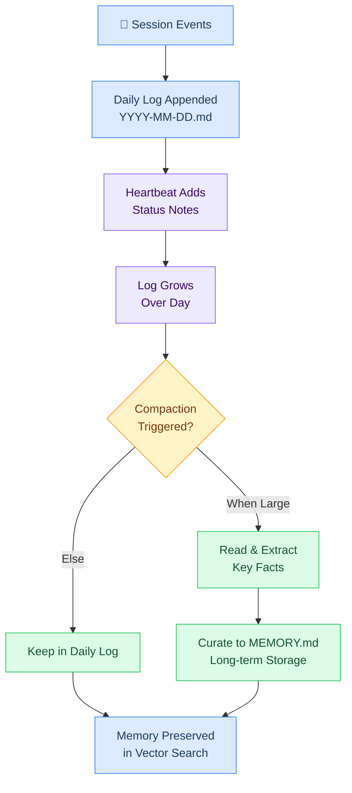

# ⑧ Daily Logs — Session Journal

> Session facts from today and yesterday. Appended to as sessions end and as HEARTBEAT finds things to note. Decays gracefully — older logs age with a 30-day half-life in vector search.

**Location:** `~/.openclaw/workspace/memory/YYYY-MM-DD.md`
**Injected:** Every session (today's + yesterday's)
**Size budget:** 6,000 tokens (4% of window)
**Actual:** Varies wildly (quiet day = small, intensive session = large)

---



---

## Purpose

**Session facts from today and yesterday.** Appended to as sessions end and as HEARTBEAT finds things to note. Decays gracefully — older logs age with a 30-day half-life in vector search.

---

## What It Covers

Each day gets a file at `memory/YYYY-MM-DD.md`:
```
Session summaries (who, what, duration, token count)
Decisions made that day
Tasks attempted and completed
Debug notes
Transient state (what Crispy was working on)
Checkpoint summaries (from compaction flushes)
```

---

## Injection & Lifespan

- **Injected:** Every session (today's + yesterday's)
- **Updated by:** Crispy (at session end, compaction flush, heartbeat notes)
- **Lifespan:** Persistent forever, but vector search decays >30 days old by 50%

---

## File Format

```markdown
# Daily Log — 2026-03-02

## Session: crispy-marty-tg @ 14:45

**Duration:** 2hr 15min
**Messages:** 42 turns
**Context cycles:** 1 compaction

**Summary:**
Worked on documenting L4 session layer. Completed context-assembly.md and compaction.md.
Discussed session lifecycle and storage format. No blocking issues. Next: Write sessions.md
and bootstrap files pages.

**Files modified:**
- stack/L4-session/context-assembly.md ✓
- stack/L4-session/compaction.md ✓

**Git status:** Clean

**Reminders:** Bootstrap testing tomorrow

---

## Heartbeat @ 10:20

Checked git (clean), daily log size (1200 words, ok), disk space (74%, ok).

---

## Heartbeat @ 10:40

No changes.
```

---

## Dependencies

- Loaded in [[stack/L4-session/context-assembly]] as step ⑦
- Written to at [[stack/L4-session/sessions]] end
- Indexed by vector search ([[stack/L7-memory/_overview]] Layer 4)
- Curated into [[stack/L7-memory/memory-search]] by [[stack/L4-session/bootstrap]] when large

---

**Up →** [[stack/L4-session/_overview]]
**See also →** [[stack/L7-memory/memory-search]] · [[stack/L4-session/bootstrap]] · [[stack/L4-session/sessions]]
