# L4 — Sessions and Session Management

> Session creation, reset triggers, storage format, and per-channel behavior. How Crispy maintains conversation state across time. This document consolidates session lifecycle, compaction, session templates, coding session lifecycle, and a sessions guide.

---

## Overview

A session is one conversation thread. Sessions are stored as JSONL files with one entry per turn. They reset daily, on idle timeout, or when the user requests `/new` or `/reset`.

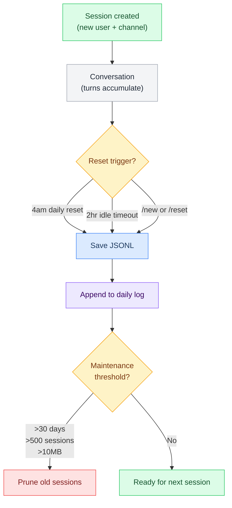

---

## Session Creation

### Scope: Per-Channel-Per-User

One session per (channel, user) pair.

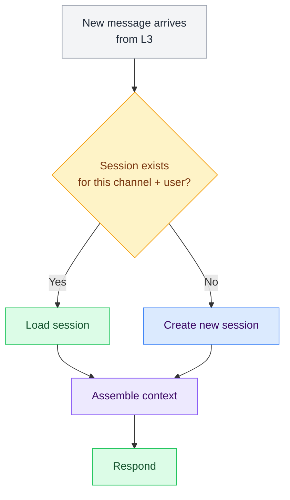

**Session ID format:** `agent-user-channel`

Examples:
- `crispy-marty-tg` — Crispy + Marty on Telegram
- `crispy-wenting-tg` — Crispy + Wenting on Telegram
- `crispy-marty-discord-dm` — Crispy + Marty on Discord DM
- `crispy-all-discord-servers` — Crispy in Discord server #crispy-logs (group scope, not per-user)

---

## Per-Channel Session Behavior

### Telegram DM (`crispy-marty-tg`)

| Setting | Value | Effect |
|---|---|---|
| Scope | Per-user DM | One session per Marty's DM |
| Bootstrap | Full | AGENTS + SOUL + TOOLS + IDENTITY + USER + **MEMORY** |
| Daily logs | Loaded | Today's + yesterday's logs loaded |
| Voice | Enabled | ElevenLabs TTS v3 on output |
| Commands | Full | `/new`, `/reset`, `/brief`, `/email`, `/git`, `/model`, custom pipelines |
| Memory access | Full | Can read/write MEMORY.md, see vector search results |

### Telegram Group (`crispy-telegram-group`)

| Setting | Value | Effect |
|---|---|---|
| Scope | Whole group (no per-user) | One session for all group members |
| Bootstrap | Limited | AGENTS + SOUL + TOOLS + IDENTITY (no USER, no MEMORY) |
| Daily logs | Skipped | Group context is ephemeral |
| Voice | Disabled | Text only in group |
| Commands | Limited | Only `@Crispy <command>` mentions trigger; no `/new` or `/reset` |
| Memory access | None | Can't write to MEMORY.md; group is write-only to shared daily log |

### Discord DM (`crispy-marty-discord-dm`)

| Setting | Value | Effect |
|---|---|---|
| Scope | Per-user DM | One session per user |
| Bootstrap | Full | Same as Telegram DM |
| Daily logs | Loaded | Today's + yesterday's logs |
| Voice | Disabled | Discord doesn't have TTS like Telegram |
| Commands | Full | Same as Telegram |
| Memory access | Full | Same as Telegram |

### Discord Server (`crispy-discord-servers`)

| Setting | Value | Effect |
|---|---|---|
| Scope | Whole server (no per-user) | One session for entire server |
| Bootstrap | Limited | Same as Telegram group |
| Daily logs | Skipped | Server context is write-only |
| Voice | Disabled | Text only |
| Commands | Limited | Only mentions in #crispy-logs or when @Crispy tagged |
| Memory access | None | Write to shared daily log, not MEMORY.md |

### Cross-Channel DM Context

**Rule:** Never share DM context across channels.

- Marty's Telegram DM session ≠ Marty's Discord DM session
- Both load MEMORY.md (Marty's preferences are consistent)
- But conversation history is separate
- Marty never sees that his Telegram conversation was used in Discord

---

## Session Reset Triggers

### 1. Daily Reset at 4am Pacific

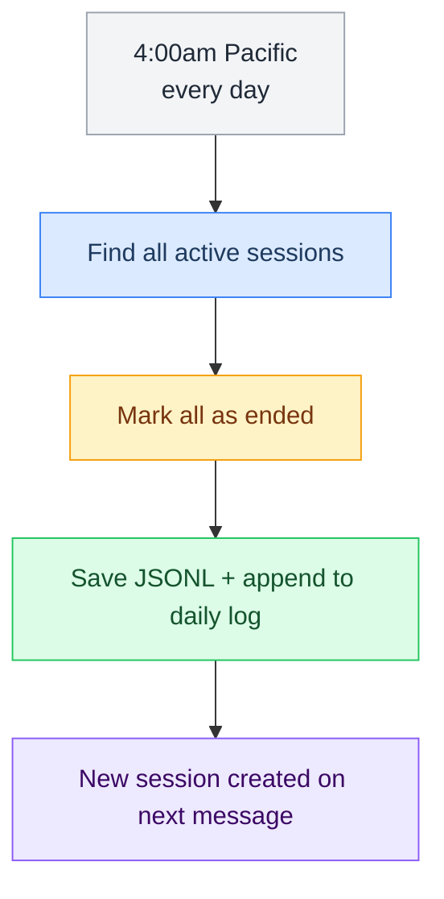

**Why 4am?** It's early morning Pacific — unlikely Marty is messaging, gives a clean break.

**Config:**

```json5
"session": {
  "reset": {
    "mode": "daily",
    "atHour": 4            // 4am Pacific
  }
}
```

### 2. Idle Timeout (2 hours)

If no messages arrive for 2 hours:

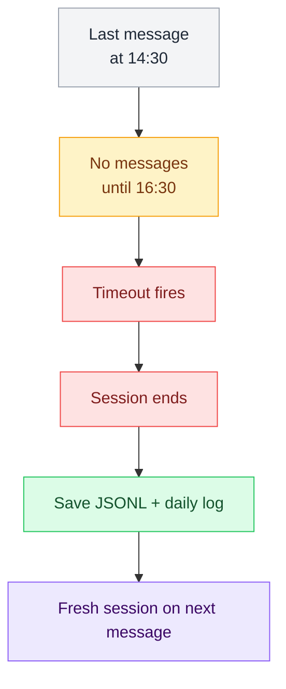

**Config:**

```json5
"session": {
  "idleTimeout": "2h"    // Reset after 2 hours of silence
}
```

### 3. Manual Reset (`/new` or `/reset`)

User-triggered reset in Telegram/Discord:

```
Marty: /new
Crispy: Starting a fresh session. Previous conversation saved to memory.

(New session created immediately)
```

---

## Session Storage

### Directory Structure

```
~/.openclaw/sessions/
├── sessions.json          ← Session index (metadata)
├── crispy-marty-tg.jsonl  ← Telegram DM conversation
├── crispy-wenting-tg.jsonl
├── crispy-marty-discord-dm.jsonl
├── crispy-all-discord-servers.jsonl
└── ...
```

### Session Index (`sessions.json`)

Tracks all sessions and their metadata:

```json
{
  "sessions": [
    {
      "id": "crispy-marty-tg",
      "agent": "crispy",
      "user": "marty",
      "channel": "telegram-dm",
      "createdAt": "2026-02-20T10:30:00Z",
      "lastMessageAt": "2026-03-02T14:45:00Z",
      "messageCount": 142,
      "tokenCount": 85000,
      "status": "active"
    },
    {
      "id": "crispy-wenting-tg",
      "agent": "crispy",
      "user": "wenting",
      "channel": "telegram-dm",
      "createdAt": "2026-03-01T09:15:00Z",
      "lastMessageAt": "2026-03-01T11:20:00Z",
      "messageCount": 8,
      "tokenCount": 12000,
      "status": "idle"
    }
  ]
}
```

### Session File (JSONL)

One entry per turn:

```jsonl
{"role": "user", "content": "What's the status of OpenClaw?", "timestamp": "2026-03-02T10:30:00Z", "channel": "telegram-dm"}
{"role": "assistant", "content": "Gateway is up. All bootstrap files written. Waiting on testing.", "timestamp": "2026-03-02T10:31:00Z"}
{"role": "user", "content": "Great. What should I test first?", "timestamp": "2026-03-02T10:32:00Z", "channel": "telegram-dm"}
{"role": "assistant", "content": "1. Verify AGENTS.md loads\n2. Check /status tool\n3. Run /brief pipeline", "timestamp": "2026-03-02T10:33:00Z"}
```

**Fields:**
- `role` — "user" or "assistant"
- `content` — Message text
- `timestamp` — ISO 8601 UTC
- `channel` — Where message came from (optional, for reference)

---

## Session End & Archival

### When Session Ends

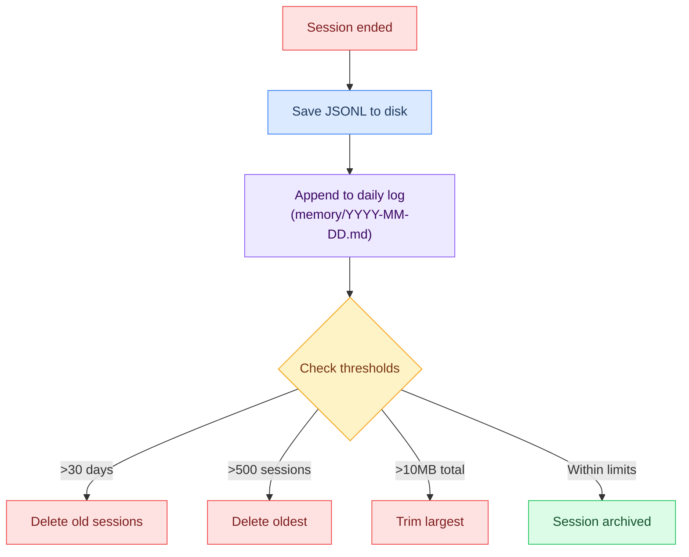

### Appending to Daily Log

When a session ends, its summary is appended to `memory/YYYY-MM-DD.md`:

```markdown
## Session: crispy-marty-tg @ 14:45

**Duration:** 2hr 15min
**Messages:** 42 turns
**Context cycles:** 1 compaction

**Summary:**
Worked on documenting L4 session layer. Completed context-assembly.md and compaction.md pages. Discussed session lifecycle and storage format. No blocking issues. Next: Write sessions.md detail page and bootstrap files page.

**Files modified:**
- stack/L4-session/context-assembly.md ✓
- stack/L4-session/compaction.md ✓

**Git status:** Clean (all changes committed)

**Reminders:** Bootstrap testing scheduled for tomorrow
```

### Maintenance Thresholds

```json5
"session": {
  "maxHistory": {
    "days": 30,        // Delete sessions older than 30 days
    "count": 500,      // Keep max 500 sessions
    "sizeMB": 10       // Total session dir <= 10MB
  }
}
```

**Cleanup order:**
1. First delete sessions >30 days old
2. If still >500 sessions, delete oldest
3. If still >10MB, trim largest by size

---

## Session Access via CLI

### List Sessions

```bash
openclaw sessions list
```

Output:
```
┌─────────────────────────────┬──────┬──────────────┬───────────┐
│ Session ID                  │ User │ Messages     │ Status    │
├─────────────────────────────┼──────┼──────────────┼───────────┤
│ crispy-marty-tg             │ marty│ 142          │ active    │
│ crispy-wenting-tg           │ wen  │ 8            │ idle      │
│ crispy-marty-discord-dm     │ marty│ 56           │ active    │
└─────────────────────────────┴──────┴──────────────┴───────────┘
```

### Reset Specific Session

```bash
openclaw sessions reset crispy-marty-tg
```

Output:
```
Session crispy-marty-tg reset.
Old conversation saved to memory/2026-03-02.md
New session ready.
```

### View Session Details

```bash
openclaw sessions view crispy-marty-tg --detailed
```

Output:
```
Session: crispy-marty-tg
Agent: crispy
User: marty
Channel: telegram-dm
Status: active

Created: 2026-02-20 @ 10:30am Pacific
Last message: 2026-03-02 @ 2:45pm Pacific
Duration so far: 10 days 4 hours
Messages: 142 turns
Tokens: 85,000 (57% of window)

Next reset:
- 4am Pacific (daily reset)
- OR 2h idle timeout
- OR manual /reset
```

---

## Session Context Window Visibility

### What Crispy Knows About Sessions

Inside context window, Crispy has:

```
Current session: crispy-marty-tg
Created: 2026-02-20
Messages this session: 142
Time in session: 2hr 15min (since last reset)
Context usage: 85,000 / 150,000 tokens (57%)
Last reset: 2026-03-02 @ 4:00am
```

This info is available via `/status` command or automatically in memory.

### What Crispy Does NOT Know

- Other sessions' content (privacy boundary)
- When other sessions reset
- Other users' MEMORY.md or USER.md
- Session-to-session patterns (only visible in daily logs via vector search)

---

## Multi-Session Scenarios

### Marty in Telegram + Discord Simultaneously

```
Time 14:00

Marty messages Telegram (crispy-marty-tg)
→ Crispy loads MEMORY.md (Marty's preferences, timezone)
→ Crispy loads today + yesterday logs
→ Responds in Telegram

Marty also messages Discord DM (crispy-marty-discord-dm)
→ Crispy loads MEMORY.md again (same file)
→ Crispy loads today + yesterday logs again (same)
→ BUT conversation history is separate (different JSONL)
→ Responds in Discord

Result: Marty's preferences are consistent across channels, but conversation
histories are isolated per channel.
```

### Marty Leaves Telegram, Comes Back 3 Days Later

```
Day 1 @ 14:00 — Marty messages Telegram
→ Session: crispy-marty-tg created
→ Messages back and forth until session ends

Day 2-3 — Radio silence in Telegram

Day 4 @ 10:00 — Marty messages Telegram again
→ Session check: Is there an existing crispy-marty-tg session?
→ Idle timeout happened on Day 1 @ 16:00 (2h idle)
→ So crispy-marty-tg was ended, archived to memory/YYYY-MM-01.md
→ New session: crispy-marty-tg created @ 10:00 on Day 4
→ MEMORY.md is loaded again (same durable facts)
→ But conversation history from Day 1 is not loaded
→ (Accessible via vector search, but not in default context)
```

---

## Session Recovery & Debugging

### Lost Session Data

If JSONL file is corrupted:

```bash
# Recovery attempt
openclaw sessions repair crispy-marty-tg
```

If repair fails:
- Conversation is lost for that session
- Daily log summary is preserved (if appended before corruption)
- MEMORY.md is safe (separate file)
- Next session starts fresh

### Session Not Resetting at 4am

**Symptoms:** Conversation keeps going without daily reset.

**Causes:**
- Reset daemon not running
- `session.reset.mode` is not "daily"
- System time is wrong

**Fix:**
```bash
openclaw sessions list --pending-reset
openclaw sessions reset <id>
```

### Idle Timeout Not Firing

**Symptoms:** Session keeps loading even after 2+ hours idle.

**Causes:**
- Heartbeat messages count as "activity" (they do)
- `idleTimeout` not set or set to 0
- Gateway crashed and restarted (resets timer)

**Fix:**
```bash
# Check config
openclaw config show session.idleTimeout

# Manually reset
openclaw sessions reset <id>
```

---

## Best Practices

### For Admins

1. **Monitor session count** — Warn if >500 or >10MB
2. **Review daily logs** — Check what Crispy is writing at session end
3. **Test idle timeout** — Verify 2h timeout works as expected
4. **Backup sessions directory** — Sessions are only stored locally

### For Crispy

1. **Write good session summaries** — Be specific when appending to daily log
2. **Respect session boundaries** — Never expose one session's context in another
3. **Clean up after reset** — Make sure git is committed before session ends
4. **Check session token count** — If approaching 150K, mention compaction may occur

---

## Compaction


## Compaction

How old context is compressed when the LLM's context window fills up. Compaction is a safeguard: flush important facts to disk first, then summarize the conversation.

---

## Overview

Crispy can hold about 150,000 tokens of context at a time. Long conversations fill this up. When it's nearly full, compaction triggers:

1. **Memory Flush** — Write session facts to daily log (`memory/YYYY-MM-DD.md`)
2. **Compaction** — Summarize the conversation into a compact summary
3. **Reload** — Start fresh with bootstrap + summary + new messages

**Key rule:** Memory is flushed BEFORE context is compressed. This ensures nothing is lost.

---

### When Compaction Triggers

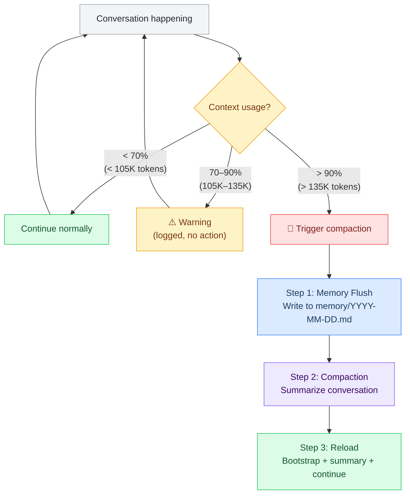

**Threshold:** 135,000 tokens (90% of 150,000).

**Config:**

```json5
"agents.defaults": {
  "compaction": {
    "mode": "safeguard",
    "trigger": "95%",              // Threshold at 95% capacity
    "maxTokens": 150000            // Hard ceiling
  },
  "contextPruning": {
    "mode": "cache-ttl",
    "ttl": "1h",
    "maxTokens": 150000
  }
}
```

---

### Step 1: Memory Flush

Before context gets compressed, Crispy writes a checkpoint to disk.

#### What Gets Flushed

**Included in flush:**
- Current objective and status
- Decisions made so far
- Files modified
- Active git branch
- Blocking issues
- Key facts from the session

**Example flush prompt:**

```
You are about to compact your context window.

Before context is trimmed, write a task checkpoint to memory/YYYY-MM-DD.md:
- Current objective
- Step progress
- Files modified
- Active branch
- Blocking issues
- Anything Crispy should remember after context resets

Write it now, then respond "FLUSH_COMPLETE".
```

#### Flush Output

Appended to `memory/YYYY-MM-DD.md`:

```markdown
## Session Checkpoint [14:30]

**Objective:** Debug OpenClaw boot sequence

**Progress:**
- [ ] Step 1: Checked git remote (done)
- [ ] Step 2: Verified memory search (done)
- [ ] Step 3: Read yesterday's log (in progress)

**Files modified:**
- `guides/bootstrap/_overview.md` — added L4 references
- `stack/L4-session/_overview.md` — expanded section headings

**Active branch:** feature/l4-docs

**Blocking:** Need to verify BOOTSTRAP.md template syntax

**Next:** Resume from Step 3, then test the bootstrap flow
```

#### STATUS.md Update

Crispy also updates `STATUS.md` (if it exists) with:

```markdown
Last session: 2026-03-02 @ 14:30 Pacific
Duration: 2hr 15min
Context cycles: 1 (one compaction)
Files touched: 2
Git status: clean
Next focus: Verify bootstrap syntax
```

---

### Step 2: Compaction (Summarization)

Once the flush is done, OpenClaw summarizes the conversation into a compact form.

#### Compaction Prompt

```
You are Crispy, about to reset your short-term context.

Summarize the conversation so far in 2-4 paragraphs:
- What was discussed
- What was decided
- What's been completed
- What still needs to happen
- Any important code snippets or references

Keep it concise (500 tokens max). This summary will replace the full conversation history
so Crispy can continue working with fresh context.

Format as a clean narrative, not a list.
```

#### Compaction Output

Becomes the new "session history" that gets loaded into the next context window:

```
Crispy was helping debug the OpenClaw bootstrap sequence. The goal is to ensure
all 9 bootstrap files (AGENTS.md, SOUL.md, TOOLS.md, IDENTITY.md, USER.md, MEMORY.md,
HEARTBEAT.md, BOOTSTRAP.md, BOOT.md) load correctly on first run.

Progress so far: Reviewed the architecture docs and identified that BOOTSTRAP.md
should be a first-run-only file that self-deletes. Also verified that skipBootstrap
needs to be flipped from true to false in CONFIG once files are written.

Completed: Documented the 9-step context assembly order, token budget allocation,
and added troubleshooting section.

Remaining: Write the compaction page, session lifecycle page, and bootstrap files
detail page. Then test the actual bootstrap flow with CONFIG.md set up correctly.

Current branch: feature/l4-docs. No blocking issues at the moment.
```

#### What Compaction Loses

- **Exact turn-by-turn conversation** — replaced by summary
- **Timestamps** — session time now shows as "compact reset at HH:MM"
- **Formatting** — code blocks, markdown, become narrative

#### What Compaction Preserves

- **Facts and decisions** — all factual content summarized
- **Context window space** — 40,000 tokens → ~8,000 tokens (80% reduction)
- **Continuity** — Crispy knows what was decided and can continue

---

### Step 3: Reload and Continue

After flush + compaction, context is reloaded with:

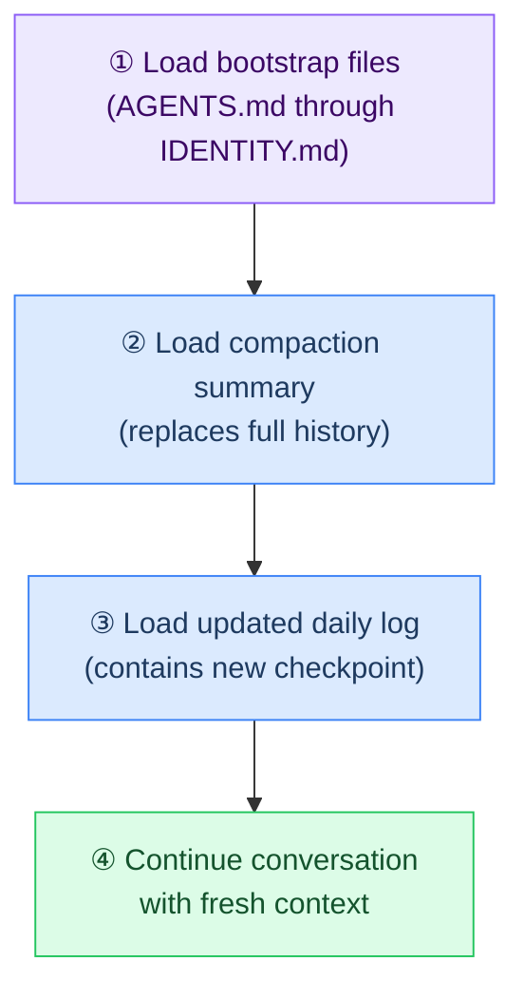

**Context is now fresh, but Crispy remembers what happened.**

---

### Compaction Config

From `openclaw.json`:

```json5
"agents.defaults": {
  "compaction": {
    "mode": "safeguard",                     // Two-phase: flush then compact
    "trigger": "95%",                         // Fire at 95% capacity

    "memoryFlush": {
      "prompt": "Summarize key facts, decisions, and action items...",
      "target": "memory/YYYY-MM-DD.md",
      "updateStatus": true                   // Also write STATUS.md
    },

    "summarization": {
      "prompt": "Summarize the conversation into 2-4 paragraphs...",
      "maxTokens": 8000,                     // Keep summary tight
      "model": "researcher"                  // Use primary model
    }
  },

  "contextPruning": {
    "mode": "cache-ttl",
    "ttl": "1h",
    "maxTokens": 150000,
    "reserveTokensFloor": 20000              // Always hold 20K for response
  }
}
```

---

### Compaction in Practice

#### Scenario: Debugging Session

```
14:00 — Session starts
Context: Bootstrap (34K) + yesterday's log (2K) + empty history

14:30 — 45 minutes of debugging conversation
Context: Bootstrap (34K) + logs (4K) + history (80K) = 118K ✓ (78%)

15:45 — Still debugging, more discussion
Context: Bootstrap (34K) + logs (6K) + history (110K) = 150K ⚠️ (100%)
→ FLUSH: Write checkpoint to memory/2026-03-02.md
→ COMPACT: Summarize 90K of history into 8K
→ RELOAD: Bootstrap (34K) + logs (6K) + summary (8K) = 48K ✓ (32%)
→ Resume debugging with fresh context
```

#### Scenario: Multi-Day Session (resets at 4am)

```
Day 1 @ 23:00 — Session starts, builds up history
Day 2 @ 04:00 — Session reset (daily reset at 4am Pacific)
→ SAVE: Entire session flushed to memory/YYYY-MM-01.md
→ NEW: Empty session starts with bootstrap + today's logs

Day 2 @ 14:00 — Later in the day, context builds again
Day 3 @ 04:00 — Another reset at 4am
→ Same cycle repeats
```

---

### Compaction Edge Cases

#### What if Flush Itself Exceeds Budget?

If the checkpoint being written is larger than the available space:

1. Flush to daily log anyway (appends, doesn't fail)
2. Reduce the size on next compaction
3. Alert admin if daily log > 2000 words

#### What if Compaction Loses Important Info?

**Safeguard:** Facts that are important for long-term success should be in:
- **MEMORY.md** — curated across sessions
- **Daily logs** — flushed before compaction
- **Workspace files** — persisted outside context window (git, AGENTS.md, etc.)

**Not safe to rely on:** Session history alone.

#### Compaction During Compaction

If a new message arrives while compaction is running:

- Compaction completes first
- New message enters fresh context
- No double-compaction

(OpenClaw queues messages during compaction.)

---

### Monitoring Compaction

#### Heartbeat Checks

Every 20 minutes, Crispy checks:

```markdown
# Heartbeat Checklist

- [ ] Recent compactions? (`memory/STATUS.md` shows count)
- [ ] Daily log size ballooning? (>2000 words → curate to MEMORY.md)
- [ ] Git status? (any compaction-induced changes committed?)
```

#### CLI Commands

```bash
# View compaction history
openclaw memory search "compaction" --limit=10

# View daily log
cat ~/.openclaw/sessions/*/memory/2026-03-02.md

# View session status
openclaw sessions list --verbose
```

#### Logs

OpenClaw logs every compaction to gateway logs:

```
[2026-03-02T15:45:00] COMPACTION_TRIGGERED context_usage=96% session_id=crispy-marty-tg
[2026-03-02T15:45:01] FLUSH_COMPLETE checkpoint_lines=12 file=memory/2026-03-02.md
[2026-03-02T15:45:02] COMPACTION_COMPLETE summary_tokens=7892 reduction=82%
[2026-03-02T15:45:03] SESSION_RESUMED context_usage=34%
```

---

### Compaction vs Pruning

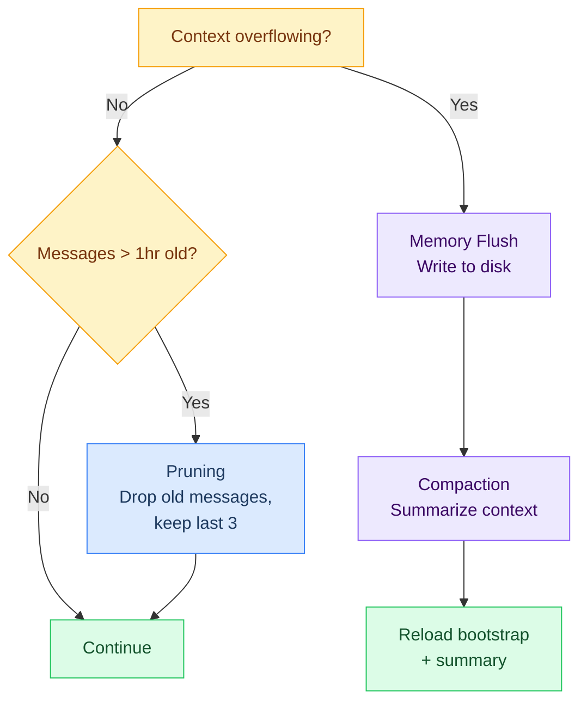

| Mechanism | When | What Happens | Data Loss? |
|---|---|---|---|
| **Pruning** | Every turn (TTL mode) | Drop messages > 1hr old, keep last 3 | No — old turns removed |
| **Compaction** | At 95% capacity | Flush to disk, then summarize | No — facts preserved in summary |

---

### Best Practices

#### For Admins

1. **Monitor compaction frequency** — If compacting multiple times per session, increase `maxTokens` or reduce verbosity
2. **Review daily logs** — Check `memory/YYYY-MM-DD.md` for missing facts
3. **Curate MEMORY.md** — Help Crispy decide what facts are "forever-worthy"

#### For Crispy

1. **Write good checkpoints** — Be specific in flush output, include blocking issues
2. **Keep compaction summaries tight** — 500 tokens is the budget
3. **Check STATUS.md** — Know when compactions happened and why
4. **Promote important facts** — Ask to curate session discoveries into MEMORY.md

---

### Troubleshooting Compaction

| Symptom | Likely Cause | Fix |
|---|---|---|
| "Compaction triggered constantly" | Sessions are too long/verbose | Increase `maxTokens` or reduce session duration |
| "Facts disappear after compaction" | They weren't in flush or summary | Add important facts to MEMORY.md before they compact |
| "Daily log exceeds memory" | No curation happening | Enable heartbeat or manually curate MEMORY.md |
| "Compaction is slow" | Summary generation taking too long | Use a faster model for summarization |
| "Compaction loses code snippets" | Formatting lost in summarization | Save code to files in workspace, not context |

---

## Session Templates


## Session Templates

Different types of sessions need different boot-up contexts. Instead of one-size-fits-all, Crispy can detect (or be told) what kind of session this is and load the right template. This saves tokens, gives better focus, and lets BOOT.md show the right visuals.

---

### The Idea

Right now every session loads the same 9 bootstrap files. But a coding session needs different context than a casual chat. A research session needs different tools than a media editing session. Session templates let Crispy **adapt what it loads and shows based on what you're about to do.**

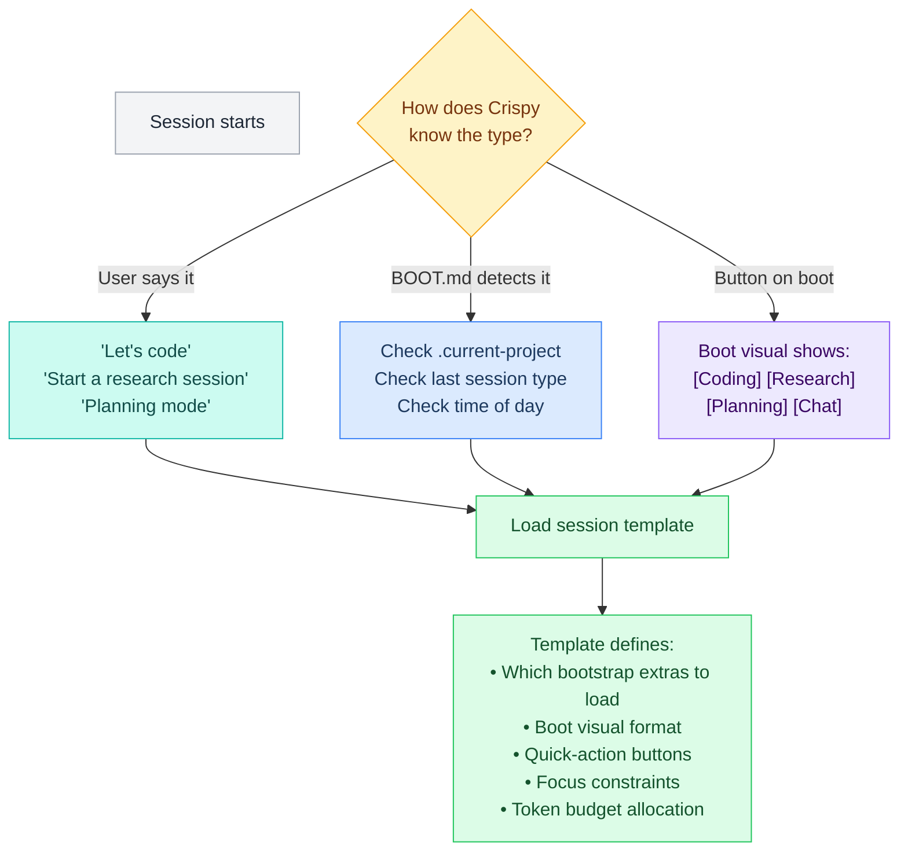

---

### 1. Coding Session

**Trigger:** "Let's code", "work on [project]", active branch detected, or [Coding] button

**What BOOT.md loads extra:**
- PROJECT-STATUS.md (task list, current branch, blockers)
- Git status (branch, clean/dirty, ahead/behind)
- Last commit messages (context on recent work)

**Boot visual:**

```
╔══════════════════════════════════════════════╗
║  🦊 Coding Session — crispy-kitsune         ║
╠══════════════════════════════════════════════╣
║  🔀 Branch:  feature/voice-pipeline         ║
║  📊 Tasks:   3/7 complete                   ║
║  🔄 Current: whisper-config                 ║
║  ⚠️  Git:     2 uncommitted files            ║
║                                              ║
║  [Continue task] [Git status]               ║
║  [New feature]   [View progress]            ║
╚══════════════════════════════════════════════╝
```

**Quick actions:** Continue task, Git status, Git push, New feature, Run tests, View diff

**Focus:** Agent prioritizes code tools (exec, read, write, edit, git). Discourages tangents.

**Token budget shift:** More context reserved for code files, less for memory/personality.

**Use cases:**
- Building a new feature across multiple files
- Debugging an issue (load error logs + relevant code)
- Code review (load PR diff + guidelines)
- Refactoring (load project structure + target files)

---

### 2. Research Session

**Trigger:** "Research [topic]", "find out about", "let's investigate", or [Research] button

**What BOOT.md loads extra:**
- Research topic context (from previous research notes if any)
- Web search + fetch tools prioritized
- Source tracking template

**Boot visual:**

```
╔══════════════════════════════════════════════╗
║  🦊 Research Session                         ║
╠══════════════════════════════════════════════╣
║  📚 Topic:   [from user or last session]    ║
║  📋 Sources: 0 collected                    ║
║  📝 Notes:   0 saved                        ║
║                                              ║
║  [Start searching] [Load prior research]    ║
║  [Set scope]       [Export findings]        ║
╚══════════════════════════════════════════════╝
```

**Quick actions:** Search web, Summarize page, Save source, Compare sources, Export findings

**Focus:** Agent prioritizes web_search, web_fetch, browser. Encourages source citations. Saves findings to a research doc in workspace.

**Use cases:**
- Comparing tools/frameworks before choosing one
- Learning about a new technology before implementing
- Finding best practices for a pattern
- Competitive analysis

---

### 3. Planning Session

**Trigger:** "Let's plan", "design [feature]", "let's figure out", or [Planning] button

**What BOOT.md loads extra:**
- Open questions list (from open-questions.md)
- Decisions log (recent decisions for context)
- Current feature scope (if working on a project)

**Boot visual:**

```
╔══════════════════════════════════════════════╗
║  🦊 Planning Session                         ║
╠══════════════════════════════════════════════╣
║  🎯 Topic:   [from user]                    ║
║  ❓ Open Qs: 14 unresolved                  ║
║  📋 Decisions: 8 logged                      ║
║                                              ║
║  [Review open questions] [New decision]     ║
║  [Start brainstorm]      [View roadmap]     ║
╚══════════════════════════════════════════════╝
```

**Quick actions:** Brainstorm, Decision tree, Pro/con analysis, Create task list, Log decision

**Focus:** Agent encourages structured thinking — pros/cons, decision trees, SMART goals. Logs decisions to decisions-log.md. Creates task lists as output.

**Use cases:**
- Designing a new feature before coding
- Making architecture decisions
- Sprint/week planning
- Working through open questions from the vault

---

### 4. Chat Session (default)

**Trigger:** Default when no specific type detected, or casual conversation

**What BOOT.md loads:** Standard bootstrap only (no extras)

**Boot visual:**

```
╔══════════════════════════════════════════════╗
║  🦊 Crispy Kitsune — Ready                  ║
╠══════════════════════════════════════════════╣
║  💬 Chat mode                               ║
║  📅 Last session: 2h ago (coding)           ║
║                                              ║
║  [Start coding] [Research something]        ║
║  [Plan a feature] [Quick question]          ║
╚══════════════════════════════════════════════╝
```

**Quick actions:** Switch to any session type, Quick question, Recall memory

**Focus:** General purpose. No special constraints.

**Use cases:**
- Quick questions ("what's the config field for X?")
- Casual conversation
- Asking Crispy to recall something from memory
- One-off tasks that don't fit other categories

---

### 5. Debug Session

**Trigger:** "Something is broken", "debug [thing]", "why is [X] failing", error pasted, or [Debug] button

**What BOOT.md loads extra:**
- Recent error logs (last 50 lines of gateway log)
- Current config state (openclaw doctor output)
- System health snapshot

**Boot visual:**

```
╔══════════════════════════════════════════════╗
║  🦊 Debug Session                            ║
╠══════════════════════════════════════════════╣
║  🔴 Issue: [from user or auto-detected]     ║
║  📋 Recent errors: 3 in last hour           ║
║  🩺 Health: gateway ✅ models ✅ channels ⚠️ ║
║                                              ║
║  [Show logs] [Run doctor] [Check config]    ║
║  [Test channel] [Restart gateway]           ║
╚══════════════════════════════════════════════╝
```

**Quick actions:** Show logs, Run openclaw doctor, Check config, Test channels, Restart gateway

**Focus:** Systematic debugging. Agent follows reproduce → isolate → diagnose → fix pattern. Logs resolution to decisions-log.

**Use cases:**
- Gateway won't start
- Channel disconnected
- Model returning errors
- Tool execution failing
- Media not processing

---

### 6. Media Session

**Trigger:** "Process these files", "organize my media", bulk media upload, or [Media] button

**What BOOT.md loads extra:**
- Media folder stats (file counts, sizes per folder)
- Quarantine count (if any)
- Recent media activity

**Boot visual:**

```
╔══════════════════════════════════════════════╗
║  🦊 Media Session                            ║
╠══════════════════════════════════════════════╣
║  📁 Inbound:    142 files (1.2GB)           ║
║  📤 Outbound:   28 files (340MB)            ║
║  ⚠️  Quarantine: 2 files awaiting review     ║
║  🗑️  Archive:    89 files (4.1GB)            ║
║                                              ║
║  [Review quarantine] [Cleanup old files]    ║
║  [Search media]      [Export report]        ║
╚══════════════════════════════════════════════╝
```

**Quick actions:** Review quarantine, Run cleanup, Search by tag, Browse by date, Export media report

**Focus:** File operations. Agent works with media folders, metadata, tagging.

---

### How Templates Work Internally

Templates aren't separate files — they're **BOOT.md logic**. BOOT.md detects the session type and adjusts its behavior:

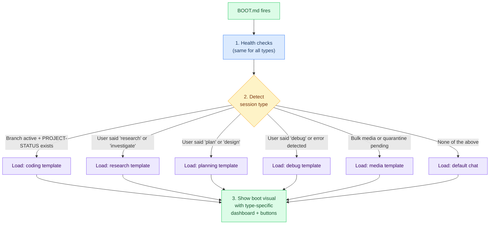

---

### Detection Logic in BOOT.md

```markdown
## Session Type Detection

Check in this order (first match wins):

1. **User explicitly stated type** in first message
   → "let's code" = coding, "research X" = research, etc.

2. **Active project detected**
   → .current-project exists + PROJECT-STATUS.md has incomplete tasks
   → coding session

3. **Quarantine files pending**
   → quarantine/ has files
   → media session (show warning)

4. **Error in recent logs**
   → gateway log has errors in last hour
   → debug session

5. **Time-based heuristic**
   → morning + no active project = planning session
   → (optional, configurable)

6. **Default**
   → chat session
```

---

### Switching Types Mid-Session

Users should be able to switch types without resetting:

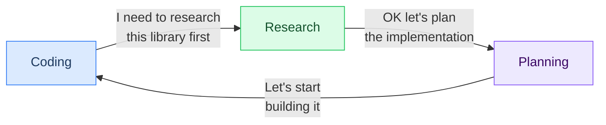

**How:** When the user switches, the agent:
1. Saves current session notes (to memory or PROJECT-STATUS.md)
2. Loads the new template's extra context
3. Shows new boot visual / buttons
4. Does NOT reset the session — keeps conversation history

**When to actually reset:**
- Feature complete → new feature (reset recommended)
- Research done → start coding (reset optional, depends on context size)
- Debug resolved → back to coding (no reset needed)

---

### Template Ideas for Later

| Template | Trigger | What it would do |
|---|---|---|
| **Review session** | "Let's review the vault" | Load vault stats, recent changes, run linter |
| **Onboarding session** | New user paired | Guided tour of Crispy's capabilities |
| **Voice session** | Voice messages only | Prioritize STT/TTS, shorter responses |
| **Pair programming** | "Let's pair on this" | Agent shows thinking, asks before acting, more collaborative |
| **Emergency session** | "URGENT" / system alert | Skip boot visual, go straight to issue, escalate if needed |
| **Maintenance session** | Scheduled or "run maintenance" | Cleanup, backup, health check, update skills |

---

### Token Budget by Template

Each template can shift how the 150K context window is allocated:

| Template | Bootstrap | Memory | History | Code/Files | Reserve |
|---|---|---|---|---|---|
| **Coding** | 25K (standard) | 5K (light) | 20K | **60K** (code files) | 40K |
| **Research** | 25K | 5K | 30K | 10K | **80K** (web content) |
| **Planning** | 25K | **15K** (full memory) | 30K | 10K | 70K |
| **Chat** | 25K | 10K | 40K | 10K | 65K |
| **Debug** | 25K | 5K | 15K | **40K** (logs + config) | 65K |
| **Media** | 25K | 5K | 15K | **30K** (metadata) | 75K |

**Note:** These aren't hard allocations — they're guidelines for how AGENTS.md instructs the agent to manage its context. The actual token usage depends on what the agent loads.

---

### Implementation Path

1. **Now:** Document the templates (this file) ✅
2. **Phase 1:** Add session type detection to BOOT.md template
3. **Phase 2:** Add PROJECT-STATUS.md support for coding sessions
4. **Phase 3:** Add boot visual formatting (channel-specific: Telegram buttons vs Discord embeds vs plain text)
5. **Phase 4:** Add type-switching mid-session
6. **Phase 5:** Add token budget hints in AGENTS.md per template

---

## Coding Sessions


## Coding Session Lifecycle

How Crispy manages coding sessions: boot visuals, feature boundaries, progress tracking, and when to start fresh. BOOT.md is the brain — it gives Crispy context on what's happening and what's next.

---

### The Problem

Without session management, coding gets messy:
- Crispy doesn't know if you're starting a new feature or continuing one
- Context from the last session is lost after compaction
- No visual progress on where things stand
- Files and branches from the last task may be dirty
- The agent wastes tokens re-discovering what it already knew

---

### The Full Lifecycle

```mermaid
flowchart TD
    subgraph BOOT_PHASE["🟢 BOOT — Session Start"]
        direction TB
        START["New session begins"]:::green
        BOOT["BOOT.md fires"]:::green
        HEALTH["Health checks:<br>git, memory, workspace"]:::green
        SCAN["Scan for active project:<br>read .current-project"]:::green
        PROGRESS["Load progress state:<br>read PROJECT-STATUS.md"]:::green
        VISUAL["Show boot visual:<br>project, branch, progress,<br>next task, blockers"]:::green
    end

    subgraph WORK_PHASE["🔵 WORK — Active Coding"]
        direction TB
        TASK["Work on current task"]:::blue
        COMMIT["Commit checkpoint"]:::blue
        UPDATE["Update PROJECT-STATUS.md<br>mark task done, note progress"]:::blue
        NEXT{"More tasks<br>in this feature?"}:::amber
    end

    subgraph FEATURE_BOUNDARY["🟡 BOUNDARY — Feature Complete"]
        direction TB
        DONE["Feature complete"]:::yellow
        PR["Create PR / merge"]:::yellow
        LOG["Log to decisions-log + memory"]:::yellow
        RESET{"Start new<br>feature?"}:::amber
    end

    subgraph NEW_SESSION["🟣 NEW SESSION — Clean Slate"]
        direction TB
        FRESH["Reset session"]:::purple
        NEW_BRANCH["New branch for next feature"]:::purple
        NEW_STATUS["Create new PROJECT-STATUS.md<br>with feature plan"]:::purple
        NEW_BOOT["Next BOOT.md will load<br>this new context"]:::purple
    end

    START --> BOOT --> HEALTH --> SCAN --> PROGRESS --> VISUAL
    VISUAL --> TASK --> COMMIT --> UPDATE --> NEXT
    NEXT -->|"Yes"| TASK
    NEXT -->|"No — feature done"| DONE
    DONE --> PR --> LOG --> RESET
    RESET -->|"Yes"| FRESH
    RESET -->|"No — done for now"| END_SESSION["End session"]:::gray
    FRESH --> NEW_BRANCH --> NEW_STATUS --> NEW_BOOT

    classDef green fill:#dcfce7,stroke:#22c55e,color:#14532d
    classDef blue fill:#dbeafe,stroke:#3b82f6,color:#1e3a5f
    classDef yellow fill:#fef9c3,stroke:#facc15,color:#713f12
    classDef purple fill:#ede9fe,stroke:#8b5cf6,color:#3b0764
    classDef amber fill:#fef3c7,stroke:#f59e0b,color:#78350f
    classDef gray fill:#f3f4f6,stroke:#9ca3af,color:#1f2937
```

---

### What BOOT.md Does on Startup

When a session starts, BOOT.md runs a startup routine. For a coding session, it should give Crispy a **visual dashboard** — not just health checks.

#### The Boot Visual

What Crispy sees on session start (and sends to you in the first message):

```
╔══════════════════════════════════════════════╗
║  🦊 Crispy Kitsune — Session Boot               ║
╠══════════════════════════════════════════════╣
║                                                  ║
║  📁 Project:  crispy-kitsune                     ║
║  🔀 Branch:   feature/voice-pipeline             ║
║  📊 Status:   3/7 tasks complete                 ║
║                                                  ║
║  ✅ voice-pipeline.md — done                     ║
║  ✅ stt-integration — done                       ║
║  ✅ tts-response — done                          ║
║  🔄 whisper-config — IN PROGRESS                 ║
║  ⬜ elevenlabs-setup                             ║
║  ⬜ voice-debug-guide                            ║
║  ⬜ e2e-test                                     ║
║                                                  ║
║  ⚠️  Blockers: None                              ║
║  📝 Last note: "Whisper working but slow,        ║
║     need to test with deepgram as fallback"      ║
║                                                  ║
║  🛠️  Quick actions:                              ║
║     [Continue whisper-config]                    ║
║     [View progress] [Git status] [New feature]   ║
║                                                  ║
╚══════════════════════════════════════════════╝
```

#### How BOOT.md Generates This

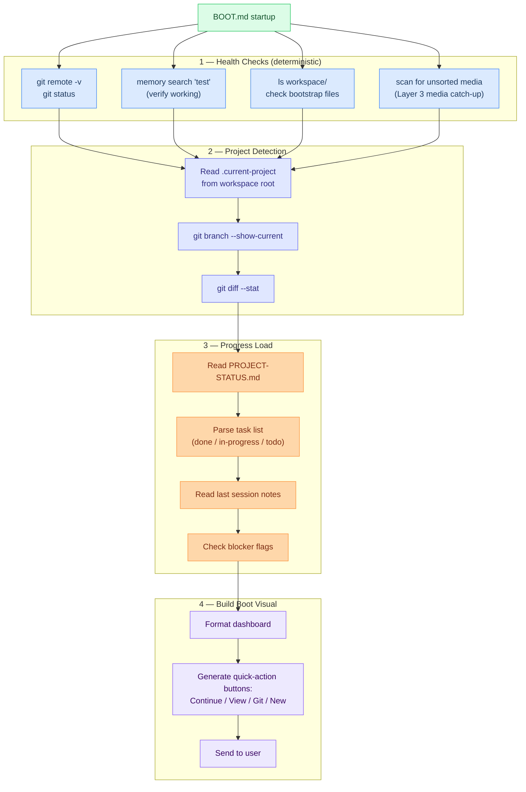

---

### PROJECT-STATUS.md — The Progress File

Lives in the workspace root. BOOT.md reads it, the agent updates it during work.

```markdown
# Project Status

## Current Feature
voice-pipeline

## Branch
feature/voice-pipeline

## Tasks
- [x] voice-pipeline.md — design doc
- [x] stt-integration — Whisper API wired up
- [x] tts-response — ElevenLabs outbound working
- [ ] whisper-config — openclaw.json audio settings   ← IN PROGRESS
- [ ] elevenlabs-setup — API key + voice selection
- [ ] voice-debug-guide — troubleshooting doc
- [ ] e2e-test — full voice round-trip test

## Blockers
None

## Notes
- Whisper works but 4.2s latency on 8s clip — try deepgram
- ElevenLabs voice_id needs to be in .env not config
- Voice reply format must be ogg_opus for Telegram

## Last Session
2026-03-02T14:30:00Z — Finished tts-response, started whisper-config
```

**Key:** This file is simple markdown. The agent reads it with `Read`, updates it with `Edit`. No special tooling needed. BOOT.md just `cat`s it on startup and formats the visual.

---

### Feature Boundaries — When to Start a New Session

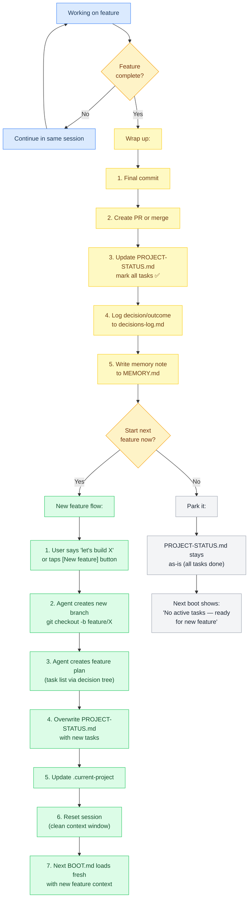

---

### Why Reset Between Features?

Starting a fresh session between features has real benefits:

| Problem with long sessions | How reset fixes it |
|---|---|
| Context window fills with old feature's code | Clean slate — only new feature in context |
| Compaction loses detail from early in session | No compaction needed — fresh start |
| Agent confuses old feature context with new | PROJECT-STATUS.md clearly defines current scope |
| Token cost grows as history builds | Smaller sessions = fewer tokens per turn |
| Bootstrap instructions get diluted | BOOT.md re-injects full instructions |

**Rule of thumb:** One feature = one session. If a feature has 7 tasks and takes 3 hours, that's one session. When it's done, wrap up, reset, boot fresh for the next one.

---

### The Full Sequence: Feature A → Feature B

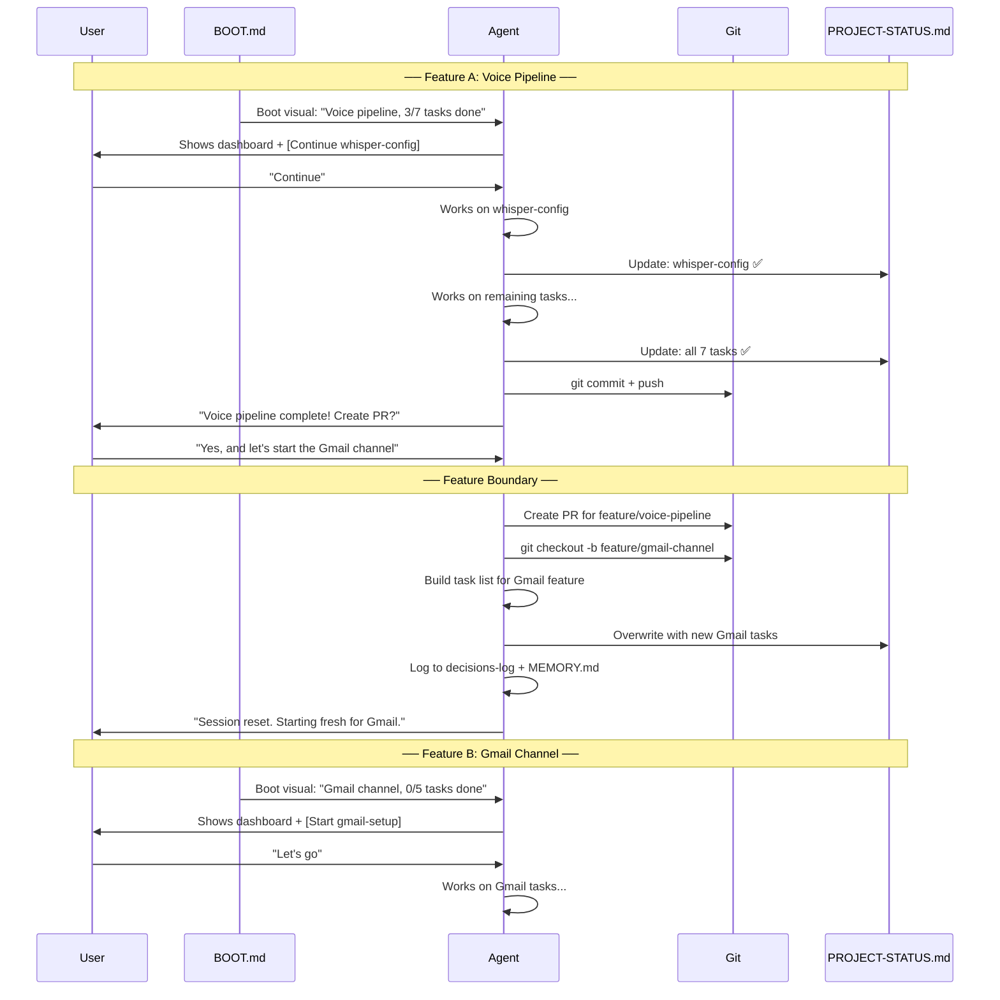

---

### Updated BOOT.md Template

```markdown
# Startup Checklist

## Health Checks
- [ ] Git remote accessible (`git remote -v && git fetch --dry-run`)
- [ ] Memory search working (`memory search "test"`)
- [ ] Workspace bootstrap files present (AGENTS.md, SOUL.md, etc.)
- [ ] Scan for unsorted media files (run media-catchup if found)

## Project Context
- [ ] Read `.current-project` from workspace root
- [ ] Read `PROJECT-STATUS.md` for task list and notes
- [ ] Check git branch matches expected feature branch
- [ ] Check for uncommitted changes from last session

## Boot Visual
- [ ] Format project dashboard (name, branch, progress, blockers)
- [ ] Generate quick-action buttons
- [ ] Send boot visual to user

## If No Active Project
- [ ] Show: "No active project. Ready for a new feature."
- [ ] Offer: [Start new feature] [Review open questions] [Check git]

Report health issues immediately. Show boot visual as first message.
```

---

### Files Involved

| File | Location | Updated by | Read by |
|---|---|---|---|
| **BOOT.md** | `~/.openclaw/workspace/BOOT.md` | Admin (manual) | Gateway on session start |
| **PROJECT-STATUS.md** | `~/.openclaw/workspace/PROJECT-STATUS.md` | Agent (during work) | BOOT.md on startup |
| **.current-project** | `~/.openclaw/workspace/.current-project` | Agent (on feature switch) | BOOT.md on startup |
| **decisions-log.md** | `~/.openclaw/workspace/memory/decisions-log.md` | Agent (on feature complete) | BOOT.md (optional) |
| **MEMORY.md** | `~/.openclaw/workspace/MEMORY.md` | Agent (curated notes) | Every DM session |

---

### Open Questions for BOOT.md

These need to be resolved before implementation:

- [ ] Should BOOT.md auto-reset the session when a feature is complete, or always ask?
- [ ] How much of PROJECT-STATUS.md should be injected into context? (full file or summary?)
- [ ] Should the boot visual be a Telegram message with inline buttons, or plain text?
- [ ] Can BOOT.md run a Lobster pipeline (boot-check.lobster) or is it agent-only?
- [ ] What happens if BOOT.md health check fails? Block messages or warn and continue?
- [ ] Should PROJECT-STATUS.md live in workspace root or in a `projects/` subfolder?
- [ ] Multi-project support: one PROJECT-STATUS.md per project, or one global file?

---

## Guide: Sessions Deep Dive


## Guide: Sessions Deep Dive

`sessions.json` + `*.jsonl`. One file per conversation. Reset daily or on idle.

### Session Lifecycle

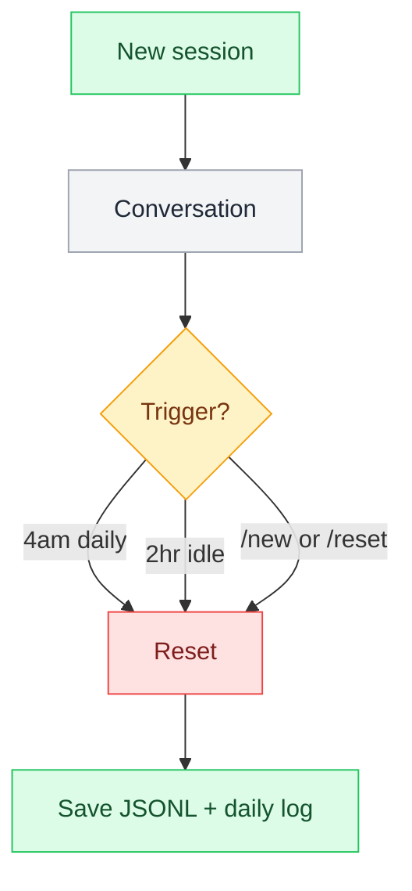

### Config

```json5
"session": {
  "dmScope": "per-channel-peer",  // One session per (channel, user)
  "reset": {
    "mode": "daily",
    "atHour": 4                   // 4am Pacific
    // "idleMinutes": 120         // OR 2hr idle
  }
}

// Maintenance thresholds
// Warn at: 30 days / 500 sessions / 10MB
```

### Storage

```
~/.openclaw/sessions/
├── sessions.json          ← Session index
├── crispy-marty-tg.jsonl  ← Marty's Telegram DM history
├── crispy-wenting-tg.jsonl
└── ...
```

### CLI

```bash
openclaw sessions list           # Active sessions
openclaw sessions reset <id>     # Reset specific session
```

---

## Related Pages

- [[stack/L4-session/_overview]] — Overview of L4 layer
- [[stack/L4-session/context-assembly]] — How context is assembled
- [[stack/L4-session/bootstrap]] — Bootstrap configuration and limits
- [[stack/L5-routing/message-routing]] — Message flow through all layers
- [[stack/L7-memory/_overview]] — Memory architecture and decay

---

**Up →** [[stack/L4-session/_overview]]
