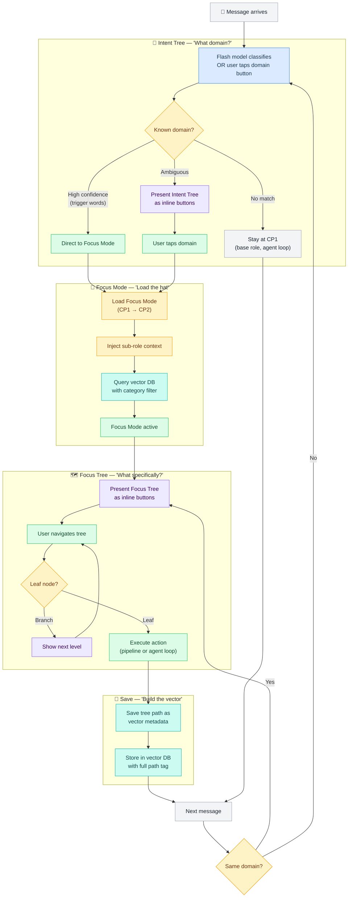
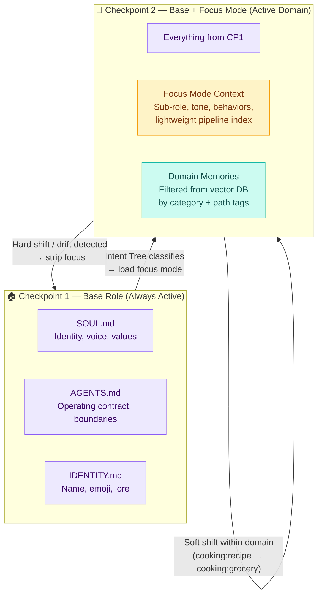
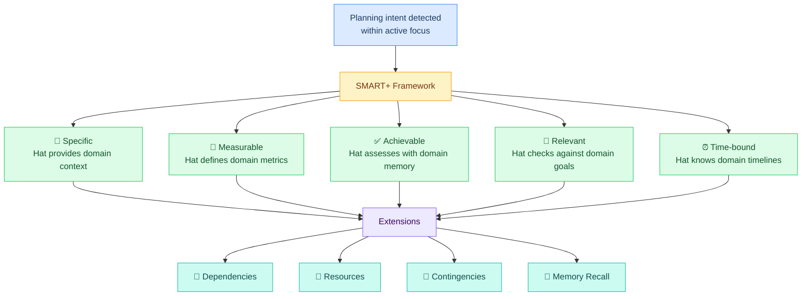
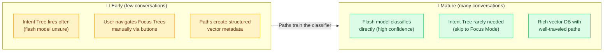

# L5 — Focus Mode Tree

> The **Focus Mode Tree** is Crispy's conversation navigation system. It has three layers: the **Intent Tree** identifies what domain you're in, the **Focus Mode** loads domain-specific context (the "hat"), and the **Focus Tree** navigates within that domain via structured decision paths. Every completed path through the tree creates structured vector metadata in L7 — the more conversations happen, the stronger the system gets at predicting and routing.

**Up →** [[stack/L5-routing/_overview]]

---

## The Full Loop



### The Three Layers

| Layer | Name | What It Does | Token Cost | Rendered As |
|---|---|---|---|---|
| **1** | **Intent Tree** | Identifies which domain the conversation is about | ~100 (flash model) or 0 (button tap) | Inline buttons when ambiguous |
| **2** | **Focus Mode** | Loads domain-specific context, memories, and sub-role | ~400-800 injected into context | Invisible to user (context injection) |
| **3** | **Focus Tree** | Navigates within the domain to a specific action | 0 (stored in session state) | Inline buttons, max 3 levels |

### Why the Tree Path IS the Vector

Every completed navigation through the Focus Tree creates structured metadata:

```
User taps: Cooking → Recipes → Cook → Asian → "Miso Salmon"
Vector tag: cooking:recipe:cook:asian
```

This is **100% confidence classification** — the user told us exactly where they are. No flash model guessing. Over time, these paths become training data for the classifier: after 50 conversations going Cooking → Recipes → Cook → Asian, the flash model learns to skip the tree and route directly when you mention sushi.

---

## The Two-Checkpoint Architecture



### How Checkpoints Work

1. **Every conversation starts at CP1** — base role only. SOUL + AGENTS + IDENTITY. This is the drift floor.

2. **Intent Tree fires** — flash model classifies or user taps a domain button → load Focus Mode → CP2.

3. **CP2 = CP1 + Focus Mode + Domain Memories.** The focus mode tells the model: "You're in cooking mode. Be warm and practical. Here are relevant cooking memories."

4. **Hard shift or drift detected** → strip focus → back to CP1. Clean rewind.

5. **Soft shift within domain** (cooking:recipe → cooking:grocery) → focus stays on, sub-path adjusts.

### Why Two Checkpoints Prevent Drift

From drift-guardian research:
- Persona consistency degrades >30% after 8-12 turns
- The most recent user message drives drift (R² = 0.53-0.77)
- Context window position matters (U-shaped attention)

The focus mode addresses all three:
- **Turn degradation** → Focus mode re-injects domain context every turn (continuous SCAN re-anchoring)
- **Message-driven drift** → Focus keeps the current domain salient in attention
- **Position decay** → Focus sits right after base role (position 0-1), in the high-attention zone of the U-curve

The rewind to CP1 is the emergency brake. If the focus gets corrupted, stripping it is instant and clean.

---

## The Intent Tree (Layer 1)

The Intent Tree fires BEFORE any focus mode loads. It's the entry point that determines which domain to enter.

### Telegram Rendering

```
🦊 Crispy
What are we doing?

[🍳 Cooking] [💻 Coding]
[💰 Finance] [💪 Fitness]
[🐾 Pets]    [🎨 Design]
[🔄 Habits]  [❓ Other]
```

### When the Intent Tree Fires

| Condition | Intent Tree Behavior |
|---|---|
| **Explicit trigger word** (high confidence) | Skip tree, load focus mode directly |
| **Ambiguous message** (flash model unsure) | Present Intent Tree as inline buttons |
| **Session start with greeting** | Present as quick-action grid |
| **Hard topic shift detected** | Save current → present Intent Tree for new domain |
| **User types "focus" or "mode"** | Present Intent Tree explicitly |

### Intent Tree JSON Structure

```json5
{
  "tree_id": "intent_root",
  "type": "intent_tree",
  "prompt": "What are we working on?",
  "buttons": [
    { "text": "🍳 Cooking", "data": "focus:cooking", "action": "load_focus" },
    { "text": "💻 Coding", "data": "focus:coding", "action": "load_focus" },
    { "text": "💰 Finance", "data": "focus:finance", "action": "load_focus" },
    { "text": "💪 Fitness", "data": "focus:fitness", "action": "load_focus" },
    { "text": "🐾 Pets", "data": "focus:pet-care", "action": "load_focus" },
    { "text": "🎨 Design", "data": "focus:design", "action": "load_focus" },
    { "text": "🔄 Habits", "data": "focus:habits", "action": "load_focus" },
    { "text": "❓ Other", "data": "focus:none", "action": "agent" }
  ]
}
```

---

## Focus Trees (Layer 3) — Domain Navigation

Each Focus Mode has its own Focus Tree — pre-defined decision paths rendered as inline buttons. The tree path becomes the vector metadata.

### Cooking Focus Tree

```
🍳 Cooking Focus (CP2 active)
├── 🥘 Pantry                          ← "what do I have?"
│   ├── 🛒 Shop                        ← "I need to get food"
│   │   └── SMART+ kicks in            ← budget? store? when?
│   │       → grocery-list pipeline
│   └── 📦 Inventory                   ← "check what I have"
│       → pantry-check pipeline
│
└── 📖 Recipes                         ← "I want to cook something"
    ├── 📋 Plan                         ← "plan ahead"
    │   └── SMART+ kicks in            ← how many meals? timeline? prep day?
    │       → meal-plan pipeline
    └── 👨‍🍳 Cook                        ← "cook right now"
        ├── 🍝 Italian
        ├── 🍜 Asian
        ├── 🌮 Hispanic
        └── 🥗 Other
            → recipe ideas (agent loop, creative)
            → pantry inventory ALWAYS cross-referenced
```

**Key:** The pantry object is a **shared resource** across branches. Whether shopping, planning, or cooking, "what's in the pantry" is always available. Measurable data flows through the entire tree.

### Coding Focus Tree

```
💻 Coding Focus (CP2 active)
├── 🔀 Git                             ← version control operations
│   ├── 📊 Status                      → git.lobster (status)
│   ├── ⬆️ Push                        → git.lobster (push) + exec-approve
│   └── 🌿 Branch                      → git.lobster (branch)
│
├── 🐛 Debug                           ← something's broken
│   ├── 🔍 Investigate                 → agent loop (read logs, reproduce)
│   └── 🔧 Fix                         → agent loop (patch + test)
│
├── 📝 Write                           ← create or modify code
│   ├── ✨ New Feature                  → agent loop (creative)
│   └── ♻️ Refactor                    → agent loop + code-review
│
└── 🚀 Ship                            ← deploy and release
    ├── 🧪 Test                        → testing pipeline
    └── 📦 Deploy                      → deploy pipeline + exec-approve
```

### Finance Focus Tree

```
💰 Finance Focus (CP2 active)
├── 📊 Markets                         ← trading and investing
│   ├── 📈 Analysis                    → agent loop (TA/FA)
│   ├── 💼 Positions                   → position-check pipeline
│   └── 🧪 Backtest                    → backtest pipeline
│
├── 💵 Budget                           ← personal finance
│   ├── 📋 Review                      → budget-review pipeline
│   └── 📊 Track                       → expense-tracker pipeline
│
└── 📅 Plan                            ← financial planning
    └── SMART+ kicks in                ← goals? timeline? risk?
        → agent loop (planning mode)
```

### Fitness Focus Tree

```
💪 Fitness Focus (CP2 active)
├── 🏋️ Workout                         ← training
│   ├── 📋 Plan Today                  → agent loop (creative)
│   └── 📝 Log                         → workout-log pipeline
│
├── 📊 Progress                        ← tracking
│   ├── 🏆 PRs                         → progress-check pipeline
│   └── 📈 Trends                      → progress-check pipeline (charts)
│
├── 🍎 Nutrition                       ← cross-refs cooking focus
│   ├── 🥩 Protein Check               → agent loop + cooking memory
│   └── 📋 Meal Plan                   → hat swap to cooking:meal-prep
│
└── 😴 Recovery                        ← rest and maintenance
    ├── 🤕 Injury                      → agent loop (cautious mode)
    └── 💤 Rest Day                    → rest-day-check pipeline
```

### Pet Care Focus Tree

```
🐾 Pet Care Focus (CP2 active)
├── 🏥 Health                           ← vet and medical
│   ├── 💊 Medications                 → medication-tracker pipeline
│   ├── 📅 Vet Visits                  → appointment pipeline
│   └── 🤒 Symptoms                    → agent loop (informational, NOT vet)
│
├── 🍖 Feeding                         ← food and nutrition
│   ├── 📋 Schedule                    → feeding-schedule pipeline
│   └── 🛒 Supplies                    → supply-list pipeline
│
├── 🎓 Training                        ← behavior and commands
│   ├── 📝 Log Progress                → training-log pipeline
│   └── 💡 Techniques                  → agent loop (learning)
│
└── ✂️ Grooming                        ← maintenance
    ├── 📅 Schedule                    → grooming-schedule pipeline
    └── 🛒 Supplies                    → supply-list pipeline
```

### Design Focus Tree

```
🎨 Design Focus (CP2 active)
├── 🖥️ UI/UX                           ← interface design
│   ├── 🎯 Wireframe                   → agent loop (creative)
│   ├── 🎨 Visual Design               → agent loop (creative)
│   └── 🧪 Review                      → agent loop + code-review
│
├── 📐 Graphic                         ← static visual assets
│   ├── 🖼️ Create                      → agent loop (creative)
│   └── ✏️ Edit                        → agent loop (tool-assisted)
│
├── 📊 Presentation                    ← slides and decks
│   ├── ✨ New Deck                    → pptx pipeline
│   └── ✏️ Edit Deck                   → pptx pipeline
│
└── 🏷️ Brand                           ← branding and identity
    ├── 📋 Guidelines                  → agent loop (reference)
    └── 🎨 Assets                      → agent loop (creative)
```

### Habits Focus Tree

```
🔄 Habits Focus (CP2 active)
├── ➕ Track                            ← log today's habits
│   ├── ✅ Check In                    → habit-checkin pipeline
│   └── 📝 Custom Log                  → agent loop (flexible)
│
├── 📊 Review                          ← see how I'm doing
│   ├── 📅 Daily                       → habit-review pipeline (today)
│   ├── 📆 Weekly                      → habit-review pipeline (week)
│   └── 🔥 Streaks                     → streak-check pipeline
│
├── ✨ New Habit                        ← define a new habit
│   └── SMART+ kicks in               ← what, how often, trigger, reward?
│       → agent loop + memory write
│
└── 🔧 Adjust                          ← modify existing habits
    ├── ⏸️ Pause                       → habit-update pipeline
    └── 📈 Scale Up                    → agent loop (difficulty progression)
```

---

## Token Budget (Focus Mode Context)

Focus Trees are **zero tokens** — they're stored in session state as JSON, not in the LLM's context window. The tree is infrastructure (L3 button rendering), not context (L4).

| Component | Tokens | In context window? |
|---|---|---|
| **CP1 (base role)** | ~3,000 | Always |
| **Focus Mode sub-role** | ~200-300 | Yes — defines behavior |
| **Pipeline index** | 0 | No — Focus Tree handles routing |
| **Focus Tree definition** | 0 | No — stored in session state |
| **Filtered domain memories** | ~200-500 | Yes — from vector DB |
| **Total at CP2** | **~3,400-3,800** | ~2% of 200K window |

---

## L4/L5 Split

The Focus Mode Tree spans two layers:

| Component | Layer | Why |
|---|---|---|
| Intent Tree (classification) | **L5** | Routing decision — what domain? |
| Focus Tree (navigation) | **L5** | Routing decision — what path? |
| Focus Mode context (the hat text) | **L4** (via skill) | Context assembly — injected into window |
| Focus Mode memories | **L4** (assembled) | Context assembly — query results injected |
| Compaction rules | **L5** | Compaction strategy — what to keep/flush |
| Vector metadata (tree paths) | **L7** | Memory storage — structured tags |

The category files in this folder define the **L5 side** — classification, navigation, memory filters, compaction rules. The sub-role context blocks get deployed as **L4 skills** at install time.

---

## What Each Category File Contains

Every file in this folder follows the same structure:

| Section | Purpose | Used By |
|---|---|---|
| **Trigger Words** | Keywords and phrases that signal this category | Flash model classifier, triage model |
| **Intent Patterns** | Specific intents within this category (sub-classification) | Intent classifier |
| **Sub-Role Context** | The focus mode text — domain-specific personality/instructions injected into context | L4 context shaping |
| **Focus Tree** | Pre-defined decision tree for domain navigation | L3 button rendering (session state) |
| **Pipeline Map** | Which pipelines are relevant in this domain | L5 → L6 routing |
| **Memory Filter** | Category tags for vector DB queries | L5 → L7 retrieval |
| **Compaction Rules** | What to preserve and what to flush when compacting this domain | L5 compaction |
| **Drift Signals** | Domain-specific patterns that indicate drift | Drift-guardian integration |
| **Example Flows** | Concrete conversation examples showing the full loop | Reference / testing |

---

## Category Inventory

| Category | File | Focus | Key Pipelines |
|---|---|---|---|
| 🍳 **Cooking** | [[stack/L5-routing/categories/cooking/_overview]] | Recipes, grocery, meal prep, nutrition | grocery-list, recipe-search, meal-plan |
| 💻 **Coding** | [[stack/L5-routing/categories/coding/_overview]] | Projects, debugging, tools, review | git.lobster, code-review, deploy, testing |
| 💰 **Finance** | [[stack/L5-routing/categories/finance/_overview]] | Markets, budgeting, investing, planning | market-brief, position-check, backtest |
| 💪 **Fitness** | [[stack/L5-routing/categories/fitness/_overview]] | Workouts, tracking, recovery, goals | workout-log, progress-check, program-generator |
| 🐾 **Pet Care** | [[stack/L5-routing/categories/pet-care/_overview]] | Health, feeding, training, grooming | medication-tracker, feeding-schedule |
| 🎨 **Design** | [[stack/L5-routing/categories/design/_overview]] | UI/UX, graphic, presentations, brand | pptx pipeline, creative workflows |
| 🔄 **Habits** | [[stack/L5-routing/categories/habits/_overview]] | Tracking, streaks, new habits, adjustments | habit-checkin, habit-review, streak-check |

---

## Cross-Cutting Frameworks (Not Focus Modes)

Some activities happen inside every category — they're **modes of thinking** that layer on top of whatever focus mode is active.

### Why Planning Is Not a Category

Planning is a meta-activity. You plan meals (cooking), you plan sprints (coding), you plan trades (finance), you plan training programs (fitness). Making "planning" its own focus mode would pull context from everywhere. Instead, planning is a **framework that any focus mode can invoke** when a planning-type intent is detected.

### The SMART+ Planning Framework

When the intent classifier detects a goal-setting or planning intent within any category, the active focus mode applies SMART with category-specific extensions:



### Other Cross-Cutting Frameworks

| Framework | What It Does | Trigger |
|---|---|---|
| **SMART+ Planning** | Structures goal-setting and planning | `intent_modifier: "planning"` |
| **Troubleshooting** | Reproduce → isolate → diagnose → fix | `intent_modifier: "debugging"` |
| **Teaching** | Explain at the right level, check understanding | `intent_modifier: "learning"` |
| **Decision-making** | Pros/cons, trade-offs, recommendation with caveats | `intent_modifier: "deciding"` |

---

## How the System Strengthens Over Time



Early: the system needs the Intent Tree and Focus Trees for navigation. Users tap through buttons, and every path creates clean structured metadata.

Mature: the flash model has seen enough paths to classify directly. "Make miso salmon" skips the tree and goes straight to `cooking:recipe:cook:asian`. The Focus Trees become fallbacks for ambiguous cases, not the primary routing.

This is how drift resistance grows: well-traveled paths create strong baselines. If a conversation drifts from a known path, the system detects it as anomalous and can rewind to CP1.

---

## Category Growth Rules

1. **New categories emerge from usage**, not from upfront planning
2. If the flash model returns `confidence < 0.5` more than 3 times in a cluster → signal for a new category
3. Subcategories only split when 10+ memories exist with clearly different retrieval needs
4. Every new category must use the template: copy `_template/` → `new-category/`, rename placeholders
5. New category directories must be linked from this `_overview.md` and from `00-INDEX.md`
6. Each category is a directory with `_overview.md` as the main file — future sub-files (focus tree JSON, pipeline configs) go alongside it

---

## Pages in This Folder

| Page | Covers |
|---|---|
| [[stack/L5-routing/categories/cooking/_overview]] | Cooking focus — recipes, grocery, meal prep, nutrition |
| [[stack/L5-routing/categories/coding/_overview]] | Coding focus — projects, debugging, tools, review, deploy |
| [[stack/L5-routing/categories/finance/_overview]] | Finance focus — markets, budgeting, investing, financial planning |
| [[stack/L5-routing/categories/fitness/_overview]] | Fitness focus — workouts, tracking, recovery, goals, nutrition cross-ref |
| [[stack/L5-routing/categories/pet-care/_overview]] | Pet Care focus — health, feeding, training, grooming |
| [[stack/L5-routing/categories/design/_overview]] | Design focus — UI/UX, graphic, presentations, brand |
| [[stack/L5-routing/categories/habits/_overview]] | Habits focus — tracking, streaks, new habits, adjustments |
| [[stack/L5-routing/categories/_template/_overview]] | **Template** — copy this to create a new category |

---

**Up →** [[stack/L5-routing/_overview]]
**See also →** [[stack/L5-routing/conversation-flows]]
**Decision tree rendering →** [[stack/L5-routing/decision-trees]]
