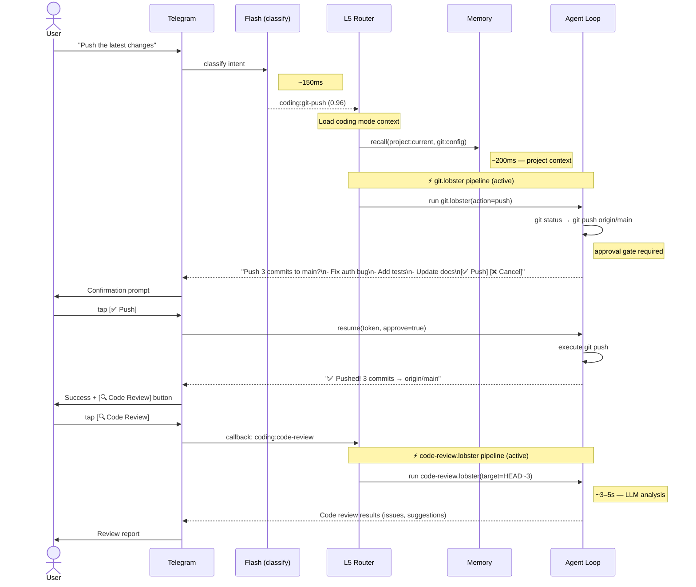
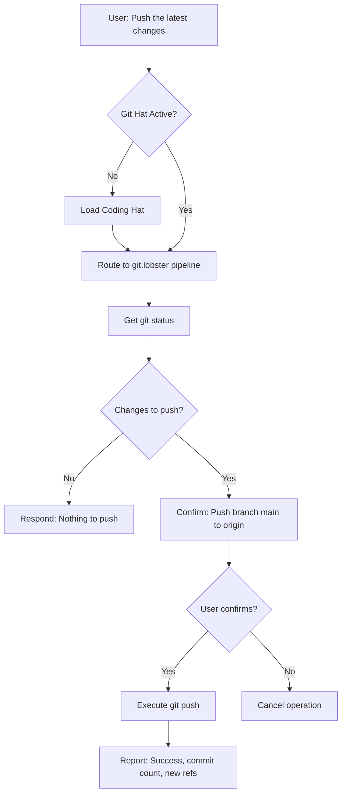
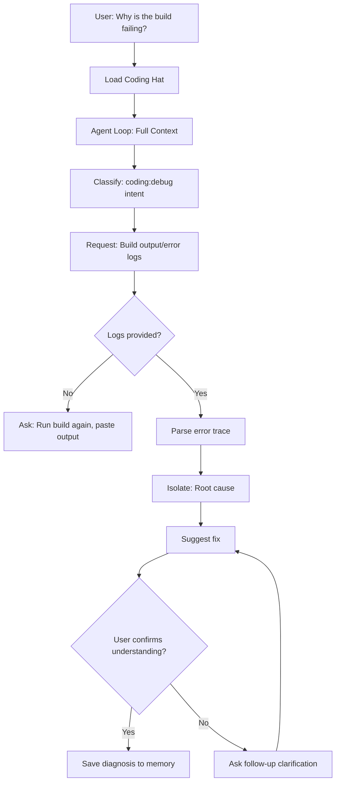
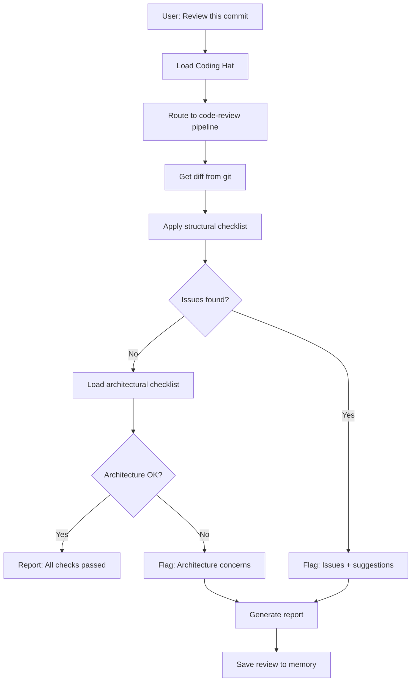
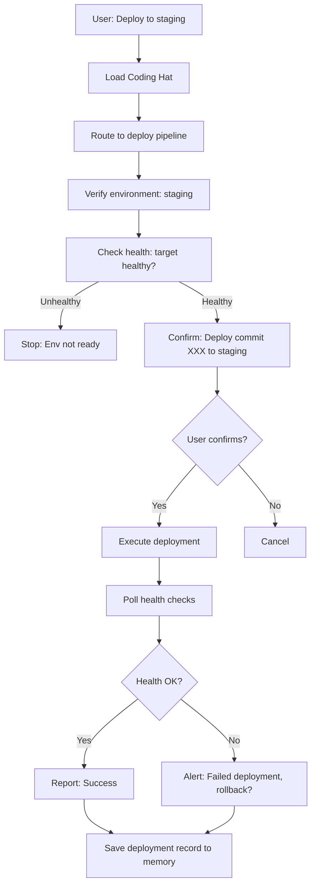
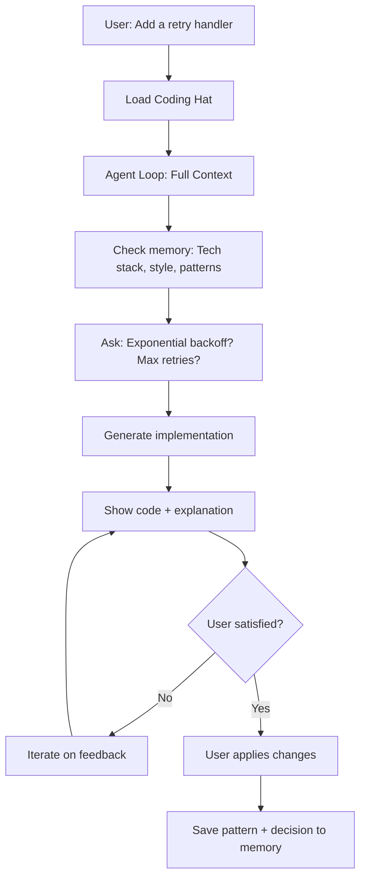
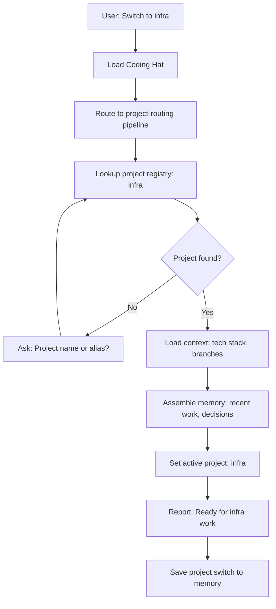
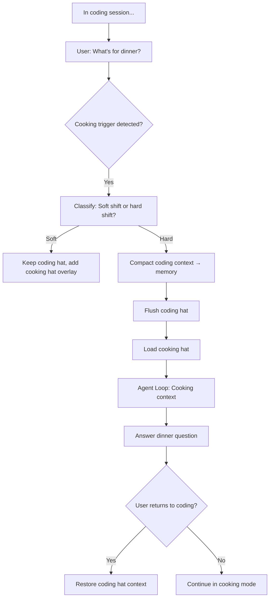
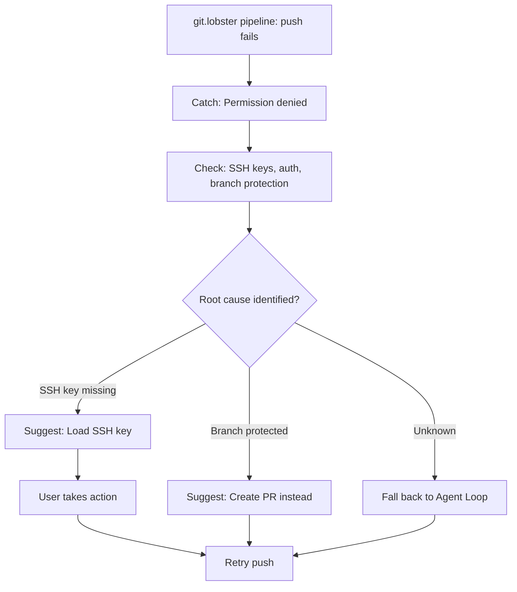

# Coding Category — Conversation Flows

> Example flows with Mermaid diagrams, channel differences, and multi-turn scenarios for coding intents.

**Up →** [[stack/L5-routing/categories/coding/_overview]]

---

## Sequence Diagram — Telegram (Pipeline Annotated)

**Scenario:** Git push with confirmation gate → code review pipeline.

### Speed Impact

| Step | Latency | Adds Latency? |
|---|---|---|
| Flash classify | 100–200ms | LLM call (flash) |
| Mode load | 150–300ms | Project context from memory |
| git.lobster pipeline | 800ms–2s | git exec + approval gate |
| code-review.lobster pipeline | 3–5s | LLM analysis |
| Agent loop (explain/debug) | 1.5–3s | LLM reasoning + code context |
| **Total (git push with approval)** | **~1–2.5s** | — |
| **Total (code review)** | **~3.5–5.5s** | — |

---

## Git Operation Flow

**Trigger:** "Push the latest changes"

**Token cost:** ~150 tokens (lookup + confirmation)

---

## Debugging Flow

**Trigger:** "Why is the build failing?"

**Token cost:** 3K–8K tokens (reasoning + diagnosis)

---

## Code Review Flow

**Trigger:** "Review this commit"

**Token cost:** 2K–4K tokens (checklist lookup + review)

---

## Deploy Flow

**Trigger:** "Deploy to staging"

**Token cost:** ~800 tokens (validation + execution)

---

## Code Writing Flow

**Trigger:** "Add a retry handler to the API client"

**Token cost:** 5K–15K tokens (creative + interactive)

---

## Project Switch Flow

**Trigger:** "Switch to the infra project"

**Token cost:** ~400 tokens (lookup + context assembly)

---

## Topic Shift: Coding → Cooking

**Trigger:** In middle of debugging session, "What's for dinner?"

---

## Error Recovery Flow

**Trigger:** Pipeline fails with "Permission denied" on git push

**Token cost:** 500–1K tokens (diagnostics + fallback)

---

## Multi-Turn: Debugging → Code Review → Deploy

**Full session example:**

1. **Turn 1 (Debug):** User: "Why is the test failing?"
   - Agent loop, diagnose, fix
   - Token cost: 4K

2. **Turn 2 (Review):** User: "Review my fix"
   - Pipeline: code-review
   - Token cost: 2K

3. **Turn 3 (Deploy):** User: "Deploy to staging"
   - Pipeline: deploy
   - Token cost: 800

**Total session cost:** ~6.8K tokens

All three intents stay within the coding hat context. Memory accumulates decisions and patterns across turns.

---

## Channel Differences

### Telegram Flow

Buttons guide the flow:
- User clicks "🐛 Debug" → System shows debug checklist → User selects "Read Error" → Proceeds

### Discord Flow

Slash commands:
- `/debug read-error` → System reads provided error → Proceeds

### Gmail Flow

Linear conversation:
- User sends email with error → System replies with questions → Back-and-forth resolution

---

**Up →** [[stack/L5-routing/categories/coding/_overview]]
