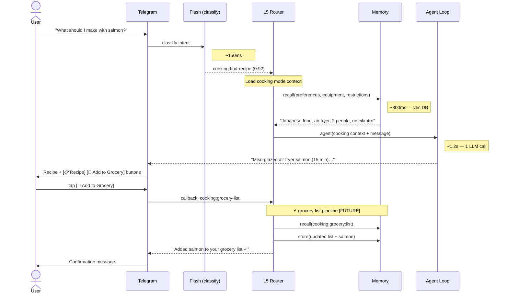
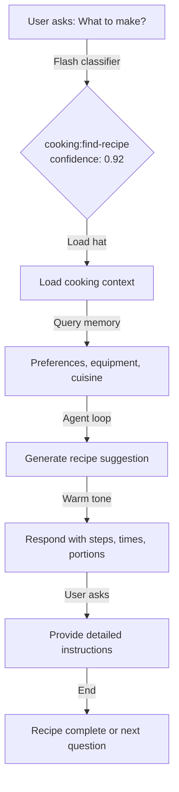
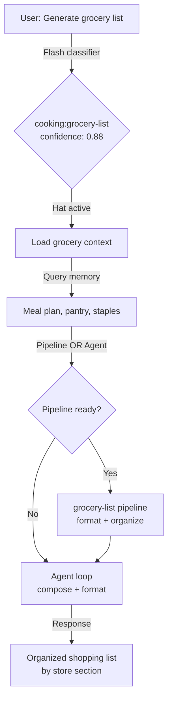
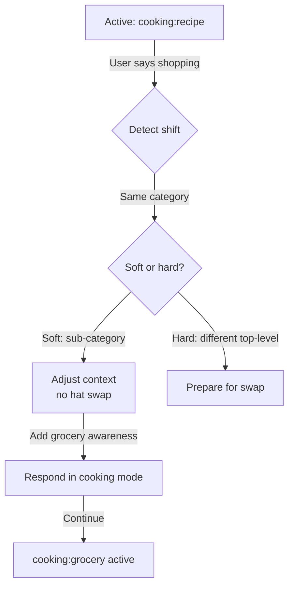
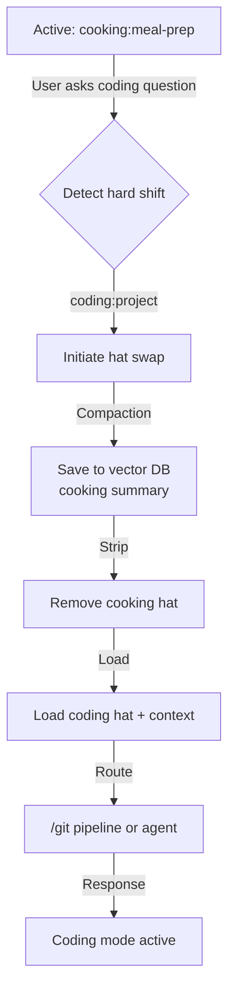
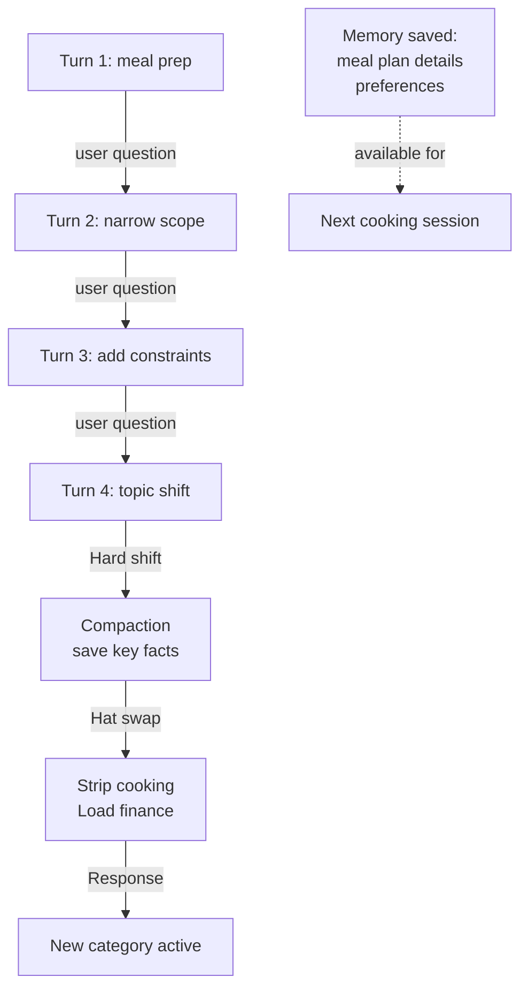

# Cooking Category — Conversation Flows

> Example interaction flows with Mermaid diagrams covering happy paths, topic shifts, and channel differences.

**Up →** [[stack/L5-routing/categories/cooking/_overview]]

---

## Sequence Diagram — Telegram (Pipeline Annotated)

**Scenario:** Recipe discovery → grocery list add via button tap.



### Speed Impact

| Step | Latency | Adds Latency? |
|---|---|---|
| Flash classify | 100–300ms | LLM call (flash) |
| Mode load | 50–150ms | Memory lookup |
| Memory recall | 200–500ms | Vector DB |
| Agent loop (recipe) | 700ms–2s | LLM call |
| grocery-list pipeline [FUTURE] | 400–800ms | No LLM — fast path |
| **Total (recipe discovery)** | **~1.2–3s** | — |
| **Total (grocery add via button)** | **~500ms** | — |

---

## Flow 1: Recipe Discovery (Happy Path)

**Scenario:** User asks for a recipe based on what's available.

```
User: "What should I make for dinner? I have salmon in the fridge"

Flash model → category: cooking:find-recipe (confidence: 0.92)
→ Load cooking hat
→ Query memory: dietary restrictions, cuisine preferences, equipment
→ Memory returns: "Loves Japanese food", "Has air fryer", "Cooking for 2"
→ Route to: agent loop (creative task)

Crispy: "Nice — salmon's versatile. Given you love Japanese flavors and have
the air fryer, how about miso-glazed air fryer salmon? Takes about 15 minutes.
Want me to walk you through it?"

User: "Yes please"

Crispy: [provides step-by-step instructions, times, quantities for 2]
```

### Mermaid Diagram



---

## Flow 2: Grocery List (Pipeline Candidate)

**Scenario:** User needs to generate a grocery list based on meal plan or recipe.

```
User: "I need to go grocery shopping, what do I need?"

Flash model → category: cooking:grocery (confidence: 0.88)
→ Cooking hat already active
→ Query memory: recent meal plan, pantry state, staples list
→ Route to: grocery-list pipeline (when built) OR agent loop (for now)

Crispy: "Based on our meal plan this week, here's what you'll need:

PRODUCE: spinach (1 bunch), asparagus (1 lb), garlic (3 cloves)
DAIRY: butter (unsalted), parmesan (4 oz)
MEAT: salmon fillets (1.5 lbs)
PANTRY: olive oil, soy sauce, sesame oil

[12 total items — organized by store section]"
```

### Mermaid Diagram



---

## Flow 3: Soft Topic Shift (Stays in Hat)

**Scenario:** User shifts cooking sub-categories without leaving cooking mode.

```
User: [talking about cooking salmon]
"Actually, I should add parmesan to the shopping list too"

Flash model → category: cooking:grocery (was cooking:recipe)
→ Sub-category shift detected (same parent category)
→ Adjust context: add grocery pipeline awareness
→ No hat swap needed
→ No compaction needed

Crispy: "Got it — adding parmesan (4 oz) to your list. Anything else?"
```

### Mermaid Diagram



---

## Flow 4: Hard Topic Shift (Hat Swap)

**Scenario:** User exits cooking and enters a different domain.

```
User: [talking about meal prep]
"Oh hey, can you check the git status on the crispy repo?"

Flash model → category: coding:project (was cooking:meal-prep)
→ Topic shift detected: hard (different top-level category)
→ Save cooking context → compaction summary → vector DB
→ Strip cooking hat
→ Load coding hat
→ Route: /git pipeline OR agent loop

Crispy: [compaction saves: meal plan for week, dietary notes]
→ [loads coding context]
"Sure, let me check the git status for you..."
```

### Mermaid Diagram



---

## Flow 5: Multi-Turn Deep Dive with Compaction

**Scenario:** Extended cooking conversation with multiple back-and-forth turns, then topic shift.

```
Turn 1:
User: "I want to meal prep for next week"
Crispy: [loads preferences, suggests approach]

Turn 2:
User: "Can we focus on quick weeknight dinners?"
Crispy: [refine meal plan, 20–30 min meals]

Turn 3:
User: "What about ingredients I already have?"
Crispy: [adjust recipes, query pantry memory]

Turn 4:
User: "OK that works. Hey, can you review my budget spreadsheet?"

[Topic shift → hard]
→ Compaction fires: "Meal plan for 7 days: Mon–Sun dinners ~25 min each,
prioritize pantry items (spinach, chicken). User prefers quick, Italian-style,
cooking for 2. Dietary: no cilantro."
→ [compaction summary saved to vector DB with cooking tag]
→ [strip cooking hat, load finance hat]
```

### Mermaid Diagram



---

## Flow 6: Channel Differences (Telegram vs Discord vs Email)

### Telegram

**Response format:** Inline buttons + markdown text

```
User (Telegram): "What should I make?"

Crispy: 🍳 You love Japanese food and have an air fryer!
How about miso-glazed air fryer salmon?

[📋 Get Recipe]  [🛒 Add to Grocery]  [❌ Exit]

(User clicks [📋 Get Recipe])

Crispy: **Miso-Glazed Air Fryer Salmon** (15 min)

Ingredients:
- 2 salmon fillets
- 2 tbsp miso paste
- 1 tbsp sesame oil
...

[Next Step]  [View All]  [← Back]
```

### Discord

**Response format:** Embeds + select menu + buttons

```
Embed:
Title: 🍳 Cooking Suggestions
Description: Based on your preferences, here are 3 recipes:

1. Miso-Glazed Air Fryer Salmon ⭐ 4.5
2. Pasta Aglio e Olio ⭐ 4.8
3. Stir-Fried Tofu & Broccoli ⭐ 4.3

[Select Menu: Choose recipe for details]
[← Back] [Exit Cooking]

(User selects salmon)

Embed:
Title: Miso-Glazed Air Fryer Salmon
Fields:
- Prep Time: 5 min
- Cook Time: 15 min
- Ingredients: [list]
- Steps: [numbered]

[Add to Grocery] [Rate This] [← Back]
```

### Email

**Response format:** Rich HTML + markdown links

```
Subject: 🍳 Dinner Idea: Miso-Glazed Air Fryer Salmon

Hi Marty,

Based on your Japanese food preference and air fryer, I suggest miso-glazed
salmon (15 minutes, serves 2).

INGREDIENTS:
- 2 salmon fillets (4 oz each)
- 2 tbsp white miso paste
- 1 tbsp sesame oil
- 1 tbsp soy sauce
- 1 tsp honey

STEPS:
1. Mix miso, sesame oil, soy sauce, and honey in a bowl
2. Brush mixture onto salmon fillets
3. Air fry at 400°F for 12–15 minutes until cooked through

SHORTCUTS:
[View Full Recipe](link?action=cooking:recipe:find)
[Add to Grocery List](link?action=cooking:grocery:add)
[Rate This Recipe](link?action=cooking:recipe:rate)
[Exit Cooking Mode](link?action=hat_swap&target=generic)

Happy cooking!
— Crispy
```

### Channel-Specific Rendering Rules

| Element | Telegram | Discord | Email |
|---|---|---|---|
| **Interaction** | Inline buttons | Select menu + buttons | HTML links |
| **Text format** | Markdown | Markdown embeds | HTML + markdown |
| **Buttons** | Up to 6 per row | 5 buttons max | Link buttons |
| **Memory query** | Instant | Instant | Pre-rendered (cached) |
| **Latency budget** | <1s (button tap) | <3s (embed render) | N/A (async) |

---

**Up →** [[stack/L5-routing/categories/cooking/_overview]]
