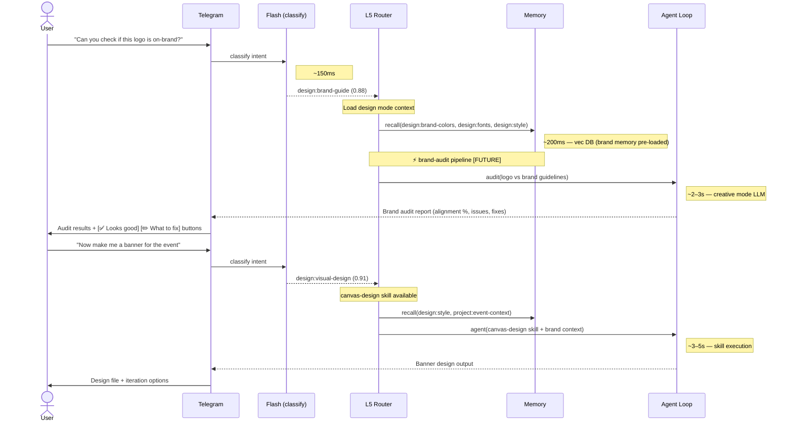

# Design Conversation Flows

> Example interaction flows, channel-specific patterns, and multi-turn scenarios for design conversations.

**Up →** [[stack/L5-routing/categories/design/_overview]]

---

## Sequence Diagram — Telegram (Pipeline Annotated)

**Scenario:** Brand audit request → creative design work.

### Speed Impact

| Step | Latency | Adds Latency? |
|---|---|---|
| Flash classify | 100–200ms | LLM call (flash) |
| Mode load + brand memory | 200–300ms | Vec DB pre-fetch |
| brand-audit pipeline [FUTURE] | 1.5–3s | LLM analysis |
| canvas-design skill | 3–5s | Skill execution |
| Agent loop (wireframe/review) | 2–3s | Creative reasoning |
| **Total (brand audit)** | **~2–3.5s** | — |
| **Total (visual creation)** | **~3.5–5.5s** | — |

---

## Overview

Design conversations typically flow through the agent loop with creative mode, loading skills as needed. Flows vary by intent (wireframe vs. review vs. graphic creation) and by channel (Telegram vs. Discord vs. email).

---

## Key Interaction Patterns

### Wireframe Flow
User initiates with `design:wireframe` intent → Agent asks for context (audience, platform, scope) → Generates layout sketch → User iterates with feedback → Final wireframe saved to context.

### Visual Design Flow
User initiates with `design:visual-design` intent → Agent loads brand memory and style preferences → Creates or refines design → User provides principle-based feedback → Updates applied → Design documented.

### Review Flow
User asks for design feedback (`design:review`) → Agent analyzes against design principles → Provides principle-grounded observations (contrast, alignment, hierarchy, etc.) → User applies feedback or discusses alternatives.

### Presentation Flow
User initiates with `design:new-deck` or `design:edit-deck` → Triggers pptx pipeline → Structure content first, design second → Slide-by-slide iteration → Final deck exported.

### Brand Reference Flow
User asks about brand guidelines (`design:brand-guide`) → Agent retrieves stored brand memory → Returns colors, fonts, rules, and rationale → User may request updates → Save preference to memory.

---

## Memory Sync Points

- **After brand decisions:** Save colors, fonts, spacing rules to memory immediately
- **After style direction is set:** Save descriptive keywords (minimal/bold/playful) to preferences
- **After project-specific design outcome:** Tag and save with project identifier
- **After accessibility requirements stated:** Save to preferences with specific standards (WCAG AA, etc.)

