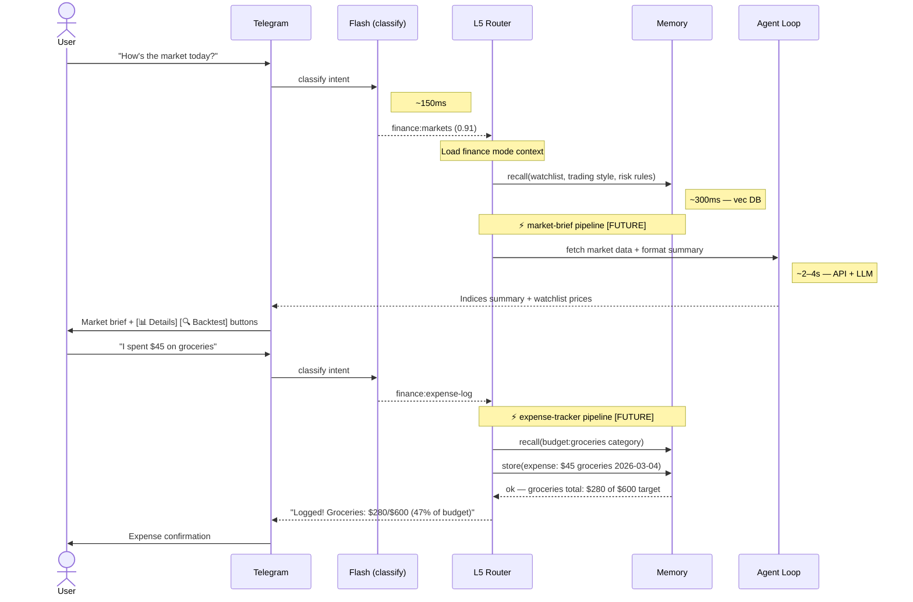
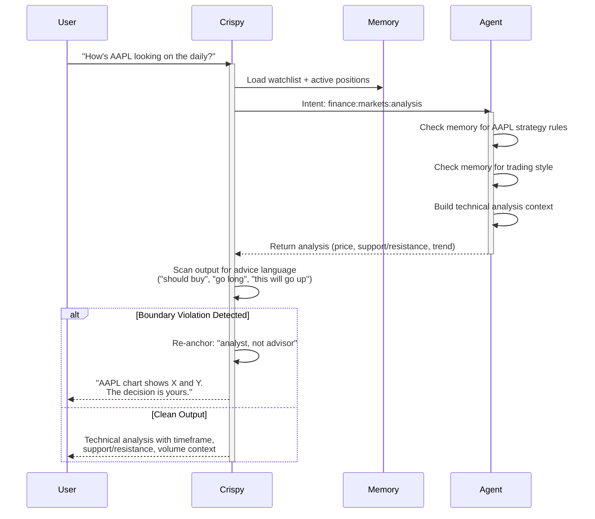
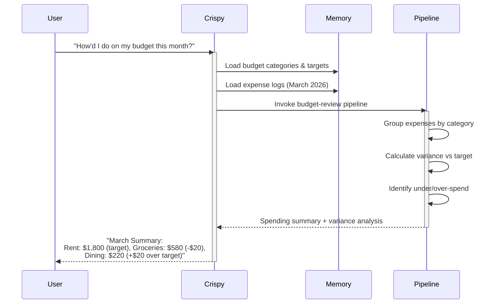
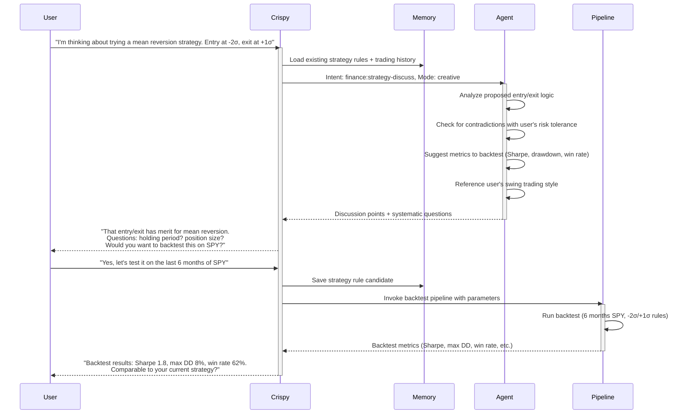
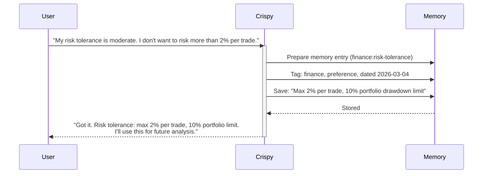

# Conversation Flows — Finance

> Example multi-turn flows with Mermaid diagrams, channel differences, and legal boundary handling.

**Up →** [[stack/L5-routing/categories/finance/_overview]]

---

## Sequence Diagram — Full Pipeline Path (Annotated)

**Scenario:** Market query triggers market-brief pipeline → expense log → budget review.

### Speed Impact

| Step | Latency | Adds Latency? |
|---|---|---|
| Flash classify | 100–200ms | LLM call (flash) |
| Mode load | 20–50ms | Memory lookup |
| market-brief pipeline [FUTURE] | 2–4s | External API + LLM |
| expense-tracker pipeline [FUTURE] | 300–800ms | Memory R/W only |
| Agent loop (analysis) | 2–4s | LLM call + reasoning |
| **Total (market brief)** | **~2.5–4.5s** | — |
| **Total (expense log)** | **~400ms–1s** | — |

---

## Flow: Market Analysis with Legal Boundary

---

## Flow: Budget Review (Local Pipeline)

---

## Flow: Strategy Discussion (Agent Loop)

---

## Flow: Preference Update (Memory Write)

---

## Channel Differences

### Telegram
- Focus Tree rendered as inline menu buttons (emoji + label)
- Analysis responses are more concise (shorter latency expectation)
- Charts/tables rendered as monospace text blocks
- Watchlist updates as quick bullet lists

### Discord
- Focus Tree as button components (with callbacks)
- More detailed analysis with formatted code blocks for metrics
- Embedded images/charts possible
- Thread-based for multi-turn analysis discussions

### Gmail
- Budget reviews can be longer, formatted (markdown → HTML)
- Detailed analysis with charts attached as images
- Strategy discussion as full email threads
- Monthly digest format for budget summaries

---

## Legal Boundary Handling

When drift is detected (advice language, emotional hype, specific recommendations):

1. **Detect:** Output scanner flags language like "you should", "buy", "invest in", "can't afford not to"
2. **Re-anchor:** Inject template: "I can share the analysis, but the decision is yours."
3. **Rephrase:** Reframe as data + user choice:
   - ❌ "You should buy AAPL; it's going up"
   - ✅ "AAPL chart shows bullish divergence on the weekly. Entry/exit are your call."
4. **Context:** Remind user of their risk tolerance and strategy rules (pull from memory)

---

**Up →** [[stack/L5-routing/categories/finance/_overview]]
