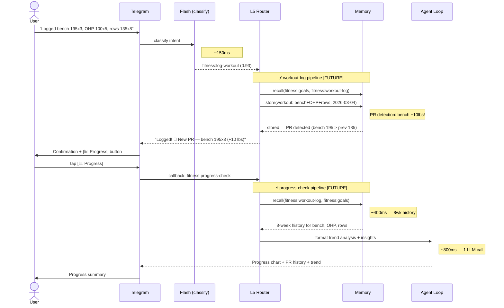

# Fitness Conversation Flows

> Example multi-turn conversation flows with decision trees, memory queries, and channel-specific handling.

**Up →** [[stack/L5-routing/categories/fitness/_overview]]

---

## Sequence Diagram — Telegram (Pipeline Annotated)

**Scenario:** Workout log → progress check with pipeline triggers.



### Speed Impact

| Step | Latency | Adds Latency? |
|---|---|---|
| Flash classify | 100–200ms | LLM call (flash) |
| workout-log pipeline [FUTURE] | 400–800ms | Memory R/W + PR detection |
| progress-check pipeline [FUTURE] | 600ms–1.5s | Memory R + 1 LLM format |
| Agent loop (planning) | 1–2.5s | LLM call + memory load |
| **Total (log workout)** | **~500–900ms** | — |
| **Total (progress check)** | **~700ms–1.7s** | — |

---

## Flow 1: Workout Planning

```
User: "What should I do for upper body today?"

Flash model → category: fitness:workout (confidence: 0.94)
→ Load fitness hat
→ Query memory: current program, last upper body session, equipment, injuries
→ Memory returns: "PPL split", "Last push day: bench 185x3, OHP 95x5", "Home gym", "Right shoulder tweak 2 weeks ago"
→ Route to: agent loop (creative, needs to account for injury)

Crispy: "Since your shoulder is still recovering, let's go lighter on pressing
and heavier on pulling today. How about..."
```

---

## Flow 2: PR Logging (Pipeline Candidate)

```
User: "Just hit 195 on bench for 3!"

Flash model → category: fitness:tracking (confidence: 0.91)
→ Fitness hat already active
→ Detect: new PR (previous: 185x3)
→ Route to: workout-log pipeline (when built) OR agent loop

Crispy: "New PR! 195x3 on bench — that's a 10lb jump from last time.
Saving that. At this rate you're tracking well toward your 225 goal."
→ Memory write: PR update with date
```

---

## Flow 3: Nutrition Cross-Category

```
User: "How much protein should I eat on training days?"

Flash model → category: fitness:nutrition (confidence: 0.85)
→ Fitness hat active
→ Cross-category query: pull cooking:nutrition memories too
→ Memory returns: "180g protein target", "Cooking for 2", "Loves Japanese food"
→ Route to: agent loop (informational)

Crispy: "Based on your training volume and current intake (~180g), you're
right in the range. On heavy training days you might bump to 200g.
Want me to suggest some high-protein meals with ingredients you usually have?"
→ If yes: soft shift to cooking:meal-prep (hat swap)
```

---

## Flow 4: Goal Setting (Planning Framework Applied)

```
User: "I want to be able to do 10 pull-ups by summer"

Flash model → category: fitness:goals (confidence: 0.89)
→ Fitness hat active
→ Planning framework triggered (goal-setting intent)
→ SMART applied in fitness context:
  - Specific: 10 strict pull-ups, dead hang start
  - Measurable: current max? (query memory or ask)
  - Achievable: assess based on current strength + timeline
  - Relevant: fits with current program?
  - Time-bound: "by summer" → June 1 = ~13 weeks

Crispy: "Great goal. How many can you do right now? That'll help me
figure out a realistic progression — whether we're going from 0 to 10
or 5 to 10 is a very different program."
```

---

## Channel-Specific Adaptations

### Telegram

- **Short-form:** Keep responses compact (2-3 sentences max for quick exchanges)
- **Buttons:** Offer "Log Workout", "My PRs", "Next Workout?" buttons
- **Followup:** Use replies to maintain context thread
- **Images:** Emoji-based form cues, no complex diagrams

### Discord

- **Rich embeds:** Use embeds for workout summaries, PR tables
- **Threads:** Create thread for multi-turn planning sessions
- **Code blocks:** Render program designs in markdown code blocks for readability
- **Reactions:** Add emoji reactions to confirm logs, PRs

### Gmail

- **Text-first:** Full explanations with step-by-step guidance
- **Lists:** Numbered workout steps, structured recommendations
- **Tables:** Use markdown tables for program layouts
- **Detailed:** Assume less frequent, longer-form messages

---

## Multi-Turn: Program Design Session

```
Turn 1:
User: "Build me a 4-day program"
Crispy: [Ask clarifying questions about goal, experience, equipment]

Turn 2:
User: [Provides details: "Hypertrophy, 3 years experience, home gym"]
Crispy: [Confirms details, asks about weak points or injuries]

Turn 3:
User: [Responds with injury history]
Crispy: [Generates program, shows week 1-2 explicitly, describes progression logic]

Turn 4:
User: "How do I progress this?"
Crispy: [Explains rep/weight progression, deload weeks, when to change exercises]
```

---

## Decision Tree: Recovery vs Training

```
User asks: "Should I work out today?"

Query memory: Last 7 days of workouts
├─ High volume recent + fatigue mentioned
│  ├─ Confidence: "You should rest" (0.85)
│  └─ Route: Agent loop + rest-day-check pipeline
├─ Moderate volume + feels fine
│  ├─ Confidence: "You can go" (0.7)
│  └─ Route: Agent loop + quick workout suggestion
└─ Low volume + no mention of fatigue
   ├─ Confidence: "Yes, go" (0.9)
   └─ Route: Agent loop + detailed workout plan
```
