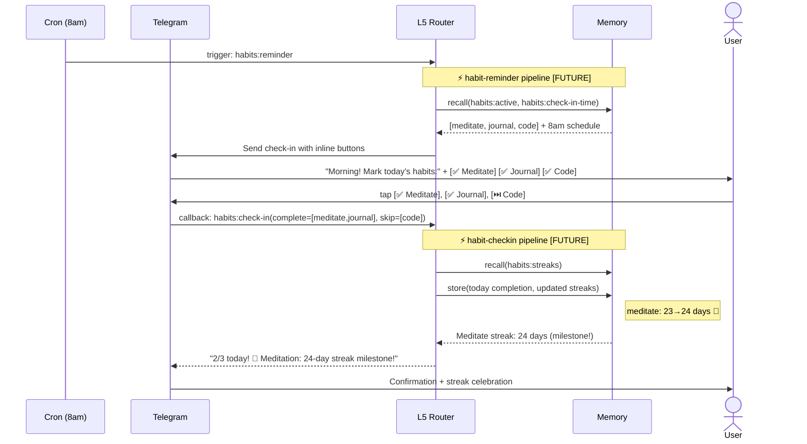
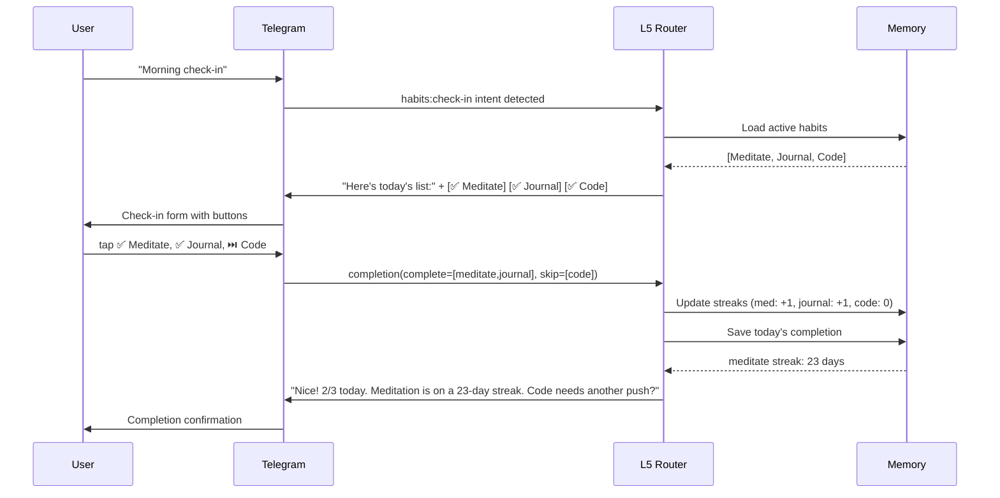
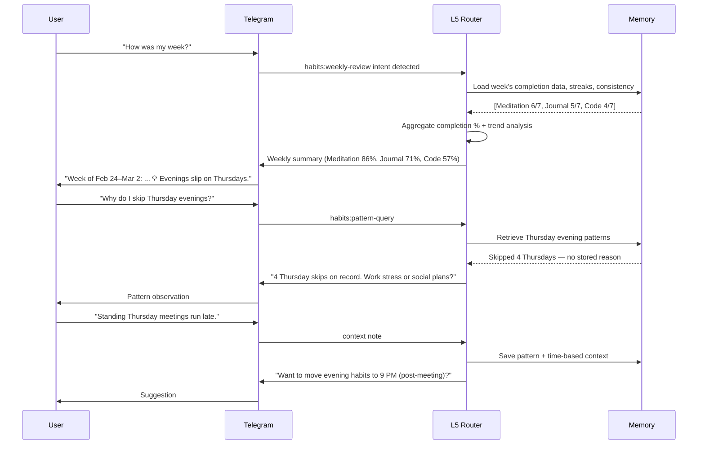

# Habits: Conversation Flows

> Multi-turn conversation flows and channel-specific behavior for habits interactions.

**Up →** [[stack/L5-routing/categories/habits/_overview]]

---

## Sequence Diagram — Telegram (Pipeline Annotated)

**Scenario:** Cron reminder → daily check-in → streak milestone.



### Speed Impact

| Step | Latency | Adds Latency? |
|---|---|---|
| habit-reminder pipeline [FUTURE] | 200–400ms | Memory R only — no LLM |
| habit-checkin pipeline [FUTURE] | 200–500ms | Memory R/W — no LLM |
| streak milestone detection | ~50ms | jq comparison only |
| **Total (reminder send)** | **~250–500ms** | — |
| **Total (check-in response)** | **~300–600ms** | — |

---

## Flow 1: Daily Check-In (habit-checkin pipeline)



---

## Flow 2: Weekly Review (habit-review pipeline)



---

## Flow 3: New Habit Formation (agent loop + memory write)

```
User: "I want to start meditating every morning"
      ↓
Router: Detect habits:new-habit intent
      ↓
Agent: Apply SMART+ framework
        "Let's define this together:
        - What: Meditate
        - When: Every morning (what time?)
        - Duration: How long? (5 min, 10 min, 20 min?)
        - Cue: What triggers it? (alarm, coffee, sunrise?)
        - Reward: What's the payoff? (calm mind, energy boost?)"
      ↓
User: "7:00 AM, 10 minutes, right after coffee, makes me calm"
      ↓
SMART+ Summary:
        - Specific: Sit quietly and focus on breath
        - Measurable: 10 consecutive minutes
        - Achievable: Starting tomorrow
        - Relevant: Reduces stress
        - Time-bound: Daily, 7:00 AM
        - Cue: After morning coffee
        - Reward: Calmness
        - Cross-category: [habits:tracking + mental-health:wellness]
      ↓
Save to memory: Full habit record + cue/reward framework
      ↓
Response: "Got it! Starting tomorrow, 7 AM meditation after coffee.
          Let's check in every morning to keep the streak going."
      ↓
(Optional: Set cron reminder for 7 AM if user consents)
```

---

## Flow 4: Habit Adjustment (habit-update pipeline)

```
User: "The 30-minute meditation is too long. Can we try 10?"
      ↓
Router: Detect habits:adjust-habit intent
      ↓
Habit-update: Fetch current "Meditation" record
        Current: 30 min daily at 7 AM, streak 12 days
      ↓
Modification: Change duration to 10 min
Preserve: Streak and start date
      ↓
Save: Old params (30 min) → New params (10 min), reasoning
      ↓
Response: "Perfect! Meditation is now 10 minutes daily at 7 AM.
          Your 12-day streak stays intact. Let's see if this sticks better."
      ↓
(Follow-up after 3 days: check if 10 min is working)
```

---

## Flow 5: Pause/Retire Habit

```
User: "Pause the gym habit while I'm traveling"
      ↓
Router: Detect habits:pause-habit intent
      ↓
Habit-update: Fetch "Exercise 3x/week" record
        Current: Streak 18 days, active status
      ↓
Modification: Status = "paused", paused_reason = "Traveling"
Preserve: All historical data, streak milestone
      ↓
Save: Pause event with date and reason
      ↓
Response: "Gym habit paused. Your 18-day streak is saved.
          When you're back, we'll pick it back up."
      ↓
(When user returns: "Welcome back. Ready to restart gym habit?")
```

---

## Channel-Specific Flows

### Telegram

- **inline buttons** for quick check-in (✅, ⏭️)
- **cron reminders** at user's preferred time
- **daily summary** as formatted text message
- **streaks** with emoji visualization

### Discord

- **slash commands** for check-in, review, add, pause
- **/habit report weekly** renders as embed with colors
- Multi-turn conversation in thread
- Reactions (✅, ⏭️) for quick feedback if preferred

### Gmail

- **weekly digest** sent Sunday evening
- Habit summary + consistency report
- No inline interactions (read-only)
- Link to Telegram for active check-in

---

## Multi-Turn Patterns

**Clarification loop:**
```
User: "Check in"
Bot: Which habits? (All / specific ones?)
User: "Just meditation and code"
Bot: [Check-in form for those two]
```

**Context escalation:**
```
User: "I skipped meditation 4 days straight"
Bot: Fetch history → "This is your lowest point since Jan 15.
     What's going on?"
User: "Got sick for a few days"
Bot: Save health note + offer gentle restart
```

**Streak preservation:**
```
User: "I'm leaving for vacation for 5 days"
Bot: "Want to pause habits or keep tracking?"
User: "Pause"
Bot: Save paused state, preserve streaks
(Return from vacation)
User: "Back home, let's restart"
Bot: Restart habits with preserved streaks
```

---

**Up →** [[stack/L5-routing/categories/habits/_overview]]
