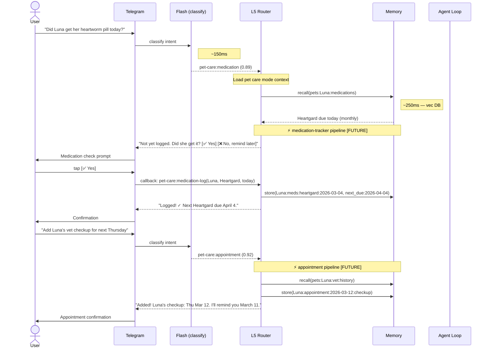

# Pet Care Conversation Flows

> Example multi-turn conversation flows, channel-specific variations, and interaction patterns for pet care.

**Up →** [[stack/L5-routing/categories/pet-care/_overview]]

---

## Sequence Diagram — Telegram (Pipeline Annotated)

**Scenario:** Medication reminder → feeding log → vet appointment booking.



### Speed Impact

| Step | Latency | Adds Latency? |
|---|---|---|
| Flash classify | 100–200ms | LLM call (flash) |
| Mode load | 50–100ms | Memory lookup |
| medication-tracker pipeline [FUTURE] | 300–700ms | Memory R/W — no LLM |
| appointment pipeline [FUTURE] | 300–600ms | Memory R/W — no LLM |
| Agent loop (health advice) | 1–2.5s | LLM call + context |
| **Total (medication check)** | **~400–900ms** | — |
| **Total (appointment add)** | **~400–800ms** | — |

---

## Flow 1: Medication Reminder

**Scenario:** Proactive alert that a medication is due.

```
Cron check → Heartgard due today

Crispy (Telegram): "🐾 Luna's Heartgard is due today!
Did she get it?
[✅ Yes, logged]  [⏰ Remind in 2 hours]  [❌ Already done]"

User taps: [✅ Yes, logged]

Crispy: "Got it! ✓ Heartgard logged for Luna.
Next dose: April 4, 2026 🗓️"
```

---

## Flow 2: Feeding Check

**Scenario:** User asks about feeding schedule.

```
User: "When did Luna last eat?"

Flash model → category: pet-care:feeding (confidence: 0.87)
→ Load pet care mode
→ Query memory: pets:Luna:feeding-log
→ Memory returns: "Morning feed 7:30am (chicken & rice), 2 cups"

Crispy: "Luna's last meal was this morning at 7:30am — 2 cups of
chicken & rice. She's due for her evening meal around 6pm."
```

---

## Flow 3: Training Milestone

**Scenario:** Log a training achievement.

```
User: "Luna just learned 'leave it'!"

Flash model → category: pet-care:training (confidence: 0.91)
→ Load pet care mode
→ Check memory: commands known
→ Route to: training-log pipeline (when built) OR agent loop

Crispy: "Excellent! 🎉 'Leave it' is a big one. Logged!

Known commands: sit, stay, come, shake, lie down, leave it (new!)

That's 6 commands. Ready to start working on 'place'?"
```

---

## Channel Differences

### Telegram
- Medication confirmations as inline buttons (✅ Yes / ❌ No / ⏰ Remind later)
- Feeding schedule as quick bullets with timestamps
- Appointment cards with date + reminder button

### Discord
- Vet appointment details in embeds with fields (date, vet, reason)
- Training progress as table in message
- Medication schedule as embedded list

### Email
- Monthly pet health digest (medications due, vet appointments, training progress)
- Async format — no inline buttons; link-based actions
- Full medication history as attachment

---

**Up →** [[stack/L5-routing/categories/pet-care/_overview]]
