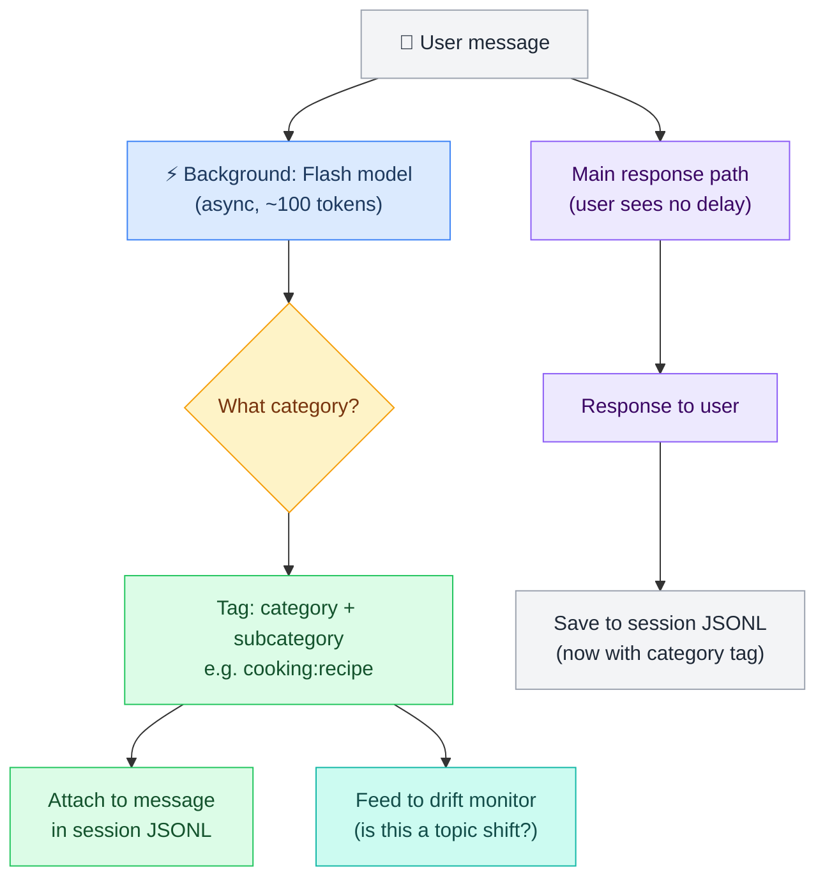
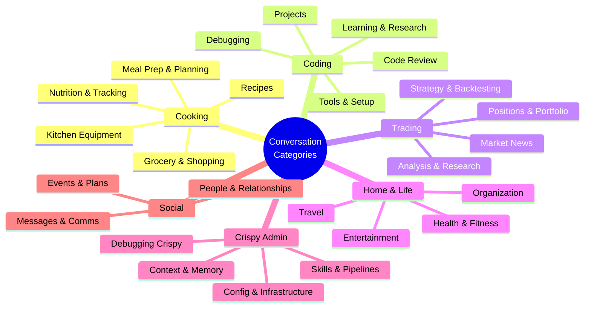
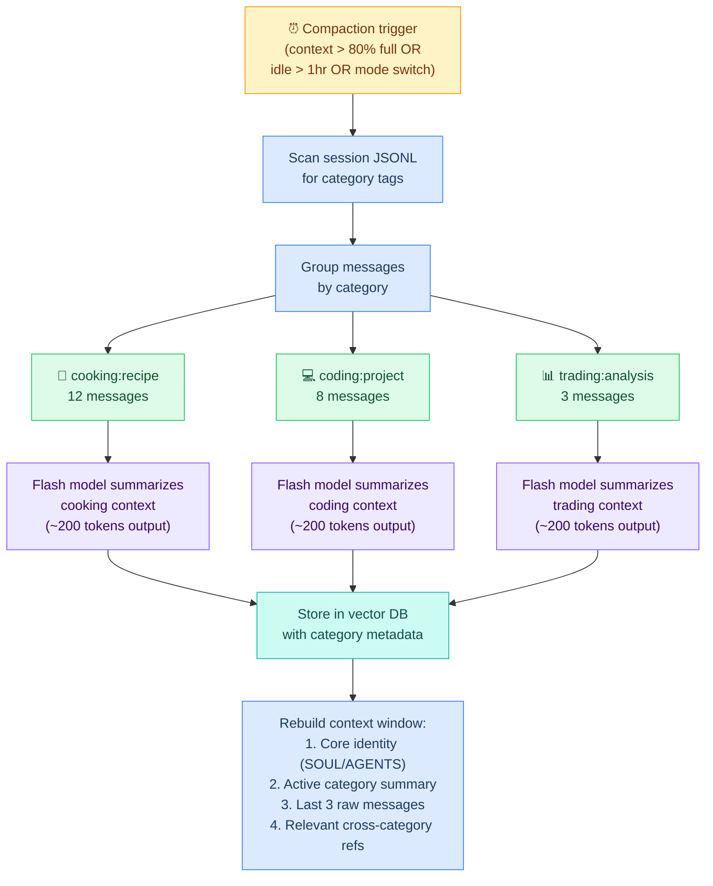
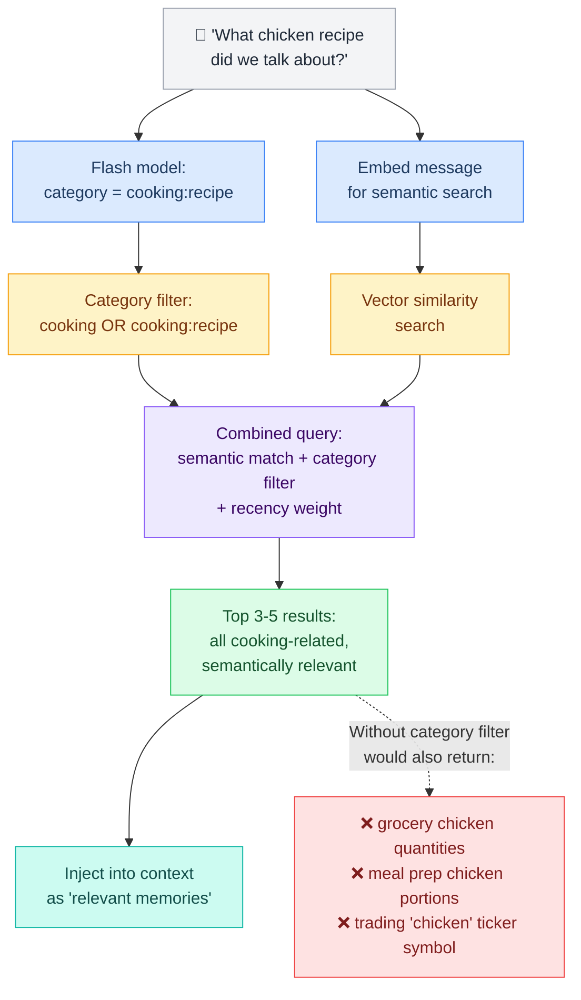
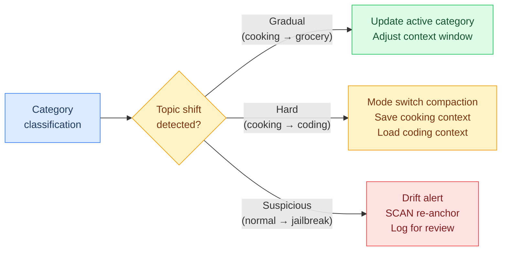

# L5 — Conversation Flows (Category-Aware Context Intelligence)

> How L5 detects conversation categories, compacts context by topic, filters memory retrieval, and prevents drift through context hygiene. This is the hypothesis: **can we compress context into topic categories and filter them in the background with a cheap model?**

**Up →** [[stack/L5-routing/_overview]]

---

## The Hypothesis

Raw conversation context is noisy. A 30-message thread about cooking might drift into a grocery list, then into meal prep, then back to a specific recipe. When compaction fires, a naive summarizer loses the nuance — it can't tell whether "chicken" means "I need to buy chicken" or "I'm cooking chicken parmesan."

**If we categorize conversation segments before compaction, we can:**
1. Produce per-category summaries that preserve domain-specific context
2. Store them in the vector DB with category metadata
3. Pull back exactly the right memories when a topic resurfaces
4. Prevent drift by keeping the context window focused on the active category

The flash model runs this classification in the background — zero impact on the user-facing response latency.

---

## Real Conversation — What Happens on Each Side

A full exchange showing the user (left, Telegram) and Crispy (right, the system). Gray annotations show what the system is doing behind the scenes at each step.

```
  👤 USER (Telegram)                            🖥️ CRISPY (System)
  ─────────────────                             ─────────────────

                                                ┌─ SESSION START ─────────────────┐
                                                │ 🟣 Bootstrap loads (~34K)       │
                                                │   SOUL, AGENTS, IDENTITY,       │
                                                │   TOOLS, USER                   │
                                                │ 🔵 MEMORY.md + daily logs       │
                                                │ 🟢 HEARTBEAT checks health      │
                                                └─────────────────────────────────┘

  ┌────────────────────────┐
  │ "Hey Crispy!"          │ ──────────────►    ⚡ Trigger words: greeting
  └────────────────────────┘                    🟢 Pipeline path (0 tokens)
                                                No LLM needed

                              ◄──────────────   ┌────────────────────────────────┐
                                                │ "Hey Marty! What's up?"        │
                                                └────────────────────────────────┘

  ┌────────────────────────┐
  │ "What chicken recipe   │ ──────────────►    ⚡ Flash classifier (async):
  │  did we talk about     │                      category: cooking:recipe
  │  last week?"           │                    🔍 Vector DB query:
  └────────────────────────┘                      filter: cooking:recipe
                                                  semantic: "chicken recipe"
                                                  temporal: last 7 days
                                                📎 Found: "Chicken parmesan
                                                  with fresh mozzarella,
                                                  San Marzano tomatoes"
                                                🔴 Agent loop (needs reasoning
                                                  to compose answer)

                              ◄──────────────   ┌────────────────────────────────┐
                                                │ "Last Tuesday we talked about  │
                                                │  chicken parmesan — the        │
                                                │  version with fresh mozzarella │
                                                │  and San Marzano tomatoes.     │
                                                │  Want me to pull up the full   │
                                                │  recipe?"                      │
                                                └────────────────────────────────┘

  ┌────────────────────────┐
  │ "Yeah! And can you add │ ──────────────►    ⚡ Flash classifier:
  │  the ingredients to my │                      category: cooking:grocery
  │  grocery list?"        │                    🟡 Button path (ambiguous):
  └────────────────────────┘                      "add to list" — which list?
                                                  Build decision tree (~800 tk)

                              ◄──────────────   ┌────────────────────────────────┐
                                                │ "Sure! Which list?"            │
                                                │                                │
                                                │  ┌──────────┐ ┌────────────┐  │
                                                │  │ 🛒 Costco │ │ 🏪 Trader  │  │
                                                │  │   Run     │ │   Joe's    │  │
                                                │  └──────────┘ └────────────┘  │
                                                │  ┌──────────┐ ┌────────────┐  │
                                                │  │ 📝 Quick  │ │ ➕ New     │  │
                                                │  │   List    │ │   List     │  │
                                                │  └──────────┘ └────────────┘  │
                                                └────────────────────────────────┘
                                                  (buttons, 60s timeout)

  ┌────────────────────────┐
  │ [taps 🛒 Costco Run]   │ ──────────────►    ⚡ Callback: tree_id + option
  └────────────────────────┘                    🟢 Pipeline path (0 tokens)
                                                  grocery-add.lobster runs
                                                  Adds 6 ingredients to
                                                  "Costco Run" list

                              ◄──────────────   ┌────────────────────────────────┐
                                                │ "Added 6 items to Costco Run:  │
                                                │  mozzarella, San Marzano       │
                                                │  tomatoes, chicken breast,     │
                                                │  basil, pasta, parmesan."      │
                                                └────────────────────────────────┘

 ─ ─ ─ ─ ─ ─ ─ ─ ─ ─ ─ ─  topic shift  ─ ─ ─ ─ ─ ─ ─ ─ ─ ─ ─ ─ ─ ─ ─ ─ ─

  ┌────────────────────────┐
  │ "Actually, can you     │ ──────────────►    ⚡ Flash classifier:
  │  help me debug my      │                      category: coding:debug
  │  Python script? It's   │                    ⚠️ CATEGORY SHIFT detected
  │  throwing a weird      │                      cooking → coding
  │  error."               │
  └────────────────────────┘                    ┌─ COMPACTION FIRES ─────────────┐
                                                │ Save cooking segment:          │
                                                │   cooking:recipe  (2 msgs)     │
                                                │   cooking:grocery (2 msgs)     │
                                                │ Flash summarizes each group    │
                                                │ Store in vector DB             │
                                                │ Load 🔴 coding hat:           │
                                                │   ^mode-coding                 │
                                                │   ^tree-coding                 │
                                                │   ^filter-coding               │
                                                └────────────────────────────────┘
                                                🔴 Agent loop (full reasoning
                                                  for debug help)

                              ◄──────────────   ┌────────────────────────────────┐
                                                │ "On it! What's the error       │
                                                │  message and which script?"    │
                                                └────────────────────────────────┘

  ┌────────────────────────┐
  │ "It's in parser.py,    │ ──────────────►    🔴 Agent loop continues
  │  line 42. Getting      │                    Tool call: read file
  │  'IndexError: list     │                    Tool call: analyze error
  │  index out of range'"  │                    (2-3 tool loops, ~5K tokens)
  └────────────────────────┘

                              ◄──────────────   ┌────────────────────────────────┐
                                                │ "Found it! Line 42 assumes     │
                                                │  the CSV has 5+ columns but    │
                                                │  some rows only have 3.        │
                                                │  Here's the fix:               │
                                                │                                │
                                                │  if len(row) >= 5:             │
                                                │      process(row[4])           │
                                                │                                │
                                                │  Want me to apply it?"         │
                                                └────────────────────────────────┘

  ┌────────────────────────┐
  │ "Yes please!"          │ ──────────────►    ⚡ Trigger: approval
  └────────────────────────┘                    🟢 Pipeline path
                                                  code-apply.lobster runs
                                                  (sandboxed file edit)

                              ◄──────────────   ┌────────────────────────────────┐
                                                │ "Done! Applied the fix to      │
                                                │  parser.py:42. Run your        │
                                                │  script again to test."        │
                                                └────────────────────────────────┘

 ─ ─ ─ ─ ─ ─ ─ ─ ─ ─  15 min later...  ─ ─ ─ ─ ─ ─ ─ ─ ─ ─ ─ ─ ─ ─ ─ ─ ─

                                                ┌─ HEARTBEAT (every 20 min) ────┐
                                                │ 🟢 Flash model health check   │
                                                │   Drift score: 0.82 (ok)      │
                                                │   Active hat: coding           │
                                                │   Session tokens: ~45K / 150K  │
                                                └────────────────────────────────┘

 ─ ─ ─ ─ ─ ─ ─ ─ ─ ─ ─  topic returns  ─ ─ ─ ─ ─ ─ ─ ─ ─ ─ ─ ─ ─ ─ ─ ─ ─

  ┌────────────────────────┐
  │ "It works! Thanks.     │ ──────────────►    ⚡ Flash classifier:
  │  Oh btw, I also want   │                      category: cooking:recipe
  │  to try that chicken   │                    ⚠️ CATEGORY SHIFT: coding →
  │  parm recipe tonight.  │                      cooking
  │  What temp for the     │                    🔍 Vector DB query:
  │  oven?"                │                      filter: cooking:recipe
  └────────────────────────┘                      Found: chicken parm summary
                                                  (from earlier this session!)

                                                ┌─ COMPACTION FIRES ─────────────┐
                                                │ Save coding segment:           │
                                                │   coding:debug (4 msgs)        │
                                                │ Swap hat: coding → cooking     │
                                                │ Load ^mode-cooking             │
                                                │ Inject recalled recipe memory  │
                                                └────────────────────────────────┘

                              ◄──────────────   ┌────────────────────────────────┐
                                                │ "For the chicken parm —        │
                                                │  preheat to 400°F. Bread the   │
                                                │  chicken, pan-fry 3 min/side,  │
                                                │  then bake 15 min with the     │
                                                │  San Marzano sauce and fresh   │
                                                │  mozz on top. You already      │
                                                │  have everything on your       │
                                                │  Costco list!"                 │
                                                └────────────────────────────────┘
                                                  ↑ Recalled grocery list from
                                                    earlier cooking:grocery
                                                    segment — dual-tag worked
```

### What This Conversation Shows

| Exchange | Routing Path | Tokens Used | Why |
|---|---|---|---|
| Greeting | 🟢 Pipeline | 0 | Trigger word match, no LLM needed |
| Recipe recall | 🔴 Agent loop | ~3K | Memory retrieval + natural language answer |
| Grocery list | 🟡 Buttons | ~800 | Ambiguous "which list?" resolved via buttons |
| Button tap | 🟢 Pipeline | 0 | Callback lookup + pipeline execution |
| Debug request | 🔴 Agent loop | ~5K | Multi-turn reasoning with tool calls |
| Approval "yes" | 🟢 Pipeline | 0 | Approval trigger → sandboxed file edit |
| Recipe return | 🔴 Agent loop | ~2K | Memory recall + hat swap + answer |

**Total conversation: 7 user messages, ~11K tokens.** Without pipeline routing, every message would hit the agent loop (~35K+ tokens for the same conversation).

---

## Context Window Lifecycle (Visual)

The 150K-token context window fills, triggers, compacts, and reloads like a progress bar. Each color represents a different type of content:

```
PHASE 1 — Bootstrap (session start)
━━━━━━━━━━━━━━━━━━━━━━━━━━━━━━━━━━━━━━━━━━━━━━━━━━━━━━━━━━━━━━━━━━━━━━━━━━━━━━━━━━━━━
[██████████████████████                                                              ]
 ▓▓▓▓▓▓▓▓▓▓▓▓▓▓▓▓▓▓▓▓▓▓                                                    ~34K / 150K
 ┊                     ┊
 ┊  🟣 SOUL (~1K)      ┊
 ┊  🟣 AGENTS (~4K)    ┊
 ┊  🟣 IDENTITY (~0.5K)┊
 ┊  🟣 TOOLS (~1K)     ┊
 ┊  🟣 USER (~2K)      ┊
 ┊  🔵 MEMORY.md (~3K) ┊
 ┊  🔵 Daily logs (~4K)┊
 ┊  🟢 BOOT + STATUS   ┊
 ┊  🟢 HEARTBEAT (~1K) ┊
 ┊                     ┊
 └─── bootstrap ───────┘


PHASE 2 — Conversation fills up (messages accumulate)
━━━━━━━━━━━━━━━━━━━━━━━━━━━━━━━━━━━━━━━━━━━━━━━━━━━━━━━━━━━━━━━━━━━━━━━━━━━━━━━━━━━━━
[██████████████████████░░░░░░░░░░░░░░░░░░░░░░░░░░░░░░░░░░░░░                         ]
 ▓▓▓▓▓▓▓▓▓▓▓▓▓▓▓▓▓▓▓▓▓▓░░░░░░░░░░░░░░░░░░░░░░░░░░░░░░░░░░░░               ~80K / 150K
 ┊                     ┊                                    ┊
 ┊  🟣 Bootstrap       ┊  🟡 Message 1 (cooking:recipe)    ┊
 ┊  (same as above)    ┊  🟡 Message 2 (cooking:recipe)    ┊
 ┊                     ┊  🟡 Message 3 (cooking:grocery)   ┊
 ┊                     ┊  🟠 Tool call + result            ┊
 ┊                     ┊  🟡 Message 4 (coding:debug)      ┊
 ┊                     ┊  🟡 Message 5 (coding:debug)      ┊
 ┊                     ┊  🟠 Tool call + result            ┊
 ┊                     ┊  🟡 ...more messages...           ┊
 ┊                     ┊                                    ┊
 └─── bootstrap ───────┘──── conversation ──────────────────┘

  ⚡ Flash model tags each message with category in background (async, ~100 tokens)
  ⚡ At turn 5: SCAN re-anchoring fires (category confirmation + self-summary)


PHASE 3 — Intent detected! Compaction triggers
━━━━━━━━━━━━━━━━━━━━━━━━━━━━━━━━━━━━━━━━━━━━━━━━━━━━━━━━━━━━━━━━━━━━━━━━━━━━━━━━━━━━━
  Context is getting full (~120K). L5 detects intent through trigger words +
  conversation pattern. Time to compact.

  WHAT STAYS (kept in context window):
  ┌──────────────────────────────────────────────┐
  │ 🟣 Bootstrap files (always kept)             │
  │ 🟡 Messages leading to the intent (last 3-5) │
  │ 🟠 Active tool results                       │
  └──────────────────────────────────────────────┘

  WHAT GETS SENT TO BACKGROUND LLM (flash model):
  ┌──────────────────────────────────────────────┐
  │ 🟡 Older messages → grouped by category:     │
  │    cooking:recipe  (msgs 1-2)  → summary A   │
  │    cooking:grocery (msg 3)     → summary B   │
  │    coding:debug    (msgs 4-5)  → summary C   │
  │                                               │
  │ ⚡ Flash model summarizes each group (~200    │
  │   tokens per group, preserves domain nuance)  │
  │                                               │
  │ 💾 Summaries stored in vector DB with:        │
  │    {category, subcategory, tags, embedding,   │
  │     decay_anchor, session_id}                 │
  └──────────────────────────────────────────────┘


PHASE 4 — Reloaded context with focus hat
━━━━━━━━━━━━━━━━━━━━━━━━━━━━━━━━━━━━━━━━━━━━━━━━━━━━━━━━━━━━━━━━━━━━━━━━━━━━━━━━━━━━━
[██████████████████████░░░░░░░░████████░░░░░░░░░                                     ]
 ▓▓▓▓▓▓▓▓▓▓▓▓▓▓▓▓▓▓▓▓▓▓░░░░░░░░████████░░░░░░░░░                          ~55K / 150K
 ┊                     ┊       ┊        ┊        ┊
 ┊  🟣 Bootstrap       ┊ 🟡   ┊🔴 Focus┊ 🟡    ┊
 ┊  (same as always)   ┊ Last  ┊  hat   ┊ Room   ┊
 ┊                     ┊ 3-5   ┊context ┊ for    ┊
 ┊                     ┊ msgs  ┊(mode,  ┊ new    ┊
 ┊                     ┊ kept  ┊tree,   ┊ msgs   ┊
 ┊                     ┊       ┊filter) ┊        ┊
 └─── bootstrap ───────┘─kept──┘──hat───┘─free───┘

  🔴 Focus hat loaded based on detected category:
     ^mode-{slug}     — tone, rules, personality overlay
     ^tree-{slug}     — button navigation structure
     ^filter-{slug}   — memory query filters for this category
     ^triggers-{slug} — intent patterns for routing

  🔵 Relevant memories pulled from vector DB using ^filter-{slug}
     (category-filtered, temporally decayed, MMR-reranked)

  The context window is now compact, focused, and ready for the next
  batch of messages. Cycle repeats from Phase 2.
```

### Color Key

| Color | What | Token Range | Lifecycle |
|---|---|---|---|
| 🟣 Purple | Bootstrap context files (SOUL, AGENTS, IDENTITY, TOOLS, USER) | ~8K | Always present, never compacted |
| 🔵 Blue | Long-term memory (MEMORY.md, daily logs) | ~7K | Refreshed at session start, pruned at compaction |
| 🟢 Green | Session management (BOOT, STATUS, HEARTBEAT) | ~2K | Lightweight, always present |
| 🟡 Yellow | User/assistant messages | 0→100K+ | Accumulates, then compacted by category |
| 🟠 Orange | Tool calls and results | Varies | Kept if active, pruned if old |
| 🔴 Red | Focus hat (category-specific context) | ~3-5K | Loaded after intent detection, swapped on category change |

### The Compaction Cycle

```
   ┌─────────────────────────────────────────────────┐
   │                                                 │
   ▼                                                 │
FILL ──→ context grows ──→ ~120K threshold           │
                              │                      │
                              ▼                      │
                     DETECT intent                   │
                     (trigger words +                │
                      flash classifier)              │
                              │                      │
                              ▼                      │
                     COMPACT by category             │
                     (flash model, background)       │
                              │                      │
                     ┌────────┴────────┐             │
                     ▼                 ▼             │
              KEEP in context    STORE in DB         │
              (last 3-5 msgs,    (per-category       │
               bootstrap,        summaries with      │
               active tools)     embeddings)         │
                     │                               │
                     ▼                               │
              RELOAD with hat                        │
              (^mode + ^filter                       │
               + relevant memories)                  │
                     │                               │
                     └───────────────────────────────┘
```

---

## Flow 1 — Conversation Category Classification

Every message (or small message group) gets a category tag from the flash model, running asynchronously behind the main response:



### The Classification Prompt (flash model)

```
Given this message in a conversation, classify it:

Message: "{user_message}"
Recent context: "{last_3_messages_summary}"

Reply with JSON:
{
  "category": "<top-level>",
  "subcategory": "<specific>",
  "confidence": <0.0-1.0>,
  "topic_shift": <true/false>
}
```

**Cost:** ~100 tokens per classification on the flash model. At $0.10/M tokens, that's functionally free.

---

## Flow 2 — The Category Tree (Starter)

Flat to start, grows into hierarchy as patterns emerge. These are seeded from Marty's actual usage patterns:



### Category Growth Rules

- **New categories emerge from usage**, not from upfront planning
- If the flash model returns `confidence < 0.5` more than 3 times in a cluster, that's a signal for a new category
- Subcategories only split when there are 10+ memories in a single category with clearly different retrieval needs
- The tree lives in a config file that L5 reads at runtime — no code changes needed to add categories

---

## Flow 3 — Category-Aware Compaction

Instead of compacting the entire conversation into one summary, L5 groups by active categories and produces separate summaries:



### Compaction Summary Prompt (flash model, per category)

```
Summarize this conversation segment about {category}:{subcategory}.

Preserve:
- Specific decisions made
- Key facts mentioned (names, quantities, preferences)
- Open questions or next steps
- User preferences revealed

Messages:
{messages_in_this_category}

Output a concise summary (max 200 tokens) that would let a future
conversation about {category} pick up exactly where this left off.
```

### What Gets Kept vs Flushed

| Keep | Flush |
|---|---|
| Per-category summaries (vector DB) | Raw message history beyond last 3 |
| Active category summary (in context) | Inactive category details |
| Key decisions from all categories | Conversational filler |
| Cross-category references | Duplicate/repeated information |
| User preferences revealed | Classification metadata |

---

## Flow 4 — Category-Filtered Memory Retrieval

When a topic resurfaces, L5 queries the vector DB with both semantic content AND a category filter:



### Retrieval Strategy

| Signal | Weight | Why |
|---|---|---|
| Semantic similarity | 0.4 | Core relevance to the query |
| Category match | 0.3 | Filters out same-word different-domain noise |
| Recency | 0.2 | Recent memories more likely relevant |
| Interaction count | 0.1 | Frequently discussed = more important |

---

## Flow 5 — Drift Prevention Through Context Hygiene

This is where category-aware compaction becomes a **drift safeguard**. Drift-guardian research shows:

- Context window position matters: U-shaped attention curve means middle content gets **30%+ less attention**
- Persona consistency degrades **>30% after 8-12 dialogue turns**
- **The most recent user message drives drift** (R² = 0.53-0.77), not accumulated history

Category-aware context management directly addresses all three:

```mermaid
flowchart TD
    subgraph PROBLEM["🔴 Without Category Awareness"]
        P1["Long conversation<br>mixes cooking + coding + trading"]:::red
        P1 --> P2["Naive compaction produces<br>one muddled summary"]:::red
        P2 --> P3["Model loses track of<br>which domain it's in"]:::red
        P3 --> P4["Persona drifts: starts giving<br>coding advice in cooking tone,<br>or cooking advice with<br>engineering precision"]:::red
        P4 --> P5["Memory retrieval pulls<br>wrong-domain results"]:::red
        P5 --> P6["Context corruption<br>compounds over sessions"]:::red
    end

    subgraph SOLUTION["🟢 With Category Awareness"]
        S1["Long conversation<br>mixes cooking + coding + trading"]:::green
        S1 --> S2["Category-aware compaction<br>produces separate summaries"]:::green
        S2 --> S3["Context window loads ONLY<br>the active category"]:::green
        S3 --> S4["Model stays grounded in<br>current domain context"]:::green
        S4 --> S5["Memory retrieval is<br>category-filtered: precise"]:::green
        S5 --> S6["Each session leaves<br>clean category memories"]:::green
    end

    classDef red fill:#fee2e2,stroke:#ef4444,color:#7f1d1d
    classDef green fill:#dcfce7,stroke:#22c55e,color:#14532d
```



### The Category-Drift Connection

| Drift Type | How Category Awareness Helps |
|---|---|
| **Persona drift** | Active category tells the model "you're in cooking mode" — acts as implicit SCAN re-anchoring |
| **Factual drift** | Category-filtered retrieval pulls domain-accurate memories, not cross-domain noise |
| **Boundary drift** | Category boundaries define what's in-scope for the current conversation segment |

### Integration with Drift-Guardian

The flash model's background classification also feeds drift monitoring:



---

## The Full Data Loop (Category-Aware)

How this fits the existing L5-L6-L7 cycle:

```
User message arrives
  → L5 classifies category (flash model, async)
  → L5 filters memory by category (vector DB query)
  → L5 shapes context window (active category + identity + last 3 messages)
  → L6 processes with focused context
  → L7 stores response with category tag
  → When compaction fires:
      → L5 groups by category
      → Flash model summarizes per category
      → Summaries stored in vector DB with category metadata
      → Context rebuilt around active category
```

---

## Resolved Questions (2026-03-04)

- [x] **Category persistence across sessions:** Smart detect — each session starts neutral, flash classifier re-detects category from first message. If it matches previous category, seamless continuation. If not, clean switch. No timer, no carry-over state. → [[decisions-log]]
- [x] **Cross-category references:** Dual-tag — messages spanning categories (e.g., "I built a meal planner app") get tagged under both. Retrievable from either hat's memory filter. More storage, richer recall. → [[decisions-log]]
- [x] **Compaction granularity:** Per-category-segment — group messages by category within a session, then summarize each group independently. Preserves domain nuance across mixed-topic sessions. → [[decisions-log]]
- [x] **Vector DB schema:** Locked. Required fields: `{category, subcategory, timestamp, session_id, summary, embedding, tags, decay_anchor}`. `tags` supports dual-tagging for cross-category messages. `decay_anchor` supports 30-day temporal decay separate from `timestamp`. Cross-referenced in [[stack/L7-memory/memory-search]].
- [x] **SCAN re-anchoring integration:** Yes — category classification doubles as re-anchoring signal. Every 5 turns, L5 compaction injects a re-anchoring step. The flash classifier re-confirms category, and L6 generates a self-summary. Spec defined in L4/L5/L6 cross-layer notes.

## Open Questions

- [ ] **Category merge/split rules:** When does "cooking:recipe" split into "cooking:recipe:italian" vs "cooking:recipe:asian"? What's the trigger threshold? (Deferred — implementation-phase question, needs usage data.)
- [ ] **Flash model prompt tuning:** The category tree needs to be in the flash model's prompt. How do we keep that prompt lean as categories grow? (Deferred — implementation-phase, depends on category count.)

---

## Implementation Phases

| Phase | What | Depends On |
|---|---|---|
| **1 — Category classifier** | Flash model prompt + category tree config file | Nothing — can prototype now |
| **2 — Tagged session JSONL** | Add category field to session log entries | Phase 1 |
| **3 — Category-aware compaction** | Modify compaction to group by category | Phase 2 |
| **4 — Filtered memory retrieval** | Add category metadata to vector DB, modify L5 queries | Phase 3 + L7 schema update |
| **5 — Drift integration** | Feed category shifts to drift monitor, SCAN re-anchoring | Phase 1 + drift-guardian setup |
| **6 — Category evolution** | Auto-detect new categories from low-confidence clusters | Phase 4 + usage data |

---

## The Two-Checkpoint System

Categories are implemented through a **hat architecture** with two rewind checkpoints. See [[stack/L5-routing/categories/_overview]] for the full design.

- **Checkpoint 1 (Base Role):** SOUL + AGENTS + IDENTITY — always active, the drift floor
- **Checkpoint 2 (Base + Hat):** Base role + category-specific context injection + filtered memories

Individual category hats define trigger words, intents, pipeline maps, memory filters, and drift signals:
- [[stack/L5-routing/categories/cooking/_overview]] — 🍳 Recipes, grocery, meal prep, nutrition
- [[stack/L5-routing/categories/coding/_overview]] — 💻 Projects, debugging, tools, review
- [[stack/L5-routing/categories/finance/_overview]] — 💰 Markets, budgeting, investing, planning
- [[stack/L5-routing/categories/fitness/_overview]] — 💪 Workouts, tracking, recovery, goals
- [[stack/L5-routing/categories/pet-care/_overview]] — 🐾 Health, feeding, training, grooming
- [[stack/L5-routing/categories/design/_overview]] — 🎨 UI/UX, graphic, presentations, brand
- [[stack/L5-routing/categories/habits/_overview]] — 🔄 Tracking, streaks, new habits, adjustments

---

## See Also

- [[stack/L5-routing/message-routing]] — The three routing paths this feeds into
- [[stack/L5-routing/categories/_overview]] — Hat architecture, checkpoint system, category inventory
- [[stack/L5-routing/_overview]] — Context shaping and compaction strategy (current)
- [[stack/L7-memory/memory-search]] — Vector DB and memory retrieval (L7 side)
- [[stack/L5-routing/guardrails]] — Drift prevention guardrails

---

**Up →** [[stack/L5-routing/_overview]]
