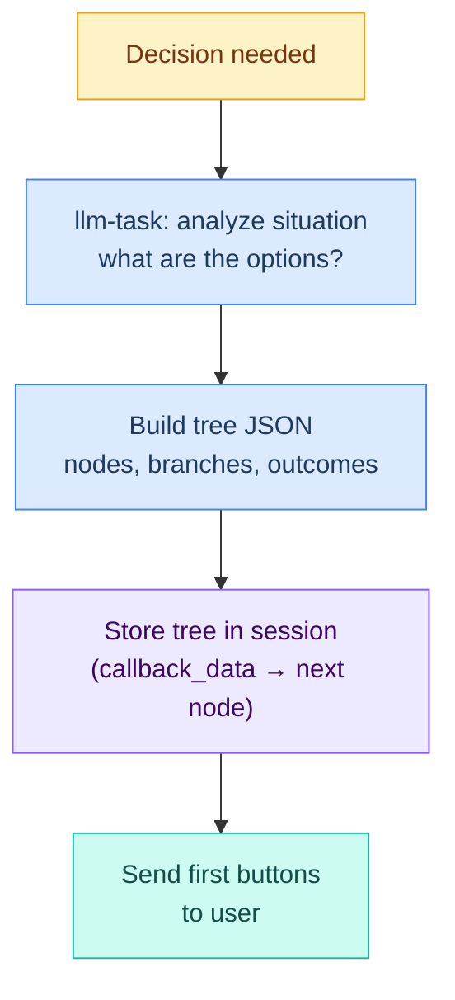
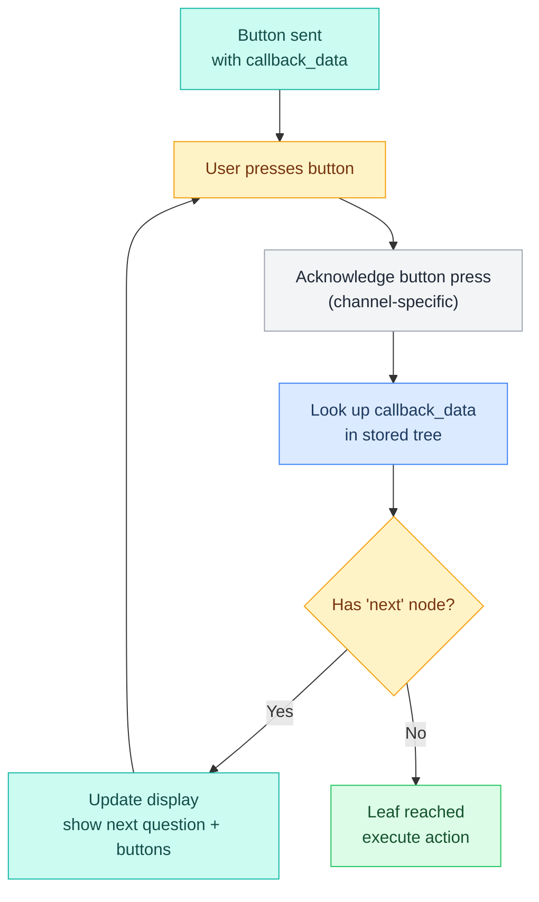

# Decision Trees — Generic Routing Pattern

> A decision tree is a structured way to present multi-level choices to users, one level at a time. Instead of overwhelming the user with a wall of text, build a tree of buttons (or numbered options) and guide them through it one decision at a time until an outcome is reached.

---

## What is a Decision Tree?

A decision tree is a JSON object that represents a series of questions and possible outcomes:

```
┌─ Root Question ─────────────┐
│  "What area needs work?"    │
│  [⚙️ Config] [🔧 Pipeline]  │
└────────────────────────────┘
    │                  │
    ▼                  ▼
┌─ Level 2 ──┐    ┌─ Level 2 ──┐
│ Config     │    │ Pipeline   │
│ [Models]   │    │ [Research] │
│ [Agents]   │    │ [Skill]    │
└────────────┘    └────────────┘
    │ (leaf)          │ (leaf)
    ▼                 ▼
┌─ OUTCOME ──┐    ┌─ OUTCOME ──┐
│ Fix Models │    │ Run Brief  │
└────────────┘    └────────────┘
```

Each node contains:
- A **question** or prompt
- **Buttons/options** that the user can choose from
- Either a **next node** (branch) or an **action** (leaf outcome)

### Tree Structure (JSON)

```json5
{
  "id": "root",
  "question": "What area needs attention?",
  "buttons": [
    { "text": "⚙️ Config", "data": "area:config", "next": "config_section" },
    { "text": "🔧 Pipeline", "data": "area:pipeline", "next": "pipeline_which" },
    { "text": "🧠 Memory", "data": "area:memory", "next": "memory_type" }
  ],
  "children": {
    "config_section": {
      "question": "Which config section?",
      "buttons": [
        { "text": "Models", "data": "config:models", "next": null, "action": "fix_models" },
        { "text": "Agents", "data": "config:agents", "next": null, "action": "fix_agents" },
        { "text": "Channels", "data": "config:channels", "next": null, "action": "fix_channels" }
      ]
    },
    "pipeline_which": {
      "question": "Which pipeline?",
      "buttons": [
        { "text": "📚 Research", "data": "pipe:research", "next": null, "action": "run_research" },
        { "text": "🎓 Skill", "data": "pipe:skill", "next": null, "action": "run_skill" },
        { "text": "🏠 Workspace", "data": "pipe:workspace", "next": null, "action": "run_workspace" }
      ]
    },
    "memory_type": {
      "question": "What about memory?",
      "buttons": [
        { "text": "Daily logs", "data": "mem:daily", "next": null, "action": "check_daily" },
        { "text": "MEMORY.md", "data": "mem:long", "next": null, "action": "curate_memory" },
        { "text": "Mem0 setup", "data": "mem:mem0", "next": null, "action": "setup_mem0" }
      ]
    }
  }
}
```

| Key | Meaning |
|---|---|
| `id` | Unique identifier for this node |
| `question` | The prompt to show the user |
| `buttons` | Array of options; each has `text`, `data`, `next` |
| `text` | Button label (1-3 words + emoji) |
| `data` | Callback identifier (format: `prefix:value`) |
| `next` | Node ID to branch to; `null` = leaf (outcome) |
| `action` | What the agent does when this leaf is selected |
| `children` | Map of child nodes (keyed by node ID) |

---

## When to Use Decision Trees

Use decision trees when:

- **3+ possible paths forward** — more than binary choice, less than overwhelming list
- **The choice affects what you do next** — not informational; the decision matters
- **The user must decide** — not a default or obvious choice
- **Multi-level decisions** — choice A leads to sub-choices, not a flat menu

**Example:** "Should I fix the config or run a pipeline?" → yes, use a tree.

---

## When NOT to Use Decision Trees

**Don't** use decision trees for:

- **Binary yes/no** — just ask in text or use 2 buttons (flat)
- **Informational lists** — "Here are some options to consider" with no action
- **Time-sensitive decisions** — buttons add latency (~500ms); if urgent, just act
- **Single level with 2 buttons** — approve-deny pattern is built-in, use that instead
- **More than 3 levels deep** — users get lost; flatten or switch to text input

---

## How to Build a Decision Tree

### Step 1: Map All Branches & Outcomes FIRST

Before sending anything, map out:
- All possible paths from the root
- Every leaf outcome (the action Crispy takes)
- Max depth per branch

**Bad:** Start sending buttons, figure it out as you go.
**Good:** Build the full JSON, store it, then send the root.

### Step 2: Structure as a Tree

- **Root level** = the initial question (always sent first)
- **Branch levels** = sub-questions that lead deeper
- **Leaf level** = outcome nodes with actions, no further branches



### Step 3: Design Rules

| Rule | Why |
|---|---|
| **Max 4 buttons per level** | More than 4 is hard to scan; mobile-friendly |
| **Max 3 levels deep** | Deeper trees frustrate users; flatten or ask text instead |
| **Every leaf = action** | No dead ends; always do something when a leaf is reached |
| **Short button labels** | 1-3 words + emoji; readability on mobile |
| **Consistent callback format** | `prefix:value` (e.g., `area:config`, `fix:models`) |
| **Store full tree in session** | Callback data alone isn't enough; need tree for navigation |

---

## The Callback Loop

Once the tree is sent, users navigate it by pressing buttons/selecting options.



**Key insight:** After looking up the callback data:
1. If `next` is not null → show the next level of buttons (don't spam new messages; update the same one)
2. If `next` is null → it's a leaf; execute the `action` and confirm to the user

---

## Channel-Specific Rendering

Different channels render decision trees differently. The tree structure is generic, but how users interact with it depends on the channel.

### Telegram: Inline Keyboard Buttons

Telegram renders buttons as an inline keyboard below the message.

```
What area needs attention?

[⚙️ Config] [🔧 Pipeline]
[🧠 Memory]
```

- Buttons are clickable; press one to navigate
- When you press a button, the **same message is edited** with the next level
- Telegram shows a loading spinner on the button until the agent responds
- See **[[stack/L3-channel/telegram/chat-flow]]** for implementation details

### Discord: Button Components

Discord renders buttons as interactive components (buttons with custom_id values).

```
What area needs attention?

[⚙️ Config] [🔧 Pipeline] [🧠 Memory]
```

- Buttons are components in an ActionRow (max 5 buttons per row)
- Can style buttons (Primary/Secondary/Success/Danger)
- When pressed, Discord sends an InteractionCreate event
- See **[[stack/L3-channel/discord/chat-flow]]** for implementation details

### Gmail: Numbered Text Options

Gmail doesn't support buttons, so decision trees are rendered as text with numbered options.

```
What area needs attention?

1. ⚙️ Config
2. 🔧 Pipeline
3. 🧠 Memory

Reply with your choice (1, 2, or 3)
```

- Tree is presented as numbered list
- User replies with the number (no buttons, just text input)
- Agent processes the number and navigates the tree
- No visual button interaction, but same logic

---

## Bootstrap Context

Agents need to know when and how to use decision trees. This context goes in `AGENTS.md`:

```markdown
## Decision Trees

When you face a multi-path decision, DON'T dump options as text. Build a decision tree with buttons.

### When to Use
- 3+ possible paths forward
- The choice affects what you do next (not just informational)
- The user needs to make the call (not a default/obvious choice)
- Multi-level decisions (choice A leads to sub-choices)

### When NOT to Use
- Binary yes/no (just ask in text or use 2 buttons)
- Informational ("here are some options" with no action)
- Time-sensitive (buttons add latency)

### How to Build Them
1. FIRST: Map out ALL branches and leaf outcomes before sending anything
2. Structure as a tree: root question → branches → sub-branches → leaf actions
3. Keep each level to 2-4 buttons (never more than 4)
4. Each button label should be short (1-3 words + emoji)
5. Use callback_data format: "category:choice" (e.g., "area:config")

### How to Walk the Tree
1. Send the root question with buttons
2. When the user presses a button, EDIT the same message (don't send new)
3. Show the next level of buttons
4. Repeat until a leaf node is reached
5. At the leaf, execute the action and confirm what you did

### Callback Data Convention
- Format: `prefix:value` (e.g., `area:config`, `fix:models`, `run:research`)
- Always store the full tree in your working context so you can look up any callback
- Answer every callback query (channel-specific requirement)
```

---

## Tree-Building Pipeline

For complex scenarios where the agent needs to **generate** a tree from structured data (not pre-defined):

```yaml
name: decision-tree
args:
  context:
    default: ""
  root_question:
    default: "What would you like to do?"
steps:
  - id: build_tree
    command: >
      openclaw.invoke --tool llm-task --action json
      --args-json '{
        "prompt": "Given this context, build a decision tree as JSON. Rules:\n- Max 4 buttons per level\n- Max 3 levels deep\n- Every leaf must have an action\n- Use callback_data format prefix:value\n- Keep button text to 1-3 words + emoji\n\nRoot question: $root_question\n\nContext: $context",
        "schema": {
          "type": "object",
          "properties": {
            "id": { "type": "string" },
            "question": { "type": "string" },
            "buttons": { "type": "array" },
            "children": { "type": "object" }
          }
        },
        "maxTokens": 1500
      }'

  - id: send_root
    command: >
      openclaw.invoke --tool agent_send --action send
      --args-json '{
        "content": "$stdin.question",
        "buttons": "$stdin.buttons"
      }'
    stdin: $build_tree.stdout
```

---

## Design Decisions (Open)

- [ ] Should the agent auto-generate trees, or use pre-defined templates?
- [ ] Add "← Back" button to navigate up the tree?
- [ ] Timeout: if no button press in 5 min, prompt the user or auto-cancel?
- [ ] Should callback history be logged for debugging?
- [ ] How do we handle invalid button presses (user tries to go back after the window closes)?

---

## Related

- **[[stack/L3-channel/telegram/chat-flow]]** — Telegram implementation details (channel-specific rendering)
- **[[stack/L3-channel/discord/chat-flow]]** — Discord implementation details (channel-specific rendering)
- **[[stack/L3-channel/telegram/button-patterns]]** — The 4 Telegram button interaction patterns
- **[[stack/L4-session/bootstrap]]** — Bootstrap context for agents
- **[[stack/L5-routing/categories/_overview]]** — Focus Mode Tree system (uses decision trees as Focus Trees)

**Up →** [[stack/L5-routing/_overview]]
