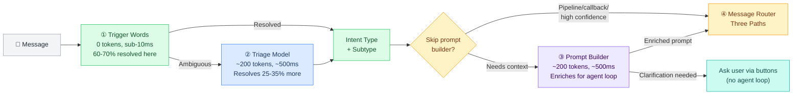
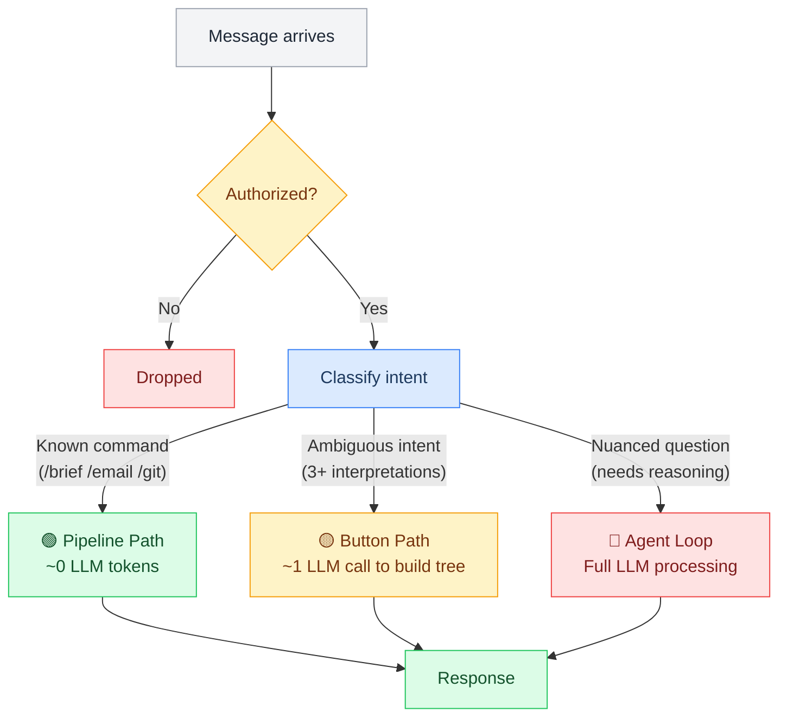
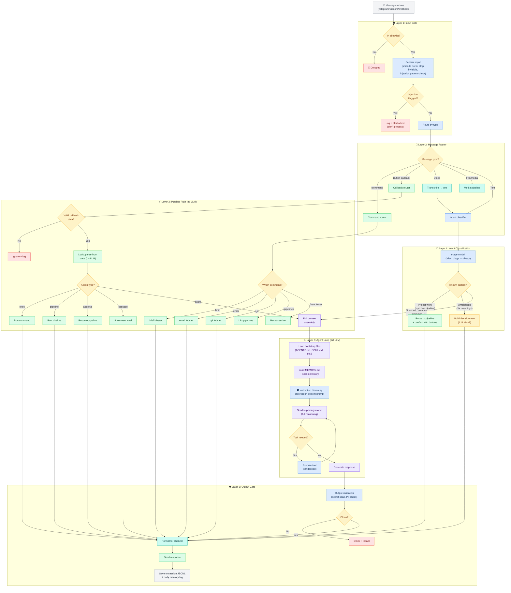
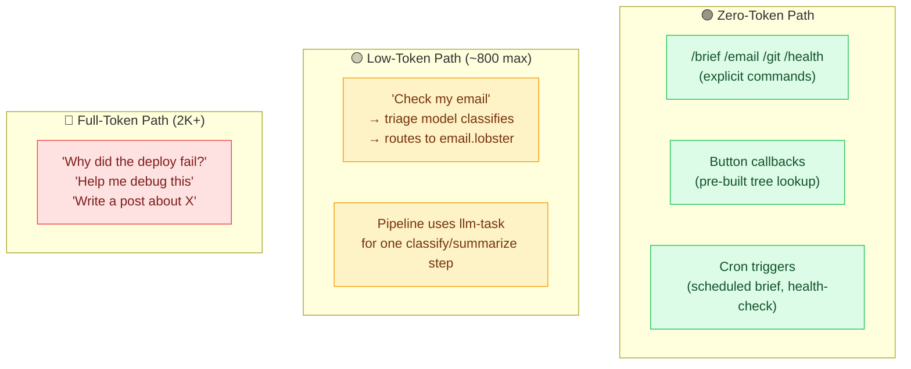
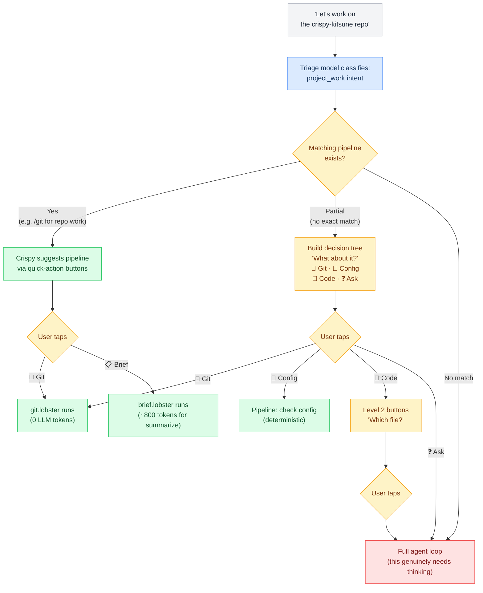
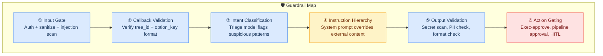

# L5 — Message Routing (Decisions)

> How incoming messages are classified and routed to the right handler: the classification pipeline (trigger words → triage model → prompt builder → router), the three execution paths (Pipeline, Button, Agent), and the decision rules that determine which path each message takes.

**Up →** [[stack/L5-routing/_overview]]

---

## The Classification Pipeline

Before a message reaches the three routing paths, it passes through a four-stage classification pipeline. Each stage is cheaper and faster than the next, and most messages are resolved before reaching the expensive stages:



| Stage | What It Does | Cost | Coverage | Doc |
|---|---|---|---|---|
| **① Trigger Words** | Regex/keyword scan → resolves intent type | 0 tokens | ~60-70% | [[#The Classification Pipeline]] |
| **② Triage Model** | Cheap LLM classifies ambiguous messages | ~200 tokens | ~25-35% | [[#The Classification Pipeline]] |
| **③ Prompt Builder** | Enriches raw message with context, file paths, approach | ~200 tokens | Agent-bound only | [[stack/L6-processing/pipelines/prompt-builder]] |
| **④ Message Router** | Routes classified intent to Pipeline / Button / Agent | 0 tokens | 100% | This document |

**Five Intent Types** (resolved by stages ① or ②):

| Type | What User Wants | Crispy's Role | Example |
|---|---|---|---|
| **ℹ️ Informational** | An answer or explanation | Answerer | "What is a lobster pipeline?" |
| **🤝 Assistance** | Guided help through a process | Facilitator | "Help me set up Discord" |
| **⚡ Action** | Something executed | Executor | "Turn on the sandbox" / "Push to git" |
| **🎨 Creative** | Ideas, design, brainstorming | Co-creator | "Let's plan the voice pipeline" |
| **🔄 Meta** | Session/context management | Navigator | "What were we working on?" |

---

## The Three Paths: Quick Reference

Every incoming message takes exactly one of three paths. The goal is to push as much traffic as possible into the fast, cheap paths and reserve the expensive path (Agent Loop) for questions that actually need thinking.



### Path Summary Table

| Path | LLM Calls | Token Cost | Latency | When Used | Example |
|---|---|---|---|---|---|
| **Pipeline** | 0 (or 1 for llm-task step) | 0–800 | ~200ms | Explicit commands, button callbacks | `/brief`, `/email`, `/git`, button taps |
| **Button** | 1 (to build the decision tree) | ~500–1500 | ~1–2s | Ambiguous requests (2+ interpretations) | "Help me with X" where X is unclear |
| **Agent Loop** | 1–10+ (tool calls, reasoning loops) | 2K–50K+ | 3–30s | Nuanced questions, creative tasks, debugging | "Why is my server slow?", "Write a post about..." |

---

## Full Message Processing Pipeline

This is the complete flow from message arrival to response, with every decision point and guardrail insertion marked:



---

## Pipeline-First Routing Strategy

The key insight: **most messages don't need the full LLM.** If Crispy can identify the intent early and route to a pipeline, the entire interaction completes without burning reasoning tokens.

### What Routes to Pipelines (Zero-Token Path)



---

## How Project-Related Requests Get Routed

This is the specific flow for project-related requests — when the user says something like "let's work on project X" or "do something in project Y":



---

## Decision Rule for Routing

Use this decision tree to determine which path a message takes:

```
IF message is a known command (/brief, /email, /git, etc.)
  → PIPELINE PATH (0 tokens)

IF message is a button callback (tree_id + option_key)
  → STATE LOOKUP (0 tokens)

IF message matches a pipeline task (project work, status check, etc.)
  → Triage + ROUTE (200 tokens)

IF message is ambiguous (3+ possible interpretations)
  → Build DECISION TREE (500-1500 tokens)

IF message needs real thinking (debugging, creative, nuanced)
  → AGENT LOOP (2K-50K+ tokens)
```

---

## Guardrail Insertion Points in Routing

Six places where guardrails intercept the message flow. Each catches a different class of problem:



| # | Guardrail | Layer | Catches | Implementation |
|---|---|---|---|---|
| ① | **Input Gate** | Before any processing | Bad actors, injection payloads, invisible chars | `sanitize.lobster` pipeline |
| ② | **Callback Validation** | Button tap handler | Crafted callback_data, tree_id spoofing | Format regex in `buttons.lobster` |
| ③ | **Intent Classification** | Triage step | Suspicious requests disguised as routine | Triage model checks for red flags |
| ④ | **Instruction Hierarchy** | System prompt | External content with embedded instructions | Hardened AGENTS.md section |
| ⑤ | **Output Validation** | Before sending | Leaked secrets, PII, .env values | `validate-output.lobster` pipeline |
| ⑥ | **Action Gating** | Before exec/send | Destructive commands, unauthorized actions | Exec-approve + pipeline approval |

---

## See Also

**Execution details →** [[stack/L6-processing/message-routing]]
