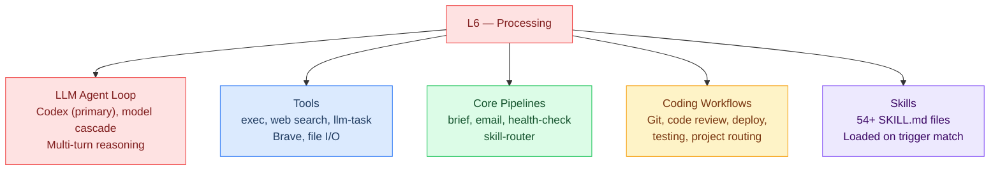
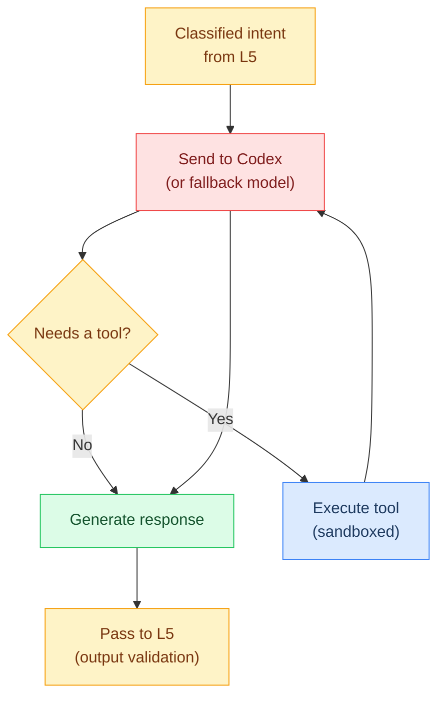
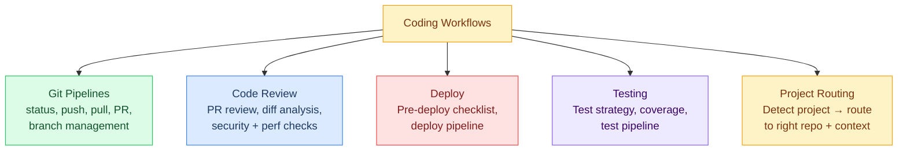
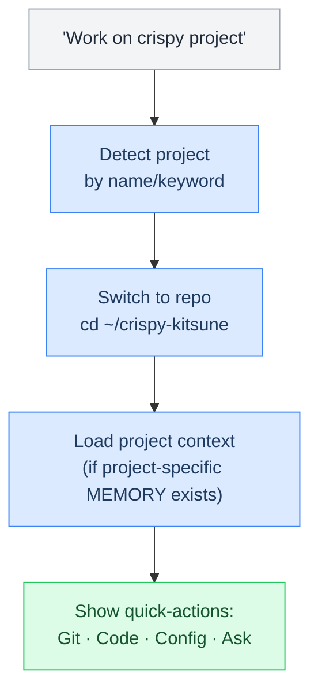

# L6 — Processing Layer

> How Crispy does the work. LLM reasoning, tool execution, skills, core pipelines, and coding workflows. This is the "application layer" — where value gets created.

**OSI parallel:** Application — the top layer where user-facing work happens.

## Contents

- [[#What's at This Layer]]
- [[#The Agent Loop]]
- [[#Core Pipelines]]
- [[#Coding Workflows]] · `flowchart`
  - [[#Project Routing]] · `flowchart`
- [[#Skills]]
- [[#Tools]]
- [[#Action Gating (L6 Guardrails)]]
- [[#Pages in This Layer]]
- [[#Layer Boundary]]
- [[#Diagrams]]
  - [[#L6 Layer Overview]] · `flowchart`
  - [[#The Agent Loop]] · `flowchart`
  - [[#Coding Workflows]] · `flowchart`
  - [[#Project Routing]] · `flowchart`
  - [[#Cron & Background Schedule (Gantt)]] · `gantt`
- [[#L6 File Review (Live)]]

---

## What's at This Layer

See: [[#L6 Layer Overview|Layer Overview]]

---

## The Agent Loop

When L5 routes to the full agent loop, this is what happens:

See: [[#The Agent Loop|Agent Loop]]

---

## Core Pipelines

Deterministic Lobster pipelines that handle routine work without full LLM reasoning:

| Pipeline | Trigger | Purpose | LLM Cost |
|---|---|---|---|
| **brief.lobster** | /brief, cron 8am | RSS digest + weather + git + inbox | ~800 tokens (for llm-task summarize) |
| **email.lobster** | /email, Gmail webhook | Email triage — classify, summarize, flag urgent | ~800 tokens |
| **health-check.lobster** | Cron hourly | System heartbeat — git clean, memory size, uptime | 0 tokens |
| **skill-router.lobster** | Internal | Check skills list, pick the best skill for the job | ~200 tokens |

---

## Coding Workflows

The `coding/` subfolder handles everything development-related:

See: [[#Coding Workflows|Coding Workflows]]

### Git Pipelines

| Pipeline | Trigger | What It Does |
|---|---|---|
| **git-status** | /git, "what's the git status" | Branch info, dirty files, recent commits |
| **git-push** | Quick-action button | Preview changes → exec-approve → push |
| **git-pull** | Quick-action button | Fetch + pull with conflict check |
| **git-pr** | "create a PR" | Draft PR from branch → preview → submit |
| **git-branch** | "switch branch", "new branch" | Branch management with safety checks |

### Project Routing

When the user says "work on project X", Crispy needs to:
1. Identify which project (by name, repo, or keywords)
2. Switch to the right git repo / workspace
3. Load project-specific context (if any)
4. Present relevant quick-actions for that project

See: [[#Project Routing|Project Routing]]

---

## Skills

54+ skills organized into packs. Skills are SKILL.md files loaded into context on trigger match:

| Pack | Count | Examples |
|---|---|---|
| Engineering | 11 | code-review, debug, system-design, testing-strategy |
| Data | 8 | data-exploration, sql-queries, visualization |
| HR | 9 | compensation, interview-prep, org-planning |
| Operations | 9 | change-management, compliance, risk-assessment |
| Productivity | 4 | memory-management, task-management |
| OpenClaw Meta | 4 | config, telegram-bot, pipeline-creator |
| Authoring | 2 | doc-coauthoring, internal-comms |
| Builders | 4 | mcp-builder, plugin creation, schedule |
| Guardrails | 1 | llm-guardrails |
| Gaming | 2 | sag, gog |

Full reference: [[stack/L6-processing/skills/_overview]]

---

## Tools

| Tool | Scope | Sandboxed? |
|---|---|---|
| **exec** | Shell commands | Yes (Docker, workspace-only writes) |
| **web_search** | Brave Search API | N/A (read-only) |
| **llm-task** | Structured LLM side-channel | N/A (800 token cap) |
| **lobster** | Pipeline execution | Yes (approval gates) |
| **memory_search** | Query past context | N/A (read-only) |
| **web_fetch** | Fetch URL content | N/A (read-only) |

---

## Action Gating (L6 Guardrails)

When L6 wants to take a state-changing action, it must pass through approval:

| Action Type | Gate | Pattern |
|---|---|---|
| Shell command | Exec-approve buttons | Preview → approve/deny |
| Pipeline step | Pipeline approval gate | resumeToken → approve/deny |
| Git push | Exec-approve | Show diff → approve/deny |
| File deletion | Confirmation prompt | "Are you sure?" |
| Message send | No auto-send | Always preview first |

---

## Pages in This Layer

| Page | Covers |
|---|---|
| [[stack/L6-processing/config-reference]] | Config blocks: tools, plugins, cron, skills |
| [[stack/L6-processing/agent-loop]] | How the multi-turn reasoning loop works |
| [[stack/L6-processing/tools]] | Tool inventory, permissions, sandboxing |
| [[stack/L6-processing/research]] | Research sub-agent pipeline |
| [[stack/L6-processing/message-routing]] | Execution flowcharts for interaction types |
| [[stack/L6-processing/runbook]] | L6 operations runbook |
| [[stack/L6-processing/pipelines/_overview]] | Core pipeline inventory + Lobster how-to |
| [[stack/L6-processing/coding/_overview]] | Git pipelines, code review, deploy, testing, project routing |
| [[stack/L6-processing/skills/_overview]] | All 54+ skills, packs, triggers, config |
| [[stack/L6-processing/CHANGELOG]] | Layer changelog — all L6 changes by date |
| [[stack/L6-processing/cross-layer-notes]] | Cross-layer notes from L6 sessions |

---

## Layer Boundary

**L6 receives from L5:** A classified intent with routing decision + sanitized input.

**L6 provides to L5 (on response):** A generated response for output validation.

**L6 interacts with L7:** Queries memory for context, writes results to daily logs.

**If L6 breaks:** Crispy can't do anything useful. Check model config, tool permissions, pipeline definitions.

---

## Diagrams

### L6 Layer Overview

What's at this layer:



### The Agent Loop

When L5 routes to the full agent loop, this is what happens:



### Coding Workflows

The `coding/` subfolder handles everything development-related:



### Project Routing

When the user says "work on project X", Crispy needs to:
1. Identify which project (by name, repo, or keywords)
2. Switch to the right git repo / workspace
3. Load project-specific context (if any)
4. Present relevant quick-actions for that project



### Cron & Background Schedule (Gantt)

All L6-owned scheduled tasks and their execution windows. Pipeline tasks use zero LLM tokens unless they contain an `llm-task` step.

```mermaid
gantt
    title L6 Processing Schedule (24h)
    dateFormat HH:mm
    axisFormat %H:%M

    section Core
    Daily brief            :milestone, b1, 08:00, 10min
    Email triage           :active, e1, 00:00, 24h
    Health check           :done, hc, 00:00, 24h
    Skill router           :active, sr, 00:00, 24h

    section Git
    git-status             :active, gs, 00:00, 24h
    git-push               :active, gp, 00:00, 24h
    git-pull               :active, gl, 00:00, 24h
    git-pr                 :active, pr, 00:00, 24h

    section Media
    Media catchup          :done, mc, 00:00, 24h
    Media cleanup          :milestone, mu, 02:00, 15min

    section Agent Loop
    Agent loop             :crit, al, 00:00, 24h
    Category classify      :active, cc, 00:00, 24h
    Compaction             :crit, co, 00:00, 24h
```



| Pipeline | Schedule | LLM Cost | Trigger |
|---|---|---|---|
| **brief.lobster** | `0 8 * * *` (PT) | ~800 tokens | Cron + `/brief` |
| **email.lobster** | On webhook | ~800 tokens | Gmail push |
| **health-check.lobster** | `0 * * * *` | 0 tokens | Cron |
| **skill-router.lobster** | On demand | ~200 tokens | Intent match |
| **media-catchup** | `*/30 * * * *` | 0 tokens | Cron |
| **media-cleanup** | `0 2 * * *` | 0 tokens | Cron |
| **git-*** | On demand | 0 tokens | `/git`, buttons |
| **Agent loop** | Per message | 2K–50K+ | L5 routing |
| **Category classify** | Per message (async) | ~100 tokens | Background |
| **Compaction** | Context > ~120K | ~200 tokens/group | Auto |

---

---

## L6 File Review (Live)

```dataview
TABLE WITHOUT ID
  file.link AS "File",
  choice(contains(file.frontmatter.tags, "status/finalized"), "✅",
    choice(contains(file.frontmatter.tags, "status/review"), "🔍",
      choice(contains(file.frontmatter.tags, "status/planned"), "⏳", "📝"))) AS "Status",
  choice(contains(file.frontmatter.tags, "type/guide"), "Guide",
    choice(contains(file.path, "coding"), "Coding",
      choice(contains(file.path, "pipelines"), "Pipeline",
        choice(contains(file.path, "skills"), "Skill", "Core")))) AS "Category",
  choice(contains(file.frontmatter.tags, "type/guide"), "Guide", "Core") AS "Type",
  dateformat(file.mtime, "yyyy-MM-dd") AS "Last Modified"
FROM "stack/L6-processing"
WHERE file.name != "_overview"
SORT file.folder ASC, file.name ASC
```

**Legend:** ✅ Finalized · 🔍 Review · 📝 Draft · ⏳ Planned

---

**Up →** [[stack/L7-memory/_overview]]
**Down →** [[stack/L5-routing/_overview]]
**Back →** [[stack/_overview]]
