# L6 — Agent Loop

> The core LLM reasoning cycle: Think → Act → Observe → Repeat until task complete or loop terminates.

---

## Universal Message Lifecycle

This is the complete flow from message arrival to response, shared across all channels (Telegram, Discord, Gmail).

### Step 1 — Input & Auth

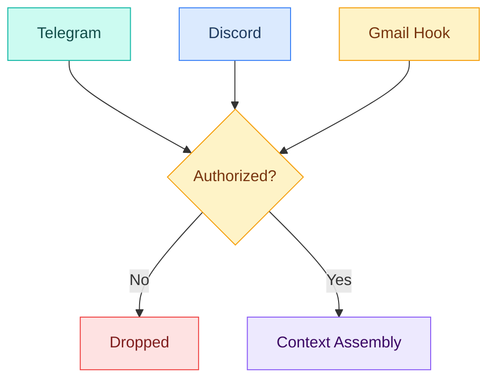

### Step 2 — Context Assembly

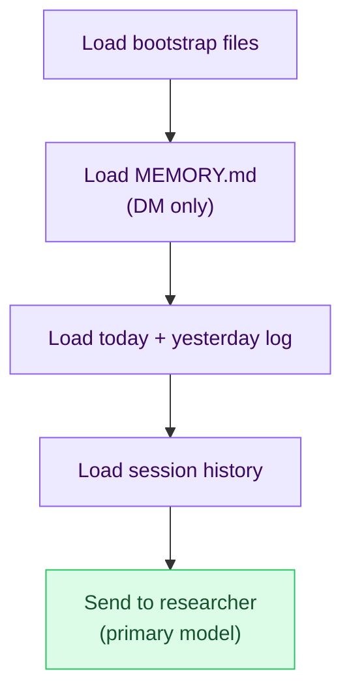

### Step 3 — Agent Loop

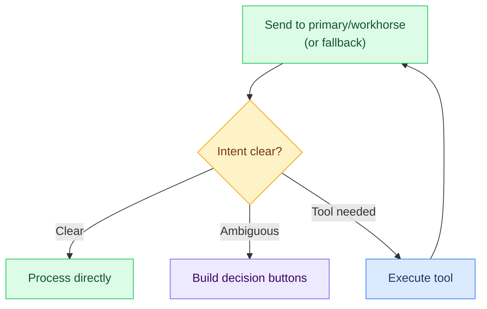

### Step 4 — Output & Persist

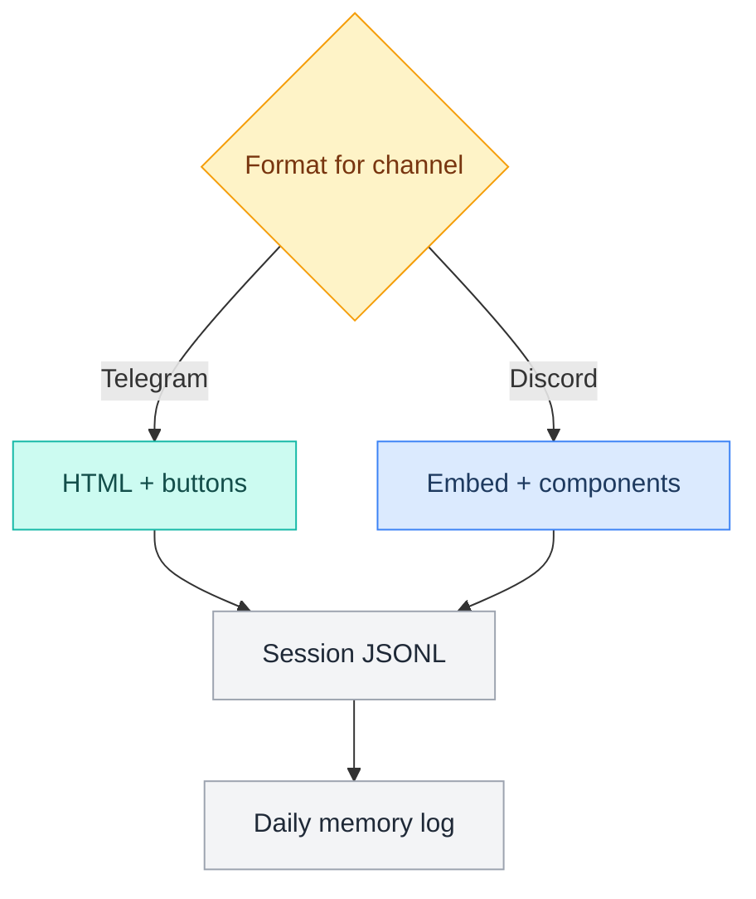

---

## The Agent Loop — Core Cycle

The agent loop is Crispy's main execution engine. Each iteration sends context to the LLM, receives a response, executes any tools, and observes the results.

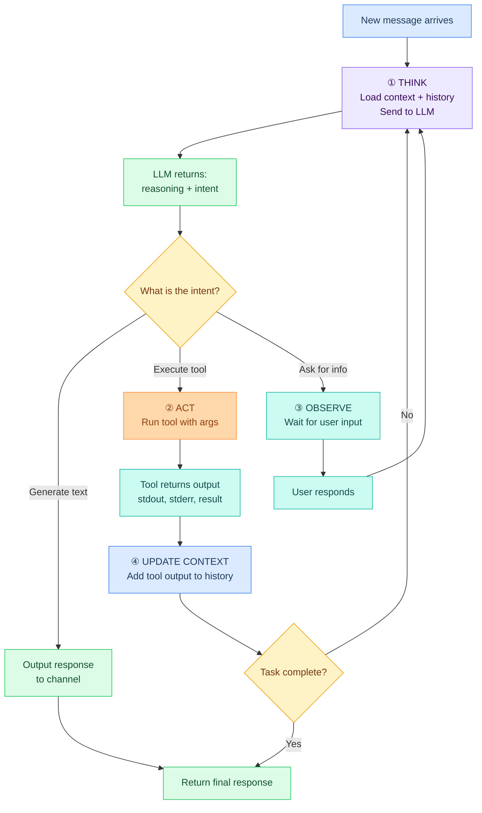

---

## Step 1: THINK — Context Assembly

Before each LLM call, Crispy assembles context in this order:

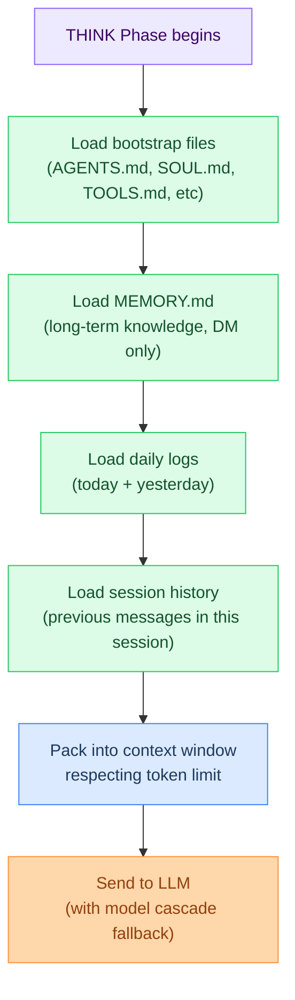

**Context Budget** (typical):
- Bootstrap files: 2–5K tokens
- MEMORY.md: 3–8K tokens
- Daily logs (2 days): 2–4K tokens
- Session history: 5–20K tokens (pruned if >1hr old)
- **Total loaded: 12–37K tokens**

**Token Allocation:**
- Input context: 40–50K tokens
- LLM output: 4K tokens (default)
- Safety buffer: 10K tokens
- **Total per turn: ~60K tokens from a 150K window**

---

## Step 2: ACT — Tool Execution

When the LLM returns a tool call, Crispy executes it with permission gating.

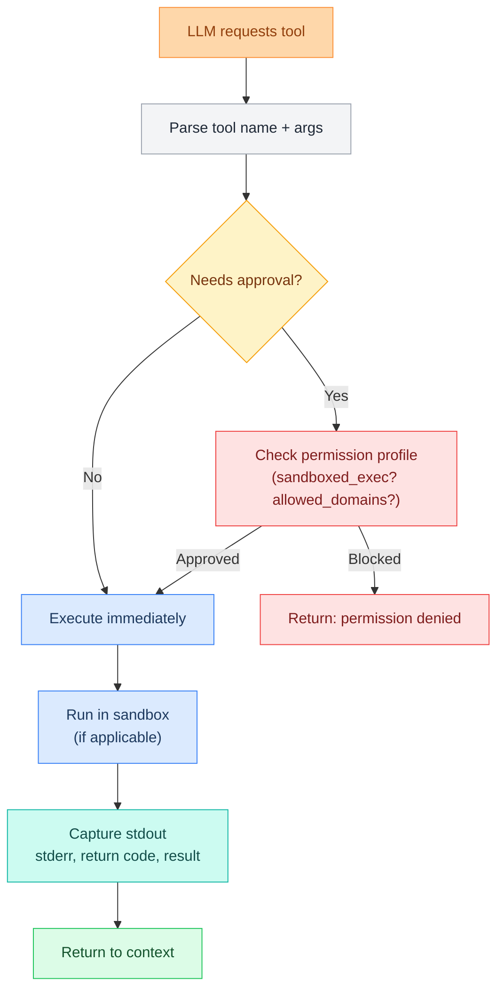

**Tool Execution Details:**
```json5
{
  "toolName": "exec",
  "args": {
    "command": "git status",
    "workingDir": "/home/user/.openclaw/workspace"
  },
  "sandbox": {
    "profile": "sandboxed",
    "workspaceAccess": "rw",
    "networkAccess": false,
    "allowedDomains": [],
    "timeoutMs": 30000
  },
  "result": {
    "stdout": "On branch main...",
    "stderr": "",
    "exitCode": 0,
    "executionTimeMs": 245
  }
}
```

---

## Step 3: OBSERVE — Context Update

Tool output feeds back into context for the next iteration.

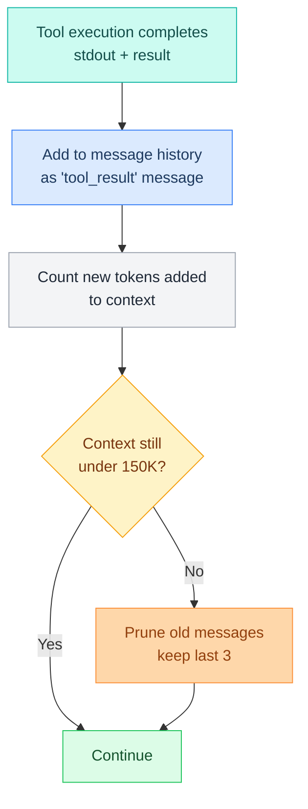

---

## Loop Termination Conditions

The agent loop exits when any of these occur:

| Condition | What Happens | Example |
|---|---|---|
| **User text goal achieved** | LLM outputs final answer | "Your git branch is 3 commits ahead of main" |
| **Max iterations reached** | Fail-safe after N attempts | Default: 10 iterations, then error |
| **Tool execution fails (critical)** | Halt and return error | `exec` permission denied, network unreachable |
| **User cancels** | `/cancel` or timeout interrupt | Telegram user clicks stop button |
| **Context overflow** | Compaction triggered (flush + reset) | Context >150K after pruning |

**Token Consumption Example:**

```
Iteration 1:
  - Input context: 45K tokens
  - LLM response: 0.5K tokens (text) + 0.2K (tool call)
  - Total: 45.7K

Iteration 2:
  - Previous + tool result: 46K + 2K = 48K
  - LLM response: 0.8K tokens
  - Total: 48.8K

Iteration 3:
  - Previous + new tool result: 48.8K + 1.5K = 50.3K
  - LLM response: 0.6K tokens
  - Total: 50.9K

[Loop continues until goal or token budget exceeded]
```

---

## Token Consumption Per Iteration

```mermaid
flowchart LR
    START["Start iteration"]:::gray
    CTX["Input context<br>30-50K"]:::blue
    THINK["LLM processes<br>~1-2K output"]:::green
    TOOL["Tool executes<br>result: 0.5-5K"]:::orange
    STORE["Store in history<br>+1-5K"]:::teal
    END["Net addition<br>per loop: 2-10K tokens"]:::purple

    START --> CTX
    CTX --> THINK
    THINK --> TOOL
    TOOL --> STORE
    STORE --> END

    classDef gray fill:#f3f4f6,stroke:#9ca3af,color:#1f2937
    classDef blue fill:#dbeafe,stroke:#3b82f6,color:#1e3a5f
    classDef green fill:#dcfce7,stroke:#22c55e,color:#14532d
    classDef orange fill:#fed7aa,stroke:#fb923c,color:#92400e
    classDef teal fill:#ccfbf1,stroke:#14b8a6,color:#134e4a
    classDef purple fill:#ede9fe,stroke:#8b5cf6,color:#3b0764
```

**Typical conversation:**
- Simple task (1–2 iterations): 50–80K tokens
- Complex task (3–5 iterations): 100–150K tokens
- Research task (10+ iterations): triggers memory flush at 150K

---

## Tool Calling Mechanism

When the LLM wants to execute a tool, it returns a structured request:

```json5
{
  "type": "tool_call",
  "toolName": "web_search",
  "id": "call_abc123",
  "args": {
    "query": "Mem0 vector database 2026",
    "maxResults": 10
  }
}
```

Crispy receives this and:

1. **Parse**: Extract `toolName` and `args`
2. **Check permission**: Is this tool allowed? Does it need approval?
3. **Validate args**: Does the schema match?
4. **Execute**: Run in appropriate sandbox
5. **Capture**: Collect stdout, stderr, exit code
6. **Return**: Add result to conversation history
7. **Continue**: Send back to LLM with result message

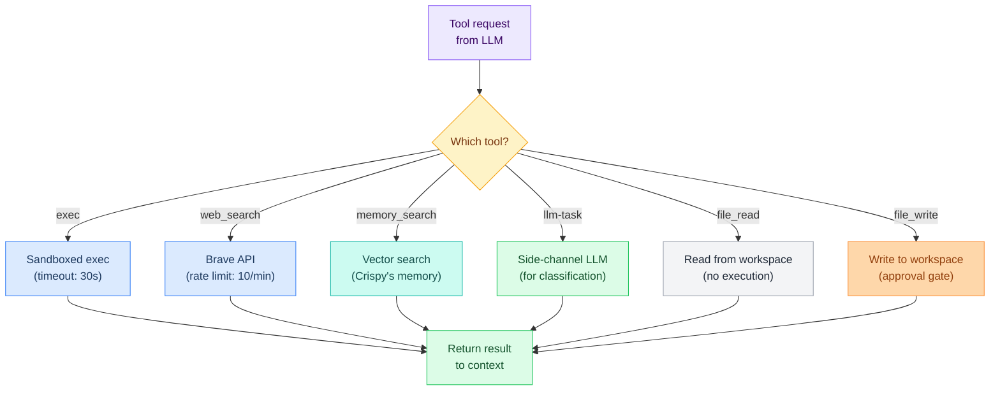

---

## Loop Control Flow

```yaml
# Pseudocode for the agent loop
while not task_complete:
  # THINK
  context = assemble_context(bootstrap, memory, history)
  response = llm.call(context, model=cascade_pick(fallback))

  # Interpret response
  if response.type == "text_output":
    # Goal achieved
    task_complete = true
    return response.text

  elif response.type == "tool_call":
    # ACT
    tool_result = execute_tool(response.toolName, response.args)

    # OBSERVE
    history.add({role: "assistant", content: response})
    history.add({role: "tool", content: tool_result})

    # Check termination
    if should_terminate(iterations, token_count, tool_result):
      task_complete = true
      return format_error(tool_result)

  elif response.type == "ask_user":
    # Wait for input
    user_input = await user_response(timeout=60s)
    history.add({role: "user", content: user_input})

  # Safety checks
  iterations += 1
  if iterations > MAX_ITERATIONS:
    return error("Loop limit exceeded")

  if token_count(context) > 150000:
    flush_memory()
    context = fresh_context()
```

---

## Model Cascade Fallback

If the primary model fails, Crispy automatically tries the next:

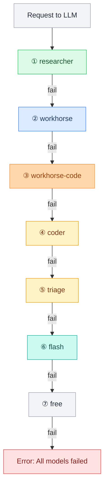

**Config:** See [[stack/L6-processing/tools]] for permission profiles.
**Model aliases:** See [[stack/L2-runtime/config-reference]] for model string → alias mappings.

---

## Agent Loop State Machine

Formal state diagram showing all transitions in the Think → Act → Observe cycle, including error recovery and termination paths.

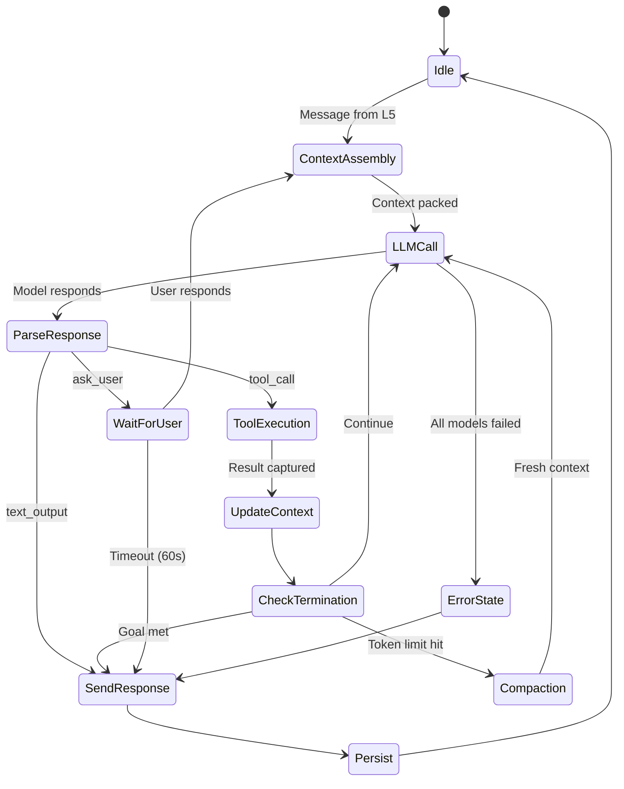

#### Agent Loop Detail

| Phase | Steps | Key Details |
|---|---|---|
| **ContextAssembly** | LoadBootstrap → LoadMemory → LoadLogs → LoadHistory → PackContext | AGENTS/SOUL/TOOLS.md first, MEMORY.md DM-only, respect token limit |
| **LLMCall** | PrimaryModel → FallbackModel → NextFallback → AllFailed | Cascade: researcher → workhorse → coder → triage → flash → free |
| **ParseResponse** | CheckType → route by type | `text_output`, `tool_call`, or `ask_user` |
| **ToolExecution** | CheckPermission → RunSandboxed → CaptureResult | Docker sandbox, network off, 30s timeout |
| **CheckTermination** | CheckGoal → CheckIterations → CheckTokens | Goal achieved, max iterations, or >150K tokens → compaction |

---

## Why This Design?

- **Modular**: Each step (think/act/observe) is independent
- **Recoverable**: Tool failure doesn't crash the loop, just returns error
- **Transparent**: Every step logged, history preserved
- **Efficient**: Context pruning keeps token usage stable
- **Safe**: Permission gating prevents unauthorized actions

---

**Up →** [[stack/L6-processing/_overview]]
**Related →** [[stack/L6-processing/tools]]
