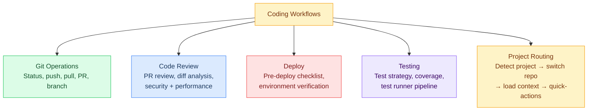

# Coding Workflows

> Everything development-related: git pipelines, code review, deploy checklists, testing strategies, and project-aware routing. The goal is to make as much of the dev workflow deterministic (pipeline-driven) as possible, with LLM reasoning only for code analysis and creative tasks.

---

## Overview

---

## Design Principles

- **Pipeline-first:** Push as much of the dev workflow into deterministic Lobster pipelines (0 LLM tokens) as possible
- **LLM for analysis only:** Code review, test suggestion, and creative tasks use the full agent loop
- **Approval gates:** Destructive operations (push, deploy, delete branch) always require user confirmation
- **Project-aware:** Context switching loads the right repo, branch, and quick-actions automatically

See the individual files below for full specs, pipeline YAML, and flowcharts.

---

## Pages in This Folder

| Page | Covers |
|---|---|
| [[stack/L6-processing/coding/git-pipelines]] | All git Lobster pipeline designs (status, push, pull, PR, branch) |
| [[stack/L6-processing/coding/code-review]] | Review workflow, skill integration, output format |
| [[stack/L6-processing/coding/deploy]] | Deploy checklist pipeline, environment verification |
| [[stack/L6-processing/coding/testing]] | Test strategy, coverage pipeline, test generation |
| [[stack/L6-processing/coding/project-routing]] | Project registry, routing logic, context switching |

---

**Up →** [[stack/L6-processing/_overview]]
**Back →** [[stack/_overview]]
