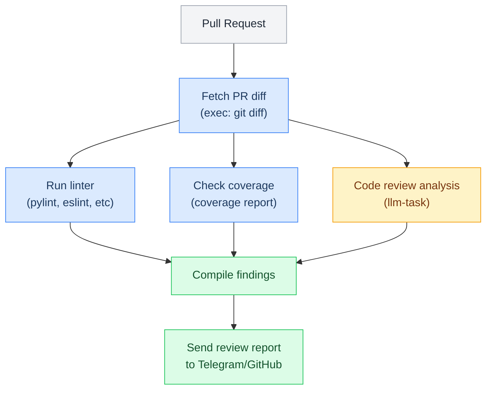
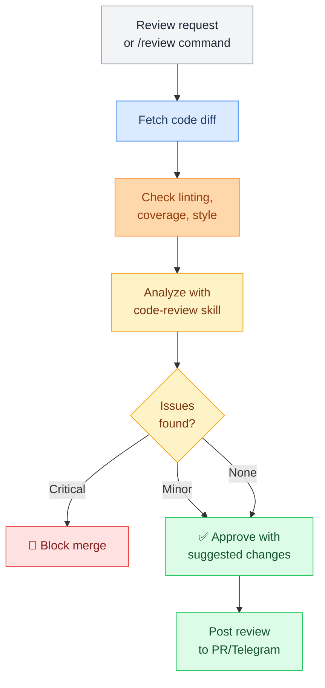

# Code Review

> Structured code review capability for security, performance, maintainability, testing, and style validation with LLM analysis and approval gates.

**Up →** [[stack/L6-processing/coding/_overview]]

---

## Overview

The code-review skill provides structured code review capability. Crispy can review code for:
- Security vulnerabilities
- Performance issues
- Maintainability concerns
- Testing coverage
- Architectural problems



---

## Review Flow



---

## Review Categories

Crispy checks code for:

| Category | Checks | Severity |
|---|---|---|
| **Security** | SQL injection, XSS, hardcoded secrets, auth bypass | Critical |
| **Performance** | N+1 queries, memory leaks, inefficient algorithms | High |
| **Maintainability** | Complexity, naming, duplication, clarity | Medium |
| **Testing** | Coverage drop, uncovered branches, missing edge cases | Medium |
| **Style** | Linting, formatting, conventions | Low |

---

## Approval Gates

The code review pipeline can block or approve merges:

```
🔴 Critical Issues Found (blocks merge):
  - SQL injection vulnerability in user input query
  - Hardcoded API key in production code
  - Missing authentication check on admin endpoint

🟡 Warnings (review anyway):
  - Function complexity is high (18 lines)
  - Test coverage dropped from 87% to 83%
  - Deprecated API usage

✅ No blockers — ready to merge
```

## Pipeline YAML

```yaml
name: code-review
description: >
  Structured code review pipeline: fetches git diff for HEAD or a specified ref,
  runs available linter (pylint/eslint/ruff), then calls workhorse LLM for security,
  performance, maintainability, and testing analysis. Reports findings by severity.
  Requires approval before posting results to Telegram or GitHub PR. Triggers via
  "review this code", "check this PR", or /review command.
args:
  target:
    default: "HEAD"
    description: "Git ref to review (branch, commit, HEAD~N)"
  post_to_github:
    default: "false"
steps:
  - id: fetch_diff
    command: exec --json --shell 'cd ~/.openclaw/workspace && git diff $target --stat && git diff $target'
    timeout: 15000

  - id: lint
    command: exec --json --shell |
      cd ~/.openclaw/workspace
      if command -v ruff &>/dev/null; then ruff check . --output-format=json 2>/dev/null || echo "[]"
      elif command -v eslint &>/dev/null; then eslint . --format=json 2>/dev/null || echo "[]"
      elif command -v pylint &>/dev/null; then pylint --output-format=json . 2>/dev/null || echo "[]"
      else echo "[]"; fi
    timeout: 30000

  - id: analyze
    command: openclaw.invoke --tool llm-task --action json \
      --args-json '{
        "model": "workhorse",
        "maxTokens": 1500,
        "prompt": "Review this code diff for: security vulnerabilities, performance issues, maintainability, and test coverage. Return JSON with keys: severity (critical|warning|ok), issues (array of {category, description, line}), summary, recommendation.",
        "schema": {
          "type": "object",
          "properties": {
            "severity": {"type": "string"},
            "issues": {"type": "array"},
            "summary": {"type": "string"},
            "recommendation": {"type": "string"}
          }
        }
      }'
    stdin: $fetch_diff.stdout
    timeout: 60000

  - id: compile_report
    command: exec --shell |
      SEVERITY=$(echo "$analyze_json" | jq -r '.severity')
      SUMMARY=$(echo "$analyze_json" | jq -r '.summary')
      ISSUES=$(echo "$analyze_json" | jq -r '.issues[] | "• [\(.category)] \(.description)"')
      echo "🔍 Code Review: $target"
      echo ""
      echo "Severity: $SEVERITY"
      echo "$ISSUES"
      echo ""
      echo "$SUMMARY"
      echo ""
      echo "Lint: $(echo '$lint_stdout' | jq 'length') issues found"

  - id: approve
    command: approve --preview-from-stdin --prompt "Post this review?"
    stdin: $compile_report.stdout
    approval: required

  - id: post
    command: exec --shell 'echo "$compile_report_stdout"'
    condition: $approve.approved
```
^pipeline-code-review

---

## Skill Usage

Trigger with: "review this code", "check this PR", "is this safe?"

The skill provides:
- Detailed findings by category
- Severity levels
- Suggested fixes
- References to security/performance docs
- Approval or rejection

---

## Dependencies

- Diff access (git or GitHub API)
- Linter for the language (pylint, eslint, etc)
- Coverage report (if available)
- `engineering:code-review` skill from Engineering pack

---

**Up →** [[stack/L6-processing/coding/_overview]]
**Back →** [[stack/_overview]]
