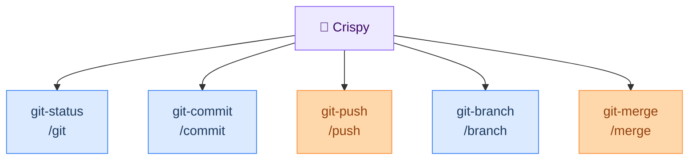
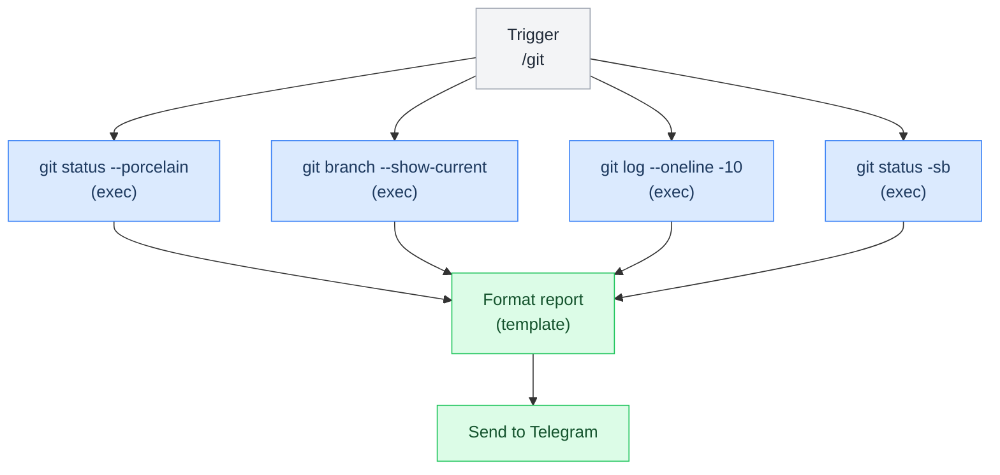
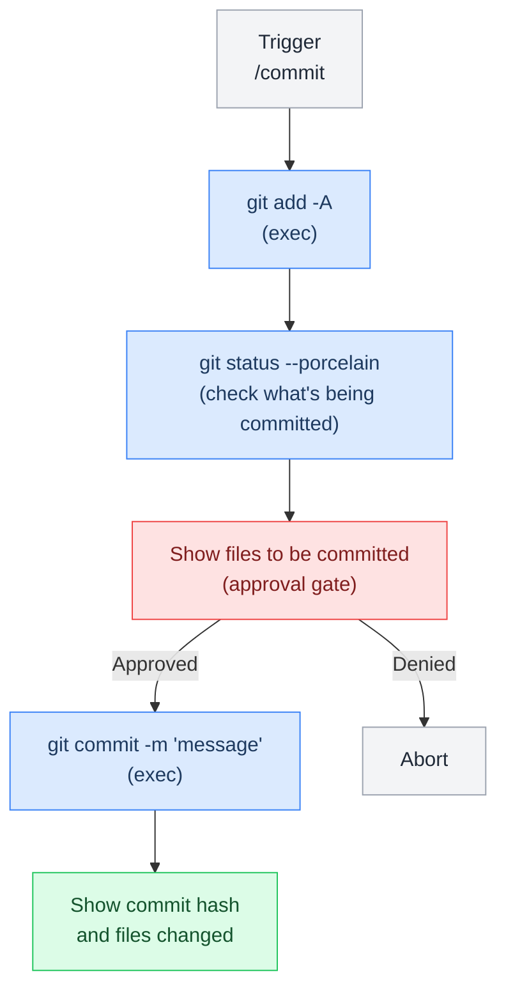
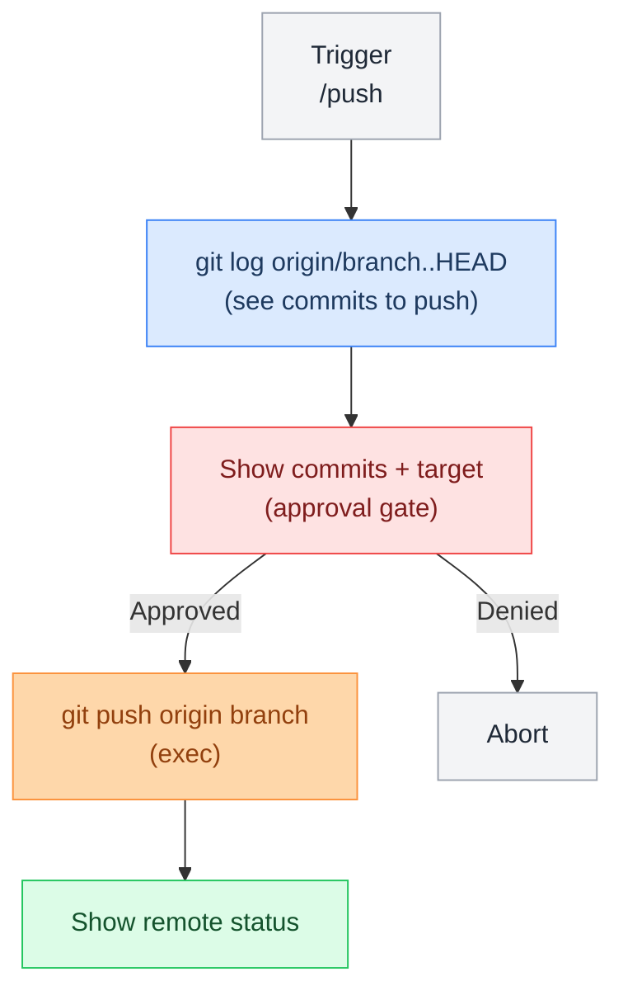
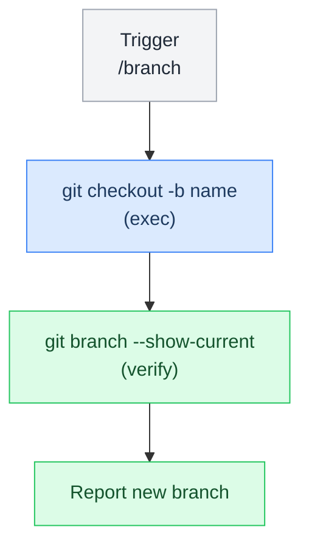
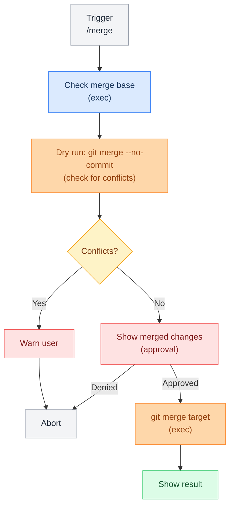

# Git Pipelines

> Automated git workflows for status checks, commits, pushes, branches, and merges with approval gates and Telegram integration.

**Up →** [[stack/L6-processing/coding/_overview]]

---

## Git Pipeline Overview

Crispy provides automated git workflows via Telegram and CLI:



---

## 1. Git Status Pipeline

**Command:** `/git` or `openclaw pipeline run git`

**Purpose:** Quick status report of branch, dirty files, commits, remote sync.

### Flow



### Pipeline YAML

```yaml
name: git
description: >
  Quick git status report: branch, dirty files, recent commits, and remote sync state.
  Triggers via /git Telegram command or openclaw pipeline run git. Read-only — no
  approval gate needed. Output sent directly to channel.
steps:
  - id: status
    command: exec --json --shell 'cd ~/.openclaw/workspace && git status --porcelain'
    timeout: 10000

  - id: branch
    command: exec --json --shell 'cd ~/.openclaw/workspace && git branch --show-current'
    timeout: 5000

  - id: log
    command: exec --json --shell 'cd ~/.openclaw/workspace && git log --oneline -10'
    timeout: 5000

  - id: remote_check
    command: exec --json --shell 'cd ~/.openclaw/workspace && git status -sb | head -1'
    timeout: 10000

  - id: format
    command: exec --shell |
      echo "🔀 Git Status"
      echo ""
      echo "Branch: $(echo '$branch_stdout' | tr -d '\n')"
      echo ""
      echo "Dirty files:"
      echo "$status_stdout"
      echo ""
      echo "Recent commits:"
      echo "$log_stdout"
      echo ""
      echo "Remote: $(echo '$remote_check_stdout' | tr -d '\n')"
```
^pipeline-git

### Example Output

```
🔀 Git Status

Branch: feature/agent-loop

Dirty files:
M stack/L6-processing/agent-loop.md
?? new-research/notes.md

Recent commits:
abc1234 docs: add agent loop documentation
def5678 feat: implement tool execution
ghi9012 refactor: clean up memory management

Remote: [ahead 2]
```

---

## 2. Git Commit Pipeline

**Command:** `/commit "message"` or `openclaw pipeline run git-commit`

**Purpose:** Stage changes and create a commit.

### Flow



### Pipeline YAML

```yaml
name: git-commit
args:
  message:
    required: true
    description: "Commit message"
steps:
  - id: check_dirty
    command: exec --json --shell 'cd ~/.openclaw/workspace && git status --porcelain | wc -l'
    timeout: 5000

  - id: stage_all
    command: exec --json --shell 'cd ~/.openclaw/workspace && git add -A'
    timeout: 10000

  - id: show_changes
    command: exec --json --shell 'cd ~/.openclaw/workspace && git status --porcelain'
    timeout: 5000

  - id: approve
    command: approve --preview-from-stdin \
      --prompt 'About to commit these files. Proceed?'
    stdin: $show_changes.stdout
    approval: required

  - id: commit
    command: exec --json --shell 'cd ~/.openclaw/workspace && git commit -m "$message"'
    stdin: $show_changes.stdout
    condition: $approve.approved
    timeout: 10000

  - id: result
    command: exec --json --shell 'cd ~/.openclaw/workspace && git log --oneline -1'
    condition: $approve.approved
```

---

## 3. Git Push Pipeline

**Command:** `/push` or `openclaw pipeline run git-push`

**Purpose:** Push commits to remote with approval gate.

### Flow



### Pipeline YAML

```yaml
name: git-push
args:
  force:
    default: false
    description: "Use --force-with-lease?"
steps:
  - id: check_commits
    command: exec --json --shell 'cd ~/.openclaw/workspace && git log -n 5 --oneline'
    timeout: 5000

  - id: check_remote
    command: exec --json --shell 'cd ~/.openclaw/workspace && git status -sb'
    timeout: 5000

  - id: show_summary
    command: exec --json --shell |
      cd ~/.openclaw/workspace
      CURRENT_BRANCH=$(git branch --show-current)
      AHEAD=$(git rev-list origin/$CURRENT_BRANCH..$CURRENT_BRANCH | wc -l)
      echo "📤 Ready to push"
      echo ""
      echo "Branch: $CURRENT_BRANCH"
      echo "Commits ahead: $AHEAD"
      echo ""
      echo "Recent commits:"
      git log -n 3 --oneline
    timeout: 10000

  - id: approve
    command: approve --preview-from-stdin \
      --prompt 'Push to remote?'
    stdin: $show_summary.stdout
    approval: required

  - id: push
    command: exec --json --shell |
      cd ~/.openclaw/workspace
      FORCE_FLAG=""
      [ "$force" = "true" ] && FORCE_FLAG="--force-with-lease"
      git push origin $(git branch --show-current) $FORCE_FLAG
    condition: $approve.approved
    timeout: 30000

  - id: verify
    command: exec --json --shell 'cd ~/.openclaw/workspace && git status -sb'
    condition: $approve.approved
```

---

## 4. Git Branch Pipeline

**Command:** `/branch newname` or `openclaw pipeline run git-branch`

**Purpose:** Create and switch to a new branch.

### Flow



### Pipeline YAML

```yaml
name: git-branch
args:
  name:
    required: true
    description: "New branch name (kebab-case: feature/name, fix/name, etc)"
steps:
  - id: validate
    command: exec --json --shell |
      if [[ ! "$name" =~ ^[a-z0-9]([a-z0-9\-\/]*[a-z0-9])?$ ]]; then
        echo "Invalid branch name: $name"
        exit 1
      fi
      echo "OK"
    timeout: 1000

  - id: create_branch
    command: exec --json --shell 'cd ~/.openclaw/workspace && git checkout -b "$name"'
    timeout: 10000

  - id: verify
    command: exec --json --shell 'cd ~/.openclaw/workspace && git branch --show-current'
    timeout: 5000
```

---

## 5. Git Merge Pipeline

**Command:** `/merge source target` or `openclaw pipeline run git-merge`

**Purpose:** Merge one branch into another with safety checks.

### Flow



---

## Telegram Commands

Register these custom commands in `openclaw.json`:

```json5
"channels": {
  "telegram": {
    "customCommands": {
      "/git": { "pipeline": "git.lobster" },
      "/commit": { "pipeline": "git-commit.lobster", "args": { "message": "{{text}}" } },
      "/push": { "pipeline": "git-push.lobster" },
      "/branch": { "pipeline": "git-branch.lobster", "args": { "name": "{{text}}" } },
      "/merge": { "pipeline": "git-merge.lobster", "args": { "source": "{{arg1}}", "target": "{{arg2}}" } }
    }
  }
}
```

---

## Approval Gates in Git Pipelines

Crispy requires explicit approval for destructive git operations:

| Operation | Requires Approval | Why |
|---|---|---|
| **git status** | No | Read-only |
| **git log** | No | Read-only |
| **git commit** | Yes | Creates permanent history |
| **git push** | Yes | Pushes to remote (affects team) |
| **git merge** | Yes | Can create conflicts, permanent |
| **git force-push** | Yes (extra warning) | Rewrites history, can lose commits |
| **git branch -d** | Yes | Deletes branch (hard to recover) |

### Example Approval Flow

```
User: "/push"

Crispy:
📤 Ready to push

Branch: feature/agent-loop
Commits ahead: 2

Recent commits:
- abc1234 docs: add agent loop documentation
- def5678 feat: implement tool execution

[Approve] [Cancel]

User clicks: [Approve]

Crispy:
✅ Pushed to origin/feature/agent-loop
```

---

## Git Status Report Format

The `/git` command produces this format:

```
🔀 Git Status

Branch: feature/agent-loop
Status: Clean / Dirty (X files)

Modified:
M  stack/L6-processing/agent-loop.md
M  stack/L6-processing/tools.md

Untracked:
?? new-research/

Recent commits (last 5):
abc1234 docs: add agent loop documentation
def5678 feat: implement tool execution
ghi9012 refactor: clean up memory management
jkl3456 build: update dependencies
mno7890 docs: bootstrap architecture

Remote:
✅ In sync with origin/feature/agent-loop
[Branch ahead 2 commits]
```

---

## Configuration

Add to `openclaw.json`:

```json5
{
  "pipelines": {
    "git": {
      "enabled": true,
      "workspace": "~/.openclaw/workspace"
    }
  }
}
```

---

**Up →** [[stack/L6-processing/coding/_overview]]
**Back →** [[stack/_overview]]
