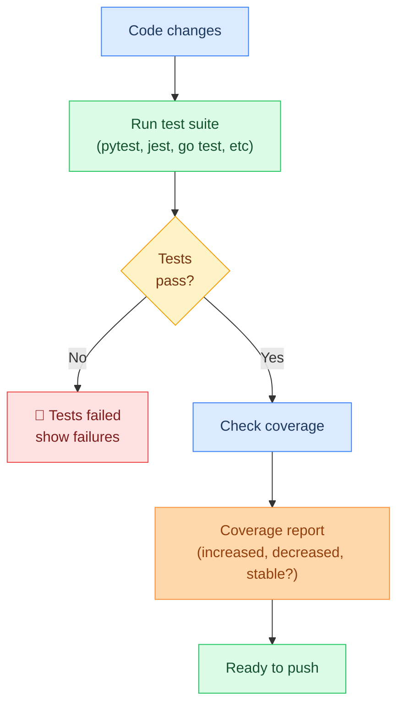
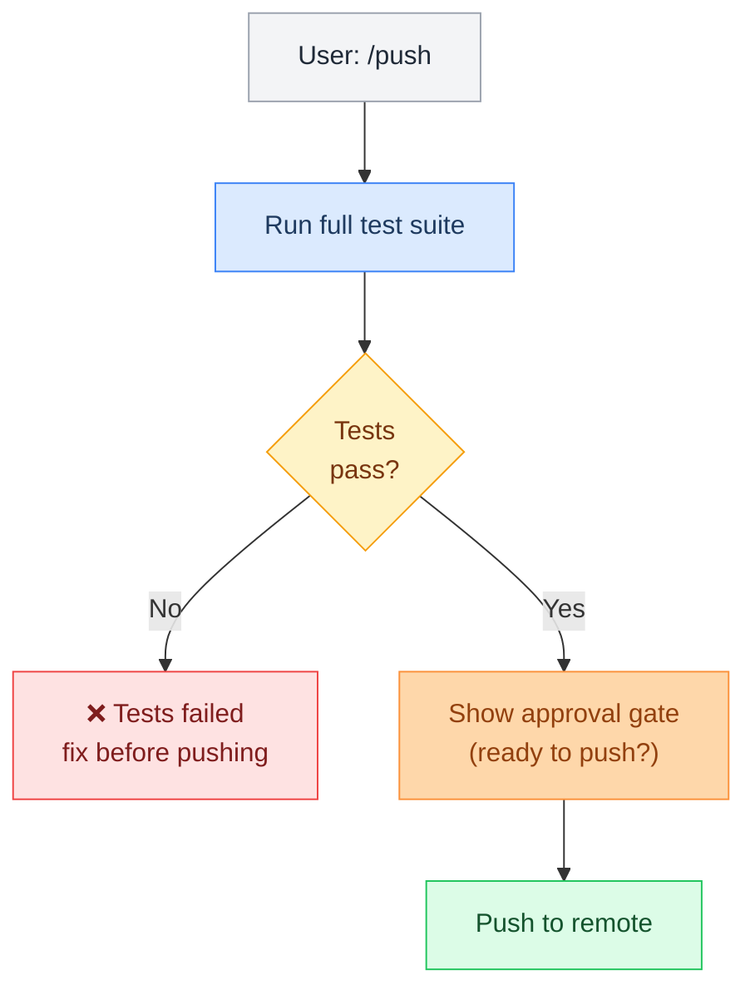

# Testing

> Test runner integration, coverage reporting, and test-before-push pipeline for automated quality assurance.

**Up →** [[stack/L6-processing/coding/_overview]]

---

## Overview

The testing workflow helps Crispy manage automated testing:



---

## Test Runner Integration

Crispy can run tests for different languages:

| Language | Runner | Crispy Command |
|---|---|---|
| **Python** | pytest, unittest | "run tests", "pytest my_test.py" |
| **JavaScript** | jest, mocha, vitest | "run tests", "npm test" |
| **Go** | go test | "run tests", "go test ./..." |
| **Rust** | cargo test | "run tests", "cargo test" |
| **Java** | maven, gradle | "run tests", "mvn test" |

---

## Coverage Reporting

After tests pass, coverage is calculated:

```
✅ All tests passed

📊 Coverage Report
───────────────────────────────────
Module          Lines   Covered   %
───────────────────────────────────
models.py       142     135       95%
api/views.py    87      79        91%
utils.py        23      22        96%
───────────────────────────────────
Total           252     236       94%

💰 vs Previous: 94% (was 94%) — stable ✅
🚨 vs Threshold: 94% >= 90% — good ✅
```

---

## Test-Before-Push Pipeline

Optional pipeline that prevents pushing without passing tests:



---

## Testing Skill

Trigger with: "how should we test", "write tests for", "test plan"

The `testing-strategy` skill provides:
- Test plan design (unit, integration, e2e)
- Coverage targets
- Edge case identification
- Test template generation
- CI/CD integration recommendations

---

## Example: Running Tests

```
User: "run tests"

Crispy:
🧪 Running test suite...

Running: pytest
[========================= 48 passed in 2.34s ==========================]

✅ All tests passed

📊 Coverage:
Total: 94%
Changed files: 96% (↑ 2%)

💡 Suggestion: Coverage improved!

Ready to push? (/push)
```

---

## Example: Test Failure

```
User: "run tests"

Crispy:
🧪 Running test suite...

Running: pytest
[===================== 1 FAILED, 47 passed in 2.56s ======================]

❌ Test failed:

test_api.py::test_user_creation
  AssertionError: expected 201, got 500

Traceback:
  File "test_api.py", line 45, in test_user_creation
    response = api.create_user(data)
  File "api/views.py", line 23
    return error_response()

💡 Issue: create_user endpoint returns 500 instead of 201
→ Check api/views.py line 23
→ Database connection issue?

Suggestions:
- Add error handling for DB failures
- Return 201 Created on success
- Mock database in unit tests
```

---

## Config

Add test configuration to `openclaw.json`:

```json5
{
  "testing": {
    "enabled": true,
    "runners": {
      "python": {
        "command": "pytest",
        "configFile": "pytest.ini",
        "coverage": true
      },
      "javascript": {
        "command": "npm test",
        "coverage": true
      }
    },
    "coverageThreshold": 85,
    "requireTestsBeforePush": true
  }
}
```

## Pipeline YAML

```yaml
name: testing
description: >
  Test runner pipeline: auto-detects language (Python/JS/Go/Rust), runs full test suite,
  parses results, and checks coverage against 85% threshold. Reports pass/fail counts and
  coverage delta vs previous run. Stores coverage baseline in memory. Async execution —
  output streams as tests complete. Triggers via "run tests" or as pre-push gate.
args:
  coverage_threshold:
    default: "85"
steps:
  - id: detect_runner
    command: exec --json --shell |
      cd ~/.openclaw/workspace
      if [ -f "pytest.ini" ] || [ -f "setup.py" ] || [ -f "pyproject.toml" ]; then echo "pytest"
      elif [ -f "package.json" ]; then echo "npm test"
      elif [ -f "go.mod" ]; then echo "go test ./..."
      elif [ -f "Cargo.toml" ]; then echo "cargo test"
      else echo "unknown"; fi
    timeout: 5000

  - id: run_tests
    command: exec --json --shell |
      cd ~/.openclaw/workspace
      RUNNER="$detect_runner_stdout"
      echo "Running: $RUNNER"
      case "$RUNNER" in
        pytest) python -m pytest --tb=short -q --cov=. --cov-report=term-missing 2>&1 ;;
        "npm test") npm test 2>&1 ;;
        "go test ./...") go test ./... -cover 2>&1 ;;
        "cargo test") cargo test 2>&1 ;;
        *) echo "No test runner detected"; exit 1 ;;
      esac
    timeout: 120000

  - id: recall_baseline
    command: exec --json --shell 'openclaw memory recall "testing:coverage-baseline" 2>/dev/null || echo "null"'

  - id: parse_results
    command: openclaw.invoke --tool llm-task --action json \
      --args-json '{
        "model": "flash",
        "prompt": "Parse these test results and extract: passed, failed, errors, coverage_pct (number or null). Return JSON.",
        "schema": {"type":"object","properties":{"passed":{"type":"integer"},"failed":{"type":"integer"},"errors":{"type":"integer"},"coverage_pct":{"type":["number","null"]}}}
      }'
    stdin: $run_tests.stdout
    timeout: 15000

  - id: save_coverage
    command: exec --shell |
      COV=$(echo "$parse_results_json" | jq '.coverage_pct')
      [ "$COV" != "null" ] && openclaw memory store "testing:coverage-baseline" --value "$COV"
    condition: 'len($parse_results_json.coverage_pct) > 0'

  - id: report
    command: exec --shell |
      PASSED=$(echo "$parse_results_json" | jq '.passed')
      FAILED=$(echo "$parse_results_json" | jq '.failed')
      COV=$(echo "$parse_results_json" | jq '.coverage_pct // "n/a"')
      BASELINE=$(echo "$recall_baseline_stdout" | tr -d '"')
      echo "🧪 Test Results"
      echo ""
      [ "$FAILED" = "0" ] && echo "✅ All $PASSED tests passed" || echo "❌ $FAILED failed, $PASSED passed"
      echo ""
      echo "Coverage: ${COV}% (baseline: ${BASELINE}%)"
      [ "$COV" != "null" ] && [ "$(echo "$COV < $coverage_threshold" | bc)" = "1" ] && echo "⚠️  Below ${coverage_threshold}% threshold"
```
^pipeline-testing

---

**Up →** [[stack/L6-processing/coding/_overview]]
**Back →** [[stack/_overview]]
