# L6 — Message Routing (Execution)

> How different types of interactions flow through the Crispy Kitsune Stack after routing decisions are made: each situation has its own flowchart showing the exact path a message takes, which layers are involved, latency, and token costs. This is a visual reference for understanding what actually happens when you send a voice note, when Crispy needs to make a plan, when you share an image, and in 7 other common interaction types.

**Up →** [[stack/L6-processing/_overview]]

---

## Pipeline Chaining: Buttons to Gates

When a button tap triggers a pipeline, that pipeline can itself contain approval gates. This creates a natural guardrail chain:

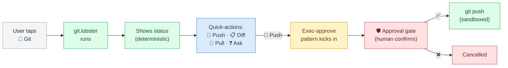

Notice: The entire chain from "work on crispy" → git status → push → approval used **zero full LLM reasoning calls**. The only LLM work was the triage classification and button tree build.

---

## Full Message Lifecycle: Situational Flowcharts

How different types of interactions flow through the Crispy Kitsune Stack. Each situation has its own flowchart showing the exact path a message takes, which layers are involved, and where decisions happen.

This document is a **visual reference** — use it to understand the full journey for each situation, then drill into the layer docs for implementation details.

---

### Why This Document Exists

The [[stack/_overview]] shows how the 7 layers connect. The [[stack/L5-routing/message-routing]] shows the three routing paths and classification decisions. But neither shows what actually happens in **real situations** — what does the stack do when you send a voice note? When Crispy needs to make a plan? When you share an image?

This document maps each situation end-to-end so you can:
1. See which layers light up for each interaction type
2. Identify bottlenecks and latency sources
3. Plan what to build first based on which situations you use most

---

### Situation Map

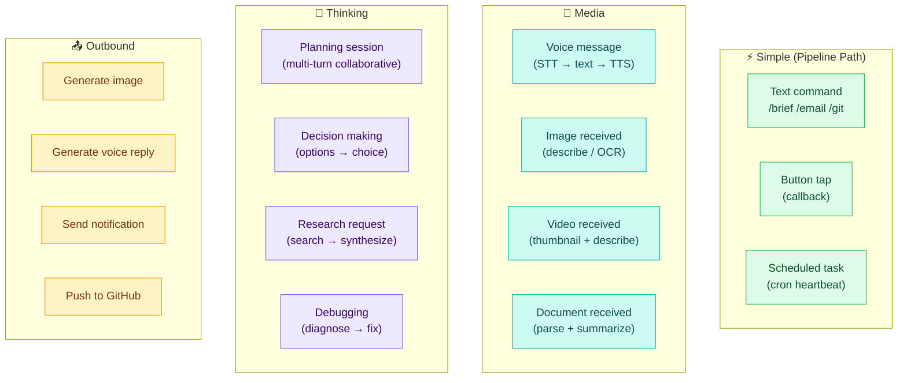

---

### 1. Text Command (`/brief`)

**Situation:** User sends `/brief` in Telegram.
**Path:** Pipeline (0 LLM tokens for routing)
**Layers touched:** L1 → L2 → L3 → L5 → L6 → L3 → L1

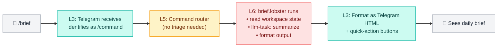

**Latency:** ~1–3s (mostly the llm-task summarize step)
**Token cost:** ~500–800 (single summarize call)
**Memory impact:** Brief logged to daily log (L7)

---

### 2. Button Tap (Callback)

**Situation:** User taps a button from a previous message (e.g., "🔀 Git" from a decision tree).
**Path:** Pipeline (0 LLM tokens)
**Layers touched:** L3 → L5 → L6 → L3

```mermaid
flowchart LR
    TAP["👤 Taps 🔀 Git"]:::gray
    TAP --> L3["L3: Telegram callback<br>data: tree_123:git"]:::teal
    L3 --> L5["L5: Validate callback format<br>Lookup tree state"]:::amber
    L5 --> L6["L6: Execute mapped action<br>git.lobster runs"]:::red
    L6 --> L3_OUT["L3: Send result<br>+ new quick-actions"]:::teal
    L3_OUT --> DONE["👤 Sees git status"]:::gray

    classDef gray fill:#f3f4f6,stroke:#9ca3af,color:#1f2937
    classDef teal fill:#ccfbf1,stroke:#14b8a6,color:#134e4a
    classDef amber fill:#fef3c7,stroke:#f59e0b,color:#78350f
    classDef red fill:#fee2e2,stroke:#ef4444,color:#7f1d1d
```

**Latency:** ~200ms–1s (no LLM call, pure state lookup + pipeline)
**Token cost:** 0 (deterministic)
**Key insight:** Button trees are pre-computed — the tap just looks up which action to run

---

### 3. Voice Message Received

**Situation:** User sends a voice note in Telegram.
**Path:** Media → STT → Agent Loop → TTS → Voice reply
**Layers touched:** L1 → L3 → L6 (STT) → L5 → L6 (Agent) → L6 (TTS) → L3 → L1

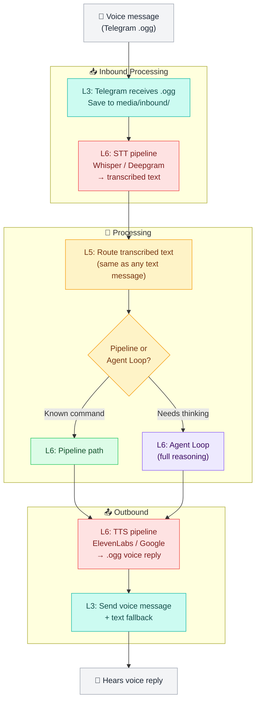

**Latency target:** <3s total (STT ~500ms + processing + TTS ~500ms)
**Token cost:** Varies — depends on whether text routes to pipeline or agent
**Files involved:** `media/inbound/telegram-YYYYMMDD-{hash}.ogg` → `media/outbound/telegram-YYYYMMDD-{hash}.ogg`

---

### 4. Image Received

**Situation:** User sends a photo in Telegram (screenshot, whiteboard, receipt, etc.).
**Path:** Media → Vision → Agent Loop
**Layers touched:** L1 → L3 → L6 (Vision) → L5 → L6 (Agent) → L3

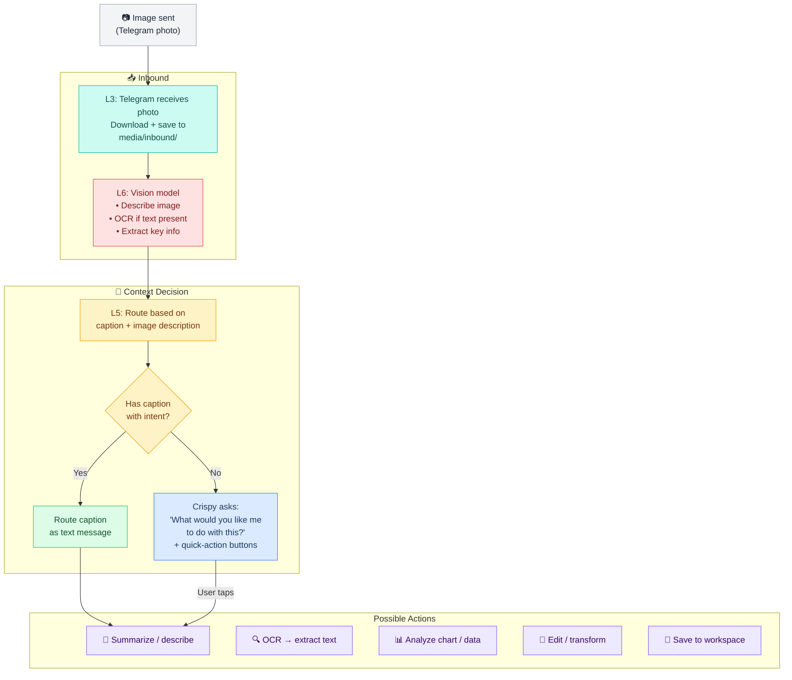

**Key decision:** If the user sends a photo with no caption, Crispy shouldn't guess — it should ask via buttons ("Describe this? OCR? Analyze? Save?"). If there's a caption like "what does this error mean?", route normally.

**Token cost:** ~1000–2000 for vision description + agent processing
**File:** `media/inbound/telegram-YYYYMMDD-{hash}.jpg`

---

### 5. Video Received

**Situation:** User sends a video clip.
**Path:** Media → Thumbnail + Metadata → Agent
**Layers touched:** L1 → L3 → L6 (Media) → L5 → L6 (Agent) → L3

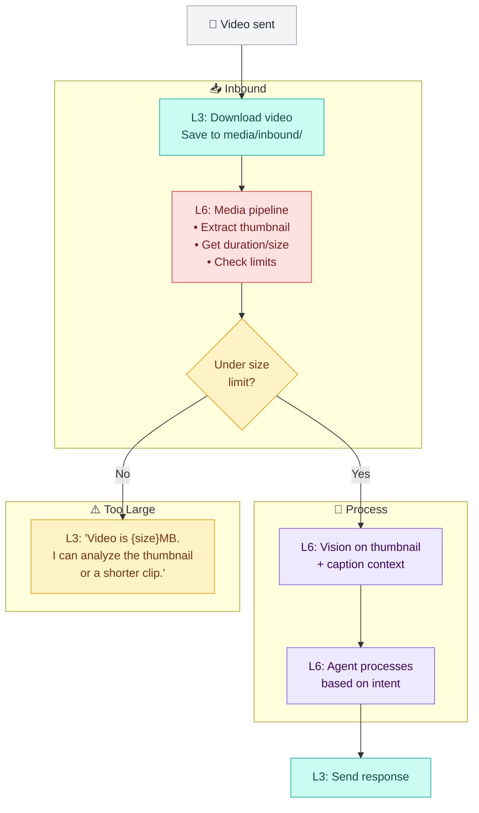

**Size limits:** Telegram max 20MB download, Discord 25MB. Videos above limit get thumbnail-only processing.
**Key insight:** We don't do full video transcription yet — we extract a representative thumbnail and use vision on that, plus any caption the user provides.

---

### 6. Planning Session (Multi-Turn Collaborative)

**Situation:** User says "Let's plan out the API for the new feature" — starts a back-and-forth planning session.
**Path:** Agent Loop (multi-turn, high token usage)
**Layers touched:** L5 → L6 → L7 (repeated)

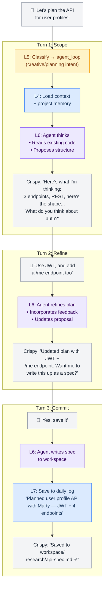

**Token cost:** 5K–30K+ across the session (context grows each turn)
**Memory impact:** Heavy — planning decisions should be logged to L7 daily log with key decisions highlighted
**Compaction risk:** Long planning sessions may trigger L4 compaction — important decisions could be lost if not explicitly saved

---

### 7. Decision Making (Options → Choice)

**Situation:** User needs help choosing between options — "Should we use PostgreSQL or MongoDB for this?"
**Path:** Agent Loop → structured comparison → user decides

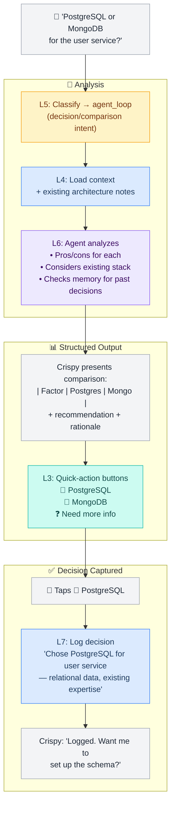

**Key insight:** Decision-making should always end with a **logged decision** in L7. Crispy should proactively ask "Want me to log this decision?" if the user picks an option.
**Token cost:** 2K–5K (single analysis turn + structured output)

---

### 8. Research Request

**Situation:** User says "Research the best TTS providers for our voice pipeline."
**Path:** Agent Loop with tool calls (web search, file writes)

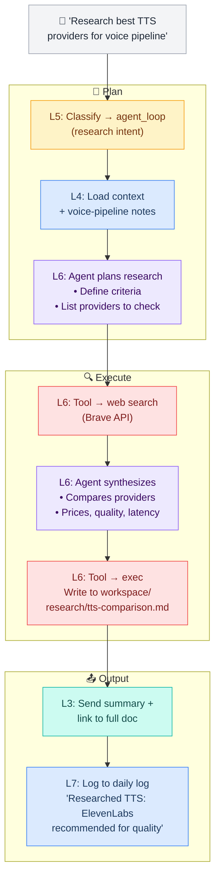

**Token cost:** 10K–50K+ (multiple search calls, synthesis, file writing)
**Output:** Research doc saved to `workspace/research/` + summary in chat
**Memory impact:** Key findings logged to L7 daily log

---

### 9. Send Notification (Outbound)

**Situation:** Crispy proactively sends a notification (e.g., cron-triggered health check alert).
**Path:** Pipeline (scheduled trigger, no user message)

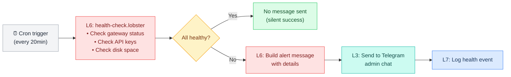

**Latency:** ~1–2s (all deterministic checks)
**Token cost:** 0 (pipeline only, no LLM)
**Key insight:** Silent on success, alert on failure — don't spam the admin

---

### 10. Push to GitHub (Exec-Approve)

**Situation:** User asks Crispy to push code changes.
**Path:** Agent Loop → Exec-Approve guardrail → Sandboxed execution

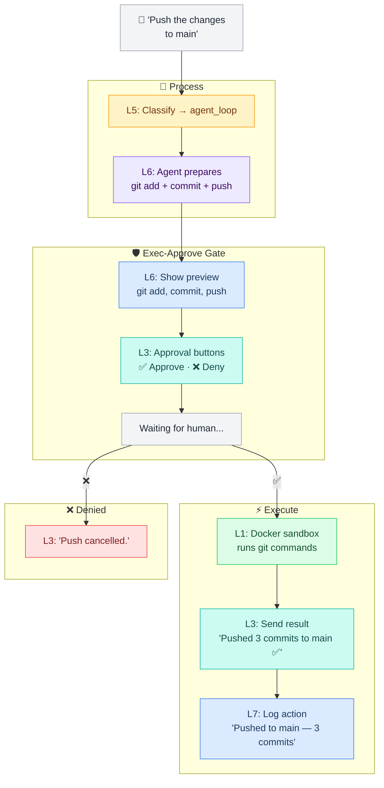

**Key insight:** Destructive or irreversible actions (push, delete, deploy) always go through exec-approve. The user sees exactly what will run before approving.

---

## Latency & Cost Summary

| Situation | Typical Latency | Token Cost | Path |
|---|---|---|---|
| Text command (`/brief`) | 1–3s | ~500–800 | Pipeline |
| Button tap | 200ms–1s | 0 | Pipeline (state lookup) |
| Voice message | 2–5s | 500–5K+ | STT → Route → TTS |
| Image received | 2–4s | 1K–2K | Vision → Agent |
| Video received | 3–6s | 1K–2K | Thumbnail → Vision |
| Planning session | 5–30s/turn | 5K–30K+ | Agent Loop (multi-turn) |
| Decision making | 3–10s | 2K–5K | Agent Loop |
| Research request | 10–60s | 10K–50K+ | Agent Loop + tools |
| Notification (cron) | 1–2s | 0 | Pipeline |
| Git push (exec-approve) | 3–15s | 2K–5K | Agent + guardrail |

---

## See Also

**Routing decisions →** [[stack/L5-routing/message-routing]]
