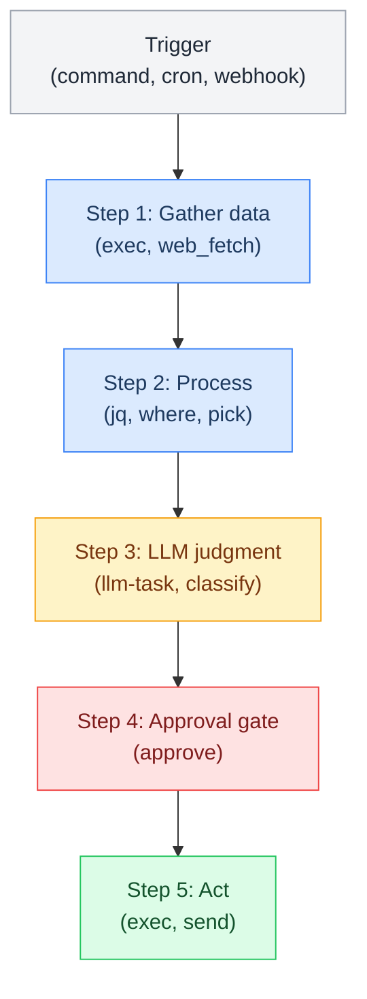

# Core Pipelines

> Lobster pipelines that handle routine work deterministically. These are the workhorses of L6 — they run without full LLM reasoning and keep token costs near zero.

---

## Pipeline Inventory

| Pipeline | Trigger | Cron | Purpose | Token Cost |
|---|---|---|---|---|
| **brief.lobster** | /brief | Daily 8am | RSS digest + weather + git + inbox summary | ~800 (llm-task) |
| **email.lobster** | /email | Gmail webhook | Email triage — classify, summarize, flag urgent | ~800 (llm-task) |
| **health-check.lobster** | — | Hourly | System heartbeat — git, memory size, uptime | 0 |
| **skill-router.lobster** | Internal | — | Match task to best skill | ~200 (classify) |

Channel-specific pipelines live in [[stack/L3-channel/telegram/pipelines|their channel folders]].
Coding pipelines live in [[stack/L6-processing/coding/_overview|the coding folder]].

---

## How Lobster Pipelines Work

### Key Concepts

- **Steps** execute in order, passing typed JSON between them via `$step_id.stdout`
- **Approval gates** halt execution and return a resume token — user approves/denies
- **Conditions** gate steps on prior results: `condition: $confirm.approved`
- **LLM steps** use `openclaw.invoke --tool llm-task` for classification/summarization (800 token cap)
- **Loops** iterate sub-workflows with `maxIterations` safety cap

### Built-in Commands

exec, where, pick, head, map, groupBy, dedupe, template, diff.last, state.get, state.set, approve

---

## Pipeline Pages

| Page | Covers |
|---|---|
| [[stack/L6-processing/pipelines/brief]] | Daily brief pipeline — RSS, weather, git, inbox |
| [[stack/L6-processing/pipelines/email]] | Email triage pipeline — classify, summarize, flag |
| [[stack/L6-processing/pipelines/health-check]] | System heartbeat — git, memory, uptime |
| [[stack/L6-processing/pipelines/skill-router]] | Skill matching and selection |
| [[stack/L6-processing/pipelines/intent-finder]] | Two-layer intent classification pipeline (trigger words + triage model) |
| [[stack/L6-processing/pipelines/prompt-builder]] | Context enrichment pipeline that builds richer prompts before the agent loop |
| [[stack/L6-processing/pipelines/media]] | Media processing, cleanup, and media-sort pipelines |

---

**Up →** [[stack/L6-processing/_overview]]
**Back →** [[stack/_overview]]
