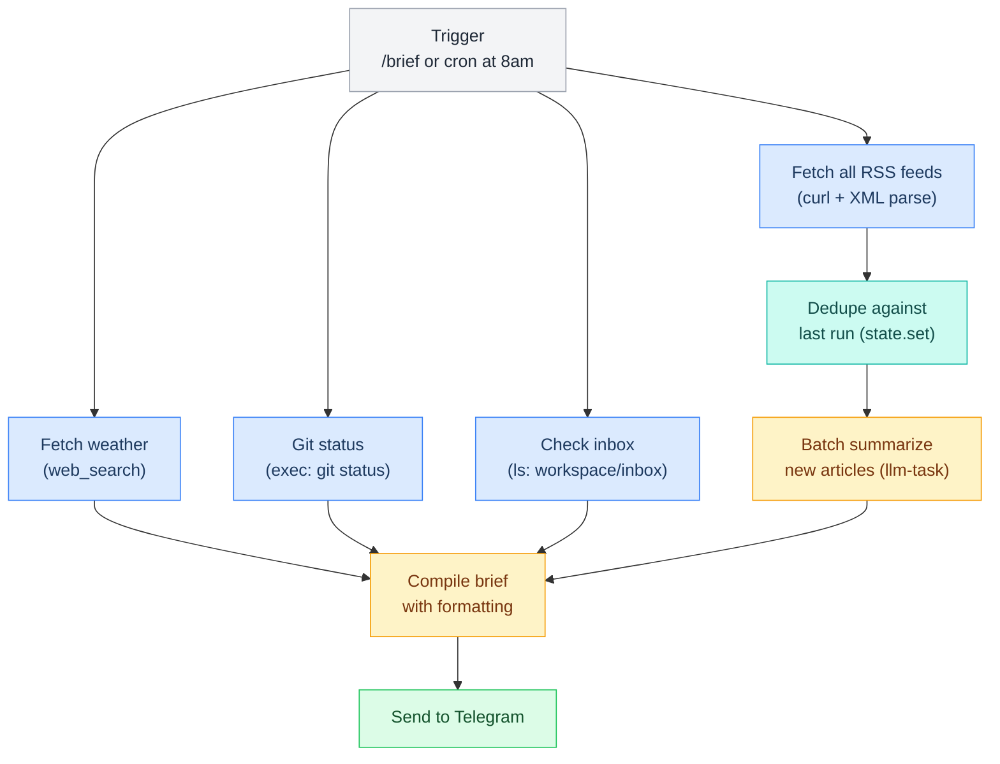

# Brief Pipeline

> Morning RSS digest with weather, git status, and inbox summary — runs daily at 8am or via /brief command.

**Up →** [[stack/L6-processing/pipelines/_overview]]

---

## Overview

The brief pipeline runs on a cron schedule (8:00 AM) or manually via `/brief` command. It fetches RSS feeds, deduplicates against the last run, summarizes articles, and compiles everything into a single Telegram message.



## Triggers

| Method | Config |
|---|---|
| **Telegram** | `/brief` custom command |
| **Cron** | Daily at 8:00 AM (America/Los_Angeles) |
| **Manual** | `openclaw pipeline run brief` |

## RSS Feed Configuration

Feeds are stored in `~/.openclaw/pipelines/feeds.json` for easy editing:

```json5
{
  "feeds": [
    // --- AI / ML ---
    { "name": "Anthropic Blog",     "url": "https://www.anthropic.com/rss.xml",           "category": "ai" },
    { "name": "OpenAI Blog",        "url": "https://openai.com/blog/rss.xml",             "category": "ai" },
    { "name": "Hacker News (top)",  "url": "https://hnrss.org/best?count=15",             "category": "tech" },
    { "name": "Ars Technica",       "url": "https://feeds.arstechnica.com/arstechnica/index", "category": "tech" },

    // --- Dev / OSS ---
    { "name": "GitHub Trending",    "url": "https://mshibanami.github.io/GitHubTrendingRSS/daily/all.xml", "category": "dev" },
    { "name": "Lobsters",           "url": "https://lobste.rs/rss",                       "category": "dev" },

    // --- Gaming ---
    { "name": "PC Gamer",           "url": "https://www.pcgamer.com/rss/",                "category": "gaming" },
    { "name": "Kotaku",             "url": "https://kotaku.com/rss",                      "category": "gaming" },

    // --- Custom (add your own) ---
    // { "name": "My Sub",  "url": "https://...", "category": "custom" }
  ],
  "maxArticlesPerFeed": 5,
  "maxTotalArticles": 30
}
```

## Pipeline YAML

```yaml
name: brief
description: >
  Daily news digest pipeline. Fetches all RSS feeds from feeds.json, deduplicates against
  previously seen URLs stored in memory, summarizes new articles with flash LLM, then
  combines with current weather, git workspace status, and inbox count into a single
  Telegram message. Triggers via /brief command or 8am cron schedule.
steps:
  - id: load_feeds
    command: exec --json --shell 'cat ~/.openclaw/pipelines/feeds.json | jq ".feeds"'
    timeout: 5000

  - id: fetch_rss
    command: exec --json --shell |
      cat ~/.openclaw/pipelines/feeds.json | jq -r '.feeds[].url' | \
      while read url; do
        curl -sf --max-time 8 "$url" | \
        python3 -c "
import sys, xml.etree.ElementTree as ET
root = ET.parse(sys.stdin).getroot()
ns = {'atom':'http://www.w3.org/2005/Atom'}
items = root.findall('.//item') or root.findall('.//atom:entry', ns)
for it in items[:5]:
  title = (it.findtext('title') or it.findtext('atom:title',namespaces=ns) or '').strip()
  link  = (it.findtext('link')  or it.findtext('atom:link',  namespaces=ns) or '').strip()
  if title and link: print(title + '\t' + link)
" 2>/dev/null || true
      done
    timeout: 45000

  - id: recall_seen
    command: exec --json --shell 'openclaw memory recall "brief:seen-urls" 2>/dev/null || echo "[]"'

  - id: dedupe
    command: exec --json --shell |
      python3 -c "
import sys, json
articles = [{'title':l.split('\t')[0],'url':l.split('\t')[1]} for l in '''$fetch_rss_stdout'''.strip().split('\n') if '\t' in l]
seen = json.loads('''$recall_seen_stdout''' or '[]')
new_articles = [a for a in articles if a['url'] not in seen][:30]
print(json.dumps(new_articles))
"

  - id: summarize
    command: openclaw.invoke --tool llm-task --action text \
      --args-json '{"model":"flash","maxTokens":500,"prompt":"Summarize each article in one line (emoji + headline). Articles:\n$dedupe_stdout"}'
    stdin: $dedupe.stdout
    timeout: 30000

  - id: weather
    command: openclaw.invoke --tool web.search \
      --args-json '{"query":"weather today Los Angeles"}'
    timeout: 10000

  - id: git_status
    command: exec --shell 'cd ~/.openclaw/workspace && git status --short | wc -l | xargs -I{} echo "{} modified"'
    timeout: 5000

  - id: inbox
    command: exec --shell 'ls ~/.openclaw/workspace/inbox/ 2>/dev/null | head -5 || echo "empty"'

  - id: save_seen
    command: exec --shell |
      python3 -c "
import json
new_urls = [a['url'] for a in json.loads('''$dedupe_stdout''')]
seen = json.loads('''$recall_seen_stdout''' or '[]')
combined = list(set(seen + new_urls))[-500:]
print(json.dumps(combined))
" | openclaw memory store "brief:seen-urls" --stdin

  - id: compile
    command: exec --shell |
      echo "📰 News Digest"
      echo ""
      echo "$summarize_stdout"
      echo ""
      echo "🌤️ $weather_stdout"
      echo ""
      echo "🔀 $git_status_stdout"
      echo ""
      echo "📥 Inbox: $inbox_stdout"
      echo ""
      echo "---"
      echo "Next brief: Tomorrow at 8:00 AM"
```
^pipeline-brief

## Managing Feeds via Telegram

Crispy responds to these commands:
- "Add this RSS feed to my brief: https://example.com/feed.xml"
- "Remove PC Gamer from my brief"
- "Show me my feed list"

These commands update `feeds.json` directly.

## Example Output

```
📰 News Digest

🤖 DeepSeek R1 Paper Released — New reasoning model beats Claude on benchmarks
🔬 Mem0 v2 Launches Graph Memory — Better long-term knowledge retention
🚀 GitHub Actions Gets 50% Faster Runners — Improved CI/CD performance
📱 React 19 Beta Out — New directives and compiler optimizations
⚡ Lobsters: The Joy of Constraint — A deep dive on building within limits

🌤️ Los Angeles: Sunny, 72°F

🔀 main branch, 2 files modified

📥 Inbox: notes.md, research/mem0/

---
Next brief: Tomorrow at 8:00 AM
```

## Cron Configuration

Add to `openclaw.json`:

```json5
{
  "cron": {
    "enabled": true,
    "jobs": [
      {
        "name": "morning-brief",
        "cron": "0 8 * * *",
        "kind": "lobster",
        "pipeline": "pipelines/brief.lobster",
        "timezone": "America/Los_Angeles"
      }
    ]
  }
}
```

---

**Related →** [[stack/L6-processing/pipelines/email]], [[stack/L6-processing/pipelines/health-check]]
