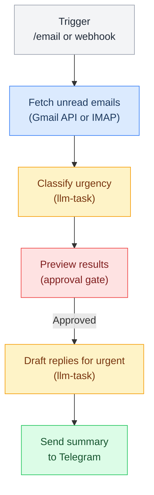

# Email Triage Pipeline

> Fetch unread emails, classify by urgency, summarize, and send digest to Telegram via manual command or Gmail webhook.

**Up →** [[stack/L6-processing/pipelines/_overview]]

---

## Overview

The email pipeline fetches unread emails, classifies by urgency, summarizes, and sends a digest to Telegram. Can be triggered manually, via Telegram command, or via Gmail webhook.



## Triggers

| Method | Config |
|---|---|
| **Telegram** | `/email` custom command |
| **Webhook** | Gmail push notification → `hooks.entries.gmail` |
| **Manual** | `openclaw pipeline run email` |

## Email Classification Schema

Emails are classified into three urgency levels:

| Urgency | Criteria | Action |
|---|---|---|
| **URGENT** | Requires immediate action (prod down, time-sensitive decision, blocker) | Flag in Telegram, consider waking Marty if after hours |
| **NORMAL** | Important but not blocking (team discussion, review request, status update) | Include in digest, review when convenient |
| **LOW** | Informational (newsletters, notifications, FYI) | Batch digest, can wait until next brief |

## Approval Gate

The pipeline requires explicit approval before sending email summaries to Telegram:

```
Crispy: "📧 Email Triage

🔴 URGENT (1):
  Re: Server down — From: devops@company.com
  Production outage requires immediate attention

🟡 NORMAL (3):
  Q1 Planning — From: boss@company.com
  Need your input on roadmap priorities

  Code Review — From: alice@company.com
  Please review PR #456

  Team Standup — From: engineering@company.com
  Summary of today's standup notes

🟢 LOW (2):
  Weekly News — From: techcrunch@news.com
  TechCrunch weekly digest...

  Slack DM — From: slack@company.com
  New DM notification

[Approve] [Cancel]"
```

## Dependencies

- Gmail API access or IMAP credentials
- OAuth token for Gmail (if using webhook)
- `llm-task` plugin (for classification)
- `hooks` config (for webhook trigger)

## Telegram Command

Register in `openclaw.json`:

```json5
{
  "channels": {
    "telegram": {
      "customCommands": {
        "/email": { "pipeline": "email.lobster" }
      }
    }
  }
}
```

## Pipeline YAML

```yaml
name: email
description: >
  Email triage pipeline. Fetches unread Gmail messages, classifies each by urgency
  (URGENT/NORMAL/LOW) using flash LLM, presents a preview with approval gate before
  sending the digest to Telegram. URGENT items include draft reply suggestions. Triggers
  via /email Telegram command or Gmail webhook push notification.
args:
  max_emails:
    default: "20"
steps:
  - id: fetch_emails
    command: exec --json --shell |
      python3 -c "
import subprocess, json, sys
# Uses gmail CLI tool or IMAP credentials from env
result = subprocess.run(
  ['openclaw', 'tool', 'gmail', 'list-unread', '--max', '$max_emails', '--format', 'json'],
  capture_output=True, text=True
)
if result.returncode == 0:
  print(result.stdout)
else:
  print(json.dumps([]))
" 2>/dev/null || echo "[]"
    timeout: 30000

  - id: classify
    command: openclaw.invoke --tool llm-task --action json \
      --args-json '{
        "model": "flash",
        "maxTokens": 800,
        "prompt": "Classify each email by urgency. URGENT=requires immediate action. NORMAL=important but not blocking. LOW=informational. Return JSON array with fields: id, from, subject, urgency, one_line_summary.",
        "schema": {"type":"array","items":{"type":"object","properties":{"id":{"type":"string"},"from":{"type":"string"},"subject":{"type":"string"},"urgency":{"type":"string"},"one_line_summary":{"type":"string"}}}}
      }'
    stdin: $fetch_emails.stdout
    timeout: 30000

  - id: format_preview
    command: exec --shell |
      python3 -c "
import json, sys
emails = json.loads('''$classify_stdout''')
urgent = [e for e in emails if e['urgency'] == 'URGENT']
normal = [e for e in emails if e['urgency'] == 'NORMAL']
low    = [e for e in emails if e['urgency'] == 'LOW']
print('📧 Email Triage\n')
if urgent:
  print(f'🔴 URGENT ({len(urgent)}):')
  for e in urgent: print(f'  {e[\"subject\"]} — {e[\"from\"]}\n  {e[\"one_line_summary\"]}')
  print()
if normal:
  print(f'🟡 NORMAL ({len(normal)}):')
  for e in normal: print(f'  {e[\"subject\"]} — {e[\"from\"]}\n  {e[\"one_line_summary\"]}')
  print()
if low:
  print(f'🟢 LOW ({len(low)}):')
  for e in low[:3]: print(f'  {e[\"subject\"]} — {e[\"from\"]}')
  if len(low) > 3: print(f'  ... and {len(low)-3} more')
"

  - id: approve
    command: approve --preview-from-stdin --prompt "Send this email digest to Telegram?"
    stdin: $format_preview.stdout
    approval: required

  - id: send_digest
    command: exec --shell 'echo "$format_preview_stdout"'
    condition: $approve.approved
```
^pipeline-email

## Future Enhancements

- [ ] Auto-draft replies for urgent emails
- [ ] Snooze feature ("remind me about this in 1 hour")
- [ ] Filter by sender (only show emails from team)
- [ ] Context-aware classification (know which projects are active)
- [ ] Auto-mark-as-read after processing
- [ ] Integration with calendar for time-sensitive items

---

**Related →** [[stack/L6-processing/pipelines/brief]], [[stack/L6-processing/pipelines/health-check]]
