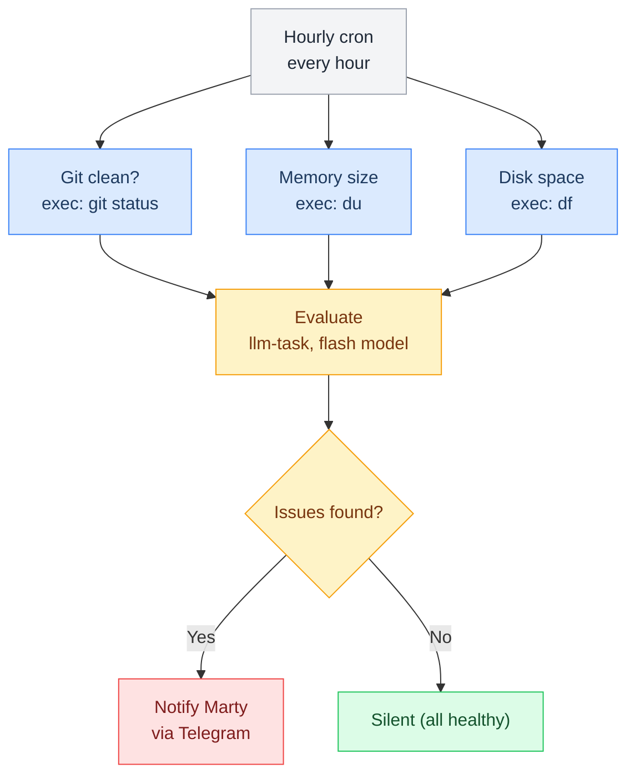

# Health Check Pipeline

> Hourly system heartbeat — checks git status, memory size, and disk usage; alerts only if issues found.

**Up →** [[stack/L6-processing/pipelines/_overview]]

---

## Overview

The health-check pipeline runs hourly and checks system metrics. It corresponds to `HEARTBEAT.md` in the workspace. When issues are found, it notifies Marty. When healthy, it's silent.



## Triggers

| Method | Config |
|---|---|
| **Cron** | Every hour (0 * * * *) |
| **Manual** | `openclaw pipeline run health-check` |

## Health Metrics

The pipeline checks these metrics:

| Metric | Alert Threshold | Why | Action |
|---|---|---|---|
| **Git dirty files** | > 0 for more than a day | Uncommitted work should be staged | Run `git status`, then `/git` |
| **Memory folder size** | > 500MB | Daily logs growing too fast | Curate MEMORY.md, archive old logs |
| **Disk usage** | > 90% | Running out of space | Clean up old files, expand disk |
| **Daily log** | > 2000 words | Daily log should be concise | Review and extract key facts to MEMORY.md |

## Cron Configuration

Add to `openclaw.json`:

```json5
{
  "cron": {
    "enabled": true,
    "jobs": [
      {
        "name": "health-check",
        "cron": "0 * * * *",
        "kind": "lobster",
        "pipeline": "pipelines/health-check.lobster",
        "model": "flash",
        "condition": {"jsonPath": "$.ok", "equals": false},
        "onCondition": {
          "kind": "agentTurn",
          "message": "Health check flagged issues: {{pipeline.output}}"
        }
      }
    ]
  }
}
```

## Pipeline YAML

```yaml
name: health-check
description: >
  Hourly system health check. Measures git workspace cleanliness, memory folder size,
  disk usage, and daily log length. Evaluates with flash LLM against alert thresholds.
  Silent when healthy — only sends Telegram notification when issues are found. Runs
  every hour via cron (0 * * * *) or manually via openclaw pipeline run health-check.
steps:
  - id: git_status
    command: exec --json --shell |
      cd ~/.openclaw/workspace
      DIRTY=$(git status --porcelain | wc -l | tr -d ' ')
      LAST_CLEAN=$(git log -1 --format="%ar" --diff-filter=A -- . 2>/dev/null || echo "unknown")
      echo "{\"dirty_files\":$DIRTY,\"last_commit\":\"$LAST_CLEAN\"}"
    timeout: 10000

  - id: memory_size
    command: exec --json --shell |
      SIZE_MB=$(du -sm ~/.openclaw/workspace/memory 2>/dev/null | awk '{print $1}' || echo "0")
      echo "{\"size_mb\":$SIZE_MB}"
    timeout: 10000

  - id: disk_usage
    command: exec --json --shell |
      PCT=$(df -h ~/.openclaw 2>/dev/null | awk 'NR==2 {gsub(/%/,""); print $5}' || echo "0")
      echo "{\"used_pct\":$PCT}"
    timeout: 10000

  - id: log_size
    command: exec --json --shell |
      TODAY=$(date +%Y-%m-%d)
      WORDS=$(wc -w < ~/.openclaw/workspace/logs/${TODAY}.md 2>/dev/null || echo "0")
      echo "{\"word_count\":$WORDS}"
    timeout: 5000

  - id: evaluate
    command: openclaw.invoke --tool llm-task --action json \
      --args-json '{
        "model": "flash",
        "maxTokens": 300,
        "prompt": "Evaluate system health. Thresholds: git_dirty>0 for >1 day=warn, memory>500MB=warn, disk>90%=alert, log_words>2000=warn. Data: git=$git_status_stdout, memory=$memory_size_stdout, disk=$disk_usage_stdout, log=$log_size_stdout. Return JSON: {ok:bool, alerts:[{metric,value,message}]}",
        "schema": {"type":"object","properties":{"ok":{"type":"boolean"},"alerts":{"type":"array"}}}
      }'
    timeout: 15000

  - id: notify
    command: exec --shell |
      python3 -c "
import json, sys
data = json.loads('''$evaluate_stdout''')
if not data['ok']:
  print('⚠️ Health Check Alert\n')
  for alert in data['alerts']:
    print(f'{alert[\"metric\"]}: {alert[\"value\"]} — {alert[\"message\"]}')
"
    condition: 'not $evaluate_json.ok'
```
^pipeline-health-check

## Model Selection

The health-check pipeline uses the **flash model** (Gemini 2.5 Flash Lite):

- Cheapest inference cost
- Fast (good for hourly checks)
- Sufficient for simple metric evaluation
- Result: ~0.1¢ per check, minimal impact on token budget

## Silent When Healthy

The pipeline only sends notifications when issues are found. If all metrics are healthy:

```
✅ [13:00] Health check: OK
✅ [14:00] Health check: OK
✅ [15:00] Health check: OK
```

No noise in Telegram.

## Example Alerts

### Alert: Git Dirty Files

```
⚠️ Health Check Alert

🔀 Git workspace has 5 uncommitted changes (hasn't been clean for 14 hours)
  → Run /git to see status
  → Commit or stash changes
```

### Alert: Disk Space

```
⚠️ Health Check Alert

💾 Disk usage at 92%
  → Free up space or expand disk
  → Consider archiving old memory logs
```

### Alert: Large Daily Log

```
⚠️ Health Check Alert

📝 Today's daily log is 2,847 words (should be ~500)
  → Review and extract key facts to MEMORY.md
  → Keep daily logs focused on daily events, move long-term knowledge to MEMORY.md
```

## Dependencies

- `exec` tool (sandbox access) — for git, du, df commands
- `llm-task` plugin with flash model
- `agent_send` tool (for Telegram notification)
- Workspace at `~/.openclaw/workspace`

## Future Enhancements

- [ ] Check if research is stale (> 7 days old)
- [ ] Monitor workspace file count (alert if > 1000)
- [ ] Check backup age (if you have automated backups)
- [ ] Monitor session history size
- [ ] Check pipeline success rate

---

**Related →** [[stack/L6-processing/pipelines/brief]], [[stack/L6-processing/pipelines/email]]
