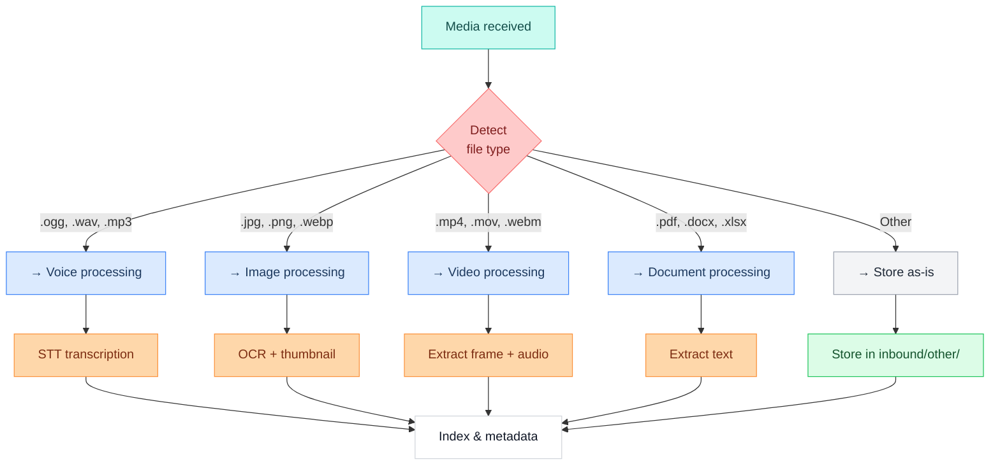
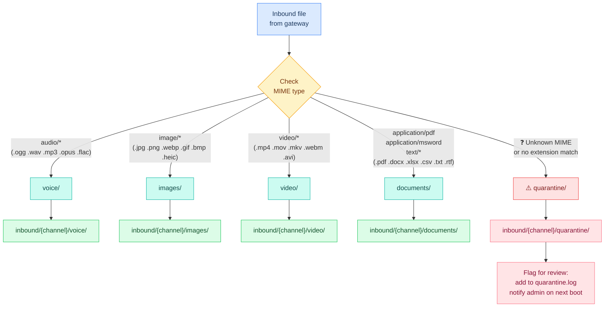
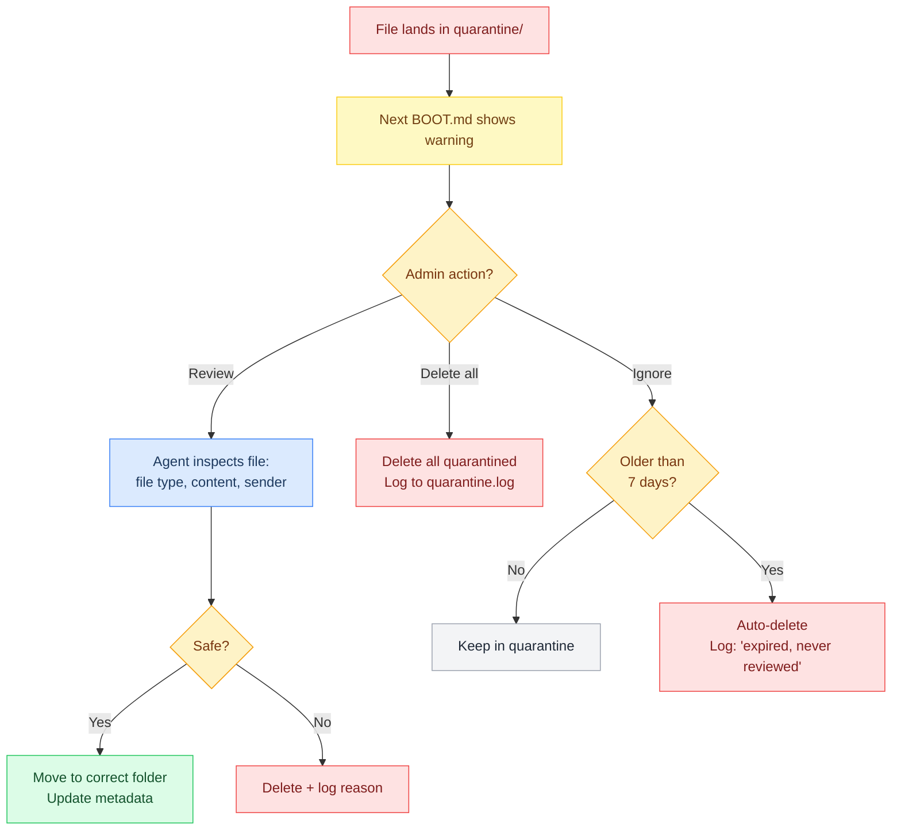

# Media Pipelines

> Inbound: Download, extract, transcribe, OCR. Outbound: Generate voice, images, documents. Cleanup: Archive and delete old media.

---

## Media Pipeline


### Overview

The media pipeline handles all media processing (inbound and outbound) in three phases:

```mermaid
flowchart TD
    subgraph INBOUND["INBOUND: Process Received Media"]
        RCV["Receive from channel"]:::teal
        ROUTE["Route by type"]:::orange
        IMG_PROC["Image: Resize, OCR, thumbnail"]:::blue
        VOICE_PROC["Voice: Transcribe (STT)"]:::blue
        VIDEO_PROC["Video: Extract audio, thumbnail"]:::blue
        DOC_PROC["Document: Extract text, summarize"]:::blue
        INDEX["Index & tag"]:::green
    end

    subgraph OUTBOUND["OUTBOUND: Generate Media"]
        GEN["Generate response"]:::teal
        IMG_GEN["Charts, graphs, images"]:::blue
        VOICE_GEN["TTS audio"]:::blue
        DOC_GEN["PDF reports, exports"]:::blue
        STORE_OUT["Store & track"]:::green
    end

    subgraph CLEANUP["CLEANUP: Archive & Delete"]
        CHECK["Find 30+ day old"]:::amber
        MOVE["Move to archive/"]:::yellow
        FIND_EXPIRED["Find 90+ day archived"]:::amber
        DELETE["Permanently delete"]:::red
        LOG_DEL["Log deletion"]:::white
    end

    RCV --> ROUTE
    ROUTE --> IMG_PROC
    ROUTE --> VOICE_PROC
    ROUTE --> VIDEO_PROC
    ROUTE --> DOC_PROC
    IMG_PROC --> INDEX
    VOICE_PROC --> INDEX
    VIDEO_PROC --> INDEX
    DOC_PROC --> INDEX

    GEN --> IMG_GEN
    GEN --> VOICE_GEN
    GEN --> DOC_GEN
    IMG_GEN --> STORE_OUT
    VOICE_GEN --> STORE_OUT
    DOC_GEN --> STORE_OUT

    CHECK --> MOVE
    MOVE --> FIND_EXPIRED
    FIND_EXPIRED --> DELETE
    DELETE --> LOG_DEL

    classDef teal fill:#ccfbf1,stroke:#14b8a6,color:#134e4a
    classDef blue fill:#dbeafe,stroke:#3b82f6,color:#1e3a5f
    classDef green fill:#dcfce7,stroke:#22c55e,color:#14532d
    classDef orange fill:#fed7aa,stroke:#fb923c,color:#7c2d12
    classDef amber fill:#fecaca,stroke:#f87171,color:#7f1d1d
    classDef yellow fill:#fef3c7,stroke:#f59e0b,color:#78350f
    classDef red fill:#fee2e2,stroke:#ef4444,color:#7f1d1d
    classDef white fill:#ffffff,stroke:#d1d5db,color:#111827
```



### Inbound Processing: Image Processing

**Pipeline:** Images (JPEG, PNG, WebP, etc.)

| Step | Tool | Time | Output |
|---|---|---|---|
| Download | curl/wget | ~200ms | Raw file |
| Resize | ImageMagick | ~500ms | 1920px max |
| Thumbnail | ImageMagick | ~300ms | 300px PNG |
| OCR | Tesseract + EasyOCR | ~2-5s | Extracted text + confidence |
| EXIF | exiftool | ~100ms | Metadata (camera, date, location) |
| Object detection | YOLO or Claude Vision | ~1-2s | Object labels + bounding boxes |
| Index | JSON write | ~50ms | Searchable entry |

### Inbound Processing: Voice Processing

**Pipeline:** Voice messages (OGG, WAV, MP3)

| Step | Tool | Time | Output |
|---|---|---|---|
| Download | Telegram/Discord API | ~100-500ms | Raw audio file |
| Validate | ffprobe | ~100ms | Format confirmation |
| Duration | ffprobe | ~100ms | Duration in seconds |
| Transcribe | Whisper API or Deepgram | ~2-10s | Text + confidence |
| Language detect | Whisper or franc | ~200ms | Language code |
| Index | JSON write | ~50ms | Searchable entry |

### Inbound Processing: Video Processing

**Pipeline:** Video files and clips (MP4, MOV, WebM)

| Step | Tool | Time | Output |
|---|---|---|---|
| Download | Telegram/Discord API | ~1-10s (depends on size) | Raw video file |
| Validate | ffprobe | ~100ms | Format confirmation |
| Duration | ffprobe | ~100ms | Duration in seconds |
| Thumbnail | ffmpeg | ~500ms | PNG frame from 25% mark |
| Extract audio | ffmpeg | ~2-5s | Separate WAV file |
| Transcribe audio | Whisper | ~5-30s (depends on duration) | Full transcript |
| Index | JSON write | ~100ms | Searchable entry |

### Inbound Processing: Document Processing

**Pipeline:** PDFs, DOCX, XLSX, TXT, etc.

| Step | Tool | Time | Output |
|---|---|---|---|
| Download | API | ~200-2000ms | Raw file |
| Validate | file command | ~50ms | Format confirmation |
| Count pages | pdfinfo (PDF) or doc parser | ~100ms | Page count |
| Extract text | pdftotext, python-docx, openpyxl | ~500ms-2s | Full text |
| Parse structure | Regex or markdown parser | ~200ms | Headings, lists, tables |
| Summarize | Claude Haiku | ~1-2s | Summary + key points |
| Keywords | spaCy or LLM | ~500ms | Extracted keywords |
| Index | JSON write | ~100ms | Searchable entry |

### Outbound Generation: TTS Audio Generation

**Config for outbound storage:**

```json5
"media": {
  "outbound": {
    "voice": {
      "enabled": true,
      "tts_provider": "elevenlabs",
      "voice_id": "Ember",
      "output_format": "ogg_opus",   // Telegram native
      "store_tts": true,
      "cache_common_responses": [
        "I'm processing that...",
        "Done!",
        "I didn't understand..."
      ]
    }
  }
}
```

## Pipeline YAML

```yaml
name: media
description: >
  Inbound media processing pipeline. Detects file type by MIME, routes to the
  appropriate processor: voice→Whisper STT transcription, image→OCR+thumbnail,
  video→frame extraction+audio transcription, document→text extraction+summary.
  Writes metadata JSON alongside each file and indexes in memory. Fires on
  message.inbound when attachment is present (gate-level hook trigger).
args:
  file_path:
    required: true
    description: "Absolute path to the downloaded media file"
  channel:
    default: "telegram"
  mime_type:
    default: ""
steps:
  - id: detect_type
    command: exec --json --shell |
      MIME="${mime_type:-$(file --mime-type -b "$file_path" 2>/dev/null)}"
      case "$MIME" in
        audio/*) echo '{"type":"voice","mime":"'"$MIME"'"}' ;;
        image/*) echo '{"type":"image","mime":"'"$MIME"'"}' ;;
        video/*) echo '{"type":"video","mime":"'"$MIME"'"}' ;;
        application/pdf|application/msword|application/*word*|text/*) echo '{"type":"document","mime":"'"$MIME"'"}' ;;
        *) echo '{"type":"unknown","mime":"'"$MIME"'"}' ;;
      esac
    timeout: 5000

  - id: process_voice
    command: exec --json --shell |
      openclaw tool whisper transcribe "$file_path" --format json 2>/dev/null || \
      echo '{"text":"[transcription failed]","language":"unknown"}'
    condition: '$detect_type_json.type == "voice"'
    timeout: 120000

  - id: process_image
    command: exec --json --shell |
      THUMB="${file_path%.jpg}_thumb.jpg"
      convert "$file_path" -resize 300x300^ -gravity center -extent 300x300 "$THUMB" 2>/dev/null || true
      OCR=$(tesseract "$file_path" stdout 2>/dev/null | head -c 2000 || echo "")
      echo "{\"thumbnail\":\"$THUMB\",\"ocr_text\":\"$(echo $OCR | head -c 500)\"}"
    condition: '$detect_type_json.type == "image"'
    timeout: 30000

  - id: process_document
    command: exec --json --shell |
      TEXT=$(pdftotext "$file_path" - 2>/dev/null | head -c 3000 || \
             python3 -c "import docx; d=docx.Document('$file_path'); print('\n'.join([p.text for p in d.paragraphs[:50]]))" 2>/dev/null | head -c 3000 || \
             cat "$file_path" 2>/dev/null | head -c 3000 || echo "")
      echo "{\"extracted_text\":\"$(echo $TEXT | head -c 2000 | tr '"' "'")\"}"
    condition: '$detect_type_json.type == "document"'
    timeout: 30000

  - id: summarize_document
    command: openclaw.invoke --tool llm-task --action json \
      --args-json '{"model":"flash","maxTokens":200,"prompt":"Summarize this document in 2-3 sentences and extract 5 keywords. Text: $process_document_json.extracted_text","schema":{"type":"object","properties":{"summary":{"type":"string"},"keywords":{"type":"array"}}}}'
    condition: '$detect_type_json.type == "document"'
    timeout: 20000

  - id: write_metadata
    command: exec --shell |
      python3 -c "
import json, os, datetime
meta = {
  'timestamp': datetime.datetime.utcnow().isoformat() + 'Z',
  'channel': '$channel',
  'file_path': '$file_path',
  'type': '''$detect_type_json''' and json.loads('''$detect_type_json''').get('type'),
  'mime': '''$detect_type_json''' and json.loads('''$detect_type_json''').get('mime'),
}
if '$detect_type_json'.find('voice') >= 0:
  meta['transcript'] = json.loads('''$process_voice_stdout''' or '{}').get('text')
elif '$detect_type_json'.find('image') >= 0:
  meta['ocr_text'] = json.loads('''$process_image_stdout''' or '{}').get('ocr_text')
elif '$detect_type_json'.find('document') >= 0:
  meta['summary'] = json.loads('''$summarize_document_stdout''' or '{}').get('summary')
  meta['keywords'] = json.loads('''$summarize_document_stdout''' or '{}').get('keywords')
out_path = '$file_path' + '.metadata.json'
with open(out_path, 'w') as f:
  json.dump(meta, f, indent=2)
print(out_path)
"
    timeout: 5000

  - id: index
    command: exec --shell |
      openclaw memory store "media:$(basename $file_path)" \
        --value "$(cat ${file_path}.metadata.json)" 2>/dev/null || true
```
^pipeline-media

### Outbound Generation: Image Generation

| Type | Tool | Time | Cost |
|---|---|---|---|
| **Bar/line/pie charts** | Matplotlib | ~500ms | Free (local) |
| **Heatmaps, scatter plots** | Seaborn | ~700ms | Free (local) |
| **Custom text on image** | Pillow | ~300ms | Free (local) |
| **Synthetic images** | DALL-E | ~10-20s | ~$0.04 per image |
| **QR codes** | qrcode library | ~200ms | Free (local) |

### Outbound Generation: Document Generation

| Type | Library | Time | Cost |
|---|---|---|---|
| **PDF reports** | ReportLab, FPDF2 | ~1-2s | Free (local) |
| **DOCX documents** | python-docx | ~500ms | Free (local) |
| **XLSX spreadsheets** | openpyxl | ~500ms | Free (local) |
| **CSV export** | csv module | ~200ms | Free (local) |

### Cleanup Pipeline

File: `~/.openclaw/pipelines/media-cleanup.lobster`

Runs daily at **2:00 AM UTC**.

**Cleanup schedule:**
- Archive media >30 days old (inbound and outbound)
- Delete archived media >90 days old
- Report storage usage
- Alert if over budget (300GB inbound, 1TB archive, 100GB cache)

### Routing by Media Type



---

## Media Sorting


### When It Fires

**Config:**

```json5
"hooks": {
  "enabled": true,
  "entries": {
    "media-sort": {
      "kind": "lobster",
      "pipeline": "pipelines/media-sort.lobster",
      "on": "message.inbound",
      "condition": "message.hasAttachment"
    }
  }
}
```

Gateway receives message with attachment → hooks.entries.media-sort triggers → media-sort.lobster runs (deterministic, no agent)

### Routing by File Type



### MIME → Folder Mapping

| MIME Pattern | Extensions | Folder | Notes |
|---|---|---|---|
| `audio/*` | `.ogg` `.wav` `.mp3` `.opus` `.flac` `.aac` `.m4a` | `voice/` | Telegram voice = `.ogg` Opus |
| `image/*` | `.jpg` `.jpeg` `.png` `.webp` `.gif` `.bmp` `.heic` `.svg` | `images/` | Telegram sends 3 sizes; gateway picks largest |
| `video/*` | `.mp4` `.mov` `.mkv` `.webm` `.avi` `.wmv` | `video/` | Includes Telegram video messages + full uploads |
| `application/pdf` | `.pdf` | `documents/` | — |
| `application/msword` | `.doc` | `documents/` | Legacy Word format |
| `application/vnd.openxmlformats*` | `.docx` `.xlsx` `.pptx` | `documents/` | Modern Office formats |
| `text/*` | `.txt` `.csv` `.rtf` `.md` `.json` `.xml` `.html` | `documents/` | Plain text and structured text |
| `application/zip` | `.zip` `.tar` `.gz` `.7z` `.rar` | `documents/` | Archives treated as documents |
| **Everything else** | Unknown | **`quarantine/`** | Flagged for manual review |

### Quarantine Policy



**Rules:**
- Quarantined files are **never processed** (no OCR, no STT, no text extraction)
- 7-day auto-delete if not reviewed
- Quarantine log kept for 90 days for audit
- BOOT.md always shows quarantine count if > 0
- Agent cannot auto-classify quarantine files without admin confirmation

### Suspicious File Detection

Beyond just "unknown MIME," these patterns trigger quarantine:

| Signal | Example | Why quarantine |
|---|---|---|
| **No MIME type** | Platform didn't report one | Can't classify safely |
| **MIME/extension mismatch** | `.jpg` file with `application/octet-stream` | Possible disguised file |
| **Double extension** | `report.pdf.exe` | Classic attack pattern |
| **Oversized for type** | 500MB "image" file | Likely mislabeled |
| **Executable patterns** | `.exe` `.bat` `.sh` `.py` `.js` `.cmd` | Code files need review |
| **Encrypted/password-protected** | Encrypted ZIP, password PDF | Can't inspect content |

### Resulting Folder Structure

After the pipeline runs:

```
~/.openclaw/workspace/media/
├── inbound/
│   ├── telegram/
│   │   ├── voice/
│   │   │   ├── telegram-20260302-a1b2c3d4.ogg
│   │   │   └── telegram-20260302-a1b2c3d4.ogg.metadata.json
│   │   ├── images/
│   │   │   ├── telegram-20260302-e5f6g7h8.jpg
│   │   │   └── telegram-20260302-e5f6g7h8.jpg.metadata.json
│   │   ├── video/
│   │   ├── documents/
│   │   └── quarantine/          ← unknown/suspicious files
│   │       ├── telegram-20260302-x9y0z1w2.bin
│   │       └── telegram-20260302-x9y0z1w2.bin.metadata.json
│   ├── discord/
│   │   ├── voice/
│   │   ├── images/
│   │   ├── video/
│   │   ├── documents/
│   │   └── quarantine/
│   └── gmail/
│       ├── documents/
│       └── quarantine/
├── .processed                   ← hash log (one SHA256 per line)
├── quarantine.log               ← quarantine audit trail
├── .last-catchup                ← cron timestamp marker
└── cleanup.log                  ← cleanup audit trail
```

### Monitoring & Logging

Every processed media file generates a detailed log entry:

```json
{
  "timestamp": "2026-03-02T14:23:15.234Z",
  "media_id": "telegram-20260302-user123-a1b2c3",
  "channel": "telegram",
  "direction": "inbound",
  "type": "image",
  "user_id": "user123",
  "user_name": "Marty",
  "file_size_bytes": 245600,
  "format": "jpeg",
  "processing": {
    "resize_applied": false,
    "thumbnail_generated": true,
    "ocr_text": "Invoice #12345",
    "ocr_confidence": 0.98,
    "ocr_duration_ms": 2340,
    "exif_camera": "iPhone 15 Pro",
    "total_duration_ms": 3200
  },
  "stored_path": "~/.openclaw/workspace/media/inbound/telegram/images/telegram-20260302-user123-d4e5f6.jpg",
  "metadata_path": "~/.openclaw/workspace/media/inbound/telegram/images/telegram-20260302-user123-d4e5f6.jpg.metadata.json",
  "tags": ["invoice", "financial"],
  "status": "success"
}
```

---

**Up →** [[stack/L6-processing/pipelines/_overview]]
**Related →** [[stack/L1-physical/media]]
**Related →** [[stack/L3-channel/voice-pipeline]]
**Back →** [[stack/_overview]]
