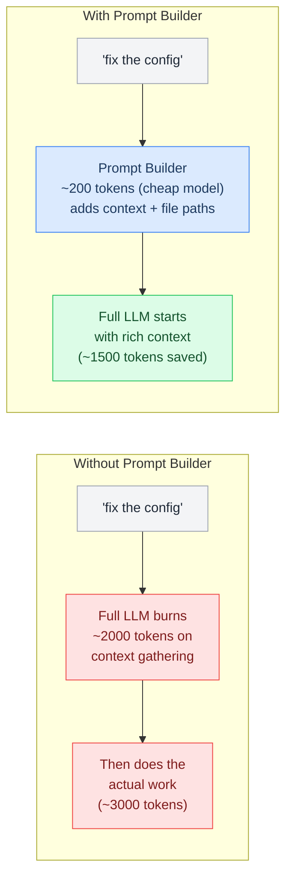
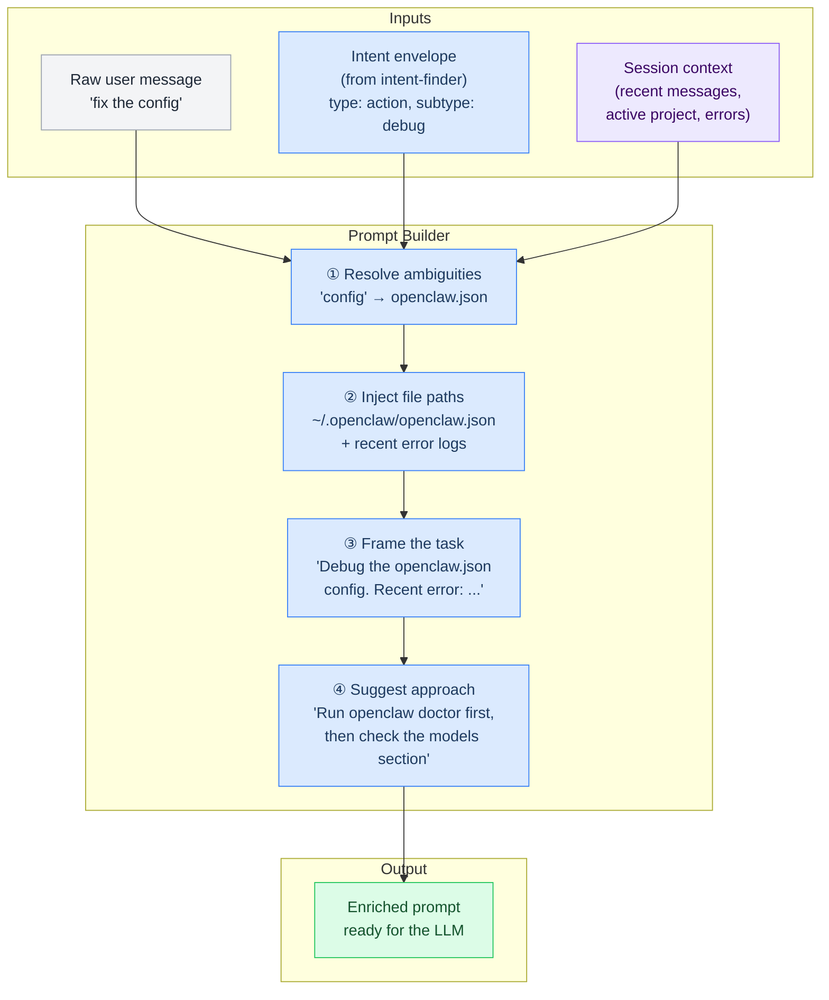

# Prompt Builder Pipeline

> Enriches raw user message + intent envelope with context, file paths, and suggested approach (~200 tokens) to save the main LLM ~1500 tokens.

**Up →** [[stack/L6-processing/pipelines/_overview]]

---

> The prompt builder sits between intent classification and the agent loop. It takes the raw user message + the intent envelope, and builds a richer, more structured prompt that helps the main LLM respond faster, cheaper, and more accurately. Think of it as a translator between human-speak and agent-speak.

> **Core insight:** If Marty says "fix the config" — that's 3 words. The prompt builder expands it into a 50-word structured prompt with context, file paths, recent errors, and suggested approach. The main LLM then starts from a much better position instead of spending 2000 tokens figuring out what "the config" means.

## The Problem

Without a prompt builder, the full LLM receives the raw user message and has to:

1. Figure out what the user means ("config" = openclaw.json? .env? AGENTS.md?)
2. Find relevant files (which files to check, where they live)
3. Recall recent context (what errors happened, what we were working on)
4. Decide on an approach (read first? diff? run doctor?)
5. Actually do the work

Steps 1–4 burn tokens on context-gathering that could be pre-computed cheaply. The prompt builder handles 1–4 so the LLM can start at step 5.



## How It Works

The prompt builder takes three inputs and produces one output:



## The Four Enrichment Steps

### ① Resolve Ambiguities

Map vague references to specific entities using project knowledge:

| Raw Reference | Resolved To | How |
|---|---|---|
| "the config" | `~/.openclaw/openclaw.json` | Intent = debug + "config" keyword → most likely openclaw.json |
| "the bot" | Telegram bot (Crispy) | Active channel = Telegram, context = bot setup |
| "the error" | Last error from session history | Check recent messages for error patterns |
| "the API" | User profile API (from MEMORY.md) | Recent planning session was about user profiles |
| "the project" | crispy-kitsune repo | Active project from session context |
| "that thing we discussed" | Guardrails output validator | L7 memory search for recent discussion topics |

**Resolution strategy:**
- Check `context_hints` from the intent envelope
- Search last 5 messages in session for related nouns
- Check MEMORY.md for recent project/topic references
- If still ambiguous → don't guess, add a clarification prompt

### ② Inject File Paths

Based on the resolved entities, inject relevant file paths so the LLM knows where to look:

```yaml
# Example: "fix the config" → inject these paths
files:
  primary:
    - "~/.openclaw/openclaw.json"      # The main config file
  related:
    - "~/.openclaw/.env"                # Environment variables
    - "workspace/AGENTS.md"             # Agent bootstrap (references config)
  recent_errors:
    - "Last error (2 min ago): 'Invalid model alias: old-workhorse'"
  diagnostic:
    - "Run: openclaw doctor"            # Suggested diagnostic command
```

## Pipeline YAML

```yaml
name: prompt-builder
description: >
  Context enrichment pipeline. Takes raw user message and intent envelope, resolves
  vague references to specific files/entities using session context and memory, injects
  relevant file paths and recent errors, and frames the task with a suggested approach.
  Saves ~1500 tokens per agent turn by pre-computing context gathering. Runs between
  intent classification and agent loop for action and assistance intents.
args:
  message:
    required: true
    description: "Raw user message"
  intent:
    default: "{}"
    description: "Intent envelope JSON from intent-finder"
steps:
  - id: recall_context
    command: exec --json --shell |
      openclaw memory recall "session:recent-context" 2>/dev/null | \
      jq '{active_project: .project, recent_files: .files[-5:], recent_errors: .errors[-3:]}' \
      2>/dev/null || echo '{"active_project":null,"recent_files":[],"recent_errors":[]}'
    timeout: 5000

  - id: resolve
    command: openclaw.invoke --tool llm-task --action json \
      --args-json '{
        "model": "flash",
        "maxTokens": 400,
        "prompt": "Resolve vague references in this message to specific files/entities. Message: \"$message\". Intent: $intent. Context: $recall_context_stdout. Return JSON: {resolved_entities: {term: file_or_entity}, primary_files: [string], suggested_approach: string, clarification_needed: bool, clarification_question: string|null}",
        "schema": {"type":"object","properties":{"resolved_entities":{"type":"object"},"primary_files":{"type":"array"},"suggested_approach":{"type":"string"},"clarification_needed":{"type":"boolean"},"clarification_question":{"type":["string","null"]}}}
      }'
    timeout: 15000

  - id: build_prompt
    command: exec --shell |
      python3 -c "
import json, sys
msg = '''$message'''
resolved = json.loads('''$resolve_stdout''')
intent = json.loads('''$intent''' or '{}')
files = resolved.get('primary_files', [])
approach = resolved.get('suggested_approach', '')
files_str = '\n'.join(f'  - {f}' for f in files) if files else '  (none identified)'
print(f'''Task: {msg}

Intent: {intent.get(\"class\", \"unknown\")} / {intent.get(\"subtype\", \"\")}

Relevant files:
{files_str}

Suggested approach: {approach}''')
"
```
^pipeline-prompt-builder

### ③ Frame the Task

Rewrite the raw message as a structured task description:

**Before (raw):** "fix the config"

**After (framed):**
> Debug the OpenClaw configuration at `~/.openclaw/openclaw.json`. The user reports an issue (details unclear from message). Recent session context shows an error 2 minutes ago: `Invalid model alias: old-workhorse`. Likely cause: model alias was updated from `workhorse` to `researcher`; user's script still references old alias. Start by running `openclaw doctor` to get a diagnostic, then update model references in the models section and user scripts.

### ④ Suggest Approach

Based on the intent type and resolved context, suggest a starting approach:

| Intent Type | Suggested Approach |
|---|---|
| **Action/debug** | Run diagnostic first → identify specific issue → propose fix → exec-approve |
| **Action/toggle** | Find the config key → show current value → confirm change → write |
| **Action/research** | Define search scope → web search → summarize findings → save to workspace |
| **Assistance** | Load the relevant guide checklist → walk through step by step |
| **Creative** | Gather existing context → propose structure → iterate with user |
| **Informational** | Check memory first → if not found, search workspace → explain |

## Cost Impact

| Metric | Without Prompt Builder | With Prompt Builder | Savings |
|---|---|---|---|
| **Avg tokens per agent turn** | ~5000 | ~3500 | **~30% fewer tokens** |
| **Clarification round-trips** | ~20% of messages need "what do you mean?" | ~5% (caught by prompt builder) | **~75% fewer clarification turns** |
| **Prompt builder cost** | 0 | ~200 tokens per call | Small investment |
| **Net savings** | — | — | **~25-30% total token reduction** |

The prompt builder pays for itself many times over by reducing the context-gathering tokens the main LLM would otherwise burn.

---

**Related →** [[stack/L6-processing/pipelines/intent-finder]], [[stack/L6-processing/pipelines/skill-router]]
