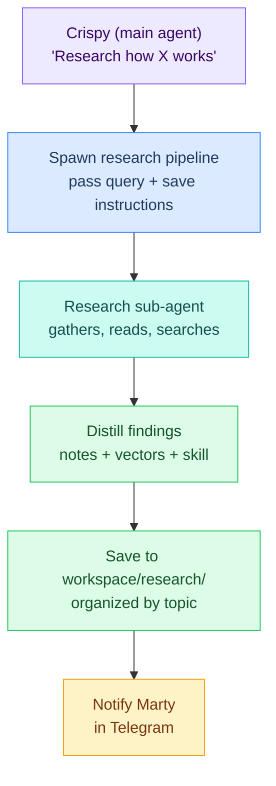
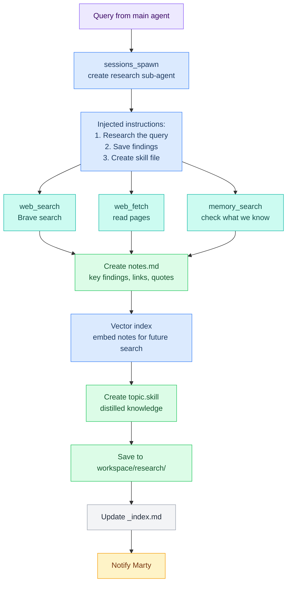
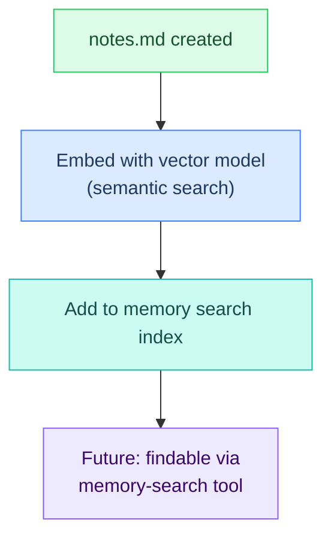

# L6 — Research Pipeline

> Spawn a research sub-agent to gather information, distill findings, and save as notes + vectors + skill.

---

## Overview

When Crispy needs to research a topic deeply, he spawns a sub-agent in its own context. The research agent:

1. **Gathers** — Uses web_search, web_fetch, memory_search
2. **Distills** — Summarizes findings into notes, vectors, and a skill file
3. **Saves** — Stores in `workspace/research/` organized by topic
4. **Notifies** — Tells Marty what was learned



---

## Key Idea

The main agent doesn't do research itself. It delegates to a sub-agent via `sessions_spawn`, which means:

- Research happens in its **own context** (isolated conversation)
- Doesn't consume main agent's **token budget**
- Can run **long and deep** without bloating main session
- **Cleaner memory** — research notes saved separately

---

## Query Envelope

When the main agent spawns research, it sends a structured query:

```json5
{
  "query": "How does Mem0 handle graph relationships for long-term memory?",
  "topic": "mem0-graph-memory",
  "depth": "deep",
  "outputFormats": ["notes", "vectors", "skill"],
  "saveDir": "workspace/research/"
}
```

The research sub-agent receives this with injected instructions to:
1. Research the query thoroughly
2. Save findings to `workspace/research/{topic}/`
3. Create `notes.md` with key findings
4. Create `sources.md` with all references
5. Create `{topic}.skill` with distilled knowledge
6. Update `workspace/research/_index.md`

---

## Pipeline Flow



---

## Pipeline YAML

```yaml
name: research
args:
  query:
    required: true
    description: "What to research"
  topic:
    default: "general"
    description: "Topic name (used as folder)"
  depth:
    default: "standard"
    enum: ["quick", "standard", "deep"]

steps:
  # ── Step 1: Spawn research sub-agent ──
  - id: research
    command: openclaw.invoke --tool sessions_spawn --action spawn \
      --args-json '{
        "task": "Research the following query thoroughly. Use web_search and web_fetch to gather information. Check memory_search for existing knowledge first.\n\nQuery: $query\nDepth: $depth (quick=30min, standard=1hr, deep=2hrs)\n\nWhen done:\n1. Create workspace/research/$topic/ directory\n2. Write notes.md with:\n   - Key findings and how it applies to our setup\n   - Open questions that need answering\n   - Links and quotes with sources\n3. Write sources.md with all URLs and references\n4. Create $topic.skill with distilled knowledge\n5. Update workspace/research/_index.md",
        "agentId": "crispy",
        "tools": ["web_search", "web_fetch", "memory_search", "exec", "llm-task"]
      }'
    timeout: 300000

  # ── Step 2: Notify on completion ──
  - id: notify
    command: openclaw.invoke --tool agent_send --action send \
      --args-json '{
        "channelId": "telegram:${TELEGRAM_MARTY_ID}",
        "message": "📚 Research complete: $topic\n\nSaved to workspace/research/$topic/\n• notes.md — summary and findings\n• sources.md — all references\n• $topic.skill — reusable knowledge\n\nUse /research list to see all topics."
      }'
```

---

## Directory Structure

Research findings are organized like this:

```
workspace/research/
├── _index.md                          ← Auto-maintained topic list
│
├── mem0-graph-memory/
│   ├── notes.md                       ← Human-readable findings
│   ├── sources.md                     ← Links and references
│
├── lobster-pipeline-patterns/
│   ├── notes.md
│   ├── sources.md
│
└── crispy-deployment/
    ├── notes.md
    └── sources.md

~/.openclaw/skills/
├── mem0-graph-memory.skill            ← Created from research
├── lobster-pipeline-patterns.skill
└── crispy-deployment.skill
```

---

## File Formats

### notes.md

```markdown
# Mem0 Graph Memory

> Researched: 2026-03-02 · Depth: deep · Query: "How does Mem0 handle graph relationships?"

## Key Findings

- Mem0 uses a graph database to represent relationships between entities
- Supports both explicit (user-defined) and implicit (inferred) relationships
- Query performance: O(log n) for most operations due to indexing

## How This Applies to Crispy

- Could use Mem0's graph to track relationships between projects, team members, and documents
- Implicit relationships could help discover connections between research topics
- Better than flat vector search for structured knowledge

## Open Questions

- [ ] How does Mem0 handle conflicting relationships?
- [ ] What's the recommended graph size limit?
- [ ] Can we import existing knowledge into the graph?

## Sources

- [Mem0 Docs: Graph Memory](https://mem0.ai/docs/graph-memory) — Core concepts and API
- [GitHub: mem0-python](https://github.com/mem0ai/mem0-python) — Implementation examples
- [Blog: Building with Mem0](https://mem0.ai/blog/graph-relationships) — Design patterns
```

### sources.md

```markdown
# Sources for Mem0 Graph Memory

## Official Documentation

- https://mem0.ai/docs/graph-memory — API reference and concepts
- https://mem0.ai/docs/integrations/memory-types — How graphs compare to vectors

## Code Examples

- https://github.com/mem0ai/mem0-python/blob/main/examples/graph_memory.py
- https://github.com/mem0ai/mem0-python/blob/main/tests/test_graph.py

## Blog Posts

- https://mem0.ai/blog/graph-relationships — Design patterns for relationship modeling
- https://mem0.ai/blog/longterm-memory — Why graphs work for long-term memory

## Research Papers

- [Graph Neural Networks for Knowledge Graphs](link) — Theoretical foundation
```

### {topic}.skill

```markdown
---
name: mem0-graph-memory
description: Knowledge about Mem0's graph relationship memory system
tags: [topic/research, topic/memory, topic/mem0]
triggers: ["mem0", "graph memory", "relationships", "long-term knowledge"]
---

# What I Know: Mem0 Graph Memory

## Quick Reference

- Mem0 uses a graph database (nodes = entities, edges = relationships)
- Supports explicit (user-defined) and implicit (inferred) relationships
- Better for structured knowledge than flat vectors
- Query time: O(log n) due to indexing

## When to Use This Skill

When Crispy is discussing:
- Long-term memory architecture
- Knowledge graph design
- Entity relationships
- Crispy's own memory upgrade plans

## Key Decisions

- [ ] Decide: Use Mem0 graphs for Crispy's long-term memory?
- [ ] Evaluate: Cost vs benefits (extra complexity?)
- [ ] Plan: Migration path if we switch from vectors to graphs
```

---

## Triggers

| Trigger | How |
|---|---|
| **Main agent decides** | Crispy calls: `openclaw pipeline run research --query "..." --topic "..."`  |
| **Telegram command** | `/research mem0 graph relationships` |
| **From another pipeline** | Sub-workflow reference in a `.lobster` file |

---

## Telegram Command

Register in `openclaw.json`:

```json5
{
  "channels": {
    "telegram": {
      "customCommands": {
        "/research": {
          "pipeline": "research.lobster",
          "args": {
            "query": "{{text}}",
            "topic": "{{slug_from:text}}",
            "depth": "standard"
          }
        }
      }
    }
  }
}
```

---

## Usage Examples

### From Main Agent

```
User: "I need to understand how Mem0's graph memory works"

Crispy:
[Decides: research needed]
[Spawns: research.lobster with query]

📚 Researching: Mem0 Graph Memory...
[Sub-agent researches in background]

[30 minutes later]
🤖: (research agent finishes)

Crispy (main agent):
Based on the research I just conducted, Mem0's graph memory works like this...
[Answers question using research findings]
```

### From Telegram

```
User: "/research how does lobster handle state management"

Crispy:
📚 Researching: Lobster State Management...

[Research happens in background]

[Later]
📚 Research complete: lobster-state-management

Saved to workspace/research/lobster-state-management/
• notes.md — summary and findings
• sources.md — all references
• lobster-state-management.skill — reusable knowledge
```

---

## Configuration

Add to `openclaw.json`:

```json5
{
  "pipelines": {
    "research": {
      "enabled": true,
      "maxDepthTime": {
        "quick": "30m",
        "standard": "1h",
        "deep": "2h"
      },
      "saveDir": "~/.openclaw/workspace/research/"
    }
  }
}
```

---

## Vector Indexing

After research is complete, the notes are automatically indexed for future memory searches:



When Crispy needs to recall facts about Mem0 later, the memory-search tool will find the research notes.

---

## Dependencies

- `web_search` tool — Brave search API
- `web_fetch` tool — Fetch and parse web pages
- `memory_search` tool — Check existing knowledge
- `sessions_spawn` plugin — Create sub-agent
- Workspace write access — Save research findings

---

## Open Questions

- [ ] Which model should research sub-agents use? (Codex for deep, flash for quick?)
- [ ] Max timeout per research depth? (30min / 1hr / 2hrs?)
- [ ] Should `.skill` files auto-register with ClawHub?
- [ ] Vector indexing: use built-in memory search or Mem0?
- [ ] Should `_index.md` be auto-generated or manually curated?

---

**Up →** [[stack/L6-processing/_overview]]
**Related →**  [[stack/L6-processing/skills/inventory]]
