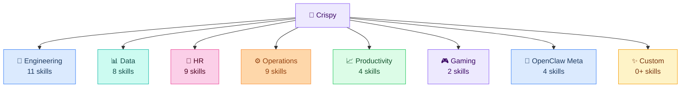
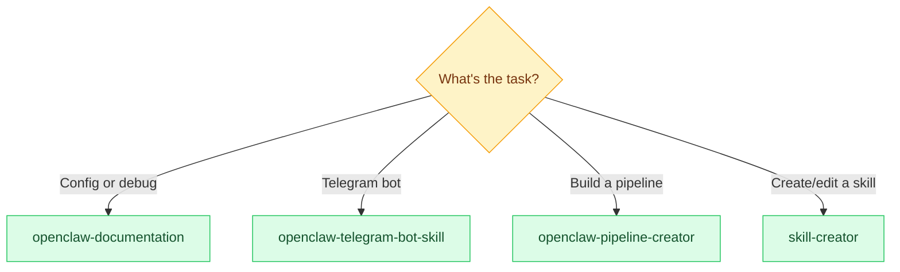
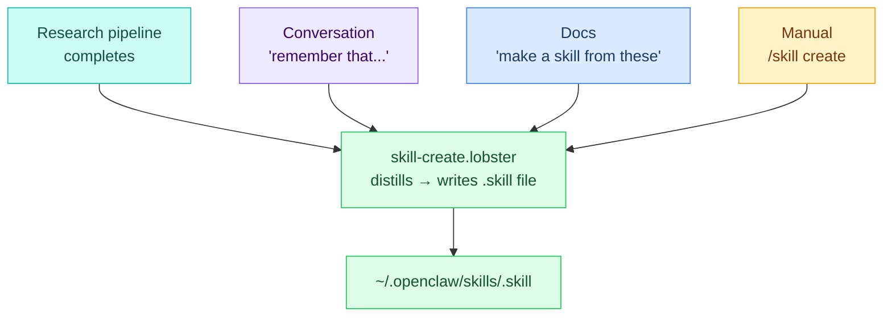
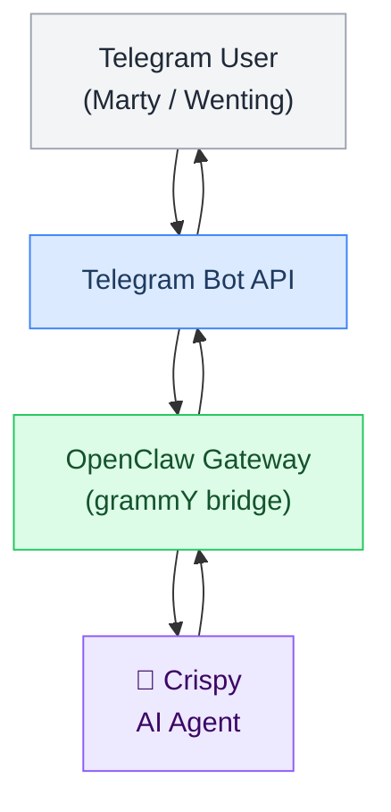
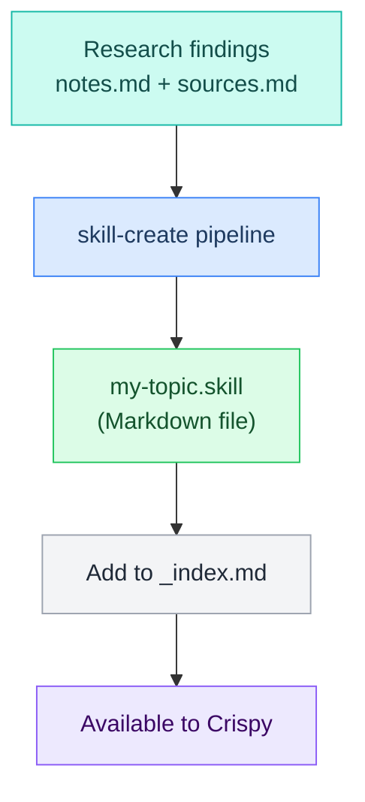
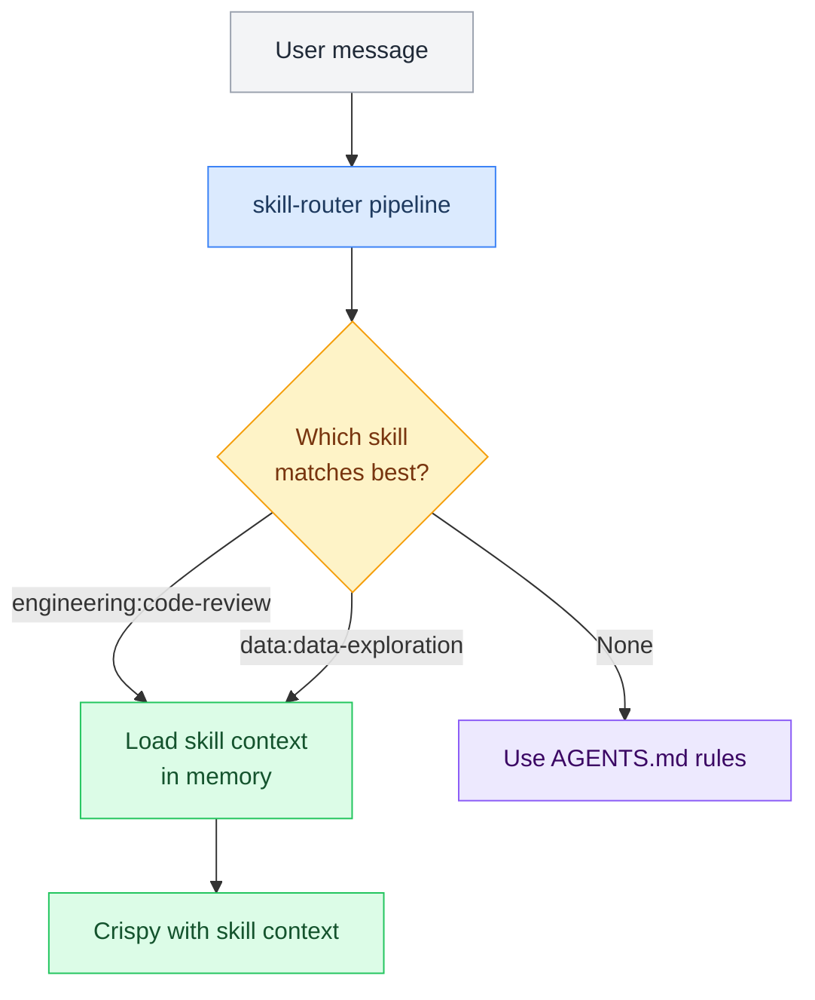

# L6 — Skills Inventory

> Complete reference of all 54+ skills Crispy has access to, organized by pack. This is the consolidated inventory combining skills/_overview.md content with all the detailed skill pack information.

---

## Overview

Skills are specialized capabilities installed from ClawHub or created from research. All skills live in `~/.openclaw/skills/`.



---

## Skills Configuration


### Complete Configuration Block

```json5
// [[stack/L2-runtime/config-reference]] §11 — Skills
"skills": {

  "entries": {

    // --- Gaming (already installed) ---
    "sag": { "enabled": true },
    "gog": {
      "enabled": true,
      "env": { "GOG_KEYRING_PASSWORD": "${GOG_KEYRING_PASSWORD}" }
    },

    // --- Engineering Pack (11 skills) ---
    "engineering:code-review":       { "enabled": true },
    "engineering:review":            { "enabled": true },
    "engineering:debug":             { "enabled": true },
    "engineering:system-design":     { "enabled": true },
    "engineering:architecture":      { "enabled": true },
    "engineering:testing-strategy":  { "enabled": true },
    "engineering:documentation":     { "enabled": true },
    "engineering:incident-response": { "enabled": true },
    "engineering:tech-debt":         { "enabled": true },
    "engineering:deploy-checklist":  { "enabled": true },
    "engineering:standup":           { "enabled": true },

    // --- Data Pack (8 skills) ---
    "data:analyze":                       { "enabled": true },
    "data:data-exploration":              { "enabled": true },
    "data:data-visualization":            { "enabled": true },
    "data:sql-queries":                   { "enabled": true },
    "data:statistical-analysis":          { "enabled": true },
    "data:interactive-dashboard-builder": { "enabled": true },
    "data:data-validation":               { "enabled": true },
    "data:data-context-extractor":        { "enabled": true },

    // --- Human Resources Pack (9 skills) ---
    "human-resources:compensation-benchmarking": { "enabled": true },
    "human-resources:draft-offer":               { "enabled": true },
    "human-resources:interview-prep":            { "enabled": true },
    "human-resources:org-planning":              { "enabled": true },
    "human-resources:people-analytics":          { "enabled": true },
    "human-resources:recruiting-pipeline":       { "enabled": true },
    "human-resources:employee-handbook":         { "enabled": true },
    "human-resources:onboarding":               { "enabled": true },
    "human-resources:performance-review":        { "enabled": true },

    // --- Operations Pack (9 skills) ---
    "operations:change-management":   { "enabled": true },
    "operations:compliance-tracking": { "enabled": true },
    "operations:process-optimization":{ "enabled": true },
    "operations:resource-planning":   { "enabled": true },
    "operations:risk-assessment":     { "enabled": true },
    "operations:vendor-management":   { "enabled": true },
    "operations:status-report":      { "enabled": true },
    "operations:process-doc":        { "enabled": true },
    "operations:runbook":            { "enabled": true },

    // --- Productivity Pack (4 skills) ---
    "productivity:memory-management": { "enabled": true },
    "productivity:task-management":   { "enabled": true },
    "productivity:update":           { "enabled": true },
    "productivity:start":            { "enabled": true },

    // --- OpenClaw Meta (4 skills, typically pre-installed) ---
    "openclaw-documentation":      { "enabled": true },
    "openclaw-telegram-bot-skill": { "enabled": true },
    "openclaw-pipeline-creator":   { "enabled": true },
    "skill-creator":               { "enabled": true },

    // --- Authoring (2 skills) ---
    "doc-coauthoring": { "enabled": true },
    "internal-comms":  { "enabled": true },

    // --- Builders (4 skills) ---
    "mcp-builder":              { "enabled": true },
    "cowork-plugin-customizer": { "enabled": true },
    "create-cowork-plugin":     { "enabled": true },
    "schedule":                 { "enabled": true },

    // --- LLM Guardrails (1 skill) ---
    "llm-guardrails": { "enabled": true }
  },

  "install": {
    "nodeManager": "npm",
    "preferBrew": true
  }
}
```

### Installation Commands

```bash
# Install packs from ClawHub
openclaw skills install engineering
openclaw skills install data
openclaw skills install human-resources
openclaw skills install operations
openclaw skills install productivity

# Meta skills typically come pre-installed
# Gaming already installed

# Verify all skills
openclaw skills list
```

---

## Authoring Skills


| Skill | Trigger Phrases | What It Does | Status |
|---|---|---|---|
| **doc-coauthoring** | "collaborate on docs", "edit together" | Real-time document collaboration | ✅ Available |
| **internal-comms** | "draft announcement", "write memo" | Internal communication templates | ✅ Available |

---

## Builder Skills


| Skill | What It Does | Status |
|---|---|---|
| **mcp-builder** | Create MCP servers for new tools | ✅ Available |
| **cowork-plugin-customizer** | Customize plugins | ✅ Available |
| **create-cowork-plugin** | Create new plugins | ✅ Available |
| **schedule** | Schedule tasks and reminders | ✅ Available |

---

## Engineering Pack


11 specialized skills for software development.

| Skill | Trigger Phrases | What It Does | Status |
|---|---|---|---|
| **code-review** | "review this code", "check this PR", "is this safe?" | Reviews code for bugs, security, performance, maintainability | 🟡 Install |
| **debug** | "help me debug", "this isn't working", "find the bug" | Structured debugging: reproduce → isolate → diagnose → fix | 🟡 Install |
| **system-design** | "design a system for", "how should we architect" | System/service/API architecture with trade-off analysis | 🟡 Install |
| **testing-strategy** | "how should we test", "test plan", "write tests for" | Test strategy: unit, integration, e2e, coverage | 🟡 Install |
| **documentation** | "write docs for", "create a README", "write a runbook" | Technical docs: API, architecture, runbooks, READMEs | 🟡 Install |
| **incident-response** | "production is down", "we have an incident", "SEV1" | Triage, coordination, postmortem writing | 🟡 Install |
| **tech-debt** | "tech debt audit", "what should we refactor" | Identify, categorize, prioritize technical debt | 🟡 Install |
| **deploy-checklist** | "ready to deploy?", "pre-deploy check" | Pre-deployment verification checklist | 🟡 Install |
| **architecture** | "design the architecture", "system design" | System architecture and design patterns | 🟡 Install |
| **review** | "code review", "peer review" | General code review capability | 🟡 Install |
| **standup** | "write standup", "daily standup" | Daily standup writing | 🟡 Install |

---

## Data Pack


8 skills for data analysis and visualization.

| Skill | Trigger Phrases | What It Does | Status |
|---|---|---|---|
| **data-exploration** | "explore this dataset", "profile this data", "what's in this CSV?" | Dataset profiling: shape, quality, distributions, nulls, outliers | 🟡 Install |
| **data-visualization** | "make a chart", "visualize this", "create a graph" | Publication-quality charts: matplotlib, seaborn, plotly | 🟡 Install |
| **sql-queries** | "write a query", "optimize this SQL", "translate this query" | Correct SQL across Snowflake, BigQuery, Postgres, etc. | 🟡 Install |
| **statistical-analysis** | "is this significant?", "run a t-test", "find correlations" | Stats, hypothesis testing, trends, outlier detection | 🟡 Install |
| **interactive-dashboard-builder** | "build a dashboard", "create a report" | Self-contained HTML dashboards with Chart.js, filters | 🟡 Install |
| **data-validation** | "QA this analysis", "check for errors", "validate the data" | Methodology checks, accuracy, bias detection | 🟡 Install |
| **data-context-extractor** | "set up data analysis for our warehouse" | Generates company-specific data analysis context | 🟡 Install |
| **analyze** | "analyze this", "what does this mean" | General data analysis | 🟡 Install |

---

## Gaming Pack


2 pre-installed skills for game library management.

| Skill | Status | What It Does |
|---|---|---|
| **sag** | ✅ Installed | Steam game library management |
| **gog** | ✅ Installed | GOG game library (uses `GOG_KEYRING_PASSWORD`) |

---

## HR Pack


9 skills for human resources workflows.

| Skill | Trigger Phrases | What It Does |
|---|---|---|
| **recruiting-pipeline** | "write a job posting", "review this resume" | Job descriptions, candidate evaluation, offer templates |
| **onboarding** | "create onboarding checklist", "new team member" | Onboarding plans, welcome docs, first-week schedule |
| **performance-review** | "write perf review", "feedback for employee" | Review templates, feedback frameworks, development plans |
| **compensation-benchmarking** | "salary bands", "comp analysis", "offer letter" | Market comp analysis, offer letters, equity calculations |
| **interview-prep** | "interview questions", "prepare for interview" | Interview preparation and question frameworks |
| **org-planning** | "org structure", "team design" | Organization design and planning |
| **employee-handbook** | "handbook", "company policy" | Employee handbook and policy templates |
| **people-analytics** | "HR metrics", "team analytics" | People analytics and HR metrics |

---

## Operations Pack


9 skills for operations and infrastructure.

| Skill | Trigger Phrases | What It Does |
|---|---|---|
| **monitoring-setup** | "set up monitoring", "create dashboards" | Monitoring config, alerting rules, dashboard design |
| **incident-postmortem** | "postmortem template", "blameless review" | RCA, timeline, prevention, lessons learned |
| **runbook** | "write a runbook", "create playbook" | Operational procedures, escalation chains, runbooks |
| **resource-planning** | "capacity forecast", "growth projection" | Resource planning, scaling analysis, cost projections |
| **risk-assessment** | "risk analysis", "risk management" | Risk identification, assessment, mitigation |
| **vendor-management** | "vendor evaluation", "SLA review" | Vendor selection, contract review, SLA management |
| **change-management** | "change plan", "change management" | Change management and planning |
| **compliance-tracking** | "compliance", "audit" | Compliance tracking and audits |
| **process-optimization** | "improve process", "optimize workflow" | Process optimization and improvement |

---

## Productivity Pack


4 skills for task and time management.

| Skill | Trigger Phrases | What It Does |
|---|---|---|
| **task-management** | "create task list", "organize my todos" | Task lists, priority matrices, time blocking |
| **calendar-coordination** | "find meeting time", "schedule for team" | Calendar search, scheduling, timezone handling |
| **memory-management** | "organize memory", "memory system" | Memory organization and management |
| **update** | "update status", "write update" | Status updates and progress reports |
| **start** | "get started", "start project" | Project startup and initialization |

---

## Telegram (Built-In)

Telegram bot functionality — not a skill pack, but built-in to L6.

| Feature | What It Does |
|---|---|
| **Custom commands** | `/git`, `/brief`, `/email`, `/research` |
| **Buttons** | Inline keyboard replies (approve/deny, action buttons) |
| **HTML formatting** | Bold, italic, code blocks, links |
| **Message editing** | Crispy can update sent messages |
| **File upload** | Send documents, images, logs to Telegram |

---

## OpenClaw Meta


4 pre-installed meta-skills for system control.

| Skill | Trigger Phrases | What It Does |
|---|---|---|
| **openclaw-documentation** | "openclaw config", "openclaw.json", "gateway setup", "openclaw doctor" | Expert OpenClaw configuration, debugging, and documentation reference |
| **openclaw-telegram-bot-skill** | "telegram bot", "bot token", "callback button", "telegram config" | Build, configure, and debug Telegram bots through OpenClaw |
| **openclaw-pipeline-creator** | "make a pipeline", "lobster workflow", ".lobster file", "automate this" | Create Lobster pipelines — YAML workflows with approval gates |
| **skill-creator** | "create a skill", "modify skill", "run evals", "optimize skill" | Create new skills, modify existing ones, measure performance |

### When Crispy Should Use Meta Skills



### Notes

These are meta-level skills — they help Crispy work on itself and its own infrastructure. They're especially useful during setup and when extending Crispy's capabilities.

The **openclaw-documentation** skill is the go-to for any config question. It covers all channel types (Telegram, WhatsApp, Discord, Slack, Signal), gateway setup, CLI commands, Docker deployment, and troubleshooting.

The **pipeline-creator** skill knows Lobster syntax and can generate `.lobster` files from natural language descriptions.

The **skill-creator** can turn research notes or conversation patterns into reusable SKILL.md files.

---

## Custom Skills Framework


> Skills created by Crispy from research, conversations, or documentation. Grows over time.

### How Custom Skills Get Created



### Current Custom Skills

#### Qdrant Database Engineer (Claude Code skill)

| Property | Value |
|---|---|
| Location | `.claude/skills/qdrant-database-engineer/SKILL.md` |
| Type | Claude Code reference skill (NOT OpenClaw platform skill) |
| Purpose | Custom vector DB engineering — RAG pipelines, knowledge bases, semantic search |
| Scope | External vector systems; distinct from L7's built-in `memorySearch` (Gemini embeddings) |
| References | 8 deep-dive guides in `references/`, 5 Python scripts in `scripts/` |
| Qdrant version | 1.17.x (Gridstore only, Query API, no deprecated methods) |

**When to use:** Building custom RAG systems, setting up external knowledge bases, bulk embedding uploads, hybrid dense+sparse search. NOT for Crispy's internal session memory — that uses the built-in `memorySearch` tool with Gemini embeddings. See [[stack/L7-memory/memory-search]] for the internal system.

```
~/.openclaw/skills/
├── _index.md                    ← Auto-maintained list
├── (custom skills appear here)
└── ...
```

### Skill File Format

See [[stack/L6-processing/skills/_overview]] for the full `.skill` file format, pipeline YAML, and lifecycle.

---

## Telegram Bot Skill


📱 Crispy's Telegram bot integration. Telegram is a **built-in channel** in OpenClaw (not a plugin). Configured under `channels.telegram` in `openclaw.json`.

### Architecture



Routing is deterministic — messages from Telegram always reply to Telegram. The AI model never picks the channel.

### Key Facts

| Property | Value |
|---|---|
| Channel type | Built-in (NOT a plugin) |
| Config path | `channels.telegram` |
| Internal framework | grammY (TypeScript) |
| Default parse mode | HTML |
| Polling mode | Long polling (default) or webhook |
| Text chunk limit | 4,000 chars (configurable) |
| File limits | 10 MB photos, 50 MB other uploads, 20 MB downloads |
| Message cap | 4,096 chars text, 1,024 chars captions |

### Access Control

#### DM Policies

| Policy | Behavior | Use Case |
|---|---|---|
| `pairing` (default) | New users get a one-time code, approved via CLI | Recommended for Crispy |
| `allowlist` | Only numeric IDs in `allowFrom` | Locked-down alternative |
| `open` | Anyone can message (needs `allowFrom: ["*"]`) | Public bots only |
| `disabled` | No DMs | Group-only bots |

#### Group Policies

| Policy | Behavior |
|---|---|
| `allowlist` (default) | Only configured groups |
| `open` | All groups (mention-gating still applies) |
| `disabled` | Block all group messages |

Group sender auth does NOT inherit DM pairing approvals — deliberate security boundary.

### Agent Actions

These are the outbound tool actions Crispy can use in Telegram:

| Action | Alias | Key Parameters | Default |
|---|---|---|---|
| `sendMessage` | `send` | `to`, `content`, `mediaUrl`, `buttons`, `replyToMessageId`, `messageThreadId` | Enabled |
| `editMessage` | `edit` | `chatId`, `messageId`, `content` | Enabled |
| `deleteMessage` | `delete` | `chatId`, `messageId` | Enabled (gated) |
| `react` | `react` | `chatId`, `messageId`, `emoji` | Enabled (gated) |
| `sticker` | `sticker` | `to`, `fileId` | Disabled |
| `createForumTopic` | `topic-create` | `chatId`, `name`, `iconColor` | Enabled |

#### Inline Buttons

Crispy can attach inline keyboard buttons to any message:

```json5
{
  action: "send",
  to: "123456789",
  content: "Choose an option:",
  buttons: [
    [{ text: "✅ Yes", callback_data: "yes" }, { text: "❌ No", callback_data: "no" }],
    [{ text: "Cancel", callback_data: "cancel" }]
  ]
}
```

Callback clicks arrive as `callback_data: <value>`. Always answer callbacks (even with empty text) or the loading spinner persists.

### Custom Commands

Registered with BotFather at gateway startup:

| Command | Description | Pipeline |
|---|---|---|
| `/brief` | Run daily brief | `brief.lobster` |
| `/email` | Run email triage | `email.lobster` |
| `/git` | Git status report | `git.lobster` |
| `/pipelines` | List available pipelines | (built-in) |
| `/status` | Check tool/health status | (built-in) |
| `/model` | Switch model alias | (built-in) |

### Config Block

```json5
// [[stack/L2-runtime/config-reference]] §4a — Telegram
"channels": {
  "telegram": {
    "enabled": true,
    "botToken": "${TELEGRAM_BOT_TOKEN}",
    "dmPolicy": "pairing",
    "groups": {
      "*": {
        "requireMention": true,
        "groupPolicy": "allowlist"
      }
    },
    "customCommands": [
      { "command": "brief",     "description": "Run daily brief pipeline" },
      { "command": "email",     "description": "Run email triage pipeline" },
      { "command": "git",       "description": "Run git status pipeline" },
      { "command": "pipelines", "description": "List available pipelines" },
      { "command": "status",    "description": "Tool + health status" }
    ],
    "streaming": {
      "enabled": true,
      "minChunkChars": 80,
      "throttleMs": 1200
    },
    "textChunkLimit": 4000
  }
}
```

---

## Previous Custom Skills

Skills created by Crispy from research or user code. Live in `~/.openclaw/skills/`:

```
~/.openclaw/skills/
├── engineering/             ← Engineering pack (ClawHub)
├── data/                    ← Data pack (ClawHub)
├── sag/                     ← Gaming: Steam (ClawHub)
├── gog/                     ← Gaming: GOG (ClawHub)
├── _index.md                ← Auto-maintained custom skill list
├── my-custom-skill.skill    ← Custom: from research
├── project-x-helper.skill   ← Custom: from conversation
└── ...
```

### Creating Custom Skills

Custom skills are created by the `skill-create` pipeline, usually triggered by research:



### Custom Skill Format

```markdown
---
name: my-topic
description: Knowledge about X that I researched
tags: [research, custom]
triggers: ["when should I use this?"]
---

# My Custom Skill

## What I Know

Key facts and knowledge...

## When to Use This

Trigger conditions — when Crispy should reference this skill...

## Key Decisions

Decisions made or needed based on this research...

## Links & References

- [Source 1](url)
- [Source 2](url)
```

---

## How Skills Are Loaded

Skills are matched and loaded on-demand:



The skill router:
1. Reads the skill-router.lobster pipeline
2. Classifies intent from user message
3. Matches against available skills (confidence > 0.5)
4. Loads the skill context into the conversation
5. Crispy acts with the skill's knowledge/templates

---

## ClawHub Integration

Find and install skills from [clawhub.com](https://clawhub.com):

- 13,700+ community skills
- VirusTotal scanning
- One-click install via CLI

### CLI Commands

```bash
openclaw skills list              # Show installed
openclaw skills list all          # Browse ClawHub
openclaw skills install engineering
openclaw skills install data
openclaw skills install human-resources
openclaw skills install operations
openclaw skills install productivity
openclaw skills search "machine learning"
openclaw skills remove <name>
```

---

## Installation Checklist

- [ ] Install engineering pack: `openclaw skills install engineering`
- [ ] Install data pack: `openclaw skills install data`
- [ ] Install hr pack: `openclaw skills install human-resources`
- [ ] Install ops pack: `openclaw skills install operations`
- [ ] Install productivity pack: `openclaw skills install productivity`
- [ ] Verify with `openclaw skills list`
- [ ] Add entries to `openclaw.json` skills section
- [ ] Test: ask Crispy to review code or explore a dataset

---

**Up →** [[stack/L6-processing/_overview]]
**Related →** [[stack/L6-processing/pipelines/_overview]]
